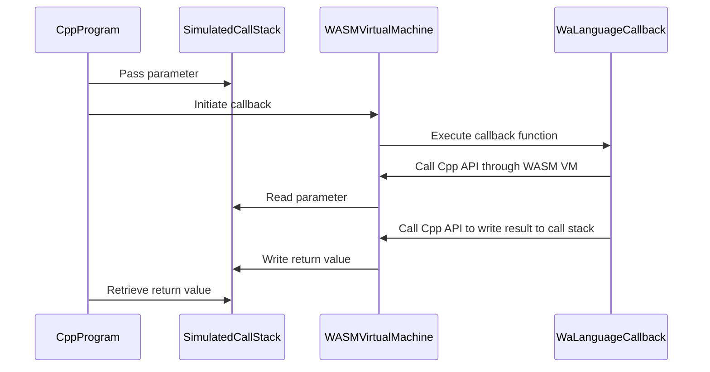
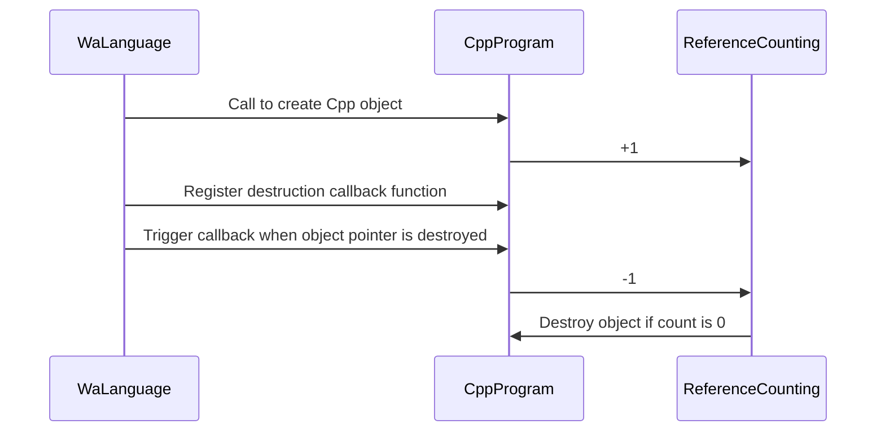

## 1. The Beginning

I've been following the Wa language team and "lurking" in their community for over a year. I was suddenly inspired by an article they published about the essence of open-source spirit. I've always been interested in the progress and survival of their open-source projects. As a core contributor to the Dora SSR project, I know that we are all the same, open-source authors from the working class, not looking down from above, but struggling like sardines in a can.

So, let me announce it here: we have prioritized the implementation of using **Wa language combined with the Dora SSR game engine to develop cross-platform games**!

<!-- truncate -->

## 2. Learning a Programming Language is Like Weaving a Cocoon for Yourself

The goal of the Dora SSR game engine is to create an inclusive and diverse engine ecosystem. Many followers are puzzled as to why this engine supports so many programming languages. Currently, it officially supports Lua, Teal, YueScript, TypeScript, TSX, and Rust for hot update scripts, yet it's still not enough. As someone who has written code and various projects for many years, I understand that no programming language is perfect. If you find a language that seems to do everything, it only means you lack experience and understanding in cross-domain development or haven't been exposed to enough programming languages to develop an aesthetic sense for them.

## 3. The Experience of Using Wa Language

Integrating Wa language into the Dora SSR game engine (i.e., providing FFI support) is simple and involves three steps:

- 1. Reuse the C API interface exported by the engine for Rust.
- 2. Import the C API interface in Wa language.
- 3. Manually write and automatically generate wrapper interface code for the C API in Wa language to provide a development experience consistent with Wa language style.

Then you can develop games using Wa language!

However, saying it's simple is deceptive. The actual integration process is as follows:

Dora SSR is a game engine primarily developed in C++. It interprets and executes Wa language compiled into WASM binary code through an embedded WASM3 virtual machine and provides engine call functionality. The Dora C++ interface currently has over 1000 functions selected to perform necessary engine functions. Writing these interface wrapper codes takes a lot of time, and they need to be updated with the engine, so an automated tool is needed to generate these interface codes.

Our automation tool needs to accomplish the following, using a simple example:

- a. I have a C++ interface:

```cpp
class App {
public:
    int32_t getTargetFPS();
};

#define SharedApplication \
    Singleton<Application>::shared()
```

- b. Convert it to a C language export interface:

```c
extern "C" {
    int32_t application_get_target_fps() {
        return SharedApplication.getTargetFPS();
    }
}
```

- c. Then convert it to a Wa language import interface:

```go
#wa:import dora application_get_target_fps
func application_get_target_fps() => i32
```

- d. Finally, convert it to a mature Wa language call interface:

```go
type _App :struct {}
func _App.GetTargetFPS() => i32 {
    return application_get_target_fps()
}
global App = _App{}
```

- e. Call it in a Wa language program:

```go
import "dora"

func init {
    println(dora.App.GetTargetFPS())
}
```

Steps b, c, and d are mainly the ones that need to be automated by tools.

But this example is the simplest case. Everyone knows that C++ has many complex mechanisms. Besides basic data types, we need to pass objects, inheritance relationships, type conversions in the inheritance chain, string objects, arrays containing various data types and objects, callback functions for mutual calls between C++ and Wa language, enum data types, static functions, member functions, class static member functions, etc. After handling object passing, a more challenging issue is managing object lifecycles. C++ manages C++, Wa language manages Wa language, and cross-language references need to manage each other.

There are many details that can't be covered here, so please check the source code (no responsibility).

Due to space constraints, I can't introduce everything here, but I'll share an interesting binding mechanism. It's about cross-language callback functions. In the world of C/C++ (and many other languages), the core of function call parameter passing is through a compiler-generated call stack to pass parameters into the function body and retrieve return values. When crossing languages, the call stacks of both languages usually can't directly access each other. So, can we write a call stack that both languages can access to simulate parameter passing and return value retrieval for cross-language function callbacks? This idea is certainly feasible.

For example, in a game loop, we often need to register an Update function called every game frame. There might be a C++ interface like this:

```cpp
void GameScheduleUpdate(const std::function<bool(double)>& updateFunc);
```

We first implement a function call stack:

```cpp
class CallStack {
public:
    void push(double v);
    void push(bool v);
    double popDouble();
    bool popBool();
};
```

Provide a C wrapper function:

```cpp
extern "C" {
    int64_t new_call_stack() { /* Create CallStack object */ }
    void call_stack_push_bool(int64_t stack, int32_t v) { /* Push bool */ }
    int64_t call_stack_pop_f64(int64_t stack) { /* Pop double */ }

    void game_schedule_update(int32_t funcId, int64_t stack) {
        std::shared_ptr<void> deref(nullptr, [funcId](auto) {
            SharedWasmRuntime.deref(funcId);
        });
        auto args = reinterpret_cast<CallStack*>(stack);
        GameScheduleUpdate([funcId, args, deref](double deltaTime) {
            args->push(deltaTime); // Pass parameter to Wa language
            SharedWasmRuntime.invoke(funcId); // Execute callback
            return args->popBool(); // Retrieve return value from Wa language
        });
    }
}
```

Provide an interface in Wa language to register the Update callback function:

```go
#wa:import dora new_call_stack
func new_call_stack() => i64
#wa:import dora call_stack_push_bool
func call_stack_push_bool(stack: i64, v: i32)
#wa:import dora call_stack_pop_f64
func call_stack_pop_f64(stack: i64) => f64

#wa:import dora game_schedule_update
func game_schedule_update(funcId: i32, stack: i64)

func _Game.ScheduleUpdate(update_func: func(delta_time: f64) => bool) {
    stack := new_call_stack()
    func_id := PushFunction(func() {
        delta_time := call_stack_pop_f64(stack) // Retrieve parameter from C++
        result := 0
        if update_func(delta_time) { // Execute actual callback
            result = 1
        }
        call_stack_push_bool(stack, result) // Pass return value to C++
    })
    game_schedule_update(func_id, stack)
}
```

In a Wa program, you can use a clean program interface like this:

```go
import "dora"

func init() {
    dora.Game.ScheduleUpdate(func(delta_time: f64) => bool {
        println(delta_time)
        return false
    })
}
```

In actual operation, the process is more complex than it seems because Wa language runs on a WASM virtual machine, and interactions between the two languages must go through the WASM virtual machine as an intermediary. The actual callback execution process might look like this:



This diagram simplifies some aspects, such as the call between the C++ program and the WASM virtual machine, which also goes through an additional process of simulating the call stack through the WASM virtual machine. So, you can see that the current solution for implementing cross-language function callbacks has some performance overhead. In the future, we might explore ways to directly access and reuse the WASM virtual machine's call stack to optimize performance.

Now, let's briefly discuss the issue of object lifecycle management. If we can't find a mechanism to automatically and correctly manage the lifecycle of C++ objects from the language level, we have to manually manage object releases in the new programming language environment. This means accurately arranging to call `obj.Destroy()` once to release objects, which can be exhausting for those eager to write game logic scripts.

Fortunately, Wa language has an advantage in that both it and the engine's C++ mechanism use reference counting. They even have very similar semantics for managing pointers to objects through reference counting. So, we just need to do this:



## 4. Challenges Encountered in Practice

Let's talk about the challenges encountered in practice.

### Challenge 1: Wa Language Author Tells Me Not to Use This Language

First, let's talk about why I'm so interested in Wa language. In fact, the Dora SSR engine has already implemented WASM bindings for Rust language. For a C++ veteran, Rust language is almost perfect. However, when it comes to quickly developing and iterating on game logic, I have some reservations. It's like trying to write an assignment with a teacher staring at every word you write, constantly criticizing you. Sometimes, due to not understanding the teacher's rules, you end up spending more time arguing and rewriting the assignment.

Wa language goes in the opposite direction of Rust. It has a Go-like design, emphasizing simplicity in language rules.

It doesn't have complex syntax challenges or mandatory elegant coding styles. You can quickly patch together your business logic with a minimal syntax set. I like this style so much that when I initially communicated with the core author of Wa language, I was warned that the project might not be mature, and I shouldn't have high expectations. I said, "If I can eat Rust crabs (Rust logo here), why not Wa?" If I encounter bugs in the language, I'll contribute to fixing them. Then came Challenge 2, where I did encounter bugs and contributed to fixing them.

### Challenge 2: The Inevitable Path of Software Engineering

To be honest, the Dora SSR open-source game engine project has the same issue. Developing open-source software, since it's called software development, naturally faces the realities of software engineering. People used to joke that open-source projects are a novel form of unpaid crowd-sourced testing (labor exploitation). To develop a mature, stable, and powerful software, taking a steady path of requirement design, development, and testing, and investing sufficient manpower and time are essential. As an open-source developer working in my spare time, even a genius who can do the work of ten people can't match the resource costs needed to create the perfect software. So, using open-source co-creation, engaging in a long-term struggle and people's war, is the only way to achieve some wonders and create technical assets accessible to everyone.

During the process of creating Wa language bindings, I did encounter some compiler bugs. Within a few days of getting started, I submitted five issues to the author. One issue was critical because my code couldn't run without fixing it, so I had to read and study the Wa language compiler's source code to find a solution.

So, I submitted this issue: https://github.com/wa-lang/wa/issues/67

And this corresponding fix PR: https://github.com/wa-lang/wa/pull/68

I feel that open-source projects often have a strange pattern: the more issues you see submitted, the fewer problems you might encounter when using the project yourself. Users discovering and submitting issues is also a necessary labor investment in building a software project. The more issues you help an open-source project discover, the fewer long-term problems it will have. This interaction model is healthy and is the charm of open-source software projects. You are not just an irrelevant bystander; even participating in observation and trial use is a significant force in building it. Most importantly, the results of the construction are shared with you.

### Challenge 3: Where is the Path?

Have you noticed that this article hasn't mentioned the popular large language models? Not jumping on the bandwagon?

Because developing a new language today is likely to be isolated from LLM assistance (not really). Fortunately, Wa language is still relatively similar to Go language, so code generated for Go can be adapted for Wa. Many people think that with AI large models, programming development has no value, but that's just a parallel universe that capitalists hope for. As developers who create the real world through practice, the world is what it is through our perception and direct creation with our hands. As an exploration of native languages on WASM, I realize the great value of Wa. For example, I can't delve into how Rust language's complex engineering implements compilation to WASM and interaction, but studying Wa has helped me quickly grasp many WASM knowledge details. With this practical experience, I can personally accept the actual value brought by authors initiating a new language.

So, I call on everyone to join in the wave of creating programming languages. Whether it's creating native, WASM, or Lua VM transpiled languages, use "one person, one language" to build a new world led by individuals rather than LLM automatically generated. If you dare to invent a new programming language, I dare to integrate a game runtime for your work through the Dora SSR open-source project, expanding the boundaries of your work.

## 5. Related Code Repository Links

- Wa language development package for Dora SSR: https://github.com/IppClub/dora-wa
- Wa language: https://github.com/wa-lang/wa
- Dora SSR open-source game engine: https://github.com/IppClub/Dora-SSR
