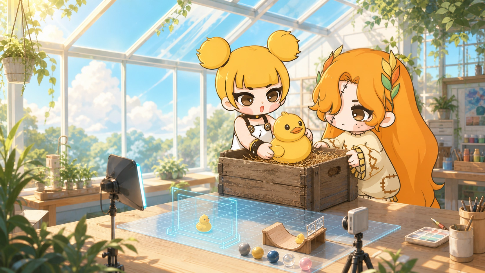
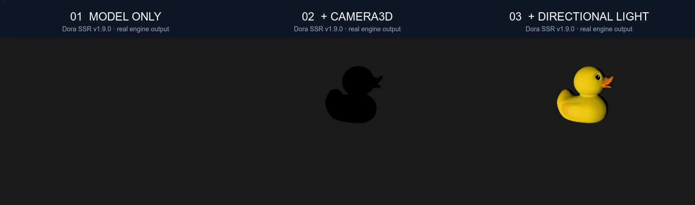

# Why Is Dora SSR Only Now Beginning to Support 3D? From Creation Cost to the First Little Duck



<!-- truncate -->

## Dora did not avoid 3D simply because a few APIs were missing

To explain why Dora SSR did not support 3D in the past, the answer cannot be found in technical implementation alone.

It was not because we had never considered it, nor merely because model, camera, and lighting APIs are difficult to implement. What truly made me hesitate was that 3D has never been only a feature problem.

Once you begin making a 3D game, the creative investment usually expands rapidly. Beyond rendering features, there are models, materials, textures, skeletal animation, scene construction, lighting, and physics. Art assets are especially demanding. To verify that an engine can genuinely support a 3D work, it is not enough to put a few test triangles on screen. Real models and scenes must be loaded and used repeatedly so that their display, movement, and interaction can be checked.

Dora SSR itself is primarily an individual creation maintained together with its community. We do not have a team that can continuously invest large amounts of programming, art, and content-production resources. For an individual creator, implementing a group of 3D APIs may still be possible. Producing enough assets, examples, tutorials, tests, and real works around them is the part that is much harder to sustain.

I did not want to put “3D support” on a feature list while leaving behind a half-finished system with little validation from actual works and insufficient energy for continued maintenance. So the idea remained on hold for a long time.

## Until AI Coding lowered the cost of experimentation

What changed was not that producing 3D content suddenly became cheap. At least for now, AI still cannot reliably complete a production-ready set of models, materials, animation, and scene assets for us.

The change was that AI Coding began to participate in real engineering: modifying several modules, building, debugging, testing, and writing documentation. It allows an idea to become a runnable prototype more quickly and makes the next verification round less expensive after a problem is found.

The maintainer must still decide the architectural boundaries, technical direction, and acceptance criteria. But once the cost of trying fell, we could finally begin an engineering effort that had previously been difficult for an individual to sustain.

## How the 3D features were built step by step

When the work truly began, our first question was not “how many model formats should we support?” It was how new 3D capabilities could enter Dora SSR without disrupting its lightweight 2D creation workflow.

### First, define the boundary between 2D and 3D

Dora SSR did not force 3D nodes into its original 2D node system. Instead, it created a separate 3D scene tree. Existing 2D nodes continue to use pixel positions, hierarchy, and render order, while the new `Node3D` handles position, rotation, and scale in three-dimensional space.

The two are connected through `View3D`. You can think of it as a 3D window embedded in the existing scene: the familiar 2D world remains outside the window, while the new 3D scene runs inside it. This required more design work, but it preserved how existing Dora SSR projects are used and allowed 2D interfaces and 3D content to remain composable.

### Next, complete the smallest path from a model to an image

After defining the boundary, the next goal was not to finish every feature at once. We first answered three minimal questions: what is placed in the scene, where is it viewed from, and how is it illuminated?

We made `Model3D` load glTF models, `Camera3D` observe three-dimensional space, and lighting and materials render the model surface correctly. Only after this shortest path worked did we continue with PBR materials, ambient light, shadows, animation, caching, and asynchronous asset loading.

That order matters. With every added layer, we could return to the previous working result and decide whether a problem came from the model, camera, lighting, or asset loading instead of confronting one large scene containing every variable at once.

### Move from “it can be displayed” to “it can be a game”

A model appearing on screen is only the beginning. To become a game object, it must move, collide, respond to the player, and work together with the original 2D interface.

Later development therefore added 3D animation, a physics world, rigid bodies, and character controllers. `Surface3D` allows existing 2D content to appear in three-dimensional space. Language bindings also have to be updated at the same time; otherwise, capabilities implemented at the engine layer still cannot reach users.

### Finally, use real scenes to close the loop

A feature compiling successfully does not mean it is usable. During development, we repeatedly ran scenes containing different models, materials, shadows, animations, and physics. We retained screenshots, rendering statistics, and automated regression results. Operations that can conceal bugs—repeatedly creating and destroying nodes, loading models asynchronously, and colliding characters with objects—also needed separate checks.

Only then did Dora SSR's first round of 3D work become a path verified through actual execution rather than merely a collection of interfaces. The next question was no longer “does the engine have 3D?” but “where should someone encountering it for the first time begin?”

## Why we finally began with a little duck

The new tools gave us the ability to start, but they did not change another long-standing Dora SSR belief: a game-development tool should not require you to prepare an entire studio before it permits you to create.

3D involves many concepts. Model formats, cameras, lighting, materials, shadows, animation, and physics can each fill a chapter. If the first tutorial begins with an elaborate scene, beginners see only a beautiful result without knowing which line they should write first.

So we chose a deliberately plain experiment: load one little duck, even if it is almost invisible at first.

Then solve only one problem at a time. First confirm that the model has entered the scene, then learn how to observe it, and finally let light reveal its surface. The result is not only a finished image, but three reusable judgments: what is in the scene, where it is viewed from, and how its surface becomes visible.

## Next, understand three basic questions

When first learning 3D development, an unexpected image does not necessarily mean the code is wrong.

A model usually needs three basic components to become a clear, readable 3D image:

- **Model**: what should appear in the scene.
- **Camera**: where and how the model is observed.
- **Lighting**: how light, shade, and volume appear on the model's surface.

Next, we will use Dora SSR and a small duck model and add these three components in order. At the end, you will not only see the final image but also understand the problem solved by each piece of code.



## What you need before starting

This article uses TypeScript. Before starting:

1. Create a Dora SSR TypeScript project.
2. Open it in Web IDE.
3. Put a glTF 2.0 model at `Assets/Model/Duck.glb`.

`.glb` is glTF's single-file format. It can hold model geometry, textures, and animation data together, making it convenient for a first exercise.

If you use your own model, change only the file path in the code. Before completing the next three steps, it is best to keep the model near its exported origin, `(0, 0, 0)`.

## Step one: load the model

First, create a model node and add it to Dora SSR's 3D entry view:

```ts
import {Director, Model3D} from "Dora";

const model = Model3D("Assets/Model/Duck.glb");
if (!model) {
	throw new Error("Unable to load Duck.glb. Check the path and format.");
}
Director.entry.addChild(model);
```

Two things happen here:

1. `Model3D()` reads the glTF file and returns a model node that can be placed in a 3D scene.
2. `Director.entry.addChild(model)` explicitly adds the model to the default 3D entry view.

The `if (!model)` branch handles a loading failure. If the path is wrong, the file is damaged, or the format is unsupported, the program immediately reports an understandable error instead of continuing until the problem becomes harder to locate.

After running this code, you may not see the duck, or you may see only a very small object. That is normal.

Dora SSR is still using its default 2D camera. A 2D scene usually organizes positions in screen pixels, while 3D models are generally built in world units closer to physical scale. The model is already in the scene; the current way of viewing it is simply unsuitable.

At this stage, confirm:

> Did the model load successfully—not does the image already look good?

## Step two: switch to a 3D camera

Next, add `Camera3D` to the existing code:

```ts
import {Camera3D, Director, Model3D, Vec3} from "Dora";

const model = Model3D("Assets/Model/Duck.glb");
if (!model) {
	throw new Error("Unable to load Duck.glb. Check the path and format.");
}
Director.entry.addChild(model);

const camera = Camera3D();
camera.lookAt(Vec3(3, 2, 5), Vec3(0, 0, 0));
Director.pushCamera(camera);
```

Focus on these three lines:

- `Camera3D()` creates a 3D camera that views the world with perspective.
- `lookAt(eye, target)` sets the camera position and viewing target.
- `Director.pushCamera(camera)` makes this the current camera.

In this example:

- `Vec3(3, 2, 5)` is the camera position: three units to the right of the origin, two above it, and five in front.
- `Vec3(0, 0, 0)` is the viewing target, the origin where the duck is located.

After switching cameras, the duck enters a suitable composition, but the image may remain dark and show little more than a silhouette.

That means the camera has done its job: it solved how to observe the model, not how to reveal the model's surface.

## Step three: add directional light

Finally, add `DirectionalLight3D`:

```ts
import {
	Camera3D,
	DirectionalLight3D,
	Director,
	Model3D,
	Vec3,
} from "Dora";

const model = Model3D("Assets/Model/Duck.glb");
if (!model) {
	throw new Error("Unable to load Duck.glb. Check the path and format.");
}
Director.entry.addChild(model);

const camera = Camera3D();
camera.lookAt(Vec3(3, 2, 5), Vec3(0, 0, 0));
Director.pushCamera(camera);

const light = DirectionalLight3D();
light.intensity = 3;
Director.entry.addChild(light);
```

A directional light is comparable to a distant light source such as the sun. Its rays share one direction, so it does not need a specific position; rotating the light node changes the illumination direction.

`intensity = 3` sets the light strength. After adding it, the duck's yellow surface, eyes, bill, and shading become clear, and the model begins to show volume.

## What problem does each component solve?

| Component | Main role | Typical result when missing |
|---|---|---|
| `Model3D` | Loads and creates the 3D object in the scene | The scene has nothing to display |
| `Camera3D` | Determines viewing position, direction, and perspective | The model is tiny, misplaced, or invisible |
| `DirectionalLight3D` | Produces readable light and shade on the surface | The model is dark, flat, or only a silhouette |

The actual result is also affected by model scale, origin, materials, and ambient light. This table helps locate the first category of problem; it is not the only answer to every 3D rendering issue.

## Common questions

### Nothing appears after loading the model

First check the model path. If there is no loading error, continue by adding `Camera3D`. The default 2D camera is unsuitable for observing a model built in world units.

### The image is still empty after adding a 3D camera

Check, in order:

1. Was `Director.pushCamera(camera)` executed?
2. Is the camera looking toward the model?
3. Is the model still near the origin?
4. Is the model itself extremely large or small?

### The silhouette is visible, but the surface is dark

Confirm that `DirectionalLight3D` was created and given enough intensity. Some materials may also require further ambient-light, color, and light-direction configuration.

### My own model does not fit the composition

Different models have different scales and origins. Adjust the camera position and target in `lookAt()` first, then consider the model's `position` and `scale`.

## Continue learning from the first scene

Dora SSR v1.9.0's first 3D tutorial sequence continues from this foundation:

> model → camera → lighting and materials → animation → physics and characters → 2D UI → measurement and debugging

Model, camera, and lighting are the starting point. Once you understand each responsibility, you can first decide whether a visual problem belongs to asset loading, observation, or surface illumination instead of changing every parameter at once.

The three-stage image in this article was produced by a script that launched the real Dora SSR engine. The same scene added the model, camera, and directional light in sequence, and the final check reported `PASS`. This proves only that the example ran successfully in the current local environment; it does not guarantee identical visual results for every model and device.

You can now open the complete tutorial, run the first step yourself, and observe how your model changes across the three stages:

**Start “Creating Your First 3D Scene”:**

https://dora-ssr.net/docs/tutorial/Three%20D%20Game%20Development/first-3d-scene/

---

<p align="center"></p>
