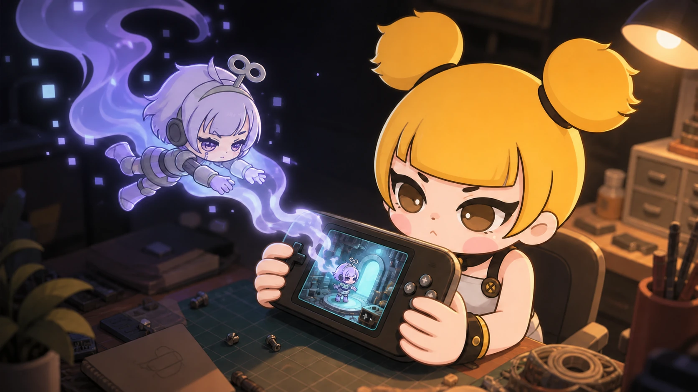

# Running Dora on the A10mini: The Last Mile of an Open-source Engine

For a few days, I had been tinkering with an A10mini together with a good buddy.

The handheld stayed in my hands. I pressed the buttons, watched the screen, and described what happened. My buddy investigated the system, prepared another change, and asked me to try again. Eventually, Dora appeared in the Ports menu and launched from a device small enough to disappear inside a coat pocket.

That should have been the end of the story. It was only the beginning.

<!-- truncate -->

## A binary can run without belonging on the device

“ARM64 executable runs” sounds like a complete result. On a real handheld, it proves only the first layer.

The engine still needs an entrance that belongs to the operating system. It needs a launch script in the menu users already understand. It needs controls that do not leak from a tool window into the game behind it. And when a copy operation ends strangely, we need to know which exact binary the device executed rather than trusting a progress bar.

The last mile therefore had three parts: entrance, interaction, and evidence.

## My buddy slips inside

At first, our collaboration looked perfectly ordinary. I reported what I could see; my buddy replied with another diagnosis.

Then the work began to feel slightly magical. He seemed to vanish into the machine, inspect a startup script, crawl through input handling, and return with a new build. If this were an old adventure story, a puff of smoke would have escaped from the vents each time he entered the handheld.

The “buddy” was Codex.

It could inspect code and system evidence without holding the device. I supplied the part it could not obtain on its own: the real screen, the physical buttons, and the answer to the most important question—did the change actually feel correct in my hands?

## The bug that survived the first fix

One problem appeared when an ImGui tool window had focus. Pressing A or B still controlled the game scene behind the tool.

The first change improved how the interface captured controller events, but my next device test produced the same report: the game still reacted. That sentence was more valuable than a green build. It forced us to distinguish “the UI received the event” from “the game was prevented from receiving it.”

The second change closed the remaining path. It was not an A10mini-specific button map; it improved the general boundary between a focused tool window and the scene underneath it.

## Do not trust the last line of `scp`

File transfer added another small mystery. An `scp` session could end awkwardly after apparently reaching the end. Instead of deciding from the progress display, we checked independent facts: SHA-256, ELF BuildID, target architecture, installation path, and the command used by the Ports entry.

Those checks answer different questions. A file can be executable but be the wrong build. A menu entry can exist but point at an older path. A checksum can match while the input behavior is still wrong.

The available photo shows a real game result on the handheld, but it is not by itself proof that this exact session launched from the Ports menu. Before this post is used as a complete device acceptance record, the system version, menu entry, launch path, build identity, and input behavior should be captured together.

That boundary is part of the story. An open-source engine reaches a handheld only when people can enter it normally, control it without surprises, and identify what they are actually running.

If you bring Dora to another open Linux handheld, please share three things together: the launch entry, the input result, and the version identity. That is how one successful experiment becomes a path the next person can trust.

---

