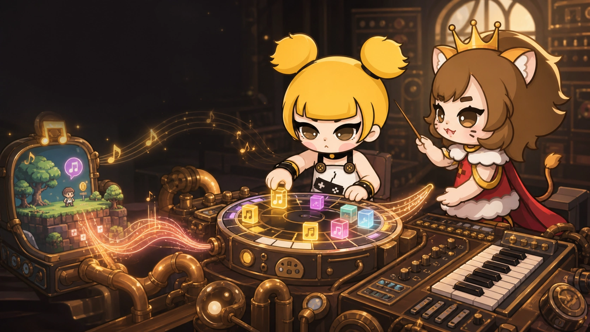

# Why Music Was Always the Most Annoying Part of a Small Game

When a game treats music as a major part of its identity, the answer is clear: work with a musician whose taste you trust. Music is not an empty slot in a production checklist.

Small games are more awkward. A prototype still benefits from music written for its pace and mood, but commissioning a professional track may be disproportionate to the experiment. Searching through stock libraries is rarely the creative work I wanted to be doing.

The feature that changed this in Dora did not begin with me. A community contributor opened a pull request that gave Dora Agent its first music-generation path using pure Lua. That small contribution started a much larger design discussion.

<!-- truncate -->

## A tool, a Skill, or part of the engine?

We first debated whether music generation should remain visible as an Agent tool. Tool calls are useful for frequent, structured capabilities, but every permanently visible tool consumes context and increases the number of choices the model must consider on every loop.

Music generation is valuable, but not frequent enough to occupy that space forever. We moved the workflow into a Skill and script: the Agent reads the instructions only when a project actually needs music.

That exposed the next problem. Synthesizing through Lua was too slow, and the available procedural timbres were limited. We eventually turned to Rust's music ecosystem and added the necessary support beneath the scripting layer.

## A very small music lesson

A computer does not understand “a warm walk through the city at night.” It understands events: which pitch begins on which beat, how long it lasts, how hard it is played, and which instrument should perform it.

Dora exposes two complementary ways to describe those events.

### Score: write the notes

A `score` is a programmatic sheet of music. Each track declares its instrument, and each note has a pitch, start beat, duration, and velocity. This is useful for UI sounds, victory phrases, known melodies, and any cue whose timing must be exact.

The Agent may help compose or revise the score, but the engine's job is deterministic: validate the definition, convert beats to time, and perform the notes accurately.

### Composition: write the rules

A `composition` describes a musical space instead of listing every note. It can specify tempo, key, mode, chord progression, section structure, melodic density, rhythmic complexity, intensity, and a random seed.

The generator builds a time grid, derives legal pitches from the scale and chords, creates sections, chooses melodic and rhythmic variations, and finally synthesizes and mixes the result. Randomness chooses between valid options; it does not remove musical constraints. A fixed seed makes the arrangement reproducible for a given engine version.

## Who performs the notes?

Dora offers two sound sources.

The built-in synthesizer uses waveforms, envelopes, FM, and procedural noise. It is compact and predictable, and works well for electronic timbres, short effects, and music that should not depend on sample assets.

The other option is SoundFont. A SoundFont maps MIDI notes, banks, and programs to sampled instruments. Dora ships GeneralUser GS 2.0.3 BETA as a compressed `.sf3`, with 287 extracted presets covering pianos, guitars, basses, strings, winds, synthesizers, and percussion.

GeneralUser GS is optional, not silently enabled. A music definition must name the SoundFont and select a preset. The library's license permits personal and commercial musical use, but its author also documents that some early free samples cannot be traced with absolute certainty. Important commercial releases should make their own risk assessment instead of treating “bundled with the engine” as the end of licensing work.

## The moment the Agent got my taste

For the first serious experiment, I asked for a warm, poetic Jazz Hiphop fragment inspired by the general qualities I enjoy in Nujabes' music—without copying a melody, sample, or arrangement from an existing work.

I translated taste into discussable constraints: 86–90 BPM, Dorian color, jazz harmony, dusty kick, a clear snare, varied hi-hats, swing, ghost notes, and a restrained melody that left room for the beat.

The first result was not magic. One version had good drums and unpleasant harmony. Another contained too many notes. A later melody became sharp and tense. I kept giving concrete feedback, and the Agent adjusted harmony, density, timbre, and the seed.

The final result, `jazz_hop_night_walk.ogg`, runs for about a minute at 88 BPM in D Dorian. It uses Dora's built-in synthesizer rather than GeneralUser GS.

I jokingly call generation “drawing a card,” but the useful part is not repeatedly pulling the lever. It is being able to listen, explain what feels wrong, change understandable musical parameters, and generate the next version.

At one point, the drums, spacing, and mood landed together. My reaction was simple: the Agent had finally understood what I meant.

## From a request to a game asset

In Dora Web IDE, a creator can describe the scene, purpose, duration, mood, and delivery format. The Agent reads the music Skill, creates a TypeScript definition, builds it, runs synthesis in the engine, and reports the actual output.

A successful TypeScript build proves the definition is valid. It does not prove the music is good. Duration, sample rate, peak level, and clipping can be checked automatically; taste still needs ears.

Try it with one small scene. Tell the Agent where the music will play, what movement it should support, and what it must avoid. Generate one version, listen, and respond with a specific musical observation.

---

