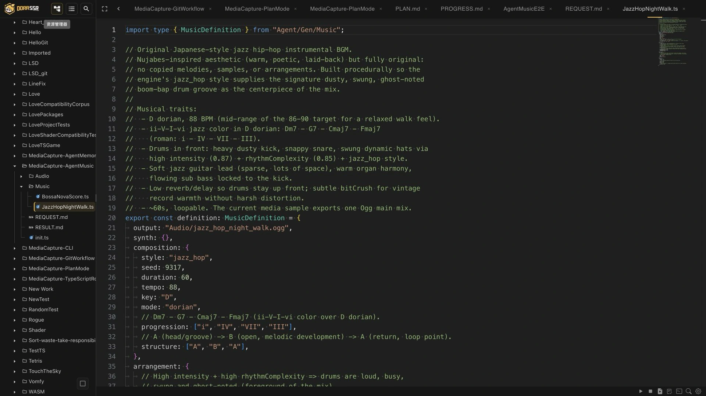
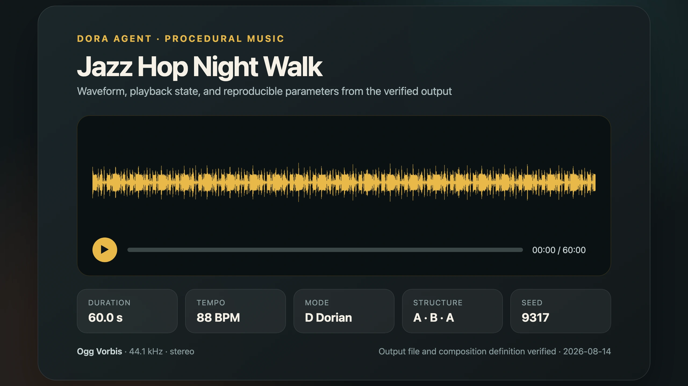
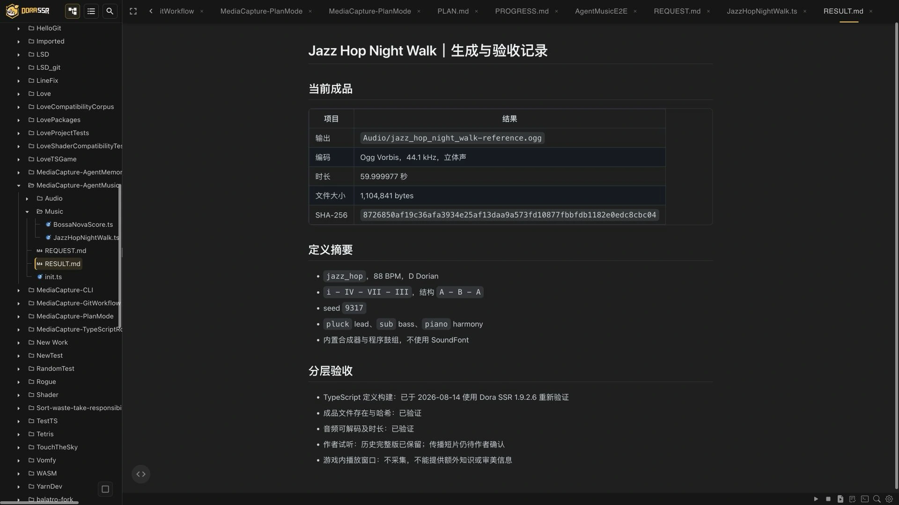

# Letting an Agent Compose Game Music

> From a community member's pure-Lua pull request to the first Jazz Hiphop track from Dora Agent that genuinely matched my taste.

When making games in the past, I often found searching for sound effects frustrating.

For a work with high musical ambitions, the answer is actually clear: find a professional musician whose style you love and who truly understands the work. Music is not something used to fill a blank in a game; it is part of the work's expression.

The awkward cases are small games, experimental prototypes, and ideas that appear suddenly.

<!-- truncate -->

I want background music that belongs to the scene, yet the project may not justify inviting a professional composer. Dropping in any loop I happen to find can easily make the image, interaction, and sound speak three different languages. A small gameplay experiment then turns into hours spent moving between asset sites and audio folders.

The problem is not a complete absence of music. It is the absence of something that feels exactly right for this game.

So when Dora Agent gained music generation, I cared less about “AI can generate another kind of thing” than about a practical question:

> Can it understand my description of a game's atmosphere and turn music into an asset that can be built, previewed, revised, and kept inside the project?

This article explains where the capability came from, why it moved from permanent tools to an on-demand Skill, how a pure-Lua prototype entered the native engine, and how an ordinary creator can use it now.


## The idea did not come from me

Dora Agent's music generation began with [PR #117](https://github.com/IppClub/Dora-SSR/pull/117), contributed by community member [`@123123213weqw`](https://github.com/123123213weqw).

The contribution used pure Lua to give the Agent sound-effect and procedural-background-music generation. It did not call an online text-to-audio service. It calculated waveforms, organized melody and rhythm, and wrote the result as WAV files inside the game project.

The first version was already substantial: it could generate short effects, background music, variations, and multiple parts. More importantly, it proved for the first time that Dora Agent could participate directly in making game assets, not only game code.

After the pull request merged, however, the community discussed it for a long time. The longest debate was not whether the music sounded good. It was a product-design question:

> Should music generation be a permanent Agent tool, or a Skill loaded only when needed?

## Why music generation did not remain a permanent tool

First, two terms.

A **Tool** is visible and callable in every Agent turn, like reading files, editing code, and running builds. It resembles the screwdriver and wrench always lying on a workbench.

A **Skill** is closer to a specialized manual and toolkit kept in a cabinet. The Agent normally knows the capability exists. When a music task appears, it reads the full instructions, writes the appropriate script, and invokes the engine.

Music generation is interesting, but it is not a frequent action in every code-editing task. Keeping the full parameter set and three generation tools in every Agent loop consumes context and makes an otherwise clear tool list increasingly crowded.

We therefore removed the permanent `generate_sfx`, `generate_music`, and variation tools and moved the workflow into the on-demand `music-generation` Skill.

In other words, the Agent no longer places an entire recording studio on the desk every time it starts work. It brings the studio out only when the project actually needs music.

The choice also made production more transparent. Instead of one opaque tool call, the Agent writes a music definition, the project type-checks its parameters and structure, and the engine performs synthesis only after that definition builds successfully.

## Being able to generate was still one layer short of being usable

The product shape exposed another problem. The pure-Lua prototype proved the direction, but could not comfortably carry increasingly complex synthesis.

Digital audio continuously calculates large numbers of samples. At 44.1 kHz, one second contains 44,100 sample positions. Tens of seconds of background music may include several parts, envelopes, mixing, and file encoding. Leaving all of that in Lua constrained both generation speed and future expansion.

The original procedural timbres were also limited. They were excellent for quick electronic effects and retro sounds, but piano, jazz drums, guitar, and similar expressions demanded more.

I therefore continued moving the capability into the engine:

- The Agent still writes a typed music definition in TypeScript.
- The project build catches misspelled styles, instruments, and parameters early.
- Synthesis, mixing, and audio encoding run asynchronously in native Rust.
- Simple sounds use the built-in synthesizer; more realistic instruments can use SoundFont.
- Short effects are written as WAV, while longer background music can be written directly as Ogg.

The complete path became:

> describe the need → Agent writes the definition → build checks it → native engine synthesis → WAV/Ogg output → preview and revise in the game

Every step remains visible and inspectable. The Agent does not make sound appear in an invisible remote service; it leaves the definition, parameters, and output inside the project.

## A very small music lesson: how can a program represent a song?

Before continuing to `Night Walk`, we need a more basic answer: why can music be generated by a program?

Music feels emotional, but a computer can first separate it into relatively clear information:

- **Pitch**: the note to play, such as C4 or F#4; internally this can also be a MIDI number from 0 to 127.
- **Beat position**: the beat on which a note starts and how many beats it lasts. This is a musical position, not a second in the audio file.
- **Tempo**: beats per minute. At 120 BPM, one beat lasts half a second.
- **Measures and meter**: repeated organization of beats. In common 4/4 time, every four beats form a measure.
- **Velocity**: whether the same note enters softly or lands heavily.
- **Tracks and timbre**: melody, bass, harmony, and drums can occupy separate tracks with different instruments.
- **Mode and harmony**: a mode defines a useful pitch collection; chord progressions shape stability, departure, and return.

If these terms are unfamiliar, the essential point is simple: a computer does not directly understand “warm” or “a night walk,” but it precisely understands which note begins on beat two, how long it lasts, and how strongly it is played. The Agent translates between human feeling and executable information.

Dora provides two paths, `score` and `composition`. Both create sound, but they solve different problems.



## Score: write every note into a programmatic sheet

A `score` is a programmatic sheet of music. The author or Agent explicitly writes the instrument for each track and every note's pitch, start, duration, and velocity.

```ts
import type { MusicDefinition } from "Agent/Gen/Music";

export const definition: MusicDefinition = {
	output: "Audio/confirm.wav",
	synth: {},
	score: {
		bpm: 120,
		beatsPerBar: 4,
		bars: 1,
		tracks: [{
			instrument: "bell",
			role: "melody",
			notes: [
				{ pitch: "C5", start: 0, duration: 0.5, velocity: 0.8 },
				{ pitch: "E5", start: 0.5, duration: 0.5, velocity: 0.8 },
				{ pitch: "G5", start: 1, duration: 1, velocity: 0.9 },
			],
		}],
	},
};
```

`start` and `duration` use beats. C5 begins at beat zero and lasts half a beat; E5 follows; G5 lasts a full beat. The engine converts those beats into seconds at 120 BPM and asks the selected timbre to perform them.

A score may contain several tracks, drums, velocity changes, stereo positions, sustain pedal, and tempo changes. It suits UI confirmations, victory cues, specified notes or rhythms, exactly repeatable melodies, and effects whose timing must land precisely.

The score does not invent the next melody. Every note is already on the page. The Agent can help compose or revise it; the engine validates, times, and performs it accurately.

## After the notes are written, who performs them? The built-in synthesizer and GeneralUser GS

Both `score` and `composition` eventually produce events describing what note is played at what time. A note does not decide whether it sounds like a piano, guitar, or square wave. The synthesizer determines the timbre.

Dora currently offers two choices.

The first is the **built-in procedural synthesizer**. Names such as `bell`, `pluck`, `sub`, `piano`, and the `lofi` drum kit correspond to internal waveform, envelope, FM, or procedural-noise models. They need no additional audio assets, generate predictably, stay compact, and suit electronic effects and procedural sound. A procedural `piano`, however, is not a recording of a real piano.

The second is **SoundFont**, a digital instrument library playable through MIDI notes. It stores real or processed samples and defines which sound, loop, and decay correspond to a bank, program, and pitch. The program still composes and schedules the performance; SoundFont supplies more recognizable instrumental material.

Dora SSR includes the [`GeneralUser GS`](https://www.schristiancollins.com/generaluser.php) SoundFont. The packaged GeneralUser GS 2.0.3 BETA by S. Christian Collins uses compressed `.sf3` samples and is about 8 MB. Dora catalogs 287 presets: Grand Piano, Electric Piano, guitars, basses, strings, winds, synthesizers, and percussion kits.

Bank and program are like a floor and room number in the instrument library. Bank 0, program 0 is Grand Piano; percussion uses a dedicated bank. The Agent can read Dora's packaged preset catalog instead of guessing numbers.

```ts
export const definition: MusicDefinition = {
	output: "Audio/piano_phrase.ogg",
	synth: { file: "Audio/GeneralUserGS.sf3" },
	score: {
		bpm: 120,
		tracks: [{
			preset: { bank: 0, program: 0 }, // Grand Piano
			notes: [
				{ pitch: "C4", start: 0, duration: 0.5 },
				{ pitch: "E4", start: 0.5, duration: 0.5 },
				{ pitch: "G4", start: 1, duration: 1 },
			],
		}],
	},
};
```

The engine does not silently use GeneralUser GS. A definition must name `synth.file` and select a `preset`; a project using only built-in instruments keeps `synth: {}`. Dora decodes the compressed SF3 samples and uses Rust SoundFont synthesis to perform them.

Neither path replaces the other. The built-in synth is lighter and more controllable. GeneralUser GS offers richer traditional instruments. One piece can even combine built-in and SoundFont tracks.

The GeneralUser GS license permits personal and commercial music creation and use or modification inside software. Its author also discloses that the origin of some early free samples cannot be traced with absolute certainty. Dora preserves that notice. Learning examples and ordinary music can rely on the stated license; an important commercial release should still review sample provenance according to its own risk.

The representative `jazz_hop_night_walk.ogg` in this article **does not use GeneralUser GS**. Its `synth` is empty; melody, bass, piano color, and drums all come from Dora's procedural synthesizer. GeneralUser GS is an optional alternative, not the source of this track.

## Composition: let rules and algorithms grow into a piece

`composition` addresses the opposite case: we know the atmosphere and structure we want, but do not want to list hundreds of notes.

| Condition | What it tells the algorithm |
|---|---|
| `style` | Which style rules to use, such as calm, hiphop, or jazz_hop |
| `tempo` | How quickly the music moves |
| `key`, `mode` | The tonal center and preferred pitch collection |
| `progression` | How chord degrees move from measure to measure |
| `structure` | How sections such as A, B, and A are arranged |
| `melodyComplexity` | How dense and mobile the melody is |
| `rhythmComplexity` | How active syncopation, drums, and note spacing are |
| `intensity` | The overall push of the arrangement and drums |
| `seed` | The choices for this generation, so a version can be reproduced |

The current procedure builds a 4/4 time grid with sixteen subdivisions per measure, derives allowed pitches from the key and mode, translates Roman-numeral chords into pitches, and keeps harmony, bass, and melody near the active chord. A deterministic pseudo-random sequence based on seed, section name, and measure selects variations within those constraints. Each style supplies a drum skeleton, dynamics, and mix tendency; Jazz Hiphop adds swing, kick, snare, hi-hat, and softer ghost notes. Finally, the events are synthesized, panned, enveloped, reverberated or delayed, normalized, and encoded as WAV or Ogg.

Random does not mean unconstrained notes. Chords provide the ground, the mode marks the walking area, complexity decides whether the route is direct or winding, and the seed remembers the chosen path.

The same engine version, definition, and seed reproduce the same arrangement decisions. An engine algorithm update may change the result, so a production project should version the final audio file as well as the seed.

The simplest distinction is:

> `score` means “perform these notes exactly”; `composition` means “arrange a version inside these rules.”

`Night Walk` needed roughly one minute of drums, bass, harmony, and melodic variation. We wanted to test whether the Agent could translate taste into compositional rules, so it used `composition` rather than listing every note.

## Let the Agent write Jazz Hiphop that I like

I have long enjoyed the warm, poetic, relaxed Jazz Hiphop associated with Nujabes. I did not simply ask the Agent to copy that style. I translated the feeling into general musical characteristics: 86–90 BPM, Dorian minor color and jazz harmony, dusty kick, clear snare, varied hi-hat, swing, syncopation, ghost notes, restrained melody, less reverb and delay, and no copied melody, sample, or arrangement.

The first result still missed. One version had good drums and unpleasant harmony. After that changed, the melody became crowded. Fewer notes still felt tense; another timbre became sharp.

My feedback grew more specific:

> The drums sound good, but the harmony does not.
>
> There may be too many notes; perhaps they are not standing together with the drums.
>
> The melody is sharp. Leave more space.

The Agent rearranged harmony and melody, lowered density, kept the drums forward, and fixed the final seed. The retained `jazz_hop_night_walk.ogg` is about 60 seconds, 88 BPM, D Dorian, and loopable.



I sometimes call generation “drawing a card,” but the useful process is not clicking until a masterpiece falls out. We listen, name what is wrong, change understandable parameters, and generate another version.

When the beat, spacing, and atmosphere finally arrived together, I had one direct reaction:

> This Agent really seems to get me.

## Next, let Dora Agent generate music for a game

You do not need to begin with 88 BPM, Dorian mode, or seventh chords. Begin by describing the game situation clearly:

> Create about 45 seconds of loopable background music for a small game about walking through a city at night. It should feel warm and relaxed, with a clear beat that keeps the character moving. Keep the melody sparse, use no samples from existing works, output Ogg, then preview it and report the actual duration.

The Agent reads the Skill and writes a TypeScript definition in the project's `Music` directory. A short cue can use `score`; atmospheric background music fits `composition`.


```ts
import type { MusicDefinition } from "Agent/Gen/Music";

export const definition: MusicDefinition = {
	output: "Audio/night_walk.ogg",
	synth: {},
	composition: {
		style: "jazz_hop",
		seed: 9317,
		duration: 45,
		tempo: 88,
		key: "D",
		mode: "dorian",
	},
	arrangement: {
		intensity: 0.8,
		melodyComplexity: 0.15,
		rhythmComplexity: 0.85,
	},
	instruments: {
		lead: "pluck",
		bass: "sub",
		harmony: "piano",
	},
};
```



For a first attempt, remember four things: `output` chooses the destination; `composition` describes style, length, tempo, and mode; `arrangement` controls density and rhythmic activity; and `instruments` selects lead, bass, and harmony timbres.

The Agent builds the file. A successful build proves that names, types, and basic structure are valid, not that the music sounds good—TypeScript has not taken over our ears.

The engine then synthesizes in the background and reports real duration, sample rate, peak, and clipping. You can preview it and respond in natural language: move the drums forward, leave more space, warm the harmony, or make the loop transition less obvious. Such observations are more useful than “make it better.” You need not be a composer, but you do need to learn to describe what you hear and what the game needs.

## It did not replace musicians; it made trying easier

Dora Agent can now help small games make effects, background loops, and revisable music assets. It has not made professional music creation unimportant.

For a work with clear artistic ambitions, I still prefer collaborating with a professional musician I admire. Human experience, expression, communication, and long-term understanding of a whole work cannot be replaced by a parameter table.

This capability solves another problem. For a small game, Game Jam, gameplay prototype, or atmosphere experiment, we no longer have to spend a long time finding a barely suitable asset before hearing the idea. We can ask the Agent for a project-ready first version, listen, and decide whether the direction deserves more work.

AI did not make the aesthetic judgment for us. It made “I have a feeling in my head—can I hear it first?” easier to begin.

If you are making a small game, do not tell the Agent only to “write a good BGM.” Describe a real scene: where the character is, what they are doing, what the player should feel, and whether the rhythm should lead or accompany them.

Then listen for the feeling that is hardest to make it understand.

---

<p align="center"></p>
