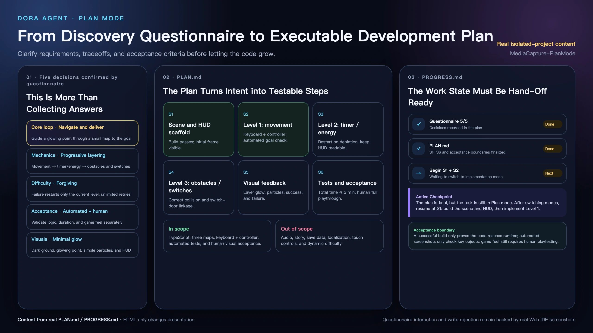

# Talk Through Requirements with the Agent First

Before asking an Agent to code for hours, I let it discuss requirements, compare designs, and propose questionnaires—then preserve our decisions in a plan and progress record.

<!-- truncate -->

> An Agent can help press the accelerator, but humans still need to hold the steering wheel for requirements, architecture, and technology choices.

## I am still discussing the requirement, and it already wants to edit files

Before asking an Agent to perform a long task, I have a habit: I do not let it code immediately. I ask it to act as a product manager for a while.

I begin with an idea that may still be vague. Together, we split requirements, add boundaries, and compare implementations. What is essential and what merely sounds attractive? Which route is convenient now and which will remain maintainable? What observable result will prove completion?

Agents are often extremely eager at this stage. A human product manager may still be saying “let us think,” while the Agent has rolled up its sleeves and is ready to modify files. Coding is what it does best; making an overly diligent programmer sit through a product meeting without touching anything almost feels unfair.

Yet the greatest danger in a complex task is not always incorrect code. Sometimes the code is perfectly reasonable, but it implements the wrong thing.

If product choices remain unresolved, the Agent must fill them from context. It may select a defensible answer, implement it cleanly, and only when we run the result do we discover that it did not solve my original problem. Bad code can be rebuilt and revised. A wrong direction moves farther from the goal the faster it is executed.

I do not require the first implementation to be beautiful. Before implementation, I care that the whole approach remains within a range I understand, can judge, and am willing to accept responsibility for.

## Knowing how to code is not knowing how to define good software

It is tempting to treat AI programming as input and output: a human writes a requirement, a model emits code, the program runs, and the task ends. Software that matches human expectations still requires at least three layers of judgment.

The first is **requirements understanding**. “Add a Plan mode” might mean let the Agent think longer, forbid it from touching project files, or require it to return several options for a human decision. Similar wording can describe three different products.

The second is **architecture**: where a capability belongs and how it should cooperate with the existing system. A restriction hidden only in a UI button is cosmetic if the backend still allows execution. Progress stored only in the current conversation is unreliable if it disappears in the next session.

The third is **technology selection**. We must compare cost, performance, platform compatibility, dependencies, existing languages, and maintenance burden. A model may propose the most common, best-documented answer for an average project. Common does not automatically mean appropriate for Dora or for an open-source engine maintained primarily by an individual.

Agents are valuable investigators. They can inspect code, supply alternatives, explain trade-offs, and reveal risk. Their first feasible proposal does not become optimal merely because a model produced it. Humans contribute judgment about needs, value, and long-term consequences; Agents contribute investigation, comparison, and implementation.

## Starting earlier does not necessarily save tokens

A poor route consumes tokens while the Agent reads files, writes code, explains changes, builds, and repairs errors. Once we notice the direction is wrong, it must relearn the requirement, remove the old design, rewrite the implementation, and verify it again.

A choice that could have been rejected in discussion grows into a very diligent chain of rework.

I do not claim Plan mode simply “saves tokens.” Investigating the project, clarifying requirements, and comparing options also consume tokens. It moves part of the cost from prematurely implementing an unconfirmed direction to understanding the problem and confirming a decision first.

The most expensive rework may not be tokens at all. Human waiting, review, repeated explanation, architecture cleanup, and lost project understanding are often harder to recover.

Agents are good at acceleration. Plan mode asks who holds the steering wheel before they accelerate.

## So we added Plan mode to Dora Agent

Plan mode is not a request for the model to think secretly for longer, nor a demand for an attractive to-do list. It separates investigation, discussion, decision, and execution.

New Dora Agent sessions still begin in executable code mode. A clear small change does not need a formal meeting. A long task, vague requirement, or major technical choice can switch deliberately into Plan mode.

The Agent then does four things:

1. **Investigate the project** by reading relevant code and documents without changing it.
2. **Clarify actual choices** only when preferences, scope, or external conditions cannot be found in the repository.
3. **Maintain the plan**, recording requirement changes, compared options, current trade-offs, implementation steps, and acceptance evidence.
4. **Wait for explicit authority**. A completed plan is not permission to execute; only human confirmation returns the task to implementation.

These steps are not merely polite prompt text. They are represented in Dora Agent's interface, state, and server-side tool boundary.

## A good questionnaire is already the Agent's first design proposal

“Ask questions first” can become another form of laziness. The user states one need and receives a dozen open questions—as if the Agent replied, “Now please perform your own requirements analysis.”

That is not the product manager I want.

Plan mode expects the Agent to inspect the project first. Facts available in code, documentation, and configuration should not be asked again. Questions should focus on choices the repository cannot answer: compatibility versus simplification, main Agent versus sub-Agent scope, or automatic rollback versus waiting for confirmation.

Questions should return with comparable options. A useful choice explains what each option changes, its cost, and which one the Agent recommends after investigation. The human still decides, but does not begin from a blank page.

For example, “How should Plan mode be restricted?” merely returns the whole design problem. A useful Agent might propose:

- **Prompt-only restriction**: smaller change, but the boundary depends on model compliance.
- **Hide execution only in the UI**: users see the distinction, but backend capabilities remain available.
- **Project server-side tools by mode and restrict plan-file paths (recommended)**: more implementation work, but the system enforces the boundary.

Producing these options requires the Agent to identify the real conflict, form feasible routes, compare safety and maintenance cost, and expose its recommendation. Designing the questionnaire is active product-design work: the Agent contributes judgment and invites the human to choose, challenge, and revise it.

This format also gathers feedback efficiently. Instead of reconstructing background for an open question, the user can choose the nearest direction, combine needed conditions, and add an unlisted experience through text or “Other.” One structured answer may confirm preference, scope, and trade-off at once and can be written precisely into the plan as a traceable decision.

Recommendations expose disagreement early. If the Agent's route feels wrong, we can challenge its assumptions before code exists. Dora questionnaires therefore support single choice, multiple choice, text, recommendations, and an additional response. They are not meant to trap users inside predetermined answers, but to offer a design draft that can be criticized and combined.

When issued, the task enters `WAITING_USER`. The questionnaire replaces the ordinary input, and sending messages, continuing, retrying, or switching mode is blocked by the server. The pending form is stored at `.agent/questionnaire/pending.json`, so an unfinished decision survives a refresh or restored session.

The Agent cannot ask the question and then slip away to continue working before the human answers.

## What we discussed cannot disappear when the meeting ends

If discussion exists only in chat history, a long conversation, context compression, or a return several days later can lose not merely the final task list but the reason for each decision.

Dora Agent therefore maintains two living documents with different jobs.

`.agent/plan/PLAN.md` is the **solution document**. It records what we decided to do and not do, compared approaches and costs, why the current route was chosen, implementation stages, and acceptance criteria.

`.agent/plan/PROGRESS.md` is the **development tracker**. It records the current step, changed modules, build and test evidence, open problems, and the next action.

They are not duplicate Agent notebooks. The plan records why; progress records how far reality has moved. The first changes throughout discussion, and the second follows source changes and verification milestones during implementation. After an interrupted session, human and Agent can continue from visible shared records instead of exchanging vague passwords from memory.

> The content comes from real `PLAN.md` and `PROGRESS.md` files generated in an isolated project; HTML only reformats them. Real Web IDE screenshots remain the behavioral evidence for questionnaire interaction and rejected Plan mode writes.

## “Please do not act” cannot depend only on the Agent's self-restraint

If a prompt says “do not modify the project” while the Agent still possesses command execution, builds, and arbitrary file editing, the boundary is only advice.

Dora Agent generates the actual tool set exposed to the model from the current `workMode`. In Plan mode, builds, network fetches, command execution, and sub-Agent creation are not provided.

Plan mode must still update `PLAN.md` and `PROGRESS.md`, so it is not entirely read-only. Its edit and delete capabilities are restricted to `.agent/plan`; attempts to target source or asset files are checked and rejected at runtime.

> Prompts tell the Agent what it should obey; server permissions decide what it can do.

The project-write restriction is confirmed in source. Reading outside the workspace still needs further live testing, so Plan mode is not presented as an all-powerful security sandbox. Its immediate purpose is to prevent project modification during planning and require explicit human authority before execution.

## Switching from product manager back to executor

After requirements, trade-offs, steps, and acceptance are confirmed, the interface offers an explicit “Start development” action.

Only then does the task return to code mode. The Agent rereads the plan and begins with the next unfinished step, editing, building, and running validation. As source changes or verification milestones complete, it updates `PROGRESS.md` so the plan does not become obsolete the moment coding begins.

Plan mode does not make the Agent work less or force a ceremony onto every small edit. It separates the things that long tasks often mix together: understand, then choose; record, then authorize; execute and verify only after authorization.

## The steering wheel remains in human hands

I will continue using Agents to write code quickly, and I still accept that a first implementation may be imperfect. AI Coding is attractive because it makes formerly expensive experiments easier.

Lower experimentation cost does not make requirements, architecture, and technology choices unimportant. When code appears faster, we need even more clarity about what it is implementing and why this route was selected.

Plan mode does not turn off the Agent's engine. It returns the steering wheel to the human before work begins.

Before your next long Agent task, consider not saying “start implementing” immediately. Ask it to read the project, return with the choices that genuinely matter, and leave behind a plan you understand and are willing to confirm.

Code can be revised. Direction is better discussed first.

---

