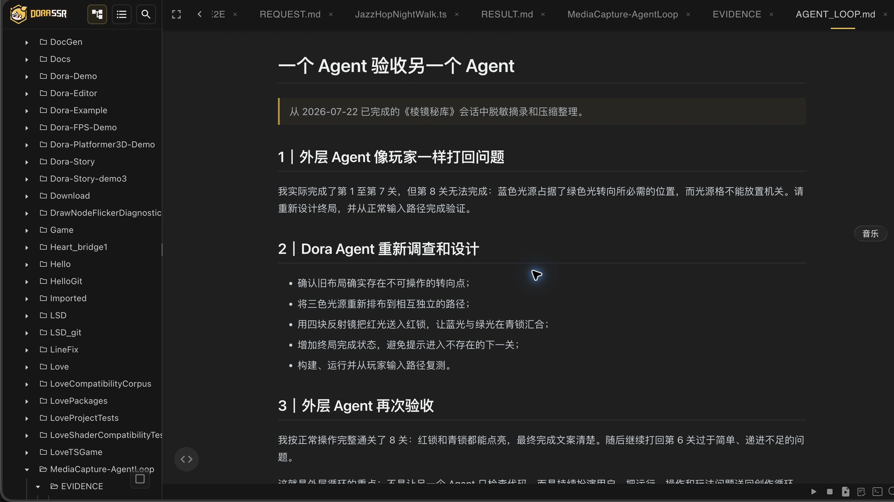
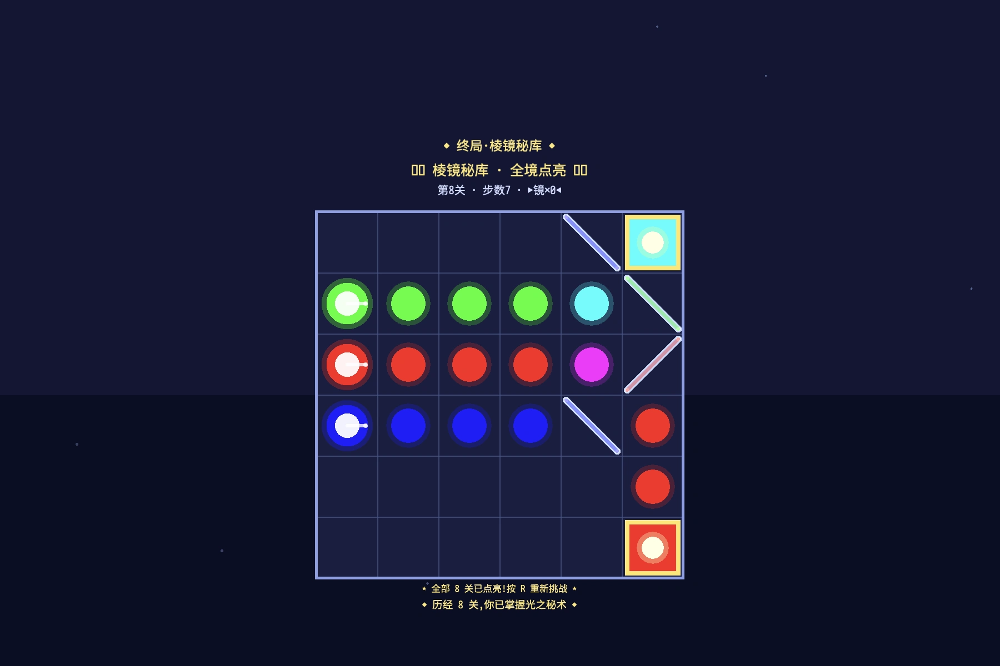
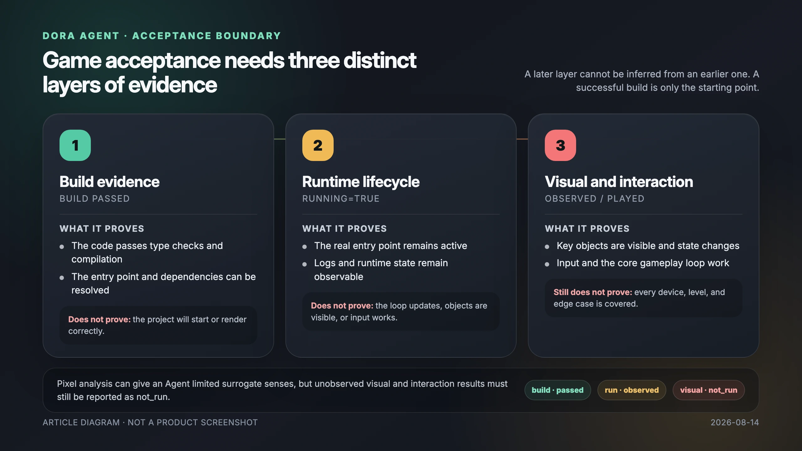
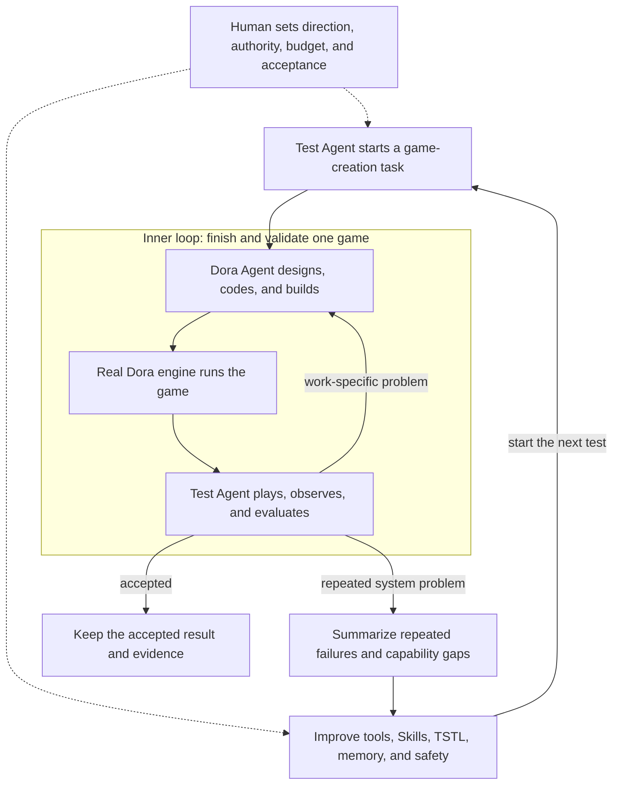

# When Agents Test Other Agents

I recently ran an experiment that sounds unnecessarily circular. Codex acted as a user: it proposed games, sent multi-turn requests, inspected the results, and asked for changes. Dora Agent acted as the developer.

Across dozens of games, the work became more than a gallery. Codex summarized repeated failures and used them to improve Dora Agent itself. The games changed, and so did the software making them.

<!-- truncate -->

## This time, I asked Codex to be the user

Codex played a Dora SSR creator inside Web IDE. It gave Dora Agent a request; Dora Agent designed, coded, built, and corrected the game; Codex continued the conversation, launched the real entry, observed the screen, used keyboard and mouse input, and returned each problem to the next turn.

One Agent made the game while another sat beside it to test the result.

This was not a training system detached from people. I still chose the experiments, what “playable” meant, and which failures deserved investigation. Codex served as a patient user, product owner, and tester that carried those requirements through every interaction.

`AgentArcade` eventually accumulated more than eighty project directories. Some were `v2` and `v3` revisions and some were incomplete experiments. After normalization, they still covered dozens of game concepts and a large record of creation, play, and rework.

Once model coding ability crossed a threshold, the hardest question was no longer only how to make it write code. It was how to make it know whether the thing it produced was actually right.

## It could not see the image, so it built itself pixel eyes

One moment still feels slightly unreal to me.

Dora Agent was fixing a light-path puzzle called *Prism Vault*. The model was GLM-5.2 and had no visual multimodal capability. It could write rendering code, but it could not simply look at a screenshot.

Instead of stopping at “please verify the image,” it asked Dora to capture a TGA screenshot, copied the file into a readable project location, and wrote Lua code to parse the image bytes.

TGA has a relatively direct structure: a header describes dimensions, pixel depth, and orientation, followed by color data. The Agent read a 1172×814, 32-bit uncompressed image, counted color regions, converted the 6×6 board coordinates into screenshot coordinates, and sampled pixels where the light source, lock, and board should appear.

It found a deep blue background, a bright red lock, a white highlight in the light source, and no fully white screen. It then captured different states to check whether placing a mirror allowed the beam to reach the lock.

The process had ordinary bugs: an unreadable path, an asynchronous copy read too early, and a wrong loop variable. Those failures make the result more useful, not less. The Agent did not pretend to see. It built a limited test that real data could contradict.

Pixel analysis can detect a black screen, missing colors, or an object absent from an expected region. It cannot judge composition, readability, animation, or game feel. It removes some deterministic errors before human review; it does not replace human eyes.

## It said the game was running, but I saw only the background

Another game passed its logic tests and reported `running=true`. When opened, it showed only the HUD.

The background node had been placed above the game graphics and faithfully covered the ball, paddle, and bricks. The program was running. The game was not meaningfully visible.

That failure separated three statements that Agents often collapse into one:

1. The code builds.
2. The engine loads and keeps the entry running.
3. A player can see, control, and complete the game.

Build and lifecycle checks are fast and automatable. Visual and interaction evidence require another layer.

## The first time I invited an Agent in, it entered the block factory

My first serious use of an Agent in Dora was more modest. I wrote one Dora-specific Blockly block as a pattern, then Cursor Agent expanded the same rules into more than 5,000 lines of API definitions in roughly three days.

The important part was the division of labor: a person understood the problem and established the pattern; the Agent spread a checkable rule across the surface.

We later let models generate typed TypeScript and compile it into Blockly. This formed a small loop—understand, generate, compile, fix, save—but a compiler can only say whether a program is legal. It cannot say whether the background covers the bricks.

## From one block tree into a complete game project

Moving into complete games required three connected abilities: understand the project, use tools to edit/build/run, and allow real results to reject the Agent's own claims.

Blockly Coder verified structured representation and compiler feedback. Dora Web IDE already placed files, editing, builds, logs, and the real engine in one workplace. Only after model coding ability improved enough to read a project over long tasks, call tools, and continue from errors did a product-level Coding Agent become worthwhile.

The question changed from “Can AI write this code?” to “Can it finish this work inside the project and present trustworthy results?”

Understanding the workplace tells it which files and APIs exist. Tools turn “I think this should work” into an actual edit, build, and run. Real results must then be allowed to contradict it. Without any one of these links, an Agent easily mistakes its own description for delivery.

## Dozens of games were not a gallery wall

In one historical batch of 24 games, Codex issued 112 tasks and produced 1,855 LLM turns. Later games did not simply become cheaper. Acceptance became stricter, and more titles required follow-up tasks.

Repeated failures included hidden graphics, a snake that stopped because one scheduled callback replaced another, missed short key presses, controller state read from the wrong place, touch targets that became tiny, and HUDs that were unreadable at full screen.

The snake case was specifically two calls to `schedule()` on the same node. In Dora, the second schedule replaces the first; a redraw callback displaced the callback advancing the game. The program did not crash. It remained solemnly still.

When a failure repeated, we stopped treating it as a one-off prompt problem. We changed Dora Agent's workflow, engine feedback, TypeScript rules, or validation tools. Common TypeScript mistakes such as uncontrolled `any`, `null`, and comparisons whose semantics diverged from Lua were moved into the TSTL compiler's constraints, where every future Agent could receive the same feedback.

## The games changed, and the Agent changed too

Repeated failure is more valuable as a system signal than as another longer game-specific prompt.

When the Agent searched APIs indefinitely instead of building, we established a small-edit, build, and error-correction rhythm. When context compression made it reread finished work, summaries retained the active error, changed files, and exact next action. When `running=true` created false confidence, we separated build, lifecycle, visual, and interaction results. Repeated coordinate, layer, `schedule`, HUD, and input mistakes became Dora-specific Skill knowledge.

Some habits needed a harder boundary. Dora TypeScript becomes Lua, and the two languages disagree in important corners. Explicit `any` abandons useful checking; bare `null` does not represent Lua's absence correctly; Lua arrays cannot preserve holes created by `undefined` or `null`; JavaScript treats numeric zero as false while Lua treats only `false` and `nil` as false.

I therefore updated Dora's TSTL compiler, not only the prompt. Explicit `any` now fails compilation. Bare `null` explains that Lua has no corresponding value and asks for `undefined`. Conditions in `if`, loops, `&&`, and `||` are checked for accidental JavaScript truthiness and require explicit “exists” or equality comparisons. Skills teach the rule early; the compiler is the gate that never forgets it.

In another test, work launched by Dora Agent drove engine memory to about 30 GB before I force-quit it. More tool authority therefore also requires timeouts, cancellation, object-count monitoring, and reliable cleanup.

This is not model-weight training. What these games continually train is the system around the model: tool feedback, Skill knowledge, progress retention, permission to continue, and the evidence required before saying “complete.”

## When the loop itself becomes an engineering object

Inside the first loop, Dora Agent edits, builds, runs, and repairs one game. Outside it is a longer loop: Codex repeatedly acts as a user, creates test samples, plays and evaluates them, summarizes shared failures, changes Dora Agent's tools, Skills, compiler, memory, and safety mechanisms, then hands the next batch of games back for testing.

I call this **Loop engineering**. It does not mean locking a model in a room to think forever. It makes goals, feedback, state retention, evaluation rules, call budget, and safety boundaries into observable and improvable engineering objects.

One game's problem returns to Dora Agent. A failure repeated across works is promoted into a system problem and changes the software before the next test.

That means an Agent can spend a long time not only implementing software, but also participating in “how this class of software becomes better”: make samples, find failures, improve the system, and test the change with new samples. The first time I recognized that shape, it felt as though we had stepped half a pace into the future.

“Self-evolution” here does not mean a model secretly rewrites its weights or escapes human goals. People still decide direction, authority, cost, and evidence. The change is that people no longer need to push every action in the loop by hand.

## Is the improvement effective? There are signs, but no magic

To avoid comparing only different games of increasing complexity, we ran a small controlled comparison with the same ordinary user request, model, acceptance rules, and ten-minute limit, without leaking implementation or test steps into the prompt.

Across three paired DeepSeek samples, the improved system reduced LLM requests from 218 to 137. In my actual play checks, playable samples increased from one to two.

That is encouraging, but three versus three is nowhere near a stable success rate. It shows only that, under those conditions, fewer loop turns and more playable results appeared together. The improved version still failed, and quality varied.

As of August 2026, my Dora Agent experience places DeepSeek V4 Pro as a usable baseline for completing the main workflow. GLM-5.2 and stronger models have been more capable and less laborious in long-context understanding, tool use, and continued execution. This is not a permanent leaderboard. Model names and project behavior change. The stable conclusion is that stronger models expand the work an Agent can lead, while tools, feedback, time, and call budget still decide whether that ability reaches the game.

## An Agent can lead, but it cannot announce “complete” by itself

I do not believe Dora Agent must remain an assistant waiting for line-by-line instructions. With a stronger model, enough time, and a reasonable call budget, it can already lead gameplay refinement, implementation, builds, and several rounds of correction. A human may participate in every product choice or provide only the creative goal, resource boundary, and acceptance standard.

This is a sliding scale, not a choice between assistance and replacement.

The more an Agent leads, the more real feedback matters. A model can produce large amounts of code and participate in design, but the running work must answer whether a game is visible, controllable, understandable, and restartable.

Dora Agent's path resembles an expanding internship. It first followed a template to make blocks, then learned to assemble them through structured text, then received a complete project, build tools, and the real engine and began taking responsibility for outcomes.

Now another Agent sits in the user's chair. It does not merely applaud. It opens the game, presses a key, and says:

“Wait—where is the ball?”

That disappointing question may be the most important step between an Agent that writes code and one that completes a work. When it can also turn the failure into the next tool, rule, or compiler improvement, the thing that changes is not only one game, but the loop that will make the next one.

---

Sources:

- [Dora SSR x Blockly—A Feeling I Had Never Had Before](https://ippclub.org/Dora-SSR-x-Blockly%E2%80%94%E8%BF%99%E7%A7%8D%E6%84%9F%E8%A7%89%E6%88%91%E4%BB%8E%E6%9C%AA%E6%8B%A5%E6%9C%89/)
- [Dora SSR x AI x Blockly: Low Tech Meets High Tech](https://ippclub.org/Dora-SSR-x-AI-x-Blockly-%E4%BD%8E%E7%A7%91%E6%8A%80%E5%92%8C%E9%AB%98%E7%A7%91%E6%8A%80%E7%9A%84%E7%A2%B0%E6%92%9E/)
- [DeepSeek API updates](https://api-docs.deepseek.com/zh-cn/updates)
- [DeepSeek V4 Pro release notes](https://api-docs.deepseek.com/zh-cn/news/news260424)
- [GLM-5.2 documentation](https://docs.bigmodel.cn/cn/guide/models/text/glm-5.2)

---

