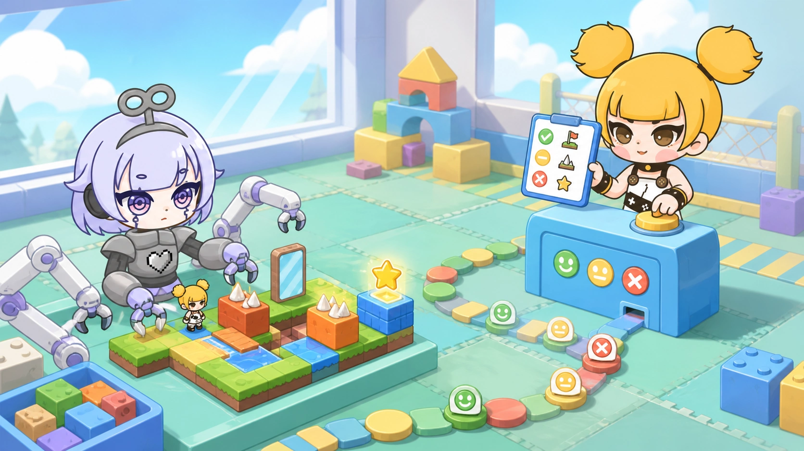

# I Asked One Agent to Play the User and Test Another Agent's Games

I recently ran an experiment that sounds unnecessarily circular. Codex acted as a user: it proposed games, sent multi-turn requests, inspected the results, and asked for changes. Dora Agent acted as the developer.

Across dozens of games, the work became more than a gallery. Codex summarized repeated failures and used them to improve Dora Agent itself. The games changed, and so did the software making them.

<!-- truncate -->

## An Agent without vision builds pixel eyes

One moment still feels slightly unreal to me.

Dora Agent was fixing a light-path puzzle called *Prism Vault*. The model was GLM-5.2 and had no visual multimodal capability. It could write rendering code, but it could not simply look at a screenshot.

Instead of stopping at “please verify the image,” it asked Dora to capture a TGA screenshot, copied the file into a readable project location, and wrote Lua code to parse the image bytes.

TGA has a relatively direct structure: a header describes dimensions, pixel depth, and orientation, followed by color data. The Agent read a 1172×814, 32-bit uncompressed image, counted color regions, converted the 6×6 board coordinates into screenshot coordinates, and sampled pixels where the light source, lock, and board should appear.

It found a deep blue background, a bright red lock, a white highlight in the light source, and no fully white screen. It then captured different states to check whether placing a mirror allowed the beam to reach the lock.

The process had ordinary bugs: an unreadable path, an asynchronous copy read too early, and a wrong loop variable. Those failures make the result more useful, not less. The Agent did not pretend to see. It built a limited test that real data could contradict.

Pixel analysis can detect a black screen, missing colors, or an object absent from an expected region. It cannot judge composition, readability, animation, or game feel. It removes some deterministic errors before human review; it does not replace human eyes.

## “Running” can still mean invisible

Another game passed its logic tests and reported `running=true`. When opened, it showed only the HUD.

The background node had been placed above the game graphics and faithfully covered the ball, paddle, and bricks. The program was running. The game was not meaningfully visible.

That failure separated three statements that Agents often collapse into one:

1. The code builds.
2. The engine loads and keeps the entry running.
3. A player can see, control, and complete the game.

Build and lifecycle checks are fast and automatable. Visual and interaction evidence require another layer.

## From the Blockly factory to complete games

My first serious use of an Agent in Dora was more modest. I wrote one Dora-specific Blockly block as a pattern, then Cursor Agent expanded the same rules into more than 5,000 lines of API definitions in roughly three days.

The important part was the division of labor: a person understood the problem and established the pattern; the Agent spread a checkable rule across the surface.

We later let models generate typed TypeScript and compile it into Blockly. This formed a small loop—understand, generate, compile, fix, save—but a compiler can only say whether a program is legal. It cannot say whether the background covers the bricks.

Moving into complete games required three connected abilities: understand the project, use tools to edit/build/run, and allow real results to reject the Agent's own claims.

## Dozens of games became an engine test bench

In one historical batch of 24 games, Codex issued 112 tasks and produced 1,855 LLM turns. Later games did not simply become cheaper. Acceptance became stricter, and more titles required follow-up tasks.

Repeated failures included hidden graphics, a snake that stopped because one scheduled callback replaced another, missed short key presses, controller state read from the wrong place, touch targets that became tiny, and HUDs that were unreadable at full screen.

When a failure repeated, we stopped treating it as a one-off prompt problem. We changed Dora Agent's workflow, engine feedback, TypeScript rules, or validation tools. Common TypeScript mistakes such as uncontrolled `any`, `null`, and comparisons whose semantics diverged from Lua were moved into the TSTL compiler's constraints, where every future Agent could receive the same feedback.

This is the beginning of what I call a Loop project: an Agent launches another Agent as a test user, evaluates the work, changes the software that produced it, and runs the loop again. A person still defines the scope, cost, and acceptance rules. But a meaningful part of software evolution can now continue for a long time inside the loop.

That feels like half a step into the future.

Try the idea on a small Dora game: ask one Agent to build it and another to validate build, lifecycle, visuals, and controls separately. Anything not observed should be reported as `not_run`, not quietly replaced by a different green check.

---

