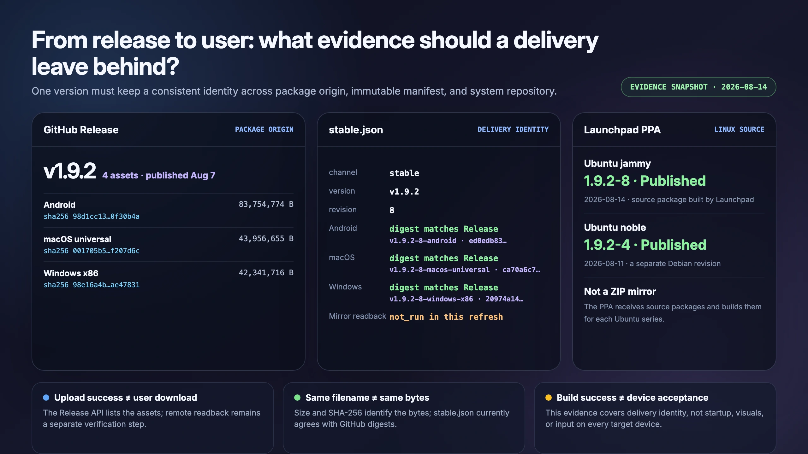

# Why Open-Source Software Fails to Reach Users

I once had a wonderfully simple picture of open source: put the code on GitHub, choose a license, and the software has reached the public.

Maintaining Dora SSR taught me otherwise. Publishing source code is closer to hanging a recipe on the door and announcing that dinner has been delivered.

<!-- truncate -->

## Source access, installation, and app stores are different deliveries

Developers can clone a repository and build it. Most users expect a package for their operating system. Mainstream users may expect to find that package in the app store already attached to their device.

Each step introduces different work: platform accounts, signing identities, review material, app metadata, packaging, updates, and long-term maintenance.

Source publication grants the right to inspect, modify, redistribute, and collaborate. Installable delivery requires packages for operating systems and processors, stable downloads, and installation instructions. App-store distribution adds the platform's developer system, identity checks, signing, content review, and continuing updates. These layers connect, but they are not equal: free source does not generate platform packages, and a package does not automatically appear in every store.

## I did consider app stores, and then deliberately stepped away

For a personal public-interest project, those recurring costs matter. After evaluating major Chinese app stores, I chose not to treat them as Dora's primary route. This was not a story of submitting an app and being rejected. It was a deliberate decision not to begin a channel whose paperwork and maintenance I could not promise to sustain.

Although Dora has no self-operated asset server, it can fetch open-source resources from third-party Git repositories and includes Web IDE, Agent, networking, and device-communication capabilities. A Chinese app-store submission therefore cannot simply treat it as a wholly offline application; the actual functionality would need an App-filing assessment. That does not mean internet access automatically requires a commercial ICP license.

App filing, ICP filing, and an ICP commercial license are not interchangeable labels. Developer identity, ownership material, package signing, and third-party licenses are also separate delivery lines rather than one universal “store qualification.”

Dora is not merely a game player. It can load and hot-update user-created game code for development and testing. Apple's App Store rules place strong limits on downloading and executing code that changes an app's functionality.

The rules contain limited exceptions for coding education, development, and testing tools whose source remains visible and editable, but whether a general engine that loads and tests complete games qualifies remains uncertain. Dora has not been submitted and rejected, so we do not claim acceptance is impossible; we also cannot call the App Store a stable public distribution route.

As of August 2026, Apple's alternative app distribution covers the European Union, Japan, and Brazil, not mainland China, and alternative apps still require Apple Notarization. A future mainland side-loading route could create an installation opportunity without automatically resolving dynamic-code, notarization, signing, trust, or security responsibilities.

The combined long-term work—filing analysis, entity material, signing, review, and repeated channel verification—was the reason I stepped back. Commercial software can assign it to legal, publishing, testing, and platform teams. Its cost does not disappear because a public-interest project is free; it moves into the maintainer's time and responsibility.

I abandoned a channel I could not yet sustain, not the goal of getting software to users.

## Without one universal store, build a distribution network

Dora uses several routes with different jobs:

- GitHub Releases remains the source of platform packages.
- Domestic repository mirrors improve reachability when an overseas route is unreliable.
- `Dora-Releases` records immutable platform revisions, file hashes, and signed release manifests.
- Linux packages follow a source-package and PPA path that can be rebuilt and inspected.
- Community-maintained launch entries carry the engine through the final meter on handhelds and less common devices.



These channels are not equally mature, and they are not all maintained by one person. A successful upload is not the same as a successful read-back. Matching filenames are not proof of matching bytes. A CI build is not proof that the package ran on every target device.

The signed `stable.json` ties a version to platform commits and file digests. Two remote attachments both named `dora-ssr-v1.9.2-android.zip` can still contain different bytes; an old file can remain remotely visible while wearing the new filename.

## Why does the same v1.9.2 still need revision 8?

In the August 14, 2026 snapshot, the case was `v1.9.2 revision 8`.

`v1.9.2` identifies the product's feature and compatibility baseline. `revision 8` identifies the delivery revision: packaging scripts, generated resources, or platform artifacts may be corrected without pretending the engine gained a new feature version.

That is why a Git tag, platform revision, and user-visible version are not the same identity. The tag fixes source history; a platform revision fixes delivered platform content; the version tells a person which product release it belongs to. Linux may similarly use a Debian revision such as `1.9.2-8`, and different Ubuntu series can temporarily carry different packaging revisions. The extra number reduces ambiguity by tracing a problem to a source, build, and package.

## Let the release process remember what people easily forget

A release pipeline turns fragile human memory into explicit handoffs:

```text
version metadata → annotated tag → platform CI → download and hash check
→ mirror upload and read-back → platform revision → final release manifest
```

The manifest records version, revision, commit, size, and digest. It is evidence for a distribution handoff, not a complete client-update security design; that belongs to the separate self-update article.

An annotated tag stores a tag object, author, time, and message and anchors a release to an exact commit. SHA-256 is a content fingerprint: a filename can remain the same when bytes change, but the digest will not. Downloading a remote artifact again checks the route from the user's side instead of trusting only the uploader's “success” response.

The signed manifest comes last because it announces a revision only after every platform artifact exists, can be anonymously retrieved, and matches its digest. Automation is not decoration. It remembers these checks for an individual maintainer who may publish late at night or return to the process months later.

## Free does not mean zero cost

Free software is not zero-cost software. Open source removes permission barriers, but delivery still needs engineering, channels, evidence, and people willing to maintain the last meter.

Someone still builds, tests, signs, uploads, mirrors, documents, maintains package sources, and investigates devices that will not launch. The costs decide who carries them and whether tools and community members can share them.

If you use a system or handheld Dora does not currently reach, the most useful contribution may be a reliable package, mirror, or launch entry—with enough version and device evidence for the next user to reproduce it.

This article reflects platform rules checked in August 2026 and is not legal advice. Current official rules and Dora's live channel state should be verified again before publication or submission.

Sources:

- [MIIT: Explanation of mobile-app filing](https://www.miit.gov.cn/jgsj/xgj/hlwgl/art/2023/art_564bf0759d7e41d5b4aa8ce4996b9e84.html)
- [MIIT: Measures for the Administration of Internet Information Services](https://sdca.miit.gov.cn/zwgk/fgbz/art/2026/art_fea940f81f1d423e87101adf147ab979.html)
- [Android: Sign your app](https://developer.android.com/studio/publish/app-signing)
- [Huawei AppGallery Connect: App distribution process](https://developer.huawei.com/consumer/cn/appgallery/devstart/)
- [Xiaomi: App qualification review FAQ](https://dev.mi.com/xiaomihyperos/documentation/detail?pId=2251)
- [Xiaomi: Mobile-app filing information guide](https://dev.mi.com/xiaomihyperos/documentation/detail?pId=1775)
- [Apple: App Review Guidelines](https://developer.apple.com/app-store/review/guidelines/)
- [Apple: Alternative app distribution](https://support.apple.com/en-mide/118110)
- [Dora SSR v1.9.2 GitHub Release](https://github.com/IppClub/Dora-SSR/releases/tag/v1.9.2)
- [Dora-Releases](https://gitcode.com/ippclub/Dora-Releases)
- [Dora SSR Launchpad PPA](https://launchpad.net/~ippclub/+archive/ubuntu/dora-ssr)

---

<p align="center"></p>
