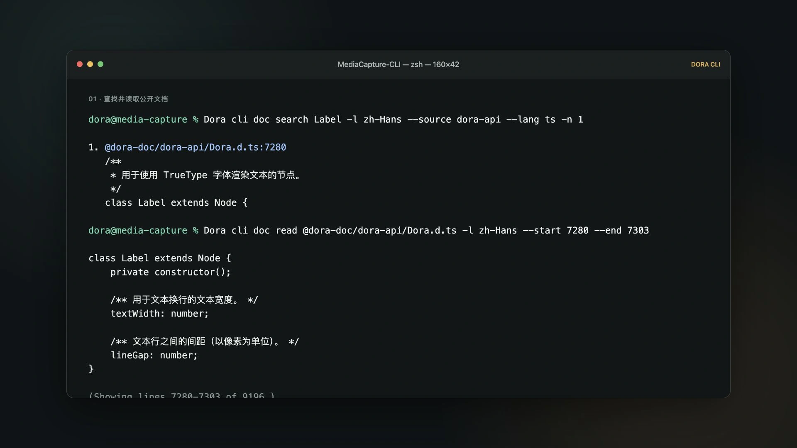
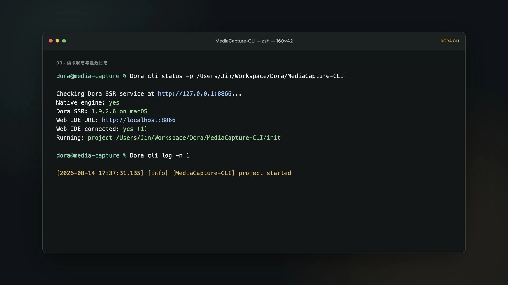
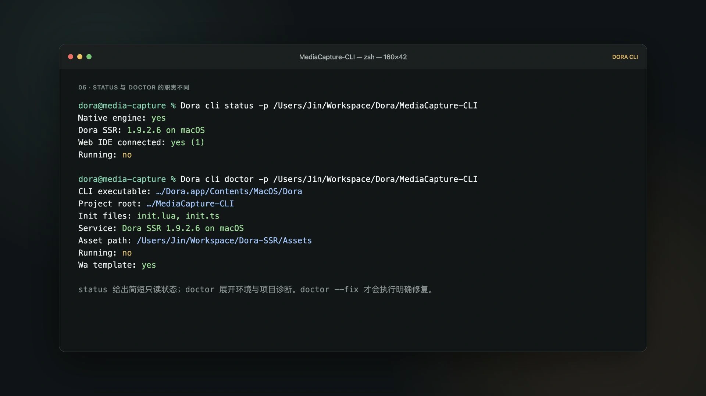

# Why Agents Need a CLI

Once an external Agent can read documentation and edit code, it still needs a shared way to build, run, inspect, and stop a project. Dora CLI closes those last gaps in the development loop.

<!-- truncate -->

I wanted external Agents such as Codex and OpenCode to continue developing a Dora game while I stepped away from the computer.

They could read and edit code. Then the workflow stopped at the browser door. A person still had to open the Web IDE, click Run, copy the output, and explain what happened.

An Agent that can write code but cannot start the project or read the result has not really taken over a development task.


## I wanted to leave the computer, but the Agent stopped at the browser door

The problem was not that an external Agent could not edit Dora code. It was that the last steps still depended on a person: open a browser tab, click Run, copy the output, and translate the result back into chat. Once I left, an otherwise long-running task paused at exactly the moment when it needed evidence.

## Writing code and taking over a development task are still separated by a gap

To take over the task, the Agent must be able to investigate Dora's real API, edit the project, build, start the real entry, inspect state and logs, stop the run, and report the evidence. Without that chain, “the code is finished” remains a proposal waiting for a human operator.

The goal was not unattended visual acceptance. It was a reproducible engineering loop that no longer broke at the browser's final buttons.

## An Agent's interfaces are not limited to tool calls and MCP

Structured tool calls and MCP are valuable when a capability is frequent and deserves deep integration. A Skill stores knowledge and a repeatable workflow. A CLI offers a lower common denominator: any Agent that can execute a command can use it, and a person can copy, review, and reproduce the same operation.

Low-frequency capabilities do not need to remain in every Agent loop. The command line lets them wait quietly until required.

These interfaces do not compete for one winner. Tool calls and MCP fit structured, frequent, deeply integrated operations. A Skill preserves how and when to perform a workflow. A CLI exposes stable commands to any Agent that can run a process, while remaining copyable and auditable by people.

## Dora already had a CLI, but the current entry came from a new need

Dora did have an earlier Python CLI. The Agent-driven change was the engine-native CLI that began taking shape in June 2026. It moved the public entry into the Dora executable and loaded a minimal Lua environment instead of waking the complete runtime for every status check.

The history matters: external-Agent demand did not invent Dora's first command line. It caused the current native CLI to become a common, maintained entrance rather than an auxiliary Python script. It is not tied to Codex, OpenCode, or any one product.

## How one automated development task can finish the loop

An external Agent can search and read Dora documentation before touching the project:

It can use `doc search` to locate the relevant tutorial or API and `doc read` to retrieve the required passage instead of inventing an engine interface from memory.



After editing, `buildrun` connects build and execution.


The Agent can then read `status` and `log`, stop the project, and report each evidence layer separately.




The path is deliberately short:

```text
find docs → edit → build and run → read status and logs → stop → report
```

For the recorded check, I created a temporary TypeScript project with Dora SSR `1.9.1.11`. The CLI searched and read the tutorial, installed API definitions, built and ran the project, read a version marker from the program log, stopped it, and returned to `Running: no`.

## Automation also needs to know whether it has crossed a boundary

`status` is a small signal light. It reports whether the engine exists, whether Web IDE is connected, and whether a project is running.

`doctor` is the detailed diagnostic sheet. Only `doctor --fix` explicitly authorizes repair actions such as starting the local engine or restoring the connection.



This distinction matters for Agents. Looking should not secretly become fixing. A status request should not wake the complete engine or change the environment.

The CLI uses the smallest engine environment appropriate to the command. Asking whether Dora is alive should not initialize rendering, audio, physics, or the whole game runtime. Detailed diagnosis belongs in `doctor`; changes belong only in the explicitly authorized `doctor --fix`.

An early implementation initialized the full content system merely to read a resource path supplied through `--asset`, then emitted unrelated destruction logs on exit. The native CLI was narrowed to expose only the minimum path information required by its Lua environment.

## `Running: yes` still does not mean the game is finished

The CLI can prove that code built, the engine started an entry, and an expected log appeared. It cannot prove that the image is correct, the controls feel good, or the game is fun.

Visual and interaction checks remain separate. If they were not performed, the Agent should report `not_run` rather than borrowing confidence from another successful check.

## The command line did not return from the past; it gained a new reader

The command line has not replaced the graphical workbench. It has gained a new reader. It is a public protocol that people, scripts, and Agents can all understand.

Try the loop on a minimal Dora project: ask an external Agent to find one API in the docs, modify the game, build and run it, read the result, stop it, and report exactly what was and was not verified.

---

Sources:

- [Dora CLI Chinese tutorial](https://github.com/IppClub/Dora-SSR/blob/main/Docs/i18n/zh-Hans/docusaurus-plugin-content-docs/current/tutorial/115.command-line-interface.mdx)
- [Original unified Python CLI](https://github.com/IppClub/Dora-SSR/commit/01a2b88909c2cb343b00365fd4418eadec7af075)
- [Move Dora CLI into the engine's Lua mode](https://github.com/IppClub/Dora-SSR/commit/bd62ba2a1775d0475296b753e193d4e1a0152464)
- [Add status and doctor](https://github.com/IppClub/Dora-SSR/commit/267ceab41d0de4842d3ee815f5afd94c710f3a63)
- [Unify the Dora CLI project workflow](https://github.com/IppClub/Dora-SSR/commit/f7db59ebccd742b1b2d5ba99612ff873c83e8b33)
- [Add CLI documentation search](https://github.com/IppClub/Dora-SSR/commit/07b237b8ea0479a548e622e699849ed829a9a132)

---

<p align="center"></p>
