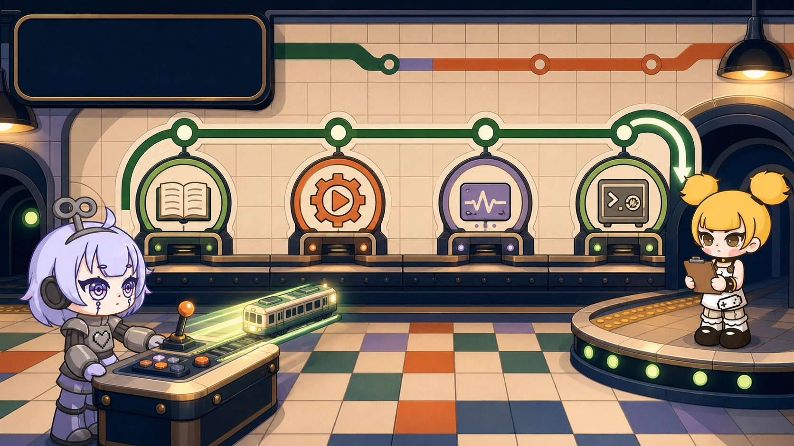

# When Agents Develop Games, Why Does the Command Line Become Universal Again?



I wanted external Agents such as Codex and OpenCode to continue developing a Dora game while I stepped away from the computer.

They could read and edit code. Then the workflow stopped at the browser door. A person still had to open the Web IDE, click Run, copy the output, and explain what happened.

An Agent that can write code but cannot start the project or read the result has not really taken over a development task.

<!-- truncate -->

## CLI, MCP, tools, and Skills solve different layers

Structured tool calls and MCP are valuable when a capability is frequent and deserves deep integration. A Skill stores knowledge and a repeatable workflow. A CLI offers a lower common denominator: any Agent that can execute a command can use it, and a person can copy, review, and reproduce the same operation.

Low-frequency capabilities do not need to remain in every Agent loop. The command line lets them wait quietly until required.

Dora did have an earlier Python CLI. The Agent-driven change was the engine-native CLI that began taking shape in June 2026. It moved the public entry into the Dora executable and loaded a minimal Lua environment instead of waking the complete runtime for every status check.

## One complete development loop

An external Agent can search and read Dora documentation before touching the project:


After editing, `buildrun` connects build and execution.


The Agent can then read `status` and `log`, stop the project, and report each evidence layer separately.


The path is deliberately short:

```text
find docs → edit → build and run → read status and logs → stop → report
```

## Read-only checks should remain read-only

`status` is a small signal light. It reports whether the engine exists, whether Web IDE is connected, and whether a project is running.

`doctor` is the detailed diagnostic sheet. Only `doctor --fix` explicitly authorizes repair actions such as starting the local engine or restoring the connection.


This distinction matters for Agents. Looking should not secretly become fixing. A status request should not wake the complete engine or change the environment.

## `Running: yes` is not a game review

The CLI can prove that code built, the engine started an entry, and an expected log appeared. It cannot prove that the image is correct, the controls feel good, or the game is fun.

Visual and interaction checks remain separate. If they were not performed, the Agent should report `not_run` rather than borrowing confidence from another successful check.

The command line has not replaced the graphical workbench. It has gained a new reader. It is a public protocol that people, scripts, and Agents can all understand.

Try the loop on a minimal Dora project: ask an external Agent to find one API in the docs, modify the game, build and run it, read the result, stop it, and report exactly what was and was not verified.

---

<p align="center"></p>
