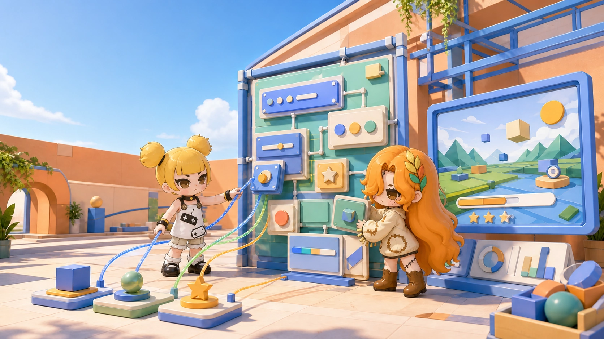
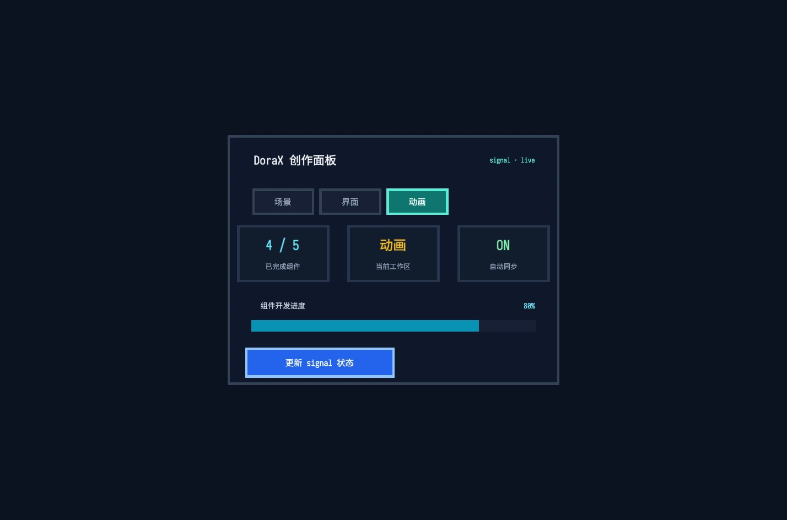

# UI Development Came Full Circle—Why Does Dora Describe Scenes in Code Again?



In the ancient age of UI development, general-purpose code created controls one by one, assigned properties, attached children, and connected events.

The industry gradually extracted interface structure into XML-shaped domain languages. Data synchronization moved through MVC and MVVM. Later, JSX and React made a different compromise mainstream: keep a declarative tree, but place it back inside a programming language with components and data-driven rendering.

Dora carries a small record of the same cultural journey.

<!-- truncate -->

## The days before “data-driven” UI

In the “ancient” era, UI code created controls one at a time, assigned properties, attached them to parents, and bound events. It worked, but no single place showed the complete interface. Reading it was like reconstructing a building from a construction log.

XML-like DSLs later made hierarchy, properties, and layout visible as structure. MVC, MVVM, and data binding addressed synchronization. JSX and React then popularized describing what the interface should be for current data and letting a runtime apply the changes.

This was never a clean replacement timeline; the approaches still coexist. The long-running questions are how to make structure clearer and how to stop manually chasing every object when data changes.

## Dora had its own XML era

Dora XML described scene structure outside ordinary source code and compiled it into a form the engine could load. It separated hierarchy from imperative construction and made a scene easier to scan.


Dora's basic XML loader dates to 2017, followed by Dora XML and a dedicated DoraXml editor. XML could hold UI components, layout, color, interaction animation, and message events, support templates and custom tags, and compile to Lua. Web IDE can still create and build `.xml` files today.

XML was useful, but it was not the end of the history. Structure eventually wanted the rest of the language back: types, autocomplete, functions, conditions, loops, and reusable components.

## Put declarative structure back into TypeScript

Dora introduced TSX in 2024. It looks familiar to frontend developers, but the tags create engine objects rather than DOM elements. A `body` is a physics body, `rect-fixture` is a collision shape, and `scale` is an engine action.


A function component can package a complete game concept: a HUD section, a menu, an enemy, a physics box, or a scene object with animation. Components are not merely a way to save lines; they give a reusable boundary to a group of objects and behavior.

```tsx
import { BodyMoveType } from "Dora";
import { React, toNode } from "DoraX";

const ScoreBox = (props: {score: number; x: number; y: number}) => (
	<body type={BodyMoveType.Dynamic} x={props.x} y={props.y}>
		<rect-fixture width={100} height={100}/>
		<draw-node>
			<rect-shape width={100} height={100} fillColor={0x8800ffff}/>
		</draw-node>
		<label fontName="sarasa-mono-sc-regular" fontSize={32}>
			{props.score}
		</label>
		<scale time={0.3} start={0} stop={1}/>
	</body>
);

const scene = toNode(
	<physics-world>
		<ScoreBox score={100} x={0} y={0}/>
	</physics-world>
);
```


## Writing a structure does not make it follow data automatically

The original `toNode()` converts a TSX tree into Dora nodes once. That is ideal when the engine's animation, physics, events, and normal game logic take over afterward.

But writing TSX does not make an existing label notice that the score changed. In 2026, DoraX added `createRoot()` and `signal()` for interfaces whose structure truly follows data.

```tsx
import { Director } from "Dora";
import { React, createRoot, signal } from "DoraX";

const items = signal([
	{id: 1, text: "Start Game"},
	{id: 2, text: "Settings"},
]);

const root = createRoot(Director.ui);
root.render(() => (
	<menu>
		{items.value.map((item, index) => (
			<label key={item.id} y={40 - index * 50}
				fontName="sarasa-mono-sc-regular" fontSize={30}>
				{item.text}
			</label>
		))}
	</menu>
));

items.value = items.value.filter((item) => item.id !== 2);
```

A dynamic root remembers the previous element tree. When a signal changes, it renders again, compares the two structures, updates properties, and adds or removes nodes. Keys preserve object identity when a list is inserted, removed, or reordered. `unmount()` removes nodes, subscriptions, and component cleanup when the interface is no longer needed.

When the dynamic interface is no longer needed, the application should call `root.unmount()`. Data-driven updates reduce manual synchronization, but they do not abolish lifecycle; they make lifecycle a rule shared by the framework and developer.



## Two entrances do not need to fight for victory

This does not mean every scene should continuously diff. Use `toNode()` for one-time construction; use a dynamic root when data-driven insertion, removal, or updates genuinely simplify the design.

Dora XML also still exists. Software evolution does not require announcing that one expression has defeated every earlier one.

Current guidance prefers TSX when there is no performance reason not to, because TypeScript provides stronger editing assistance and static checks. Different entrances serve different project conditions.

## From UI culture into the game world

DoraX is the result of a long UI culture entering a game engine: declarative structure, programming-language power, reusable components, and optional reactivity. Try it with one small HUD whose data changes at runtime, then decide whether a one-time node tree or a dynamic root better matches the problem.

Game worlds also consist of objects, hierarchy, state, and lifecycle. Menus need components, but so do physics boxes, animated characters, and scene nodes. Once TSX describes animation and physics objects, it is no longer merely writing UI. It becomes a language for how a game world is composed and how it changes with data.

---

Sources:

- [React: Describing the UI](https://react.dev/learn/describing-the-ui)
- [React: Reacting to Input with State](https://react.dev/learn/reacting-to-input-with-state)
- [Microsoft: XAML overview](https://learn.microsoft.com/en-us/windows/apps/develop/platform/xaml/xaml-overview)
- [Microsoft: Data binding and MVVM](https://learn.microsoft.com/en-us/windows/uwp/data-binding/data-binding-and-mvvm)
- [Apple: Displaying and managing views with a view controller](https://developer.apple.com/documentation/uikit/displaying-and-managing-views-with-a-view-controller)

---

<p align="center"></p>
