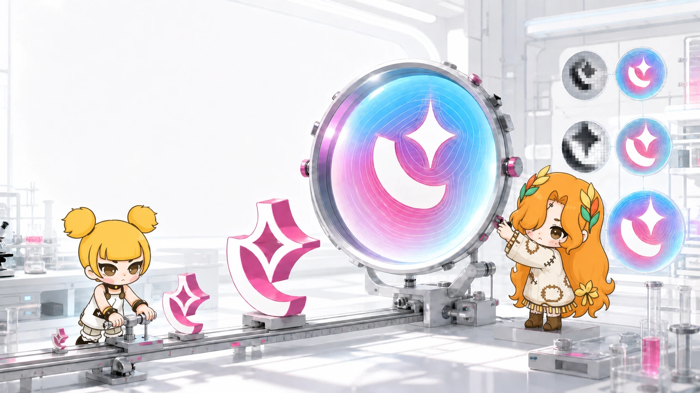

# Why Doesn't Game Text Turn into Pixels When It Grows?

Text in a document usually stays at the size it was designed for. Text in a game refuses to behave. A title scales into the scene, a button bounces, damage numbers grow above a character, and an entire UI may be transformed with its parent node.

The real problem is not merely “small Chinese text.” It is preserving vector-like quality across arbitrary font sizes and scene scaling.

<!-- truncate -->

## Why a larger texture is not enough

Traditional bitmap glyphs store coverage at one rasterized size. Magnifying them also magnifies the sampling grid, producing soft or blocky edges. Generating many font textures for many sizes increases memory use and still cannot anticipate every continuous transform.

A signed distance field, or SDF, stores a different value: the distance from each texel to the nearest glyph boundary, with a sign indicating inside or outside. During rendering, the shader reconstructs the edge from that distance and can apply smoothing appropriate to the current scale.

The texture is still finite, so SDF is not literal mathematical vector rendering. But within a useful scale range, it preserves edge quality far better than enlarging a normal bitmap glyph.

## The creative contribution came from the community

The feature became usable because community members kept pushing it forward.

A contributor known as “有个小小杜” first shared the core algorithm with me privately and discussed how it could enter Dora. I performed the initial integration on his behalf. The value of that moment was not a long chain of handoffs; it was the creativity of seeing a useful rendering path and making it concrete enough to enter the engine.

Later public pull requests completed important parts of glyph generation and practical rendering behavior. The final system work connected font caching, Label rendering, NanoVG, and scale-aware smoothing.

This is a useful picture of open-source collaboration. A feature does not always arrive as one perfect PR. An idea, an offline code fragment, an initial integration, public revisions, and broader engine work can all belong to the same contribution history.

## Quality includes behavior, not only a screenshot

Text rendering must also preserve layout, batching, color, outlines, and compatibility with the engine's transform system. A sharp isolated glyph is not enough if labels break alignment or require a separate expensive path for every size.

That is why we compare the same font, text, scale, and scene position with SDF disabled and enabled. The result should demonstrate one controlled variable rather than two unrelated attractive screenshots.

SDF gives game text more freedom to move and grow without immediately revealing its texture grid. It also shows why community contribution matters: the most valuable addition may be a new way of seeing the problem before it becomes a polished engine feature.

Try the comparison in your own UI. Scale one label through the range your game actually uses, capture the same frame with SDF off and on, and report the font, size, scale, and platform along with the image.

---

