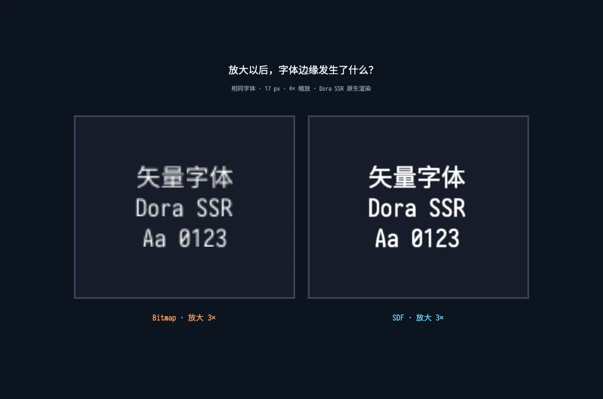

# Game Text at Any Scale

Game text scales, rotates, and moves with the scene, quickly exposing the limits of fixed-size glyph textures. SDF keeps it clear across scales—and records a particularly creative community contribution.

<!-- truncate -->

Text in a document usually stays at the size it was designed for. Text in a game refuses to behave. A title scales into the scene, a button bounces, damage numbers grow above a character, and an entire UI may be transformed with its parent node.

The real problem is not merely “small Chinese text.” It is preserving vector-like quality across arbitrary font sizes and scene scaling.

## Game text rarely stays obediently at its original size

A game label is not a paragraph fixed to a page. It can follow a camera, inherit a parent transform, zoom with a menu, pulse as feedback, or become a large damage number. A font that looks correct at one requested size may be sampled at several very different screen sizes during one animation.

That is why the problem is arbitrary-size rendering with stable quality, not a special patch for small Chinese glyphs.

## Why three natural solutions are still not enough

Traditional bitmap glyphs store coverage at one rasterized size. Magnifying them also magnifies the sampling grid, producing soft or blocky edges. Generating many font textures for many sizes increases memory use and still cannot anticipate every continuous transform.

Rendering a larger glyph texture delays the problem but spends more atlas space. Caching several discrete sizes increases memory and cache complexity while transforms still land between them. Regenerating glyphs continuously follows scale but creates work and cache churn during animation. All three approaches treat the current raster size as the answer to a continuously changing scene.

## SDF stores distance to an edge, not color

A signed distance field, or SDF, stores a different value: the distance from each texel to the nearest glyph boundary, with a sign indicating inside or outside. During rendering, the shader reconstructs the edge from that distance and can apply smoothing appropriate to the current scale.

The texture is still finite, so SDF is not literal mathematical vector rendering. But within a useful scale range, it preserves edge quality far better than enlarging a normal bitmap glyph.

## Dora had once put this capability down

Dora had explored SDF text before, but “an algorithm exists” and “the engine can use it reliably” are very different milestones. Generation quality, glyph cache integration, shader behavior, outlines, batching, and transforms all have to cooperate. The earlier path did not yet carry that complete engineering weight, so the feature was not kept as a dependable default.

## He reconsidered how the distance field could be generated

The feature became usable because community members kept pushing it forward.

A contributor known as “有个小小杜” first shared the core algorithm with me privately and discussed how it could enter Dora. I performed the initial integration on his behalf. The value of that moment was not a long chain of handoffs; it was the creativity of seeing a useful rendering path and making it concrete enough to enter the engine.

Later public pull requests completed important parts of glyph generation and practical rendering behavior. The final system work connected font caching, Label rendering, NanoVG, and scale-aware smoothing.

This is a useful picture of open-source collaboration. A feature does not always arrive as one perfect PR. An idea, an offline code fragment, an initial integration, public revisions, and broader engine work can all belong to the same contribution history.

The important thing about You Ge Xiao Xiao Du's contribution was creative judgment: he did not merely translate a known formula line by line, but reconsidered a practical distance-generation route for Dora's constraints and made the core algorithm concrete enough to discuss and integrate.

The original `SdfBuilder` propagated nearest-edge information through inside and outside distance grids and then calculated each pixel. PR #38 replaced it with `sdf_gen2d` and introduced KTM vector types so part of the distance calculation could process four elements together.

## A usable algorithm still has to grow into an engine feature

Distance values must enter the font atlas, travel through Label and NanoVG, reach a shader with the correct scale information, and coexist with color, outlines, layout, and batching. Cache invalidation, fallback glyphs, and ordinary non-SDF behavior must remain correct too.

Dora now bakes SDF glyphs into the atlas at a common 64-pixel base size. A 24-pixel Label derives its display scale from `24 / 64` instead of generating another 24-pixel glyph set. The complete chain determines whether the final `sdf = true` can safely become the default.

This is why the public pull requests and later engine integration mattered. They turned an isolated mathematical result into a path used by real labels instead of a demonstration texture.

## How we intend to prove it is genuinely better

Text rendering must also preserve layout, batching, color, outlines, and compatibility with the engine's transform system. A sharp isolated glyph is not enough if labels break alignment or require a separate expensive path for every size.

That is why we compare the same font, text, scale, and scene position with SDF disabled and enabled. The result should demonstrate one controlled variable rather than two unrelated attractive screenshots.

The comparison must record font, requested size, transform scale, platform, and whether SDF is enabled. Beyond the image, layout, color, outline, batching, and behavior through a scale animation should remain stable. A legacy-effect reconstruction is less useful than one script that renders the same label before and after the switch.

## An open-source contribution is more than one name at the end of release notes

SDF gives game text more freedom to move and grow without immediately revealing its texture grid. It also shows why community contribution matters: the most valuable addition may be a new way of seeing the problem before it becomes a polished engine feature.

Try the comparison in your own UI. Scale one label through the range your game actually uses, capture the same frame with SDF off and on, and report the font, size, scale, and platform along with the image.

---

