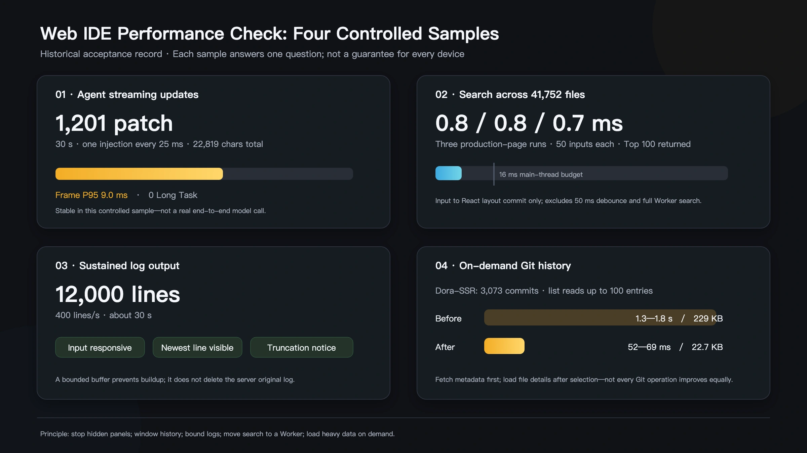

# A Performance Checkup for Dora Web IDE

In July 2026, we performed a systematic performance pass on Dora Web IDE. The trigger was not one dramatic freeze. The workbench had gradually accumulated an editor, resource tools, Git, logs, visual editors, and a Coding Agent. Each feature worked in isolation, while hidden costs began to overlap.

This article is a technical record rather than a dramatic story.

A hidden panel might still listen for data. Every few Agent characters might rerender the entire history. Search might display a few dozen matches only after scanning forty thousand files, while a Git title list might calculate every changed file in advance.

<!-- truncate -->

The audit therefore asked three questions: which work occurs too frequently, which invisible content continues calculating, and which data is loaded before anyone asks for it?

| Test load | Main pressure | Core treatment |
|---|---|---|
| 1,201 Agent updates in 30 seconds | frequent state changes and history rendering | batch updates, stable rows, visible window |
| search index over 41,752 files | main-thread work and stale-result races | Worker, Top 100, incremental index, request ID |
| 400 log lines per second, 12,000 total | refresh frequency and unbounded memory | chunked buffer, batched refresh, capacity limit |
| 3,073 Git commits | premature calculation and transfer | summaries first, details on demand |

## What is actually expensive about Agent output?

An Agent can emit hundreds of small patches and status messages. Rebuilding and sorting the entire history for every fragment wastes work. Dora now batches updates before applying them to the visible conversation.

In Dora's session protocol, a patch means a small change to current session state, not a Git patch. One more character, a tool step entering its running state, or a build finishing can all produce another patch. Handling each one by finding, sorting, and rendering the complete conversation makes fast output create more useless work.

Four measures address the chain:

1. Ordinary text and step updates wait in a short queue and are committed together every 50 ms. Stop, error, questionnaire, and task-completion control events remain immediate.
2. Session state is organized by stable IDs. Updating the last response preserves object identity for older messages and tool steps so the UI can skip rerendering them.
3. The complete history remains stored, but only the current visible window is mounted. Earlier turns expand in segments, and recent tool steps are the default view.
4. A hidden Agent panel stops autoscroll, refresh, and unnecessary observers. When reopened, it resumes from the saved snapshot rather than flashing empty and loading again.

Historical content is also mounted only for the current visible window. Hidden panels stop listening, scrolling, and refreshing instead of continuing to behave like foreground tools.

In the controlled July 26, 2026 production test, the real event entrance received 1,201 patches and 22,819 characters over 30 seconds. Frame P95 was 9.0 ms, no Long Task occurred, and stable history rows and steps did not rerender. P95 describes the slower edge of most measured frames rather than one best frame; it is still a fixed local sample, not a guarantee for every browser and machine.

## Why can forty thousand files affect one keystroke?

Searching a large project should not make typing wait for directory traversal. File indexing moved into a background Worker. The interface returns the first 100 matches and incrementally maintains its index as files change.

In the old path, one short query over 41,752 files took roughly 16–56 ms on the browser's main thread. The new path has four parts: a Worker performs matching away from typing and UI updates; only the Top 100 results return; increasing request IDs prevent an older slow query from replacing a newer result; and create, delete, rename, and move operations update only the affected index paths.

Across three independent production-page runs, browser input-update P95 measured 0.8, 0.8, and 0.7 ms. This number excludes the time for the background search to finish. It proves that matching no longer blocks input, not that searching forty thousand files takes 0.7 ms.

## Why continuous logs must have a boundary

An unlimited log eventually turns yesterday's output into today's memory problem. The Web IDE uses a capacity-limited buffer, keeps the latest lines, and tells the user when older content has been truncated.

Log lines are stored in chunks and flushed to the interface in batches at roughly 80 ms intervals. The in-memory view is capped at 10,000 lines or 4 MiB, whichever comes first. Older content is removed from the browser view, while a persistent “earlier logs truncated” notice and the server's full log-file path remain available. The browser is the fast working view; disk is the complete record.

Under a 12,000-line stream at roughly 400 lines per second for about 30 seconds, input remained usable, the newest output and truncation notice stayed visible, and the console reported no new error in the historical test.

## Do not compute content the user has not opened

Git history originally calculated details for every commit even when the list only needed titles and timestamps. The new path reads summaries first and loads file details on demand. A 100-entry history dropped from approximately 1.3–1.8 seconds to 52–69 ms in the dated local benchmark.

The test repository contained 3,073 commits. The old 100-entry response was about 229 KB; summary-first loading reduced it to about 22.7 KB. Only after the user selects a commit does Web IDE request its file changes.

Large optional modules follow the same rule: download and initialize them only when the user actually opens the feature.

Lazy work is not disposable work. An opened editor must keep its content, cursor, and undo history. Unsaved visual-editor state cannot be thrown away merely to control memory. Optimization begins by deciding which behavior must survive, then delaying only work that is genuinely unnecessary.

The shared principle is simple: invisible work should stop, historical work should be bounded, and detailed work should wait until someone asks for it.

## Turn one optimization into a long-term performance threshold

An Agent can help improve the software that houses it, but a person still initiates the audit, decides what behavior must not be sacrificed, and approves the acceptance criteria. Before presenting these figures as current results, we should rerun the same scenarios on the current public build or preserve the historical date explicitly.

The project now retains repeatable scripts for first load, panel switching, Agent streaming, log pressure, file search, Git data, and build size. Budgets record that input must not be blocked by long computation, hidden panels must stop high-frequency work, log memory must remain bounded, and large modules must not load before use. Future features can rerun the same samples; tests with different conditions must not be combined into a decorative overall percentage.

Codex was both a heavy Web IDE resident and the worker that built pressure samples, changed its own room, and verified it again. That is not autonomous self-evolution: people initiated the task, protected required behavior, and approved the acceptance standard.

The later UI-art cleanup is a separate piece of work. Onboarding, theme styling, file navigation, and visual hierarchy use different goals and evidence and belong to the next article.

If Dora Web IDE becomes slow in your project, report the project scale, reproduction steps, and an observable measurement. “It feels slow” begins the investigation; a repeatable case lets us improve the workbench.

---

