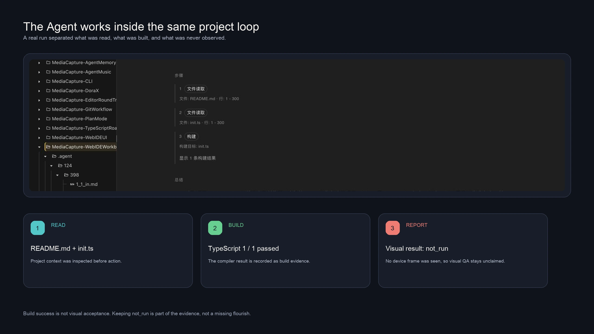

# Why Dora Put Its IDE in the Browser

I have worked on embedded systems and Android applications. Both taught me a familiar ritual: before testing a small idea, spend a long time arranging SDKs, dependencies, drivers, cables, and device connections.

Years later, I picked up a small open-source Android retro handheld and wanted a simpler answer: could the device run Dora and also host the tools needed to change the game?

<!-- truncate -->

## I had not started programming, but I was already configuring the environment

Embedded and Android development taught me a ceremonial workflow: a small idea arrives, and SDKs, toolchains, dependencies, drivers, and device connections line up for inspection before the program exists.

When every version and path agrees, they disappear into the background. When one does not, environment repair takes over the evening. The work adds no mechanic or character; it is the admission price for beginning.

That experience became a small obsession while building Dora: game development is already complicated—could “starting development” avoid becoming a project of its own? An individually maintained engine cannot sustain a complete native IDE for every platform. If each device demands a new admission ticket, cross-platform support is only half finished.

## I wanted a handheld to become the development site

I had a Chinese open-source Android retro handheld nearby. A device that runs Android and has physical controls is difficult for an engine author to treat only as a toy.

Could it see the game before a computer finished coding, packaging, and transferring it? Could the handheld itself become the place where the game is changed and tested?

That question is really about where a game is verified. A desktop simulator can resemble the target, but the real screen, controls, performance, file system, and operating-system behavior often tell the truth only on the device. If Dora stays on the target and a development surface can connect from outside, the device becomes a workbench rather than merely a release destination.

## We did not build a separate IDE for every device

Dora runs an HTTP service and Web IDE from the same engine process. A phone or handheld can display its local address, while a laptop or tablet on the same network opens the editor in an ordinary browser.

The code remains on the target device. The browser supplies the larger keyboard, screen, and editing surface. There is no attempt to reproduce the engine renderer inside the browser; the actual Dora runtime still owns rendering, physics, audio, and input.

This choice has a cost. Browser tools cannot offer the same experience as every native visual editor, especially for large art assets. Dora therefore focuses the Web IDE on code, project configuration, lightweight resources, and specialized visual tools that can provide useful previews.

The browser is an entrance, not a replacement engine. You reach in from outside; files, builds, and the running result remain connected to the real Dora process on the handheld.

## But the choice has always carried a cost

Game creation is not only code. Scenes, animation, particles, physics shapes, and art assets need visual adjustment. A browser cannot cheaply reproduce every large native editor deeply coupled to the renderer.

Dora Web IDE therefore does not aim to clone an entire desktop game editor. It concentrates on code, project files, and structured configuration and adds focused visual assistance for animation, particles, physics, Yarn stories, TIC-80, and similar tasks.

The claim is not that the Web cannot edit graphics. It is that a small open-source project should not pretend it can move a whole industrial game-production factory into the browser. The result is a compact workshop: not every tool exists, but the material, build result, and running work remain close at hand.

## The workshop opened first; the Agent came to work later

Dora's Web IDE entered the repository in February 2023 with a straightforward path: file tree, code editing, highlighting, type checking, definition lookup, upload, save, run, and error display. It was built to help people enter Dora's workplace, not in anticipation of today's Coding Agents.

The LLM Agent experiment in Blockly Coder began in April 2025. A mini Coding Agent arrived in February 2026 and later gained Web IDE interaction, project updates, checkpoint rollback, Skills, memory, build checks, and runtime verification.

The workshop had been open for two years before the new worker arrived. Only then did Dora's emphasis on code and configuration stop looking merely like a resource compromise and begin to look like an advantage.

## Why the Agent changed the answer

Before Coding Agents, a browser-based code workbench was mainly a portability decision. Once an Agent could read files, edit code, build, inspect logs, and keep project plans, the same constraints became an advantage.

Code, configuration, documentation, Git state, runtime status, and Agent conversation all lived in one inspectable place. The Agent did not need to operate a large native editor by imitating mouse gestures; it could work through project files and explicit tools.

The distinction between evidence layers remains important. A browser edit and successful build prove that the source changed and compiled. They do not prove that a particular remote device displayed the new result. That final on-device image still needs to be captured from the same test session.

Conversational AI can suggest code. An Agent inside development must read the project, understand its structure, modify files and configuration, build, interpret errors, run the work, and inspect results:

> project files → human or Agent edit → checks and build → real-device run → result → next iteration

The Web IDE already contained this site. Textual code and configuration are readable by both people and Agents, while builds, logs, and runtime results can object to their assumptions. The Agent did not make browser graphics more powerful; it amplified the value of the earlier code-centered choice.

## Two device arrangements, one creative loop

The broader goal is a closed loop on devices with more resources as well: start Dora and Web IDE on a phone, edit from its own browser or another screen, run the real engine, and inspect the result without rebuilding a conventional desktop toolchain.

The currently established form runs Dora on a handheld, phone, or desktop target while another device opens Web IDE. A future form would let a sufficiently capable phone run both Dora and the browser interface locally. That same-device phone loop remains a goal to complete and verify, not a mature claim for every handset.

The two forms share one architecture: the engine and project remain on the target, while the browser may come from another screen or the target itself.

## A small workshop where people and Agents can both work

Dora's Web IDE is therefore not “the engine recreated in a web page.” It is a portable control surface attached to the real engine. Agents made that control surface useful in a way we did not fully anticipate when the browser architecture first appeared.

Agents do not make graphical editing, art, design, and repeated adjustment unimportant, nor do they turn Dora into a replacement for large production suites. The change is narrower: a person can test an idea earlier on real hardware; an Agent can work on code, configuration, and builds in the same project; and neither has to confuse “written” with “verified.”

I originally wanted only to avoid losing another evening configuring a handheld. Looking back, the browser decision left behind a compact workshop beside the real device. At first, only people worked there. Later, an Agent arrived carrying its toolbox.

Try it on one device on your local network. Open a minimal project from another browser, change one visible value, build it, and keep the device result separate from the browser's build evidence.

---

