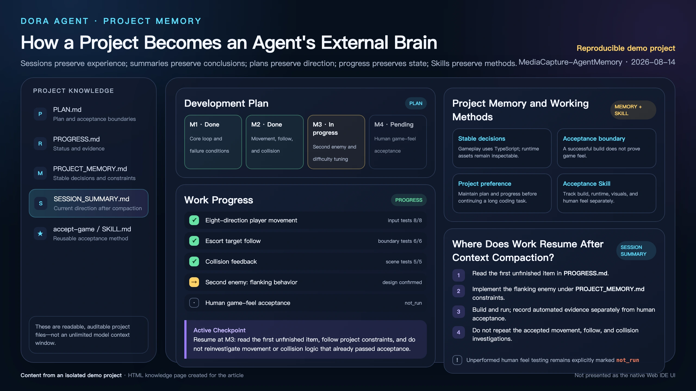
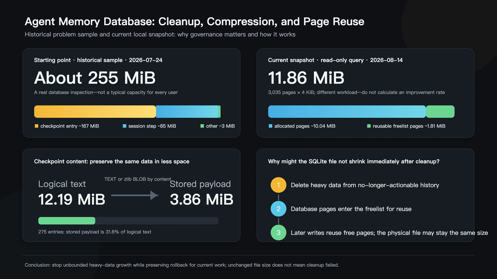

# The Project as the Agent's External Brain

One day I inspected Dora's application data and found an Agent database of roughly 255 MiB.

That is not enormous by modern storage standards, but it was still growing. The diligent colleague had kept before-and-after file bodies for checkpoints, tool steps, parameters, results, and session data. Some orphaned tasks and checkpoints could also survive after their original session disappeared.

The discovery changed the question from “How much can an Agent remember?” to “Which memory deserves which lifetime?”

<!-- truncate -->

## Agent memory does not exist only inside the model

Calling everything “memory” hides important engineering differences.

1. **Model context** is the limited desk where the current reasoning happens.
2. **`SESSION.jsonl`** preserves the recoverable tail of a conversation, not an eternal transcript.
3. **Memory and summary files** preserve preferences, project facts, current progress, and searchable history.
4. **Plans, questionnaires, steps, and checkpoints** preserve work in progress, decisions, diffs, and rollback evidence.
5. **Skills** preserve a method that has been verified often enough to be reused.

Plan mode adds an especially useful form of progress memory: `PLAN.md` records what and why, while `PROGRESS.md` records what actually happened and what comes next.

More concretely, stable user preferences and decisions enter `MEMORY.md`; project structure, build methods, and known issues enter `PROJECT_MEMORY.md`; the current goal, completed validation, and next action enter `SESSION_SUMMARY.md`; and earlier compressed records remain searchable through `HISTORY.jsonl`. Plan mode writes `.agent/plan/PLAN.md` and `.agent/plan/PROGRESS.md`.

## The first compression is not about disk space, but extracting the next step

Context compression is not ZIP compression. It removes repeated discussion and outdated guesses while preserving decisions, changed files, test results, the current blocker, and the first unfinished action.

An Active Checkpoint should be precise enough that the Agent resumes the next step rather than rereading the whole project or repeating completed tests. The goal is not a beautiful summary; it is a reliable work handoff.

## The second compression: checkpoints really do occupy disk space

File checkpoints solve a different problem. Repeated edits may store many mostly identical copies of a large file. Dora stores worthwhile checkpoint bodies as zlib-compressed BLOBs while keeping small or unprofitable content as text.

The decompressed result must match the original byte for byte because the data still supports diffs and rollback. Corrupt streams and unreasonable output sizes are rejected rather than treated as empty files.

In one historical sample, about 163.2 MiB of checkpoint text was estimated to compress to roughly 60.8 MiB. That 62.8% reduction describes one dataset, not a universal code-compression ratio.

## The difficult question is when the system is allowed to forget

Compression alone cannot stop unbounded growth. Dora asks whether a task is still operable.

The current task and any referenced child tasks retain their diffs and rollback data. Running tasks, tasks waiting for the user, and child-Agent checkpoints still required by the parent cannot be cleaned.

Once an old task has been superseded and the interface can no longer operate on it, heavy steps, checkpoints, and file bodies can be removed while lightweight messages and summaries remain. Each task is cleaned in one transaction, and orphan cleanup processes only a small batch at a time.

In a recorded 100-task test, heavy history did not continue growing linearly; only the current task's checkpoint and entry remained at the end.

The historical July 24, 2026 sample behind this redesign was roughly 255 MiB: checkpoint entries accounted for about 167 MiB and session steps about 85 MiB. Cleanup is not triggered by reaching one fixed byte threshold. It follows whether a task is still actionable and belongs to the current reference closure. Orphan cleanup handles at most four tasks per pass and uses transactions so a failure cannot delete only half of one task's evidence.

Dora later moved sessions, tasks, steps, checkpoints, and task references into a dedicated `agent.db`, keeping high-frequency work data separate from ordinary engine configuration.

Long-term project memory and Skills have a different lifetime and are not deleted with ordinary heavy task data.

## A file that does not immediately shrink is not necessarily a failure

SQLite may not immediately shrink the file after rows are deleted. Freed pages enter a freelist and can be reused by future writes. Preventing unbounded growth matters more than making the file look smaller immediately.

Vacuuming a file and reclaiming logical task data are different operations. A stable file size followed by reused free pages can be the intended outcome; judging cleanup only from Finder's byte count would mistake database layout for retained Agent history.

That is why immediately running `VACUUM` was not the answer to the original audit. The 255 MiB sample was mainly live records, not already deleted empty pages. `VACUUM` can remain an occasional idle-maintenance action after the data lifecycle itself is correct.

## A Skill is memory, and also an upgrade from experience to method

A Skill is called procedural memory by analogy. In engineering terms, it is an on-demand project document under `.agent/skills/*/SKILL.md`. Once a workflow has been investigated and verified repeatedly, the project can preserve not only what happened but how to do that class of work again.

A project directory is therefore more than a chat archive. Conversations preserve experience, memory files preserve conclusions, plans preserve direction, progress preserves the handoff, and Skills preserve reusable methods.

Run one long Dora Agent task and inspect what survives context compression and restart. The test is successful when the Agent continues from the first unfinished action without pretending that discarded detail was never needed.

---

