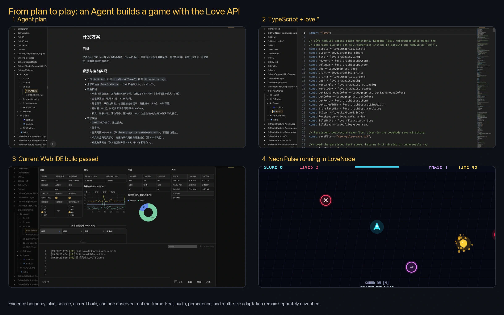
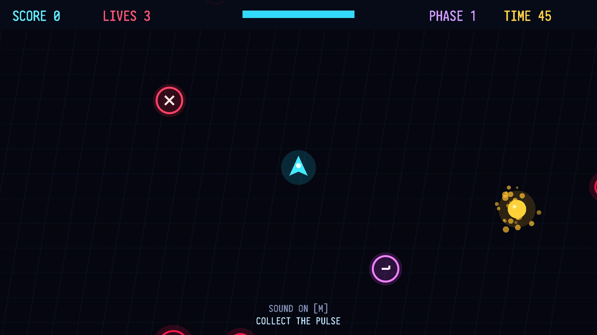
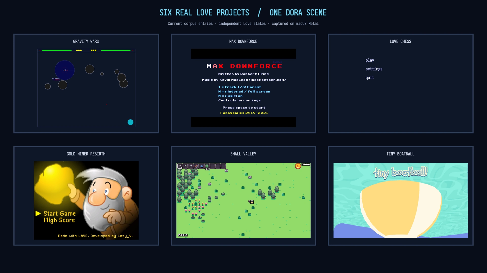
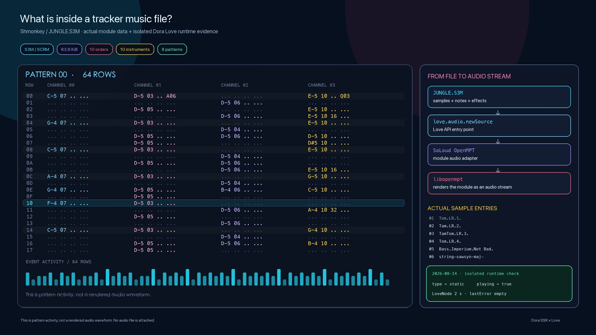

# When Dora Learned LÖVE

Models know Love well but may hallucinate Dora’s less familiar APIs. Love compatibility does not add a second engine; it lets the same Dora foundation speak a game language that people and models already know.

<!-- truncate -->

Models writing wrong code is not unusual. The frustrating part is simpler: when a model does not know something, it can only guess through hallucination.

When I asked Agents to make Dora games, they often invented APIs that looked perfectly plausible. Dora is a small, comparatively young engine; public examples and discussions are scarce beside older ecosystems.

I had been considering a reverse question before the community discussion began: instead of teaching every model all of Dora from scratch, could Dora learn a game language models already knew?

## On the other side, many people had spoken the language for years

LÖVE has years of games, tutorials, source code, and community practice behind it. YueScript users have also long enjoyed writing LÖVE games. We cannot inspect a model's complete training set, but in practice many models recall `love.*` conventions more reliably than Dora's APIs.

On August 12, 2026, itch.io's LÖVE tag showed about 3,300 results, while a separate free-game filter for works “made with LÖVE” showed 2,990. The scopes differ and neither represents every LÖVE work, but they demonstrate a long-used creative ecosystem rather than a few isolated examples.

Community conversation became the trigger to turn the idea into implementation.

## Not an engine inside an engine

Dora does not embed a second complete LÖVE runtime. LÖVE-style calls for graphics, audio, input, and files are implemented on top of Dora's existing renderer, audio system, input, filesystem, and main loop.

One engine foundation exposes two creation languages: Dora's node APIs and the familiar `love.*` surface.

Games may keep familiar `love.graphics`, `love.audio`, and `love.filesystem` calls and callbacks, while Dora supplies the renderer, audio, input, files, platforms, and the single application main loop underneath.

The compatibility problem is deeper than function names. Old projects depend on coordinate conventions, paths, callback timing, resource lifetimes, Lua habits, and combinations of calls that tiny examples never exercise.

Some depend on Lua 5.1 or LuaJIT-era idioms. Others assume a particular relative-path rule, trailing slash, or module return value. One game may load the same image repeatedly during initialization and expose a resource problem no small sample ever reaches.

## Why LÖVE became a node

Each `LoveNode` owns an isolated Lua state, virtual window, event queue, and resource lifetime. It can be positioned and composed like another Dora scene node. Two LoveNodes can run together without sharing game globals or taking each other down on restart.

The node also keeps Dora's workbench. A project may use Lua, TypeScript, YueScript, or Teal; Dora compiles the source into Lua 5.5, then LoveNode runs it. Web IDE, diagnostics, build, and Agent workflows remain available.

## Neon Pulse: an Agent uses familiar patterns

To test the AI-coding value, Dora Agent created a LÖVE-style arcade game called *Neon Pulse*. The game logic uses TypeScript and LÖVE APIs; Dora compiles it to Lua, and LoveNode runs it inside a host scene.

The Agent first maintained a plan and progress file, then added combo multipliers, enemy types, power-ups, difficulty phases, a high score, and synthesized effects.

Current records prove the build and sustained runtime. They do not replace a complete human review of feel, sound, persistence, and every screen ratio.

## Filling the API table is where compatibility only begins

We fixed twenty open-source LÖVE games at known versions and ran them as compatibility samples. Under the August 12, 2026 macOS Metal Debug test, 17 remained running for the 120-frame sample and three failed initialization. This is a dated corpus result, not “LÖVE ecosystem compatibility.”

SNKRX requires `luasteam`; DoomCar carries a serializer that depends on LuaJIT FFI. Flash Blip moved past its earlier LuaSocket dependency after Dora added networking support, then exposed a `newImageData` semantic difference.

## Translating shaders across modern backends

Original LÖVE rendering is built around OpenGL. Dora translates LÖVE Shader syntax into a bgfx-compatible shader, then bgfx targets the active backend—OpenGL, Metal, Direct3D 11, or Vulkan.

That requires semantic translation, not text replacement. A local function parameter named `time`, for example, must not be replaced as if it were the external `time` uniform. Real games also pushed support for screen size, pixel coordinates, and vertex-component defaults.

A concrete Shader contained both a uniform named `time` and `clock(float time)`. Blind substitution changed the local function parameter and broke meaning while leaving shader-like text behind. The translator had to understand that a local parameter shadows the external uniform. Real projects then drove support for `love_ScreenSize`, `love_PixelCoord`, vertex-component defaults, and the behavior behind `newShader`.

One old game contributed a musical surprise. Shmonkey uses an S3M tracker module, where samples, score data, and effect commands must be performed rather than decoded as one finished waveform. Dora integrated upstream SoLoud OpenMPT support and libopenmpt so the track could play again.

## The moment we actually began implementing it

The idea of giving models a familiar LÖVE API existed before the community conversation. The discussion did not invent the reason; it supplied the moment when a private line of thought became a shared engineering task.

I later saw a community member experimenting with LÖVE-like interfaces in a script. The conversation made the work feel less distant, and on July 21, 2026 I asked the group: “What if we simply port LÖVE 2D's source into Dora?”

In the group, we talked about whether compatibility was worthwhile, which parts of LÖVE mattered first, how it could coexist with Dora rather than become a separate product, and what real games were already exposing. That exchange turned “perhaps Dora could learn this language” into a route with people willing to try, question, and inspect it.

The distinction matters to the story: model familiarity motivated the idea, while community dialogue created the social and practical trigger to start work.

## Give people and Agents a shared language

LÖVE does not replace Dora, and Dora is not claiming official cooperation with the LÖVE project. The two ecosystems contribute different strengths: a mature shared language on one side, and Dora's scene composition, Web IDE, multi-language tools, Agents, and multi-backend renderer on the other.

Open Dora Web IDE and ask the Agent for one minimal LÖVE game with one scene, one control, and one win condition. Then build and run it through LoveNode—and report separately what was built, what ran, and what you actually played.

---

