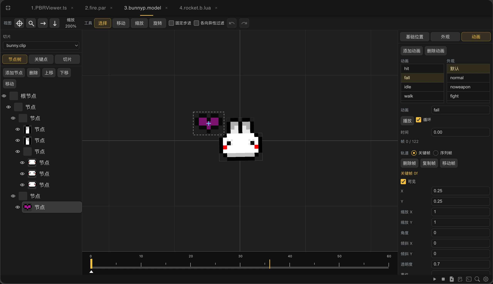
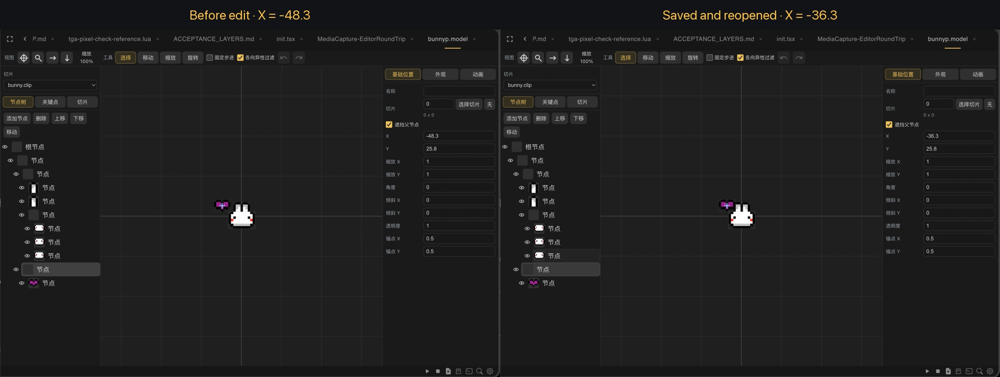
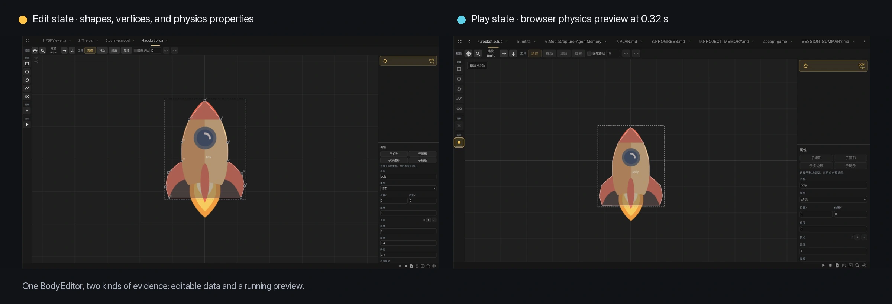
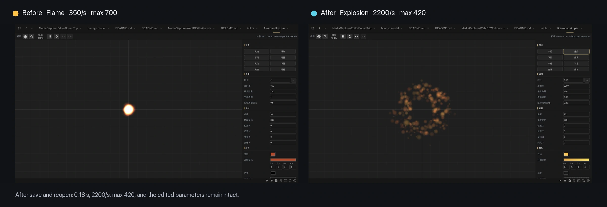

# Bringing Old Game Editors Back to the Browser

Before Dora SSR, I built a game engine project called Dorothy. It was Dora's predecessor, and many resource formats and creation ideas can be traced back to it.

Dorothy included editors for character hierarchy and animation, physics shapes and joints, and particle parameters. The original tools were themselves written with the engine's own interfaces. That gave them immediate runtime feedback—but also tied their data, UI, and execution environment closely to an old engine structure.

<!-- truncate -->

## The new workshop was missing old tools

As Dora moved development into Web IDE, code, resources, Git, logs, and Agents entered the browser. The old specialized editors did not. Existing `.model`, `.b.lua`, and `.par` resources remained useful, but creators lost the comfortable way to inspect and refine them.

The migration goal was therefore not to reproduce every button at the same coordinate. It was to preserve the creator's contract: open an old resource, see it, change it, save it, and let Dora load it again.

## ActionEditor as the main case

ActionEditor reads the compressed XML inside a `.model` file and turns it into a semantic document for hierarchy, looks, actions, timelines, and keyframes. Resource data is kept separate from rendering caches and current UI selection.

Saving still writes a `.model` Dora can load. Users are not forced to convert every historical character because the editor moved to the browser.

## “It opens” is not enough to call the migration complete

“The file opens” is only the first gate. A reliable round trip checks parsing, editing the intended object, writing without losing untouched meaning, reopening, previewing, and loading through the real engine runtime.

## Different content needs different feedback

BodyEditor preserves `.b.lua` shapes, joints, and physics properties, but its browser canvas must support selecting, dragging, and playing a physical simulation.

ParticleEditor preserves `.par` XML semantics. Parameters become meaningful only when they run together, so the editor keeps configuration and a repeatable live preview side by side.

The three editors should not be mechanically identical. They preserve the same creation loop while providing different forms of spatial, temporal, and dynamic feedback.

## Keep resources, leave old coupling behind

The migration discards internal structures that mix resource data, runtime nodes, and UI state. It also drops fixed `Input/Output` directory assumptions that belonged to the old project layout.

Preserving compatibility does not mean preserving every inconvenience. The old resource meaning matters more than the old window arrangement.

## A future DSL between Agents and editors

Agents made software archaeology cheaper by reading old code, splitting the work, and repeating compatibility checks. They do not remove the need for visual editing.

A future complement may be a small domain-specific language for actions, physics, and particles. An Agent could describe “rain that grows heavier” or “a character charges and swings forward,” compile that description into a Dora resource, and give the human a useful first draft.

The creator would still open the result in a visual editor, play it, drag it, and refine the expression. The DSL and editor serve different hands: one makes generation and revision explicit; the other restores sight and feel.

If you have an old `.model`, `.b.lua`, or `.par`, try the complete loop: open, modify, save, reopen, preview, and load it in Dora. A compatibility report is most useful when it names the exact step where meaning changed.

---

