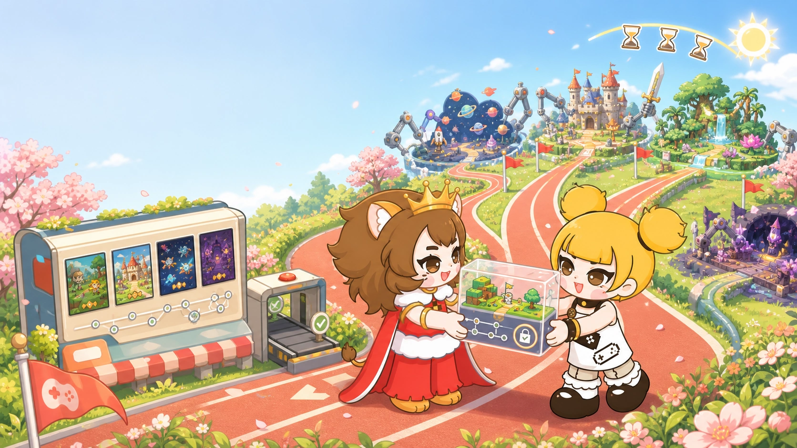
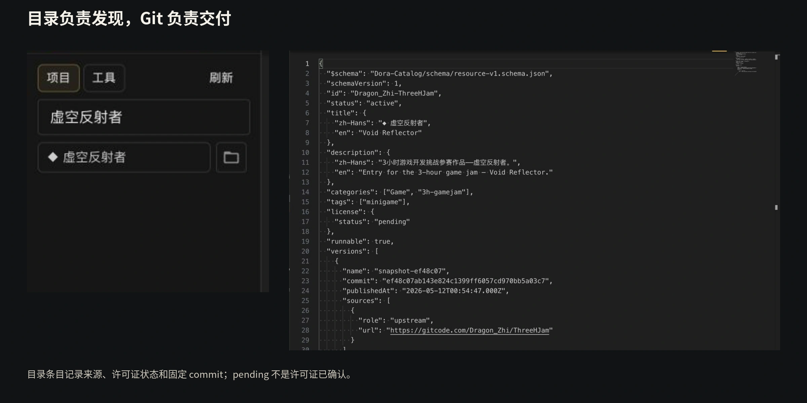
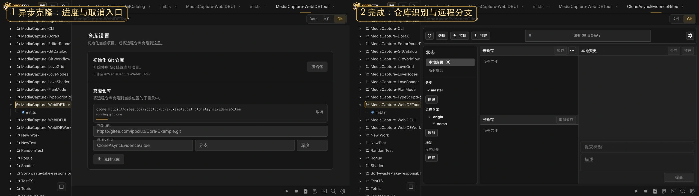
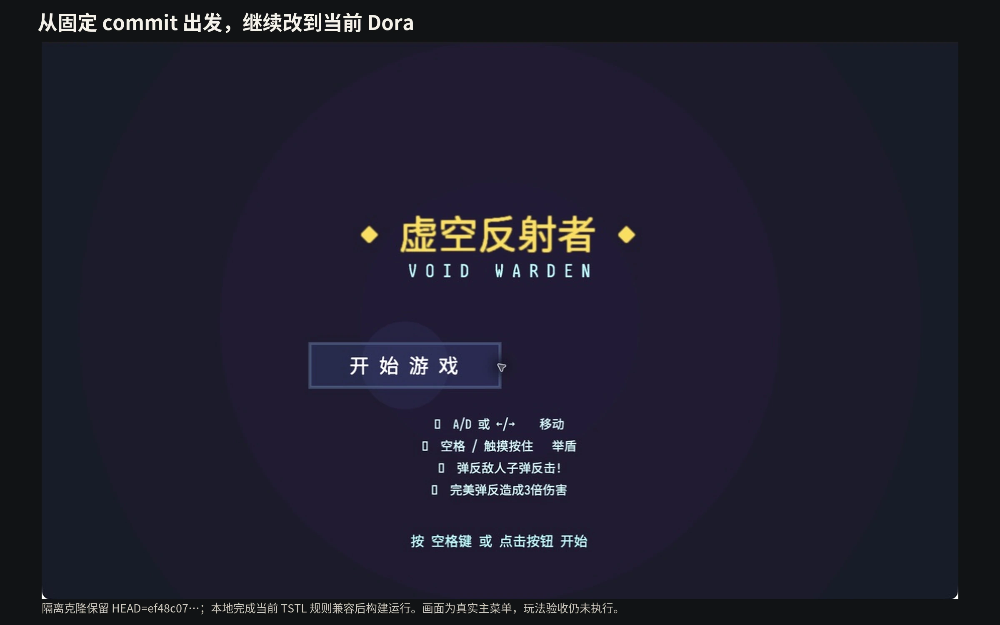

# How Can One Open-source Game Become the Next Creator's Starting Point?

I have long wanted open-source games to work like a relay.

Not merely as source archives that people can inspect, but as living projects another creator can download, run, change, commit, and carry forward. In Game Jams, I often see people rebuild the same input, scene, character-state, menu, and genre foundations. Rebuilding can be good practice, but it also makes me wonder: could yesterday's finished game become today's starting point?

Dora therefore had an early, deceptively simple goal: obtain an open-source game through `git clone`.

<!-- truncate -->

## We wanted a repository and delivered a ZIP

Dora also runs on phones, handhelds, and other devices. It cannot assume that every system has Git installed or ask users to configure a command-line environment before downloading a project.

The old ResourceDownloader used a practical compromise. A fixed service synchronized upstream repositories, repackaged them as ZIP files, and served previews and downloads.

It worked, but a ZIP is a copy of files, not a living project. It has no history, remote, or reliable identity for the exact revision. Once the user edits it, the downloader cannot distinguish upstream content from personal work. Meanwhile, the community must keep maintaining synchronization, packaging, storage, and delivery infrastructure.

We wanted to pass projects between creators and ended up operating a warehouse of archives.

## go-git reopened the original route

go-git is a pure-Go Git implementation under Apache-2.0. For Dora, that combination made embedded, cross-platform Git practical without requiring a system Git installation.

Dora wrapped the capability behind an asynchronous `Git.run` boundary. Higher-level tools submit operations and receive progress, cancellation, results, and errors without depending directly on go-git's internal types. LFS support, timeouts, fixed-revision checks, and failed-install cleanup were added around that boundary.

ResourceDownloader could finally deliver the repository itself.

## A catalog is a map, not a store

Dora-Catalog does not host or resell every game's content. An entry records the project description, license status, source or mirror addresses, preview, and the full commit expected for the initial installation.

A branch moves. A commit identifies one exact snapshot. A source can also change without changing that identity: if one host becomes unreachable, another mirror can deliver the same commit.

The catalog records license status separately. A publicly readable repository is not automatically permission to redistribute or publish derivatives. In the snapshot checked on August 11, 2026, the two public catalog sources pointed to the same commit and contained 73 entries, while their license states were still `pending`. That is not a detail to hide; it is a boundary creators must resolve before redistribution.

## Installation ends by handing the project to the user

Dora first clones into a temporary directory. It checks the actual HEAD against the requested commit, verifies the entry point, and rejects paths, symbolic links, or unapproved submodules that could escape the destination. Only a complete candidate is moved into `Download/<id>`.

The installed project keeps `.git` and its actual remote. The user may commit, branch, change remotes, merge upstream work, or remain offline. ResourceDownloader may announce a newer catalog entry, but it does not silently pull, reset, or overwrite local work.

That restraint is what turns a download into ownership.

## We tried an actual relay

The Dora community once ran a tiny three-hour Game Jam around this idea. Instead of asking everyone to begin with an empty directory, we supplied one playable prototype as a Git repository. We also gave participants free model API access and tokens to use with Dora's built-in Agent.

The result surprised us. With the shared foundation doing its job, people spent less time rebuilding the same base and pushed the prototype toward six distinct ideas.

Reuse did not make the works alike. It moved the starting line closer to the part where each person's imagination became visible.

Technical continuity still does not imply legal permission. A license or the author's explicit consent is part of the baton too.

If you want to join the relay, begin small: confirm a project's license, clone and run it, then make one change of your own. If you maintain a Dora game with a clear version and license, consider contributing a Dora-Catalog entry.

Open source means more than letting people see what you made. With clear boundaries, it gives the next pair of hands somewhere real to begin.

---

