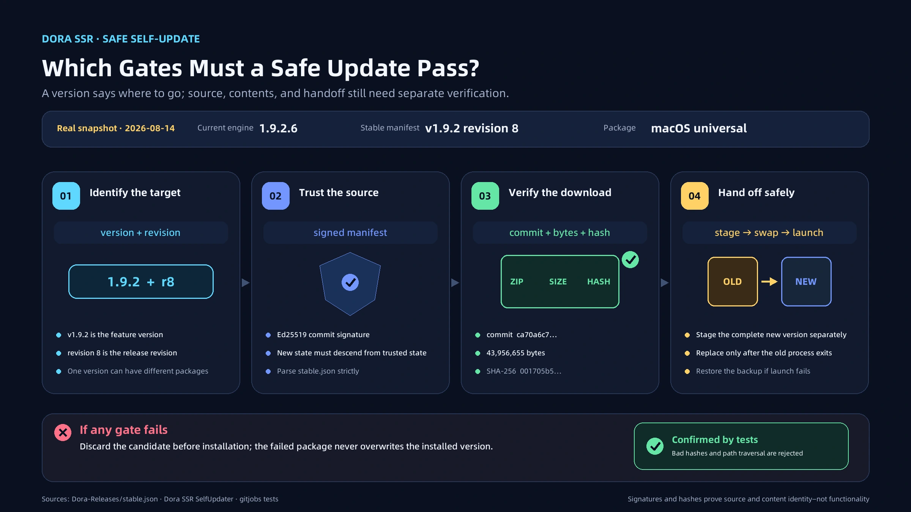

# How Dora Avoids Installing the Wrong Update

Self-update sounds like three operations: compare versions, download an archive, and replace the old files.

In practice, a version number says only what release we intend to install. It does not prove who published the download, whether its bytes are correct, or whether the previous application will survive an interrupted update. Dora SSR separates those questions into explicit verification gates.

<!-- truncate -->

## Version is not a package identity

A platform package may need to be rebuilt after the feature version is published. The software can still be `v1.9.2` while the delivered archive has changed.

Dora therefore records a `revision`. In the public stable manifest checked on August 14, 2026, the example was `v1.9.2 revision 8`. Each platform also had a fixed Git tag, full commit, exact file size, and SHA-256 hash.

- Version names the feature release.
- Revision names a delivery revision within that release.
- Tag and commit identify the source snapshot.
- Size and SHA-256 identify the downloaded bytes.

A matching filename is not evidence of matching content. Installation continues only when the required identities agree.

## Different sources, different proofs

Dora can check GitHub Releases or the signed Dora-Releases repository.

For GitHub, the updater verifies the platform attachment, URL, size, and digest, then checks size and SHA-256 again after download. Because a GitHub release tag primarily names the base version, the interface can still allow a same-version package to be downloaded again when its delivery revision may have changed.

The signed repository begins with an Ed25519-signed manifest. Dora's embedded public key verifies the publisher's signing key, then the client checks the platform tag, the exact commit and its signature, and finally the package size and SHA-256.

The chain is deliberately short:

**signed manifest → fixed platform revision → exact commit → exact package**

Any mismatch stops the update.

## Remember the last verified state

An old release can still carry a valid signature. Signature verification alone cannot prevent a server from quietly sending a client backward.

Dora stores a last-known-good repository state. A new update must advance from that verified point rather than silently roll back. When the network fails, previously verified cache may remain usable, but newly unverifiable content is not promoted to trusted state.

## Replace only after preparation succeeds

Correct download bytes do not complete the update. Overwriting a running application or losing power midway can leave a mixture of old and new files.

Dora prepares the new build in a temporary location and hands over only after verification. On macOS, for example, the new application is staged beside the current one; if the replacement cannot start correctly, the process attempts to restore the backup. Android, Windows, and macOS each need a platform-specific final handoff, while Linux continues through PPA/APT.

These checks establish publisher and package identity. They do not prove that the software has no vulnerability, nor do they replace device launch and functional testing.

A reliable updater is not one that can never fail. It is one that knows what each step proves, stops when a proof is missing, and protects the last working installation.

---

