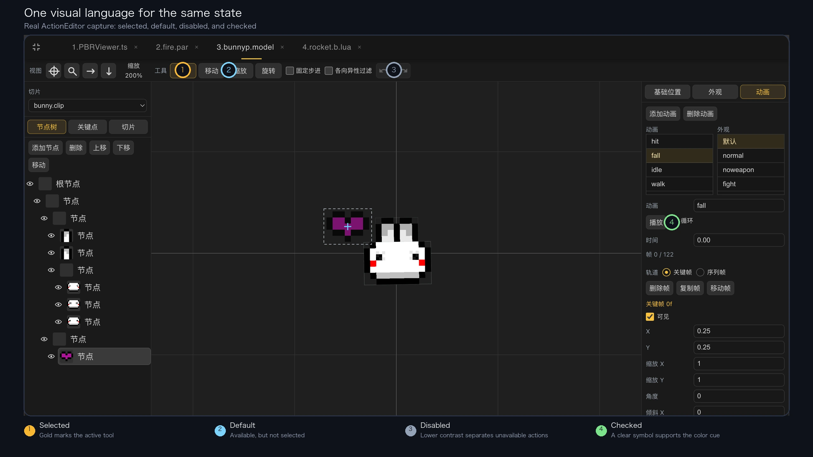

# Reorganizing Dora Web IDE

This UI pass was not a reskin. It reorganized first-use guidance, state feedback, file navigation, and information hierarchy so the Web IDE’s growing capabilities are easier to find and understand.

<!-- truncate -->

In July 2026, we reorganized parts of Dora Web IDE's interface: first-project guidance, visual-editor styling, file navigation, and document reading.

The goal was not a new coat of paint. We wanted to answer three practical questions: where a first-time user should begin, how an active state should look, and what deserves attention when the screen becomes crowded.


## Teach one complete task

Previously, a new user arrived among the file tree, editor, run controls, logs, and Agent without a clear first path.

The new onboarding guide asks the user to complete one real loop:

1. Create a directory.
2. turn it into a TypeScript project.
3. Open the generated `init.ts`.
4. Add the example code.
5. Run the project.
6. Decide whether to continue with Dora Agent.

```ts
print("Hello Dora!");
```

Each step is tied to an actual interface condition. The guide advances when the action is complete, so it teaches “create—edit—run” rather than merely pointing at buttons. It can be skipped, reopened, and remembered, but it does not replace the documentation.


## Give visual editors a shared state language

Dora Web IDE includes code, action, body, and particle editors built at different times. Their layouts need not be identical, but the same state should look like the same state.

The cleanup established common rules: dark surfaces hold primary content; gold marks selection, keyboard focus, and important actions; hover, selected, focused, and disabled states remain visibly distinct; controls share spacing, corner, and transition conventions.



Consistency here is transferable knowledge. Once a user understands selection in one editor, the next editor should not require a new visual vocabulary.

## Clarify navigation and reading hierarchy

Search results need both a filename and a path. The filename identifies the target; the path disambiguates names. Giving them equal weight makes long paths harder to scan.

The updated list emphasizes names, constrains and softens paths, and distinguishes keyboard focus, highlight, and selection. Its height and internal scrolling also respect the available viewport.

Markdown rendering received clearer spacing and treatment for headings, text, links, quotes, code, images, and tables. The content did not change; its structure became easier to see.


## What the current evidence does—and does not—show

Code and screenshots prove that the rules were implemented. They do not prove that a new user learns faster.

That requires task observation: ask someone unfamiliar with the workflow to create, edit, and run a project; record where they hesitate and whether they can identify the result and the Agent entry point.

For now, we can say the onboarding and visual rules are present. Their effect on learning cost remains a question for real users.

If an entry point or state is unclear during your first Dora Web IDE session, report the exact screen, action, and expected result. Reproducible confusion is useful design evidence.

---

<p align="center"></p>
