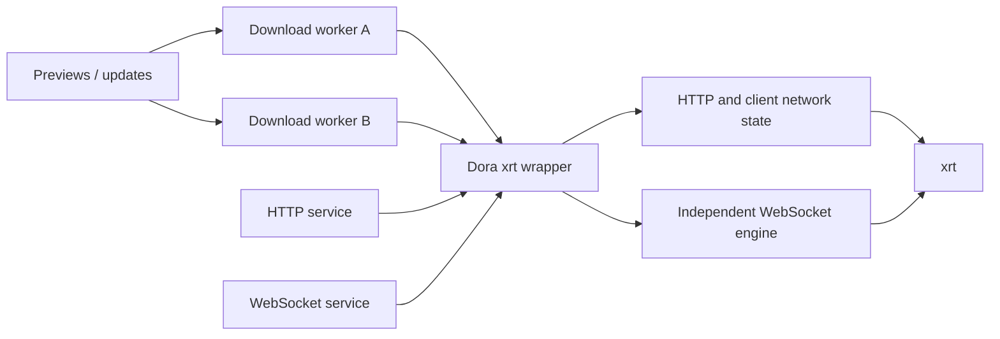

# Shared Tokens, Stored as Code

> How a community author's networking library entered Dora SSR

One day in May 2026, our community chat turned to AI Coding.

People were no longer asking models to complete a few lines. They were supervising hours-long Agent tasks, handing over refactors, watching mistakes appear, correcting them, and running another round. Tokens went in like fuel; code grew at the other end.

Yezi—Elbold Dadunur—described the emerging collaboration in one sentence:

> Everyone burns tokens to make something, then shares the result.

I found the phrase playful and precise.

Open source has always shared implementation. AI Coding adds another kind of paid work behind it: explaining the problem to a model, letting it explore bad routes, pulling it back, designing tests, and deciding whether the result is actually usable.

Code can preserve part of that spent effort. The next person does not need to begin again from an empty prompt; they can start from a readable, licensed, tested project.

<!-- truncate -->

## When software starts to feel like making a wish

Before strong coding Agents, source code was visibly scarce labor. Reimplementing a library might take months or years, so access to the finished source was valuable by itself.

That scarcity is changing. A developer can increasingly describe a desired component and wait for an Agent to produce something surprisingly complete. Software creation begins to feel like making a wish.

But a plausible result is not a fulfilled wish.

Why this architecture? Which platforms ran it? What failed during development? Is the license clear? Will anyone fix the next problem? Faster generation does not automatically produce those answers.

The value of open source is therefore shifting rather than disappearing. Raw source may become less scarce, while a verified engineering starting point—one that humans and Agents can inspect, maintain, and trust—becomes more valuable.

The concrete result behind this story is xrt.

## The artifact was called xrt

Yezi is also xrt's author, known as xLeaves / xywhsoft. xrt is a cross-platform C foundation library under the MIT license. The version Dora adopted can be embedded as a single-header implementation: one C file enables the implementation and the rest include declarations.

That shape matters to an engine spanning Android, Windows, macOS, iOS, and Linux. Every large prebuilt dependency adds platform builds, license delivery, and version maintenance.

Small size was not the only reason I trusted it. I knew the author, his conventional programming ability, and the way he supervised and tested Agent output. Dora then added its own evidence in real engine scenarios.

On May 21, 2026, Dora first used xrt to replace its HTTPS client and removed bundled prebuilt OpenSSL libraries from parts of the platform setup. By August, the HTTP server backend, WebSocket path, and downloads were being organized around xrt too.

xrt was not built specifically for Dora. The two projects continue independently; Dora chooses and maintains its own integration boundary.

## Independent downloads instead of one queue

Dora downloads updates and resource previews. Previously, all downloads shared one worker thread—like a station with a single service window. One slow request could make unrelated requests wait.

The later design gives each download an independent work unit. The caller decides how much concurrency makes sense; the lower layer tracks cancellation and lifecycle for each request.

This does not promise unlimited windows. It returns the decision about how many to open to the layer that understands the workload.

## Different services should not share one fragile lifetime

HTTP resembles submitting a form and receiving a response. WebSocket resembles a phone call kept open for logs and state. Both use networking, but their lifetimes differ.

Dora gave the WebSocket service its own network engine so stopping or restarting it would not disturb the state needed by HTTP and client requests.

The C wrapper keeps xrt types and implementation details in a small boundary. Structural tests check that server code does not include xrt directly and that the implementation is enabled only where intended. Sharing a library is the beginning; making it a maintainable resident is separate work.

The upper-level `HttpServer` sees only interfaces defined by Dora. The boundary is compiled with both C and C++ compilers so third-party implementation details cannot quietly spread back through the server layer.

## More generated code makes human judgment more visible

“Sharing tokens” does not mean sharing an account or API key, nor publishing unchecked generated code.

The same models and token budget can produce very different quality and value. One person may frame the problem well, correct a bad architecture early, and verify the result on real systems. Another may spend more and still end with code nobody understands or accepts responsibility for.

AI reduces execution cost. It does not distribute judgment, responsibility, or trust equally.

That is why human cooperation may matter even more in an age of abundant code. I adopted more than an AI-assisted library: I knew the author could understand, test, and maintain it. Dora then supplied another layer of use and verification. Code, author credibility, and adopter evidence formed a chain.

If you have an AI-assisted result that you have seriously reviewed, tested, licensed, and are willing to maintain, bring that “token artifact” to the Dora community. The next person may be able to start where your expensive exploration ended.

---

