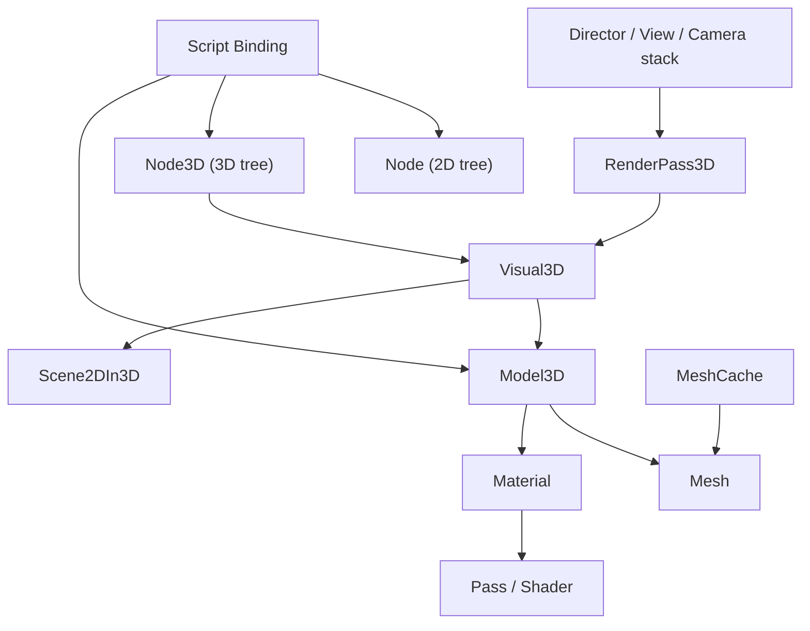

# Dora 引擎 3D 功能设计总览

> 本文保留 3D 架构形成阶段的总体设计与历史方案。当前实现状态以 `PROGRESS.md` 为准，后续开发优先级与验收计划见 `08-production-readiness-roadmap.md`。文中 `RenderPass3D`、`MeshCache`、`Scene2DIn3D` 等内容包含尚未落地或已经由当前实现替代的设计，不应直接视为现行 API。

## 1. 背景与目标

当前 Dora-SSR 的核心渲染与场景系统以 2D 为主，但底层并不是完全不具备 3D 能力：

- 现有 `Node` 已支持 `z / angleX / angleY / scaleZ` 与 4x4 world matrix。
- `CameraBasic`、`CameraUI3D` 已能生成 3D 视图矩阵。
- `View` 已管理投影矩阵与多 view 顺序。
- `Pass / Effect / ShaderCache` 已构成可复用的着色器与渲染状态入口。

但经过进一步讨论，3D 设计的最终方向不再是：

- `Node3D : Node`
- 或 `NodeBase / Node / Node3D`

而改为更直接的方案：

- 保留现有 `Node` 作为默认 2D 场景树
- 新增独立 `Node3D` 作为 3D 场景树
- `Node3D` 自己完整实现 3D 语义下的树、生命周期和变换逻辑
- 2D/3D 混合只通过桥接节点完成

本轮设计需要覆盖下列必需能力：

- 3D 场景图节点类型
- `Camera3D`
- `Mesh` 资源加载
- `Material` 系统
- `Shader` 管线
- `Model3D` 节点，负责绑定 mesh + material
- 与 Lua / Yue / TS 一致的脚本暴露
- JOLT 物理的接入规划

## 2. 设计原则

### 2.1 语义彻底分离

优先保证 2D/3D 语义清晰：

- `Node` = Dora 默认 2D 场景节点
- `Node3D` = Dora 独立 3D 场景节点

两者不是继承关系，也不共享同一棵父子树语义。

### 2.2 复用底层思路，不强行复用结构

可以复用的应是思路和工具，而不是类型层级：

- 复用现有矩阵计算与 dirty propagation 的实现经验
- 复用 `View` + `Director` 的 view-projection 管理
- 复用 `Cache` 风格引入 `MeshCache`
- 复用 `Pass / Effect / ShaderCache`

但不再为了“看起来复用”去抽一个收益不高的 `NodeBase`。

### 2.3 2D/3D 协同但不任意混挂

目标不是让 3D 替代 2D，而是做到：

- 2D 游戏不受影响
- 2D 与 3D 可在同一帧内协同渲染
- 2D 子树与 3D 子树不任意互为父子
- 混合只通过桥接节点完成

## 3. 总体架构

建议新增以下核心对象：

- `Node`
  - 保持现有默认 2D 节点身份
- `Node3D`
  - 独立 3D 语义节点基类
  - 自己实现 3D 子树、生命周期、调度、事件、变换
- `Visual3D`
  - 3D 可见实例基类
  - 统一承载 bounds、culling、实例级材质覆写和 render item 提交入口
- `Camera3D`
  - 基于现有 `Camera` 体系扩展
  - 管理 perspective / orthographic、FOV、near/far、lookAt
- `Mesh`
  - 几何资源
  - 管理 vertex/index buffer、submesh、bounds、顶点布局
- `Material`
  - 材质实例
  - 绑定 shader pass、纹理、uniform、render state
- `RenderPass3D`
  - 负责 3D 可见对象收集、排序、提交
  - 管理 depth buffer、forward pipeline、透明/不透明队列
- `Model3D`
  - 节点层对象
  - 持有 `Mesh` + `Material`，向 `RenderPass3D` 提交 draw item
- `Scene2DIn3D`
  - 桥接节点
  - 在 3D 世界中承载一棵独立 2D 子树
- `MeshCache`
  - 加载 glTF/OBJ
  - 复用 `Cache` 风格进行同步/异步加载

推荐关系：

## 4. 与现有系统的关键结论

### 4.1 `Node3D` 不再继承现有 `Node`

原因：

- `Node` 在用户心智上已经等同于默认 2D 节点
- `Node3D : Node` 会天然允许 2D/3D 父子关系含义不清
- 即使运行时限制混挂，也会让类型关系显得别扭

### 4.2 不再强行抽 `NodeBase`

最新判断是：

- `Node` 里真正值得下沉的公共能力并不多
- 为了抽公共基类而重构，会带来大面积迁移成本
- 相比之下，直接做独立 `Node3D` 更务实

### 4.3 `Node3D` 应复用现有数学实现思路

现有 `Node::getLocalWorld()` 已能处理：

- 3D 平移
- XYZ 旋转
- Z 缩放
- world matrix 级联

因此 `Node3D` 应复用现有数学实现思路，而不是复制一套完全不同的数学模型。

### 4.4 `Camera3D` 应继承 `Camera` 体系，不绕过 `Director`

`Director` 已通过 camera stack 计算 view-projection，并驱动 UI / UI3D / 主场景渲染。3D 相机应继续走这套路径。

### 4.5 2D/3D 混合应通过桥接节点

最新方案中不建议让 `Node` 子树与 `Node3D` 子树任意互为父子。应采用：

- `Scene2DIn3D : Node3D`
- 未来如有需要再做 `Scene3DIn2D : Node`

### 4.6 3D 渲染应新增独立 pass

2D Sprite/Label/Line 等渲染路径已经高度针对屏幕四边形与批处理优化。3D draw call 的组织方式不同，必须新增：

- 3D 可见对象列表
- depth test / depth write
- 不透明与透明排序
- 顶点布局与材质切换

## 5. 范围切分

### Phase 1: 最小可用 3D

交付目标：

- `Node3D`
- `Visual3D`
- `Camera3D`
- `Mesh` / `MeshCache`
- `Material`
- `Model3D`
- `RenderPass3D`
- `Scene2DIn3D`
- glTF 静态模型加载
- Lambert 或 Blinn-Phong 基础前向渲染
- Lua / Yue / TS 绑定

### Phase 2: 可生产化增强

交付目标：

- PBR metallic-roughness
- 法线贴图
- 多 submesh / 多材质
- frustum culling 强化
- 资源热重载
- glTF 节点层级导入增强
- 环境光 / IBL 预留

### Phase 3: 物理与动画扩展

交付目标：

- JOLT 独立模块接入
- 刚体 / 碰撞体组件
- 变换同步桥接
- 骨骼动画或 glTF animation 的评估与实现

## 6. 关键风险

### 6.1 `Node3D : Node` 会导致语义污染

如果继续让 `Node3D` 直接继承现有 `Node`，问题会是：

- 2D/3D 父子关系天然可混挂
- `Node` 的 2D 心智会污染 `Node3D`
- 很多只属于 2D 的 API 会在 `Node3D` 上变尴尬

### 6.2 一开始就上 PBR + 阴影 + JOLT 范围过大

首版应先证明以下闭环：

- 文件加载成功
- 模型提交正确
- 相机与裁剪正确
- 材质与 uniform 生效
- 2D/3D 混排不破坏现有行为

### 6.3 JOLT 与 3D 渲染不应同阶段耦合

仓库当前没有 JOLT 代码，物理仍基于 `playrho` 2D。JOLT 应定义为独立里程碑。

## 7. 文档清单

- `PROGRESS.md`
  - 当前已实现能力、验证状态和已知限制
- `01-scene-graph-and-camera.md`
  - `Node` / `Node3D` / `Visual3D` / `Camera3D` 的场景语义与接口
- `02-render-pipeline-and-material.md`
  - `RenderPass3D`、材质、着色器、光照与排序
- `03-asset-pipeline-and-model.md`
  - `Mesh`、glTF/OBJ、`Model3D`、缓存与资源格式
- `04-scripting-and-runtime-integration.md`
  - Lua/Yue/TS 绑定、运行时接入、调试与测试
- `05-jolt-physics-roadmap.md`
  - JOLT 接入边界、分阶段计划与组件设计
- `06-cocos-godot-comparison.md`
  - 外部参考分析
- `07-node-node3d-dual-tree.md`
  - `Node` 与 `Node3D` 双树方案
- `08-production-readiness-roadmap.md`
  - 从当前实现推进到轻量游戏可用状态的优先级、范围与验收标准

## 8. 历史实施顺序

以下顺序记录最初的架构落地计划，其中大部分闭环已经完成。新的实施顺序以 `08-production-readiness-roadmap.md` 为准。

1. 打通 `Node3D`、`Visual3D`、`Camera3D`、`RenderPass3D` 的最小闭环。
2. 引入 `Mesh` 与 `Model3D`，先支持 engine 内置 primitive。
3. 再接 glTF 静态加载。
4. 再接 `Material` 参数系统、`Scene2DIn3D` 和基础灯光。
5. 最后做脚本绑定、编辑器工具、示例与性能优化。

## 9. 首版验收标准

- 可在脚本中创建 `Camera3D` 并推入 `Director`。
- 可在脚本中创建 `Model3D("model.glb")` 并渲染。
- `Scene2DIn3D` 能稳定显示一棵 2D 子树。
- 不透明对象具有正确 depth test。
- 透明对象按距离排序，结果稳定。
- UI、UI3D、现有 2D 场景在启用 3D 后行为不回退。
