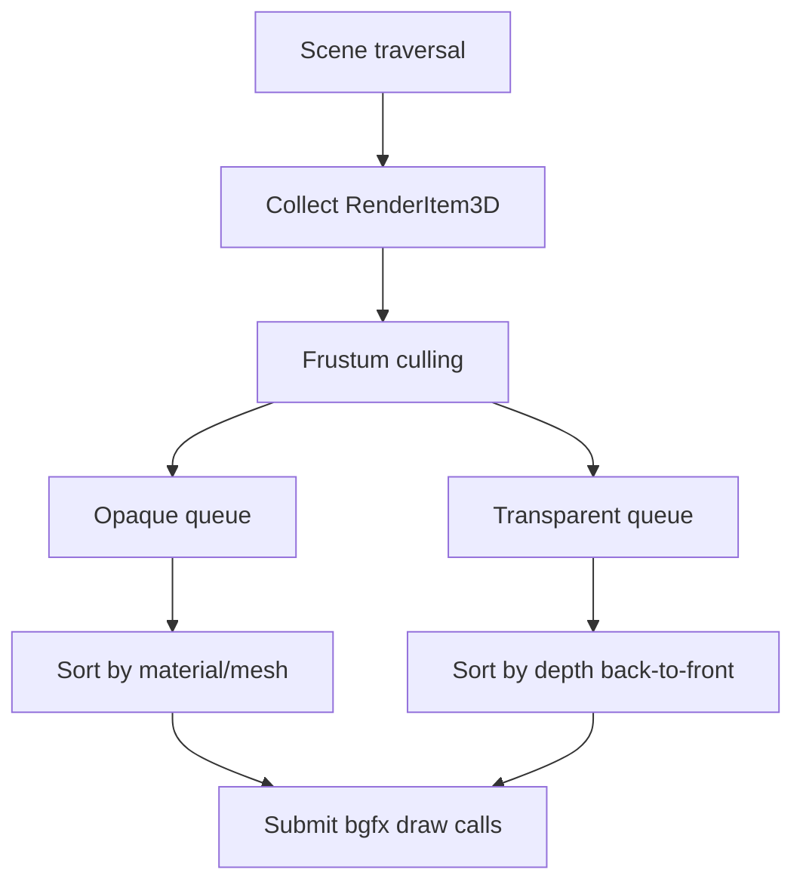

# Dora 3D 渲染管线与材质设计

## 1. 目标

本篇定义以下内容：

- `RenderPass3D`
- draw item 收集与排序
- depth buffer
- forward rendering
- 光照模型
- `Material` 与 shader 管线

首版目标是稳定可扩展，不是立即追求最先进渲染特性。

## 2. 渲染总流程

推荐的主流程：

1. 场景树遍历
2. `Model3D` 生成 `RenderItem3D`
3. `RenderPass3D` 分类到 opaque / transparent / debug
4. 设置 3D view transform 与 depth
5. 提交不透明队列
6. 提交透明队列
7. 提交 debug 队列
8. 继续走 UI3D / UI / post effect



## 3. `RenderPass3D` 设计

## 3.1 职责

`RenderPass3D` 负责：

- 接收 3D draw item
- culling
- 排序
- 统一设置 render state
- 处理光照常量与全局 uniform

不负责：

- 解析资源
- 管理节点树
- 处理动画

## 3.2 数据结构

建议核心结构：

```cpp
struct RenderItem3D {
	Matrix world;
	Matrix normal;
	AABB bounds;
	Mesh* mesh;
	Material* material;
	uint32_t submeshIndex;
	float distanceToCamera;
	uint64_t sortKey;
	bool transparent;
};
```

队列：

- `std::vector<RenderItem3D> _opaqueItems`
- `std::vector<RenderItem3D> _transparentItems`
- `std::vector<RenderItem3D> _debugItems`

## 3.3 排序策略

### 不透明

优先减少状态切换：

- shader
- material
- mesh
- submesh

排序 key 推荐：

- 高位：pipeline / pass type
- 中位：shader id / material id
- 低位：mesh / submesh

### 透明

优先视觉正确：

- 按 camera 距离从远到近

透明物体不做 aggressive batching。

## 3.4 depth buffer

首版必须提供：

- depth test
- depth write
- clear depth

建议默认规则：

- opaque: depth test on, depth write on
- transparent: depth test on, depth write off
- debug line: depth test 可配置，默认 on

## 4. 前向渲染方案

首版推荐 forward rendering，而不是 deferred。

原因：

- 与当前 Dora 渲染架构更容易整合
- 与 bgfx 和现有 pass 机制兼容度高
- 代码量与调试成本低
- 更适合移动端与轻量项目

首版支持的光源：

- 1 个主方向光
- N 个点光源，首版可限制 4 个以内
- 环境光常量

## 5. 光照模型选择

## 5.1 首版建议

建议第一阶段做两套标准材质：

- `Unlit`
- `LitLambert`

如果团队可接受略高复杂度，也可直接上：

- `LitPBRMetallicRoughness`

但我更建议：

- Phase 1: Unlit + Lambert
- Phase 2: PBR

原因：

- 有利于先稳定 mesh/material/render path
- 调试更直接
- 能更快验证 glTF 导入链路

## 5.2 PBR 预留

即使首版不上 PBR，也要让 material schema 兼容后续扩展：

- baseColor
- metallic
- roughness
- normalScale
- emissive
- occlusionStrength

## 6. `Material` 设计

## 6.1 定位

`Material` 是 3D 材质实例，不建议直接复用 `SpriteEffect`：

- `SpriteEffect` 内置单贴图 sampler 语义过重
- 3D 材质需要多纹理槽位和渲染状态组合

但 `Material` 应复用：

- `Pass`
- `Shader`
- `ShaderCache`

## 6.2 推荐接口

```cpp
class Material : public Object {
public:
	PROPERTY(MaterialType, Type);
	PROPERTY_BOOL(Transparent);
	PROPERTY_BOOL(DoubleSided);
	PROPERTY_BOOL(DepthTest);
	PROPERTY_BOOL(DepthWrite);
	PROPERTY_CREF(Color, BaseColor);
	PROPERTY(float, Metallic);
	PROPERTY(float, Roughness);
	PROPERTY(float, AlphaCutoff);

	void setTexture(String slot, Texture2D* texture);
	Texture2D* getTexture(String slot) const;

	void setFloat(String name, float value);
	void setVec4(String name, const Vec4& value);
	void setMatrix(String name, const Matrix& value);

	Pass* getPass(uint32_t index = 0) const;
};
```

## 6.3 为什么 `Material` 不直接继承 `Effect`

`Effect` 更偏“pass 容器”，而 `Material` 需要表达：

- 纹理槽
- 参数语义
- render state
- shader keyword / variant

建议关系：

- `Material` 内部持有 `RefVector<Pass>`
- 不强行继承 `Effect`

如果为了复用现有 API，也可让 `Material : public Effect`，但需要明确：

- `Effect` 负责 program/pass
- `Material` 负责 parameter binding + render state + textures

## 6.4 纹理槽规范

首版建议固定命名：

- `s_baseColor`
- `s_normal`
- `s_metallicRoughness`
- `s_emissive`
- `s_occlusion`

Lambert 首版可只要求：

- `s_baseColor`

## 7. Shader 管线设计

## 7.1 复用现有 `Pass / ShaderCache`

当前 `Pass` 已支持：

- vertex + fragment program
- float / vec4 / mat4 uniform

扩展点主要是：

- 多 sampler
- render state 描述
- 全局 uniform 管理

## 7.2 建议新增能力

### `Pass`

扩展：

- `setTexture(String name, Texture2D* tex, uint8_t stage)`
- `setRenderState(uint64_t state)`

### `ShaderLibrary3D`

内置 shader 命名建议：

- `builtin:vs_mesh_unlit`
- `builtin:fs_mesh_unlit`
- `builtin:vs_mesh_lit`
- `builtin:fs_mesh_lit`
- `builtin:vs_mesh_pbr`
- `builtin:fs_mesh_pbr`
- `builtin:vs_debug3d`
- `builtin:fs_debug3d`

## 7.3 全局 uniform

建议按 frame / camera / object 三层组织：

### Frame 级

- `u_time`
- `u_ambientColor`
- light arrays

### Camera 级

- `u_view`
- `u_proj`
- `u_viewProj`
- `u_cameraPos`

### Object 级

- `u_world`
- `u_normal`
- material 参数

首版可以由 `RenderPass3D` 在提交前统一设置。

## 8. 灯光系统

首版提供完整的场景节点接口：

- `DirectionalLight3D : Node3D`
- `PointLight3D : Node3D`

继承 `Node3D` 后，灯光可以直接使用场景树的 transform、visible 和生命周期语义。renderer 只收集当前 `View3D.scene` 子树中的灯光，因此多个 `View3D` 的灯光状态互不覆盖。

轻量 forward renderer 的预算定义为：

- 每个 view 选择一盏主方向光。
- 场景中的 `PointLight3D` 节点数量不设置公开硬上限。
- 每个 render item 最多选择四盏点光执行完整逐像素 PBR。
- 其余仍影响该对象的点光在 CPU 端合成为 L1 SH，只补充逐像素 diffuse。

点光先用 range 与对象 world AABB 做相交测试，再按以下分数选择 Top 4：

```text
score = luminance(linearColor) * intensity * attenuation(distanceToWorldAABB)
```

这个限制是单次 draw 的高质量光照预算，不是场景 API 上限。它避免为首版引入 GPU light list、compute shader 和 GLES fallback，同时保留比“只取四盏并硬截断”更连续的多灯效果。

直接光 uniform 不占用额外纹理槽：

```glsl
uniform vec4 u_directionalLightDirection;
uniform vec4 u_directionalLightColor;
uniform vec4 u_pointLightPositionRange[4];
uniform vec4 u_pointLightColorIntensity[4];
uniform vec4 u_overflowLightSH[4];
```

当 profile 表明大量重叠动态点光已经让 CPU 候选查询或四盏高光预算成为主要瓶颈时，再评估 spatial hash 和 Forward+/Clustered Forward；该升级不改变 `PointLight3D` 的公开接口。

## 9. 与 bgfx 交互

每个 draw call 的提交顺序建议：

1. 绑定 vertex buffer / index buffer
2. 设置纹理 sampler
3. 设置 object/material uniform
4. 设置 render state
5. `bgfx::submit(viewId, program, depth)`

depth 值仍可用于微调排序，但 3D 正确性应主要依赖 depth buffer。

## 10. 代码落点建议

新增文件：

- `Source/Render/RenderPass3D.h`
- `Source/Render/RenderPass3D.cpp`
- `Source/Effect/Material.h`
- `Source/Effect/Material.cpp`
- `Source/Shader/Builtin3D.cpp`

修改文件：

- `Source/Effect/Effect.h/.cpp`
  - sampler / render state 扩展
- `Source/Cache/ShaderCache.*`
  - 3D 内置 shader 注册
- `Source/Basic/Director.cpp`
  - 在主渲染流程中插入 `RenderPass3D`

## 11. 首版验收

- `Model3D` 能使用 `Unlit` 与 `Lambert` 两类材质。
- 不透明队列具备稳定 depth 与排序。
- 透明材质可正确混合。
- 相机移动时光照与视角结果稳定。
- 关闭所有 3D 节点时不引入额外 draw call。
