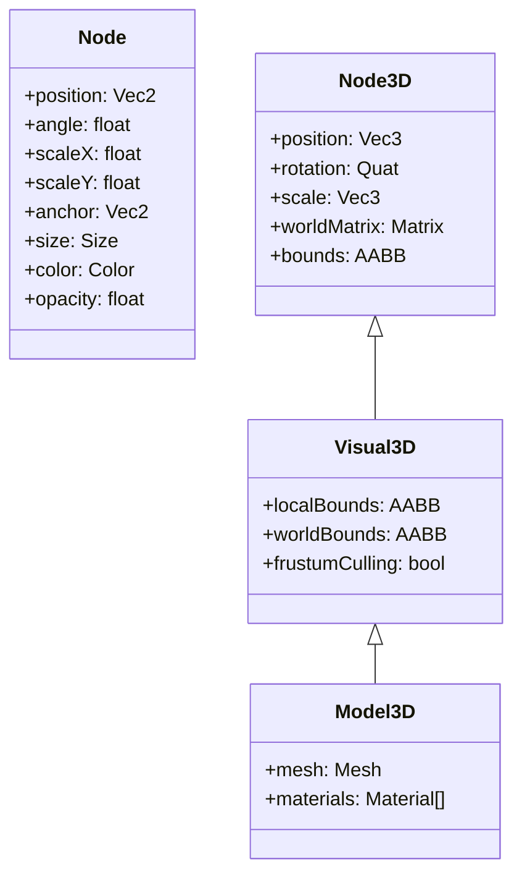

# Dora 场景树方案：Node 与 Node3D 双树设计

## 1. 目标

本文定义 Dora 支持长期 3D 演进的最终场景树方向：

- 保留现有 `Node` 作为默认 2D 场景树
- 新增独立 `Node3D` 作为 3D 场景树
- 放弃 `Node3D : Node`
- 放弃 `NodeBase`
- 通过桥接节点实现 2D/3D 互嵌

这份设计的核心目标是：

- 让 2D/3D 语义真正分离
- 不为抽取公共基类而做高成本重构
- 先把 3D 做对，再谈后续收敛公共实现

## 2. 背景

当前 Dora 的 [`Node`](/Users/Jin/Workspace/Dora-SSR/Source/Node/Node.h) 已经同时承担了：

- 场景树管理
- 生命周期
- 调度与事件
- 输入处理
- 2D 视觉语义
- 一部分 3D 变换能力

这使它在今天是高效的，但对完整 3D 系统来说会遇到两个结构性问题：

1. `Node` 对外心智是“默认 2D 节点”，但内部又带了一部分 3D 能力。
2. 如果直接做 `Node3D : Node`，就会天然允许 2D/3D 节点以不清晰的方式随意嵌套。

最新判断是：从 `Node` 中继续抽 `NodeBase` 的收益不高，不值得为此承担大规模迁移成本。

## 3. 最终结构

推荐结构如下：



补充节点：

- `Scene2DIn3D : Node3D`
- 未来如有需要再加 `Scene3DIn2D : Node`

## 4. 设计原则

## 4.1 语义分离

`Node` 和 `Node3D` 必须是两套明确不同的场景节点语义：

- `Node` = 2D 场景节点
- `Node3D` = 3D 场景节点

用户不应该把 `Node3D` 理解为“多了 z 值的 Node”。

## 4.2 完整实现优先于勉强复用

`Node3D` 自己完整实现：

- child tree
- enter/exit/cleanup
- schedule/update/fixedUpdate/render
- event/signal/slot
- 3D transform

可接受少量代码重复，只要换来语义清晰和实现边界稳定。

## 4.3 桥接而不是混挂

2D/3D 混合不能靠任意父子嵌套，而要靠专门桥接点：

- 3D 内嵌 2D：`Scene2DIn3D`
- 未来如果需要 2D 内嵌 3D：`Scene3DIn2D`

## 5. `Node` 的定位

`Node` 保持 Dora 现有默认节点角色，但语义明确为：

- 2D 场景节点

它继续负责：

- `Vec2` 位置与 2D 变换
- anchor / size
- skew
- color / opacity 级联
- 2D 到 world 的空间变换
- 当前与 Sprite/Label/DrawNode/ClipNode 等 2D 渲染相关的约定

## 6. `Node3D` 的定位

`Node3D` 是 Dora 的 3D 场景节点基类。

它的职责是：

- 提供纯 3D 变换语义
- 提供独立 3D 子树
- 为可见 3D 节点提供统一父类

建议接口：

```cpp
class Node3D : public Object {
public:
	PROPERTY_CREF(Vec3, Position);
	PROPERTY_CREF(Vec3, Scale);
	PROPERTY_CREF(Quat, Rotation);
	PROPERTY_CREF(Vec3, Angles);
	PROPERTY_READONLY_CREF(Matrix, WorldMatrix);

	void addChild(Node3D* child, int order = 0, String tag = String::empty());
	void removeChild(Node3D* child, bool cleanup = true);
	void removeFromParent(bool cleanup = true);

	Vec3 convertToWorldSpace(const Vec3& localPoint);
	Vec3 convertToNodeSpace(const Vec3& worldPoint);
};
```

## 7. 与现有数学实现的关系

虽然 `Node3D` 不再继承现有 `Node`，但可以继续复用现有数学实现思路：

- 维护 local matrix
- 级联 parent world matrix
- dirty propagation

建议直接迁移或复用现有 `Node::getLocalWorld()` 的数学实现思路，而不是重新发明一套不同的变换模型。

## 8. `Visual3D`

建议在 `Node3D` 与 `Model3D` 之间增加一层：

```cpp
class Visual3D : public Node3D {
public:
	PROPERTY_BOOL(FrustumCulling);
	PROPERTY_READONLY_CREF(AABB, LocalBounds);
	PROPERTY_READONLY_CREF(AABB, WorldBounds);
	PROPERTY_READONLY_CREF(Matrix, NormalMatrix);
};
```

这样后续灯光、贴花、粒子、实例化对象就不会都直接堆在 `Node3D` 上。

## 9. 2D/3D 混合策略

`Node` 子树和 `Node3D` 子树不允许直接互挂。

桥接节点：

### `Scene2DIn3D : Node3D`

职责：

- 内部持有一个 `Node` 根节点
- 将这棵 2D 子树渲染到 `RenderTarget`
- 再把结果贴到 3D 平面或曲面上

### `Scene3DIn2D : Node`

首版可以不做，仅预留。

## 10. 语言绑定策略

脚本层主要看到的是：

- `Node`
- `Node3D`
- `Visual3D`

而不是任何内部公共基类。

## 11. 对现有代码的迁移策略

### Phase 1

- 保持现有 `Node` 不动
- 新增 `Node3D`
- 新增 `Visual3D`
- 新增 `RenderPass3D`

### Phase 2

- 引入 `Model3D`
- 引入 `Scene2DIn3D`
- 接 glTF 与材质系统

### Phase 3

- 再考虑是否有必要抽公共工具层，而不是提前抽 `NodeBase`

## 12. 为什么这套方案优于 `Node3D : Node`

`Node3D : Node` 的优点是实现快，但长期问题明显：

- 2D/3D 父子关系天然会混乱
- `Node` 的 2D 心智会污染 `Node3D`
- 很多 API 在 3D 节点上会变得尴尬

双树方案虽然会重复实现一部分能力，但更适合 Dora 当前阶段：

- 语义干净
- 不需要大规模重构现有 `Node`
- 2D/3D 边界清晰
- 桥接策略明确

## 13. 推荐结论

推荐 Dora 采用：

- `Node` 作为默认 2D 场景树
- `Node3D` 作为独立 3D 场景树
- `Visual3D` 作为可见 3D 实例基类
- 2D/3D 混合只通过桥接节点完成

这条路线是当前 Dora 在“长期架构纯度”和“实现成本”之间更现实的平衡点。
