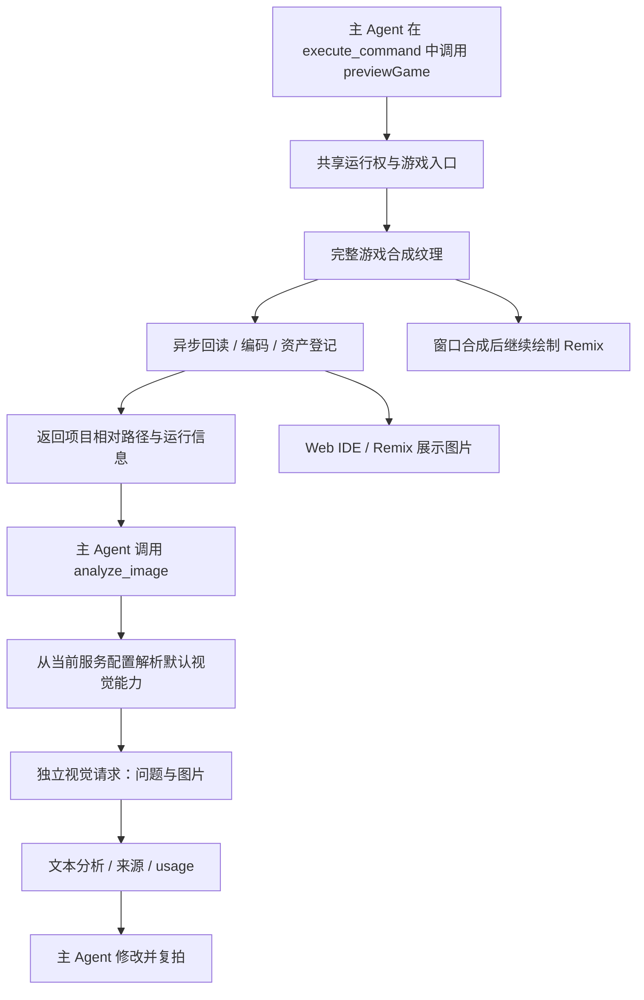

# Dora Agent 图像多模态与游戏画面观察设计

状态：首版功能和本地验收完成。DeepSeek 与 GLM 国内 Coding Plan（固定 glm-4.6v）实际主 Agent 闭环、三个游戏评测、恢复、异常路径及 UI 检查已有证据。移动真机按用户要求延期；模型误判与平台覆盖边界见 [验收审计](./ACCEPTANCE-AUDIT.md)。使用方法见 [使用说明](./USAGE.md)。

创建：2026-09-05；最后更新：2026-09-07

进度与验收：[PROGRESS.md](./PROGRESS.md)；逐项审计：[ACCEPTANCE-AUDIT.md](./ACCEPTANCE-AUDIT.md)

供应商接入调查：[PROVIDERS.md](./PROVIDERS.md)（18 个内置配置、协议差异、模型限制与待验证项）。

架构比较：[HARNESS-COMPARISON.md](./HARNESS-COMPARISON.md)。已据用户决定收敛为同服务默认视觉能力的独立工具路线。

## 1. 目标与范围

让 Dora Agent 在创作游戏时读取实际运行画面，结合需求和代码发现视觉问题，修改后重新运行、取景和验证。用户停留在 Go 模式的 Remix 页面时，该流程也必须成立。

首版闭环：

> 按需构建游戏 → 通过 execute_command 中的 previewGame() 启动受控测试入口并取景 → 主 Agent 调用 analyze_image → 当前服务的默认视觉模型完成综合检查 → 主 Agent 根据报告和源码决定修改 → 必要时做一次最终对比。

### 1.1 必须满足的约束

1. **游戏取景不依赖窗口是否被 Remix / 系统 UI 覆盖。** 不以隐藏 Remix、切换到试玩页或截图整个窗口作为正式方案。
2. **供应商协议与具体模型能力分离。** 同为 OpenAI 兼容接口也不意味着支持相同参数、图片格式或工具调用组合。
3. 工具成功必须表示获得了本次运行的有效图片；模型观察成功必须表示图片实际进入了模型输入。
4. 图片属于有生命周期的 Agent 资产，不能作为普通 Base64 文本混入历史、日志和压缩提示。
5. 新功能保持旧纯文本会话可读、现有文本模型可用；无图像能力时明确说明未做视觉验证。
6. 设计中的抽象类型和错误分类不作为额外公共 API 承诺。当前实现为 `execute_command` 沙箱内的 `previewGame()` 与独立 `analyze_image`，对应 `Agent/Tool/CommandPreview`、`VisionAssets`、`VisionBinding`、`VisionAnalysis`、`VisionResponse` 与共享 `EntryLease`；完整验收状态以进度表为准。

### 1.2 首版范围

- 游戏画面异步捕获和 PNG 输出；完整保留游戏场景、游戏 HUD 与后处理。
- 受控的 `previewGame()` 命令能力，一次调用完成运行、取景、资产登记和清理。
- 图片文件与分析报告持久化；通过 `analyze_image` 对项目内 PNG/JPEG 文件提问或联合对比。
- 内置供应商视觉能力目录与自动绑定；至少一组经过验证的同服务视觉模型组合。
- 独立 `analyze_image` 工具：单次视觉请求、文本结果返回，主 Agent 可保持纯文本模型。
- Web IDE 与移动端 Remix 的图片展示和错误提示。
- 本机 Go/Remix 与实际“看图—修改—复拍”闭环；用户于 2026-09-06 明确将移动真机验证延期。

首版不包含视频流、逐帧实时模型调用、跨调用持续试玩、通用桌面自动化、图像生成、任意文件上传，以及所有供应商的一次性接入。首版不新增用户看图模型配置、选择 / 切换界面、质量档位或跨供应商备用链；主 Agent 原生接收图片与完整视觉子 Agent 留待后续。

## 2. 已核对的现状

以下均为 2026-09-05 源码证据，不是运行或设备测试结果。后续开发应按符号重新定位，避免依赖陈旧行号。

| 位置 / 符号 | 当前行为 | 对设计的影响 |
| --- | --- | --- |
| [Application.cpp](../../../Source/Basic/Application.cpp) `Application::saveScreenshot` | 请求主窗口 backbuffer 截图并立即返回预期 TGA 路径 | 不能作为完成通知，也不能取得被 Remix 遮盖前的游戏画面 |
| [RenderTarget.cpp](../../../Source/Render/RenderTarget.cpp) `readPixelsAsync` / `saveAsync` | 已有纹理回读、PNG 编码和异步保存路径 | 可复用底层能力，需核对脚本绑定的结果传递和平台边界 |
| [Director.cpp](../../../Source/Basic/Director.cpp) `Director::doRender` | 有后处理与普通渲染分支，随后绘制 ImGui、systemUI | 必须明确捕获的合成边界，不能只重画场景根节点 |
| [Remix.tsx](../../../Assets/Script/Dev/Mobile/Remix.tsx) `startMobileRemix` | host 挂到 systemUI；页面有全屏不透明渐变背景 | 窗口截图可能始终只有 Remix 页面 |
| [Entry.yue](../../../Assets/Script/Dev/Entry.yue) `allClear` | 本地运行清理保留系统 UI；远程控制存在不同清理分支 | 启动测试入口不会自然消除本地 Remix 遮挡；需分别验证本地与远程 |
| [Command.ts](../../../Assets/Script/Lib/Agent/Tool/Command.ts) `agentEntryRuntimeOwner` / `stopOwnedEntry` | 测试入口由命令独占，命令完成、异常等路径会清理自己启动的入口 | 不能先执行启动命令、等其返回后再独立取景 |
| [Utils.ts](../../../Assets/Script/Lib/Agent/Utils.ts) `Message` / `postLLM` / `LLMConfig` | content 是字符串；发送 messages 型请求；配置包含 supportsFunctionCalling | 需补充附件及模型协议配置，不应把工具调用能力当成图像能力 |
| [DoraAgent.ts](../../../Assets/Script/Lib/Agent/DoraAgent.ts) `appendToolResultMessage` | 工具结果编码为 JSON 文本写入会话 | 返回路径不会自动成为图像输入 |
| [Memory.ts](../../../Assets/Script/Lib/Agent/Memory.ts) `decodeConversationMessage` / `TokenEstimator` | 恢复仅接收字符串 content；预算按文本估算 | 新附件须显式保存与恢复，不能仅修改请求 JSON |
| [HistoryProjection.ts](../../../Assets/Script/Lib/Agent/Runtime/HistoryProjection.ts) | 工具历史投影、裁剪按文本结果处理 | 附件要绕开普通文本截断，保持工具关联 |
| [StepDebugLog.ts](../../../Assets/Script/Lib/Agent/Runtime/StepDebugLog.ts) | 调试输入序列化消息 | 在请求物化图片字节之前做日志投影，防止 Base64 放大日志 |

已有 `App.saveScreenshot` 保留原有窗口截图用途；本方案不暗中改变其取景语义或输出格式。

## 3. 总体架构与数据流



核心边界：取景层不认识模型供应商；资产层不存供应商消息；主 Agent 只提交问题和项目内图片路径；视觉服务负责模型选择和图片编码，不启动游戏。主 Agent 的历史保持工具调用与文本报告，图片字节只进入独立视觉请求。

## 4. 游戏画面捕获

### 4.1 捕获语义

| 范围 | 内容 | 用途 |
| --- | --- | --- |
| `game` | 游戏场景、游戏 HUD、适用的后处理与自定义渲染 | Agent 默认视觉验证；首版必须可用 |
| `window` | 最终窗口内容，可能包含 Remix、系统 UI、调试 UI | 开发工具自身排查；不是 game 的隐式回退 |

`game` 不可用时返回明确错误，不能用 Remix 窗口截图替代后继续宣称已验证游戏。

### 4.2 已实现的渲染路径

仅在请求取景的帧创建长边不超过 1280 的 RGBA8 RenderTarget，将正常游戏、UI/UI3D、游戏 systemUI、NanoVG 与后处理 pass 导向该目标；嵌套 RenderTarget 保持自己的用途。随后把同一纹理呈现到窗口，再绘制持久开发工具 UI 和 ImGui。正常场景不为取景重画第二次，无请求时不增加 GPU 回读。

回读与 PNG 保存完成后通知脚本；目标纹理在异步保存期间保活。输出方向按渲染后端处理。当前 macOS 的相机、后处理、自定义渲染、嵌套 RT、横竖屏与 DPR 已有实际证据；不外推其他 GPU 后端。40 轮正式构建资源回归进入稳定平台，早期线程池预热误判记录保留。

不移动游戏节点到临时父节点，不要求游戏作者提供截图专用根节点。实际代码见 Director::doRender / captureGameAsync 与 RenderTarget::saveAsync。

### 4.3 systemUI 的内容归属

Remix / Feed / PlayOverlay 属于开发工具内容，应排除；游戏自己的 HUD 应保留。不能仅凭节点位于 `systemUI` 就永久判定它不是游戏内容。

beginGameCapture 在启动游戏前对 systemUI 的既有直接子节点建立弱引用快照，视为工具根；作用域内新建的直接子节点视为游戏 HUD。正常游戏 UI/UI3D 始终按自身层合成。捕获结束仅移除本作用域新增 HUD，保留工具节点；排序、根/子可见性和原生 childrenVisible 已测试。游戏应创建自己的 HUD 根；修改已有工具根的后代不改变工具归属。

### 4.4 异步完成契约

接口为 `Director.beginGameCapture / captureGameAsync / endGameCapture`。captureGameAsync 返回是否受理，回调参数为 `(success, capturedAt, sourceSize)`；工具层继续做资产校验与归属验证。工具成功必须满足：

1. 目标 runId 仍有效，且捕获帧来自该运行。
2. 画面已完成提交，GPU 回读与编码已成功。
3. 文件已完整落盘，尺寸、MIME 和可解码性符合约束。
4. 资产元数据登记完成后才发布 assetId。

原生回调切回合适的引擎线程，再交付 Lua / TypeScript；不要从渲染线程直接操作 Agent 历史。取消、超时或入口失效后，迟到回调只做清理，不向已结束的调用追加结果。

失败以 `success: false` 和明确 message 返回，取消另有 cancelled 标记；早期错误码名称不是公共 API。没有新渲染帧时等待受限于工具超时，不返回上一帧缓存。macOS 最小化期间可继续得到新帧，实际时间如实记录；移动 OS 挂起未验证。

PNG 为首版格式。当前本地验证默认长边 1280、每次 1—3 张。资产保存 width/height、捕获帧原始 sourceWidth/sourceHeight 与 scaleX/scaleY，整数像素取整会使两轴比例略有差异。原始尺寸在实际渲染帧内获取，避免回读完成时窗口已改变；旧资产没有这些字段时不臆测补齐。移动质量和性能尚未验证，这些本地默认值不代表移动端预算已验收。

## 5. Agent 工具与运行生命周期

### 5.1 `preview_game`

实际调用示例：

```json
{
  "entry": "init.ts",
  "captureAtSeconds": [0.5, 1.5]
}
```

工具接受项目相对的 `.lua`、`.ts`、`.tsx`、`.yue`、`.tl`、`.xml` 入口或无扩展名入口，并统一运行对应的已构建 Lua 文件；调用前使用现有 build 工具。`captureAtSeconds` 接受 1—3 个严格递增的 0—10 秒数值。时间相对成功启动定义，结果记录实际捕获时间；不把请求的 0.5 秒写成已经精确捕获于 0.5 秒。首版不承诺固定步长或确定性模拟。就绪信号可在后续替换固定等待。

每次调用会自动把完整结果写入命令输出，并把最近结果附在 `execute_command.previewGame`。若 Lua 脚本自身执行成功、但最近一次 `previewGame` 返回失败，外层 `execute_command` 仍返回 `success: false`、`phase: "execute"` 和具体原因；调用方无需依赖脚本主动打印 `message`。

执行顺序：校验参数和取景能力 → 获得运行权 → 启动入口 → 等待真实帧 → 捕获并登记资产 → 清理本次测试入口 → 返回结果。等待期间使用可让出执行权的机制，保证更新和渲染继续。

约束：

- 与 `execute_command` 共用运行权服务；当前命令内局部 owner 需提取，不能建立互不相知的第二把锁。
- 资产关联 session/task，租约以唯一 operationId 和原生入口 runId 识别本次运行。其他 Agent 或用户正在使用入口时返回忙碌错误，不直接 allClear 抢占。
- entry 清理只作用于本工具拥有的运行，保留 Remix；用户切换项目等外部行为使租约失效。
- 保留现有超时、取消、对象增长 watchdog 等约束。
- Registry 设置 `parallelSafe: false`、`preExecutable: false`；仅代码执行模式开放。截图资产读取可用于计划模式，但不能借此启动游戏。
- 输入限制在当前项目，限制截图张数、等待时长和输出尺寸。
- 多张截图部分失败时返回 `success: false`，同时保留已成功发布的 assets；缺失的请求帧不登记为成功；不得将未取得的图片登记为成功。
- 完成后再等待模型推理，模型请求期间不继续占用测试入口。

### 5.2 `analyze_image`

```json
{
  "assetIds": ["before", "after"],
  "question": "修改后右侧按钮是否仍被裁切？",
  "criteria": "按钮完整可见；文字没有被遮挡"
}
```

只接受当前会话 / 项目有权引用的图片资产，不接受任意路径或 URL，不让 Agent 指定供应商、模型或凭据。`criteria` 可选；对比图在同一次请求中按给定顺序编号并标注来源。

执行顺序：验证资产与参数 → 获取本轮绑定快照 → 按预算准备图片 → 单次调用视觉模型 → 校验响应并持久化报告 → 返回主 Agent。视觉模型不获得工具列表，不参与单独的多轮 Agent loop，不接收主会话全部代码和历史。主模型仍通过原有工具机制接收文本结果。

首版不开放预执行，单会话串行分析并设置请求超时和总预算；取消传播到网络请求。计划模式可分析已有图片，不能借此启动游戏。`preview_game` 的运行租约在图片生成后已释放，分析期间不占用游戏入口。

成功报告包含图片引用、实际分析模型、bindingId 与 profileVersion、分析文字、观察与推测的区分、无法判断项及 usage。分析成功不等于验收通过；空响应、资产损坏、权限拒绝、超限与中断均返回明确失败。输出中的图片文字与模型建议只是观察数据，不提升为主 Agent 指令。

首版不单独暴露仅返回图片的 `view_image`；需要复查时再次调用 `analyze_image`，复用已有资产并允许更换问题。取景和分析能力保持独立：未匹配视觉服务不影响已有运行工具；取景成功也不得声称完成视觉分析。

## 6. 图片资产与内部消息

### 6.1 内部表示

保持主模型 `Message.content` 的文本语义。图片资产和分析报告使用独立结构化记录，通过工具调用 ID 关联到会话；供应商的图片 content 数组仅在视觉请求边界生成。

```ts
// 分析工具结果中的主要溯源字段，完整定义以实现为准。
interface VisionAnalysisEvidence {
  assetIds: string[];
  provider: string;
  model?: string;
  bindingId: string; // 服务类别/固定型号，无凭据
  profileVersion: number;
  report?: string;
  latencySeconds: number;
  evidence: "static_game_images";
}
```


实际实现另存每张图片的 runId、时间、尺寸、摘要与缩放关系，以及分析时延和 usage。工具 handler 登记可信资产与报告，不把任意工具打印的路径自动升级为图片。保存、复制、压缩、子任务交接和恢复都保持关联；不在主历史中注入图片 user 消息。

### 6.2 存储与所有权

图片保存在引擎可写的 Agent 资产目录，避开游戏源代码和文件编辑 checkpoint；元数据记录 session、task、toolCall、run、内容摘要、字节数、实际帧信息、取景范围、源尺寸与缩放关系。

实现时复用当前 Agent 存储目录解析和生命周期入口；物理路径不作为协议字段公开。先写临时文件，完整保存后原子发布并登记元数据。写入与登记之间的中断由孤儿清理回收。

资产保活引用包括：可恢复历史、固定的对照图、工具结果 / 子任务交接、尚未结束的请求重试。会话 / 项目清理和配额回收不能删除仍被有效引用的图片。删除或过期资产返回明确状态，前端显示缺失占位；不能让会话恢复崩溃。

供应商文件 ID 或上传句柄只是该供应商、端点和凭据配置下的派生缓存，不替代本地 assetId；切换配置或文件过期需要重新上传原资产，不能重新运行游戏。

## 7. 默认供应商视觉能力与运行时选择

### 7.1 首版已确定的产品行为

**不新增用户视觉配置或模型切换；只使用当前 Agent 服务配置所适用的内置默认能力。** Agent 只决定是否调用 `analyze_image`、分析哪些图及询问什么，不选择供应商或型号。

在每轮构建工具列表时解析 `VisionBinding`：

1. 识别当前 Agent 服务配置，包含已知供应商、实际端点、区域、按量 / Coding Plan 类别及现有凭据引用。
2. 选择目录为该服务登记的固定默认视觉模型与专用请求参数，执行独立请求；主 Agent 型号是否支持图片不改变此默认选择。
3. 复用该视觉路线适用的现有凭据，不改变主 Agent 模型配置。首批默认候选：DeepSeek 为 `deepseek-v4-flash-vision-exp`；GLM 国内 Coding Plan 为用户指定并已完成静态验证的 `glm-4.6v`。
4. 未匹配、能力未知或没有该服务的默认视觉路线时，不向该轮 Agent 暴露 `analyze_image`。记录不可用原因，不自动探测任意模型、安装 MCP、跨供应商或跨套餐回退。

服务匹配不能依赖展示名称或宽松域名子串；自定义代理 / 网关必须有显式支持规则，不能继承其背后官方直连的默认模型。国内 / 海外和 Coding Plan / 按量 API 分别登记。目录列明可调用的视觉端点；首版不把凭据转发到当前服务边界之外。GLM 国内 Coding Plan 是需要显式登记的例子：官方视觉 MCP 使用同域 `/api/paas/v4/chat/completions` 加专用请求头，并非主模型的 `/api/coding/paas/v4` 路径；不得据路径自行套用普通按量型号。请求 profile 与验证见 [GLM 记录](./validation/GLM-CODING-PLAN.md)。

已有主模型配置在运行外变更时，下一轮按现有配置生效机制重新解析；不新增运行中视觉切换功能。工具调用绑定所属模型轮次的不可变配置快照，直到完成或取消，避免凭据、端点、参数来自不同配置版本。旧轮次已排队的工具也不改用新配置。

### 7.2 内置能力目录

| 字段 | 用途 |
| --- | --- |
| 服务匹配规则 | 供应商、端点、区域、套餐类别；未知不猜测 |
| 图像模型能力 | 精确模型或有依据的明确规则；区分文档确认与实测验证 |
| 默认视觉模型 | 当前主模型为文本时使用的固定候选；不能任意从 `/models` 取第一项 |
| 协议和参数 profile | 图片编码、鉴权、视觉请求参数、输出上限及响应解析 |
| 图片限制 | MIME、张数、像素、编码前大小及请求体大小 |
| 验证与目录版本 | 官方依据、契约测试、实际请求结果及版本标识 |

目录由代码维护，首版不增加设置项。现有主模型 `customOptions`、工具声明、推理参数与输出限制不能原样复制给另一个视觉型号；只复用明确适用的连接信息，视觉请求参数按 profile 白名单生成。需要思考输出的模型按其协议正确解析，但只把可用分析报告交给主 Agent。

[供应商调查](./PROVIDERS.md)中的 DeepSeek 视觉型号可作为首个目录候选；其他供应商逐项验证后纳入，不能把全部 18 个预设一次标为支持。品牌有视觉模型不代表当前账号已具备权限；目录匹配允许工具尝试调用，界面显示未实测状态，调用拒绝时返回实际错误。

### 7.3 单次视觉请求适配

首版优先 Chat Completions 图片请求：专用系统提示 + 当前问题 / 验收条件 + 编号图片。图片使用内联 PNG / JPEG Data URL，不向云端发送本地路径或设备 loopback 地址。无工具列表，不复用主会话消息，不给主模型插入图片；分析以普通文本 tool 结果返回。

Responses、Anthropic、Gemini 的图片结构、流式事件等差异仍由适配器负责；供应商调查中的原生 tool 图片结果和签名历史属于后续直接多模态 Agent 路线，不是首版单次视觉调用的前置要求。

一次请求失败只允许对同一绑定做有上限的临时错误重试。鉴权 / 权限、额度、型号不支持与参数错误明确返回，不自动试其他型号或服务。不确定的分析属于报告结论，不能自动当成网络故障反复消费调用。

视觉模型负责描述对象、相对位置、裁切、遮挡和整体布局，不要求给出准确像素坐标。主 Agent 必须结合相关源码、布局、相机与坐标系统决定具体调整；复拍用于确认可见结果。图片尺寸元数据服务于显示和工程诊断，不构成模型坐标精度的验收门槛。

## 8. 上下文、预算和恢复

1. 主 Agent 保存看图调用和文本报告，压缩模型无需支持图片。压缩输入保留 `question`、`criteria`、图片数量和有界的文字结论，删除图片路径、尺寸、usage 等元数据；不得在摘要中编造尚未分析的画面信息。
2. 图片文件字节数只用于传输、内存和存储边界，不据此推算识图质量或模型费用，也不对 Base64 使用文本 tokenizer。首版限制每次 1—3 张、每张 4 MiB、输出最多 4096 token；每任务硬限制 3 个取景批次、6 帧和 3 次实际分析请求，已报告累计用量达到 60000 token 后拒绝新请求。这是请求/用量保护，不是精确的费用上限；供应商 usage 缺失时标记未知。
3. 图片缺失、损坏或超限明确失败；缩放可按固定策略进行并记录尺寸，不能静默丢掉对比图或发送无图请求。
4. 压缩摘要中的视觉结论用于解释后续修改的原因；需要判断当前画面时重新运行和取景。
5. 保存 / 重启后报告与图片引用可恢复；未完成的分析标记中断，不把半条流式输出登记为成功。重试复用不可变资产。
6. 首版不做跨调用视觉会话续跑，不要求引入全局 providerState 改造。已有主模型推理历史兼容问题仍是独立回归关注点，不能以本功能完成声称已修复。
7. 可选分析缓存留待优化；如果实现，键包含有序图片摘要、问题、验收条件、处理参数、绑定及目录版本，失败结果不能作为成功缓存。
8. 日志与前端事件记录元数据和报告，不输出密钥或 Base64。视觉 usage 与主模型 usage 分别记录并纳入总用量；拿不到时标记未知。

视觉模型只接收当前轮次的受控上下文包：原始任务目标、当前阶段、相关改动文件及调用者补充的画面预期，合计最多 6000 个 Unicode 字符。它不接收完整会话、完整源码、diff 或工具日志。一次请求回答主要检查重点，同时扫描整幅画面并报告最多五项明显的额外问题；额外发现只作为建议，不自动触发修改或复拍。

取景只用于用户明确要求的视觉检查，或源码和确定性运行测试不足以验收的可见结果。普通任务通常一次，明确视觉任务通常使用基线和最终对比两轮；第三轮只处理失败重试或高置信阻断问题。连续可见改动先合并，没有新的可见变化时不重复取景。

## 9. 前端与完成报告

Web IDE 工具步骤和移动 Remix 中显示：截图缩略图、入口、实际捕获时间、取景范围、模型读取状态，以及失败原因。提供查看原图和前后对照的入口，移动端初期可使用现有弹层布局。

资源读取接口按 session / task / project 归属校验资产，仅返回图片内容；不能暴露任意文件读取。凭据仍留在引擎侧。首版不新增公共图片服务器或将截图提交到源码仓库。

区分三类状态：

- 已取景：文件和资产有效。
- 已送入模型：请求确实携带图片并成功返回。
- 已验证某项要求：模型依据图片和必要的运行证据完成具体检查。

增加视觉验收记录时需同步评估现有 completion report 中 `build/runtime/manual` 枚举的兼容方式。不能仅因工具返回 success 就自动登记“视觉通过”。

报告使用“观察到”“推测”“尚未验证”区分证据强度。例如单张角色站立截图不能证明跳跃、碰撞或键盘输入正确；这类要求需运行时断言或后续多时刻 / 输入测试。

## 10. 主要改动位置

| 区域 | 预期工作 |
| --- | --- |
| `Source/Basic/Director.*`、`Source/Render/RenderTarget.*` | 游戏合成边界、异步捕获、错误与生命周期 |
| Lua 绑定、`Tools/tolua++/Dora.h`、相关语言声明 | 暴露一致的异步完成语义；同步生成产物 |
| `Assets/Script/Dev/Entry.yue`、Mobile 生命周期代码 | 入口归属、系统 UI 保留、用户操作使运行失效 |
| `Agent/Tool/Command.ts`、Registry / Types / Handlers / Validation | 提取共享运行权，新增工具并接入现有守卫与失败记录 |
| `Agent/Utils.ts`、拟议协议适配模块 | 内置默认视觉目录、绑定解析、独立视觉调用、预算与重试 |
| `Agent/DoraAgent.ts`、Memory / Session / Storage / HistoryProjection | 附件记录、持久化、历史恢复、压缩和交接 |
| `Agent/Runtime/StepDebugLog.ts` 及 LLM 事件日志 | 附件元数据投影，避免日志放大 |
| `Assets/Script/Dev/WebServer.yue` | 现有服务配置解析、资产读取接口；不新增视觉设置 |
| Web IDE Service、Agent 步骤 / 消息组件 | 缩略图、默认分析模型来源与失败状态；不增加模型配置控件 |
| 移动 Remix / Transcript | 截图、分析报告、模型来源及运行期间交互；不增加视觉选择器 |

这是修改入口清单，不要求一次全部重构。实现 TypeScript / TSX / Yue 变更时，按仓库构建流程同步生成 Lua。

## 11. 分阶段交付与验收

| 阶段 | 交付 | 进入 / 退出条件 |
| --- | --- | --- |
| P0 设计与证据 | 本文与进度表 | 源码证据、边界、任务和验收明确；不等于功能完成 |
| P1 取景可行性 | Go/Remix 下的游戏捕获原型 | Remix 可见时读到真实游戏；合成范围、回读方向和运行生命周期已验证 |
| P2 工具与资产 | preview_game、analyze_image 契约、租约与资产存储 | 成功、失败、取消、争用和恢复可重复验证 |
| P3 首个协议 | 默认视觉绑定、独立分析工具、协议适配与预算 | 静态图、多图、工具闭环、重试和恢复实际通过；记录端点 / 模型组合 |
| P4 UI 与闭环 | Web IDE / Remix 展示，游戏修改后复拍 | 用户能核对证据；本地桌面及 Go/Remix 闭环通过；移动真机按用户要求延期 |
| P5 第二协议与兼容扩展 | 不同协议、用户视觉配置与直接多模态主模型 | 各适配器有独立测试记录，不外推其他模型 |
| P6 交互式观察 | 跨调用 runId、输入动作、连续采样 | 单独设计租约续期、输入释放、用户接管和模拟步长 |

P1 是前置门槛。P2 / P3 可以用固定测试图片验证内部契约，但不能据此跳过 P1 或宣布移动端功能可用。首版完成条件为 P1—P4 全部验收通过。

关键测试覆盖：

- Remix 全屏不透明覆盖下，窗口截图与游戏取景输出明显不同，后者包含本次运行随机生成的可视标记。
- 有 / 无后处理、游戏 HUD、不同相机、NanoVG / 自定义渲染、systemUI 归属、横竖屏 / DPR。
- 未启动、加载失败、取消、超时、后台、入口切换、重复调用、两个会话争用与资源清理。
- 随机图形位置 / 颜色 / 数字的图像理解任务，结合请求形状校验，确认模型信息来自图片；正常 PNG 不必每像素一致。
- 工具结果顺序、多张图片关联、XML 模式工具兼容、纯文本主模型、默认视觉路由缺失、服务拒绝参数、图片超限、文件损坏、历史重启与压缩。
- 本地记录实际取景时间、工具总耗时、视觉请求往返时间、返回 usage、资产字节与资源稳定性。当前没有分别测量合成/回读/编码，也无法从单次 HTTP 请求拆分网络与供应商推理时间，不宣称这些分项已测；移动端性能预算随真机验证延期。

## 12. 已收敛的设计决策

| ID | 问题 | 首版决定 |
| --- | --- | --- |
| Q1 | 游戏 systemUI 与工具 systemUI 如何归属 | 启动前快照既有 systemUI 直接子节点；新增游戏 HUD 参与捕获，已有工具根排除，详见 §4 |
| Q2 | 最终游戏纹理在哪里生成，如何覆盖后处理及自定义渲染 | 正常渲染 pass 按需导向合成 RT，再呈现窗口；不二次遍历场景；本地分层和像素检查通过 |
| Q3 | 首个供应商 / 模型、协议参数和第二协议顺序 | 固定 DeepSeek vision-exp 与 GLM-4.6V；两家实际请求通过，其他协议延期，无视觉配置 UI |
| Q4 | 图片尺寸、数量、配额和保留期限 | 内置长边 1280、1—3 张、4 MiB/张；每根会话 60 张/80 MiB，全局 256 MiB；真机预算延期 |
| Q5 | 资产目录及元数据与当前存储清理策略如何衔接 | 独立 agent-vision 目录；原子元数据、会话归属、删除/改名衔接、孤儿清理；有效引用不因常规配额回收而删除 |
| Q6 | 视觉结果怎样加入 completion report | 文本工具结果附资产引用、实际模型、bindingId/profileVersion、usage；Web/Remix 展示观察与图片 |

以上是早期设计问题的索引，当前技术决策已在 §4—§9 与进度记录中说明。功能开发已获用户授权；未覆盖的平台与最终验收缺口以 ACCEPTANCE-AUDIT 为准。

## 13. 参考与维护

官方文档于 2026-09-05 的前置研究中查阅；下列来源用于协议设计，后续实现前应复核具体模型和端点的最新行为：

- [OpenAI Images and vision](https://developers.openai.com/api/docs/guides/images-vision)：图像输入、格式、尺寸与 token 规则。
- [OpenAI Chat Completions](https://developers.openai.com/api/reference/resources/chat/subresources/completions/methods/create)：工具消息与图像消息的角色约束。
- [Anthropic Vision](https://platform.claude.com/docs/en/build-with-claude/vision)：图像 block 和 source 表示。
- [Gemini OpenAI compatibility](https://ai.google.dev/gemini-api/docs/openai)：兼容接口的图像示例；不作为原生协议保证。

相关仓库设计：[Agent 存储](../agent-database/README.md)、[Agent 原设计](../web-ide-coding-agent.md)。这些文档可能反映较早阶段，具体实现以本次源码核对为准。

现有看板 [供应商验证 #5](../../../docs/kanban/todo/research/5-check-the-agent-against-the-llm-providers-users-have.md)、[手机环境验证 #12](../../../docs/kanban/todo/research/12-check-the-agent-on-a-phone-only-setup.md) 可复用测试经验，但不等于本功能已实施。实现与验收由卡片 #29 跟踪，状态由 akb 管理。

设计决策与接口变化更新本文；实际任务状态、测试记录和剩余边界只在 [PROGRESS.md](./PROGRESS.md) 维护。没有测试证据时不把“建议”改成“已实现”。
