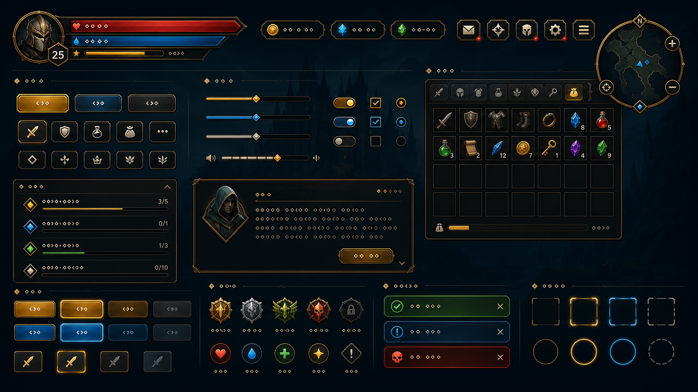
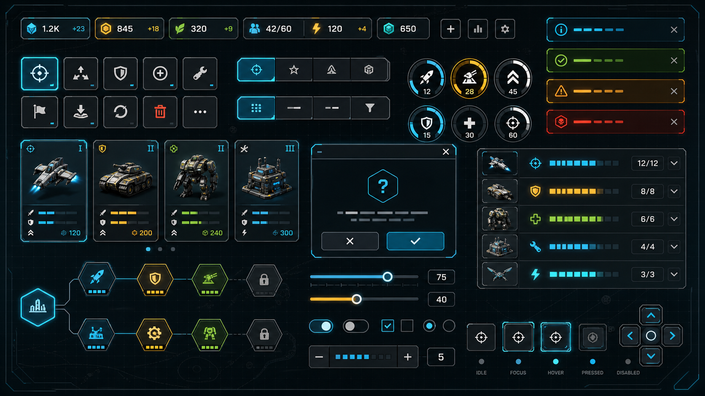

# Dora 游戏 UI 组件库设计

本文设计一套面向 Dora 引擎的游戏通用 UI 组件库。目标是让开发者用仿 ReactJS 的动态 TSX 写法快速搭建 HUD、菜单、背包、对话、商店、设置、卡牌和编辑器式游戏界面，同时复用 `AlignNode` 的 Yoga/Flex 布局能力，并通过 NanoVG 风格的矢量绘制获得可缩放、低资源依赖的视觉表现。

## 参考图

以下图片只作为设计语言参考，不是需要逐像素还原的资产。组件实际实现应尽量由 nvg 的路径、渐变、描边、裁剪、文字和少量图标组成。





## 设计目标

- **上手快**：常见游戏 UI 通过 TSX 组合完成，开发者不需要先理解复杂渲染管线。
- **运行时可变**：状态、列表、进度、倒计时、选中项、禁用态等通过 DoraX `signal` 和 `createRoot()` 动态更新。
- **布局可靠**：所有容器和控件优先使用 `AlignNode` 的 `style` 表达尺寸、间距、对齐、换行、绝对定位和自适应。
- **绘制轻量**：默认使用普通 `Node` 的 render 回调在当前 UI 层表面直接调用 nvg 绘制，不为每个控件创建离屏纹理。
- **风格可换**：视觉由主题 token、组件 variant 和 painter 函数组成，游戏可以换成幻想、科幻、像素、暗黑、休闲等风格。
- **输入完整**：覆盖触摸、鼠标、键盘和手柄焦点，支持 hover、pressed、selected、disabled、focused、loading、cooldown 等状态。
- **低侵入**：不替代 Dora 原有节点系统；组件最终仍是 `Node` / `AlignNode` / `Sprite` 等普通节点的组合。首版 UIX 文字和图标统一走 nvg，避免与 Dora `Label` 所在场景节点层发生遮挡顺序差异。

## 非目标

- 首版不做 DOM/CSS 完整兼容，只提供游戏 UI 需要的组件语义和 Yoga 子集布局。
- 首版不做复杂富文本排版和 Web 表单级输入法体验；文本输入单独作为高阶组件推进。
- 首版不内置完整图标库，只定义图标插槽、nvg 图标 painter 规范和少量基础符号。
- 首版不把所有矢量图形缓存成纹理。`VGNode` 是可选优化，不是默认渲染路径。

## 设计语言

组件库的默认设计语言命名为 **Dora Prism**。它的目标不是强绑定某个游戏题材，而是提供一套可换皮的“游戏感矢量 UI”基础。

### 视觉原则

- **清晰优先**：血条、资源、按钮、背包格子和提示必须在 720p 到高 DPI 屏幕上保持可读。
- **形状克制**：基础形状以 4、6、8、12、16 半径的圆角矩形为主，少量斜切角和内嵌线用于游戏感。
- **层级明确**：用背景、面板、控件、焦点、危险/奖励反馈五层 token 控制明暗和饱和度。
- **矢量友好**：所有默认效果限制在 nvg 可稳定表达的能力内：路径、圆角矩形、线性/盒状/径向渐变、描边、阴影近似、裁剪、文本。
- **动效短促**：交互反馈以 80-180ms 为主，避免菜单操作拖泥带水；长期动效只用于冷却、加载、选中呼吸和稀有奖励。

### 默认色彩 token

| Token | 建议值 | 用途 |
| --- | --- | --- |
| `surface.base` | `0xff11161d` | HUD 和面板底色 |
| `surface.raised` | `0xf01b2430` | 浮层、卡片、按钮底 |
| `surface.sunken` | `0xcc080b10` | 输入框、进度槽、背包格 |
| `line.normal` | `0xcc405062` | 普通边线 |
| `line.strong` | `0xddb9c7d8` | 强边线、分隔 |
| `accent.primary` | `0xff35d0ff` | 主要操作、焦点 |
| `accent.warm` | `0xffffc15a` | 奖励、强调 |
| `state.danger` | `0xffff4f5e` | 生命、错误 |
| `state.mana` | `0xff4d7cff` | 法力/能量 |
| `state.success` | `0xff56d68a` | 成功、可用 |
| `text.primary` | `0xfff4f8ff` | 主文本 |
| `text.secondary` | `0xff9eacbd` | 次文本 |
| `text.disabled` | `0xaa637080` | 禁用文本 |

主题可以覆写 token，但要保持同一界面里至少有一个冷色功能色、一个暖色奖励色、一个危险色和一组中性色，避免变成单一色相皮肤。

### 尺寸 token

| Token | 值 | 说明 |
| --- | --- | --- |
| `space.1` | `4` | 最小内间距 |
| `space.2` | `8` | 控件内边距、图标间距 |
| `space.3` | `12` | 按钮和表单间距 |
| `space.4` | `16` | 面板内边距 |
| `space.6` | `24` | 大面板分组间距 |
| `radius.sm` | `4` | 背包格、输入框 |
| `radius.md` | `8` | 按钮、普通面板 |
| `radius.lg` | `12` | 弹窗、HUD 组 |
| `stroke.hairline` | `1` | 高 DPI 细线 |
| `stroke.normal` | `2` | 常规边线 |
| `focus.width` | `3` | 键鼠/手柄焦点环 |

### 字体策略

- 默认使用 Dora 可加载的 UI 字体名，不把字体文件硬编码进组件。
- UIX `Text` 首版使用 nvg `CreateFont` / `FontFaceId` / `Text` 渲染，不使用 Dora `Label`。
- `sdf`、`smoothLower`、`smoothUpper` 保留为 API 兼容字段；当前 nvg 文本路径不消费这些参数。
- nvg 文本主要用于按钮、badge、图标数字、短标签和 tooltip 短说明；复杂段落后续交给专用 `RichText` 组件。

## 技术架构

### 节点分层

```text
<Root> createRoot(parent)
  <align-node windowRoot style={screenStyle}>
    <Stack / Row / Panel / Button / Slider / InventoryGrid ... />
  </align-node>
```

组件内部按三类节点协作：

- **布局节点**：`AlignNode`。负责 Yoga/Flex 盒模型、窗口根布局、绝对定位、gap、padding、margin、aspectRatio 和 overflow。
- **绘制节点**：普通 `Node`。负责输入命中、生命周期、焦点状态，并在 `onRender` / `Node.render()` 阶段直接调用 nvg 绘制到当前 UI 层表面。
- **缓存节点**：`VGNode`。只在需要离屏纹理的场景使用，例如复杂装饰背景、昂贵模糊阴影、可复用九宫格风格面板、需要作为 Sprite 参与后处理的 UI。

默认控件不创建 `VGNode`，否则大量按钮、格子、列表项会产生过多 framebuffer/texture，反而不适合高频游戏 UI。

### 渲染策略

每个可视组件拆成 `layout box + painter`：

```tsx
<align-node style={{width: 180, height: 44}}>
  <custom-node
    touchEnabled
    onCreate={() => createPaintNode(drawButton)}
  />
  <Text text="Start" fontName="sarasa-mono-sc-regular" fontSize={18} />
</align-node>
```

推荐封装为内部 helper：

```ts
type PaintState = {
  width: number;
  height: number;
  theme: Theme;
  state: "idle" | "hovered" | "pressed" | "focused" | "disabled";
};

type Painter = (this: void, state: PaintState) => void;
```

组件在 `AlignNode.onLayout(width, height)` 中记录布局尺寸，普通 `Node` 在 render 回调中读取尺寸并调用 painter。这样可以让 Yoga 只管布局，nvg 只管画法。

### 动态更新

- 使用 DoraX `createRoot(parent).render(() => <App />)` 作为动态 UI 入口。
- 使用 `signal()` / `useSignal()` 表示组件状态、游戏数据投影和临时 UI 状态。
- 列表项必须提供稳定 `key`，例如物品 id、任务 id、技能 id。
- 组件内部状态优先使用 signal；复杂业务状态由游戏层传入，组件库不内置全局 store。
- 卸载时通过 `onUnmount` 释放定时器、动画句柄、外部订阅和缓存引用。

### 布局约定

组件库提供语义化布局组件，但它们只是 `AlignNode` 的薄封装：

| 组件 | 默认布局 |
| --- | --- |
| `Box` | 单个 `align-node`，透传 style |
| `Row` | `flexDirection: "row"` |
| `Column` | `flexDirection: "column"` |
| `Stack` | 绝对定位叠层，常用于背景、内容、角标 |
| `Spacer` | flex grow 占位 |
| `SafeArea` | 根据屏幕边距和平台安全区扩展 padding |
| `PortalLayer` | Toast、Tooltip、Modal 的固定层 |

布局 style 只使用当前 DoraX 类型已经覆盖的属性：`width`、`height`、`minWidth`、`maxWidth`、`margin`、`padding`、`gap`、`flex`、`flexGrow`、`flexShrink`、`flexDirection`、`justifyContent`、`alignItems`、`position`、`left/right/top/bottom`、`overflow`、`aspectRatio` 等。

## 组件体系

### Foundation 基础层

| 组件 | 用途 |
| --- | --- |
| `PaintNode` | 普通 Node + nvg painter 的内部基础组件 |
| `Icon` | nvg 符号、Sprite 图标或自定义 painter |
| `Text` | 短文本 Label 封装 |
| `NumberText` | 资源数字、伤害数字、倒计时 |
| `FocusRing` | 键盘/手柄焦点绘制 |
| `SoundCue` | 组件状态变化时播放 UI 音效的约定层 |

### Layout 布局层

| 组件 | 用途 |
| --- | --- |
| `Box` | 基础盒 |
| `Row` / `Column` | 主轴布局 |
| `Stack` | 重叠布局 |
| `Grid` | 背包、技能、卡牌网格 |
| `ScrollView` | 任务列表、商店列表 |
| `VirtualList` | 大型列表，按可见区创建节点 |
| `Panel` | 游戏面板背景、标题栏、内容区 |
| `Divider` | 分隔线 |

### Controls 控件层

| 组件 | 状态 |
| --- | --- |
| `Button` | idle, hovered, pressed, focused, disabled, loading |
| `IconButton` | idle, hovered, pressed, focused, disabled, selected |
| `Toggle` | checked, unchecked, disabled |
| `Checkbox` | checked, indeterminate, unchecked, disabled |
| `RadioGroup` | selected, focused, disabled |
| `Slider` | dragging, focused, disabled |
| `Stepper` | min, max, changed |
| `SegmentedControl` | selected, hovered, disabled |
| `Tabs` | selected, unread badge, disabled |
| `TextInput` | focused, error, disabled, placeholder |
| `Select` | open, selected, disabled |

### Game Patterns 游戏模式层

| 组件 | 用途 |
| --- | --- |
| `HealthBar` / `ManaBar` / `ShieldBar` | 角色状态 |
| `ResourceCounter` | 金币、木材、弹药、人口 |
| `CooldownButton` | 技能按钮和倒计时遮罩 |
| `InventoryGrid` | 背包格、拖放、数量角标、稀有度边框 |
| `ItemSlot` | 装备、材料、技能、卡牌格 |
| `QuestTracker` | 任务追踪和完成状态 |
| `DialogueBox` | 头像、名称、正文、选择项 |
| `ActionBar` | 快捷栏，支持键盘/手柄提示 |
| `MinimapFrame` | 小地图外框、标记图层插槽 |
| `ToastStack` | 右侧/上方消息队列 |
| `Modal` | 确认、奖励、设置弹窗 |
| `RadialMenu` | 手柄/触屏快捷环 |
| `Card` | 卡牌游戏或奖励选择 |

### Overlay 反馈层

| 组件 | 用途 |
| --- | --- |
| `Tooltip` | 物品详情、技能说明 |
| `Popover` | 小型浮层 |
| `ContextMenu` | 编辑器式菜单或策略游戏命令 |
| `Notification` | 系统消息 |
| `RewardReveal` | 奖励展示 |
| `LoadingMask` | 局部加载和阻塞 |

## 组件 API 草案

### Theme

```ts
type Theme = {
  colors: Record<string, number>;
  space: Record<string, number>;
  radius: Record<string, number>;
  stroke: Record<string, number>;
  font: {
    name: string;
    size: {
      xs: number;
      sm: number;
      md: number;
      lg: number;
      xl: number;
    };
    sdf?: boolean;
  };
  motion: {
    fast: number;
    normal: number;
    slow: number;
  };
};
```

### Button

```tsx
<Button
  variant="primary"
  size="md"
  icon="play"
  disabled={false}
  onClick={() => startGame()}
>
  Start
</Button>
```

Button 默认结构：

```text
AlignNode(layout)
  PaintNode(background, border, state overlay)
  Row(content)
    Icon(optional)
    Text(label)
    Spinner(optional)
  FocusRing(optional)
```

### Panel

```tsx
<Panel title="Inventory" variant="glass" style={{width: 420, height: 520}}>
  <InventoryGrid items={items.value} columns={6} />
</Panel>
```

Panel 的 painter 负责背景、边线、标题栏阴影和角装饰；内容区仍然是普通 `AlignNode` 子树。

### InventoryGrid

```tsx
<InventoryGrid
  items={bag.value}
  columns={8}
  cellSize={52}
  selectedId={selected.value}
  onSelect={(item) => selected.value = item.id}
/>
```

首版只要求点击选择和角标显示；拖放、拆分堆叠、右键菜单作为二期。

### CooldownButton

```tsx
<CooldownButton
  icon="skill-fireball"
  cooldown={cooldown.value}
  maxCooldown={8}
  hotkey="Q"
  onCast={() => cast("fireball")}
/>
```

冷却遮罩用 nvg 扇形路径或裁剪矩形绘制，数字用短文本。进度每帧变动时只更新对应 signal，不重建整条 ActionBar。

## 输入和焦点

### 指针输入

- 组件默认设置 `touchEnabled`，并根据 `onTapBegan`、`onTapEnded`、`onTapped`、`onTapMoved` 更新 pressed/hover/drag 状态。
- 命中区域由布局尺寸决定，视觉可以小于命中区域。
- `swallowTouches` 默认由组件类型决定：按钮吞掉，Tooltip 不吞，Modal 遮罩吞。

### 键盘和手柄

- 首版由模块级 context 维护当前输入模式：`pointer`、`keyboard`、`controller`。
- 可聚焦组件注册到 `FocusManager`。
- 首版焦点导航按注册顺序切换；显式 `focusUp/down/left/right` 和布局位置推断放到第二阶段。
- 焦点环必须由 nvg 直接绘制，不能只依赖颜色变化，保证无障碍和电视屏幕可见性。

### 状态模型

每个交互组件统一生成：

```ts
type InteractionState = {
  hovered: boolean;
  pressed: boolean;
  focused: boolean;
  selected: boolean;
  disabled: boolean;
  loading: boolean;
};
```

painter 根据状态映射 token。业务组件只关心语义状态，例如 `selected`、`cooldown`、`rarity`。

## 动效设计

| 动效 | 时长 | 方式 |
| --- | --- | --- |
| Button press | 80ms | 背景变暗、内容下移 1-2px |
| Focus enter | 120ms | 焦点环 alpha/scale 进入 |
| Modal open | 160ms | opacity + scale |
| Toast enter | 180ms | x offset + opacity |
| Cooldown | 实时 | nvg 遮罩角度或高度 |
| Progress | 100ms | 宽度插值，变化过大可直接跳 |

动效应只改变绘制状态或少量 transform，避免频繁修改 Yoga 布局。

## 渲染细节

### 推荐 painter 顺序

1. 外阴影近似：半透明圆角矩形或 box gradient。
2. 主背景：纯色或线性渐变。
3. 内高光：顶部/左侧 1px 线。
4. 边框：状态色描边。
5. 状态 overlay：hover/pressed/disabled。
6. 装饰：角标、切角、稀有度线。
7. 焦点环：通常最后画，避免被遮挡。

### 避免的做法

- 不要每个按钮都创建一个 `VGNode`。
- 不要在 render 回调里分配大量临时表、创建新字体或加载资源。
- 不要用复杂纹理模拟本可由 nvg 画出的基础面板。
- 不要把长列表所有项都常驻渲染；需要 `VirtualList`。
- 不要让动画驱动布局属性，除非组件确实需要 reflow。

### 何时使用 VGNode

`VGNode` 适合这些情况：

- 一个复杂背景被多个界面复用，缓存成纹理能减少路径绘制。
- 需要把 UI 图形当作 Sprite 参与缩放、旋转、滤镜或后处理。
- 需要昂贵的离屏组合，例如大面积发光、模糊近似、动态纹理图章。
- 需要导出或采样 UI 表面纹理。

普通控件、HUD 条、背包格、按钮、标签页、滑条、焦点环默认走普通 `Node` 直接渲染。

## 实现路线

### Milestone 1: Foundation

- `Theme`、模块级 context、默认 Dora Prism token。
- `PaintNode`：普通 Node 直接 nvg 绘制，支持 `onLayout` 尺寸同步。
- `Box`、`Row`、`Column`、`Stack`、`Spacer`。
- `Text`、`Icon`、`FocusRing`。
- `Button`、`IconButton`、`Panel`、`ProgressBar`。

验证场景：一个动态 HUD，包含血条、金币、技能按钮和设置弹窗。

### Milestone 2: Game Components

- `HealthBar`、`ResourceCounter`、`CooldownButton`、`ActionBar`。
- 第二批通用控件：`Tabs`、`Slider`、`Toggle`。
- 轻量 overlay：`Tooltip`、`ToastStack`、`Modal`。

验证场景：背包 + 技能栏 + Toast 的可交互 demo。

### Milestone 3: Navigation and Scale

- `FocusManager` 和手柄/键盘导航。
- `ScrollView`、`VirtualList`。
- `InventoryGrid`、`ItemSlot`。
- `Popover`、`ContextMenu`。
- Safe area、不同分辨率缩放策略。
- 主题扩展：Fantasy、SciFi、Minimal 三套示例。

验证场景：电视/手柄菜单、长任务列表、商店列表。

### Milestone 4: Advanced Patterns

- `DialogueBox`、`QuestTracker`、`RadialMenu`、`Card`。
- 文本输入和选择控件增强。
- 可选 `VGNode` 缓存 painter。
- 组件文档、交互规范和示例工程。

## 文件组织建议

```text
Assets/Script/Lib/UIX/
  index.ts
  theme.ts
  context.ts
  paint/
    PaintNode.tsx
    painters.ts
    icons.ts
  layout/
    Box.tsx
    Row.tsx
    Column.tsx
    Stack.tsx
    Grid.tsx
  controls/
    Button.tsx
    Slider.tsx
    Toggle.tsx
    Tabs.tsx
  game/
    HealthBar.tsx
    CooldownButton.tsx
    InventoryGrid.tsx
    DialogueBox.tsx
  overlay/
    Modal.tsx
    Tooltip.tsx
    ToastStack.tsx
  input/
    FocusManager.ts
    Interaction.ts
```

命名暂用 `UIX`，避免和现有 `Assets/Script/Lib/UI` 混淆。正式落地前需要确认是否并入现有 UI 命名空间。

## 示例

```tsx
import { Director, Node } from "Dora";
import { createRoot, signal } from "DoraX";
import { Row, Panel, HealthBar, CooldownButton, ResourceCounter } from "UIX";

const hp = signal(0.72);
const fireCooldown = signal(0);

const rootNode = Node();
Director.ui.addChild(rootNode);

createRoot(rootNode).render(() => (
  <align-node windowRoot style={{padding: 16, flexDirection: "column"}}>
    <Row style={{height: 56, alignItems: "center", gap: 12}}>
      <HealthBar value={hp.value} max={1} style={{width: 240, height: 22}} />
      <ResourceCounter icon="coin" value={1280} />
    </Row>
    <Panel
      title="Skills"
      style={{position: "absolute", right: 16, bottom: 16, width: 280, height: 76}}
    >
      <Row style={{gap: 8}}>
        <CooldownButton hotkey="Q" cooldown={fireCooldown.value} maxCooldown={8} />
        <CooldownButton hotkey="W" cooldown={0} maxCooldown={10} />
        <CooldownButton hotkey="E" cooldown={2.5} maxCooldown={12} />
      </Row>
    </Panel>
  </align-node>
));
```

## 开发前置决策

- 组件库命名空间和源码目录确定为 `Assets/Script/Lib/UIX/`，不并入现有 `Assets/Script/Lib/UI/`。旧 `UI` 继续保留给现有 Yue/Lua 控件体系，`UIX` 专注动态 TSX 组件。
- DoraX runtime 需要支持 `align-node.style` 动态 patch。当前 `Assets/Script/Lib/DoraX.ts` 与生成的 `Assets/Script/Lib/DoraX.lua` 已具备该能力：`align-node` 更新时会调用 `css(getAlignStyleText(style))`。
- 首版默认渲染路径固定为普通 `Node` 直接 nvg 绘制；`VGNode` 只作为明确需要离屏纹理时的优化路径。

进入实现前以这些文档作为开发规格：

- [MVP Scope](01-mvp-scope.md)：首版组件范围、非范围、验收 demo。
- [Runtime Architecture](02-runtime-architecture.md)：运行时节点结构、绘制和输入状态契约。
- [Component API](03-component-api.md)：首版组件 props、事件、默认值和行为边界。
- [Theme and Painters](04-theme-and-painters.md)：主题 token、painter 签名、绘制原语和状态映射。
- [Validation Plan](05-validation-plan.md)：编译、引擎内 demo、回归点和验收命令。
- [Development Tasks](06-development-tasks.md)：开发任务拆分、依赖、产物、验证方式和进度跟踪表。

## 风险和待确认

- 普通 `Node` 的 nvg 绘制 helper 需要统一封装，避免每个组件重复处理坐标、尺寸、DPI 和状态。
- 长文本和 nvg 文本测量要设定清晰边界，防止每帧测量开销扩大。
- 手柄焦点推断需要实际 demo 验证，尤其是网格、滚动列表和弹窗嵌套。
- `UIX` 需要和现有 `Assets/Script/Lib/UI` 控件共存，避免模块名、全局状态和资源命名冲突。

## 设计结论

首版应以 **动态 TSX + AlignNode 布局 + 普通 Node 直接 nvg 绘制** 为核心，而不是先做一套离屏纹理控件。这样最符合 Dora 当前能力：布局由 Yoga 解决，状态由 DoraX 解决，绘制由 nvg 解决，节点生命周期仍由引擎原生系统管理。`VGNode` 保留为性能和特效优化工具，在明确需要缓存或纹理化时再引入。
