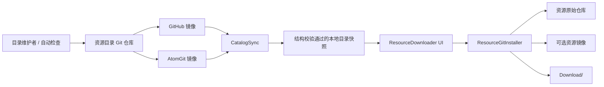

# ResourceDownloader Git 直连同步设计

## 1. 结论

建议取消“源 Git 仓库 → Dora 资源服务器 → ZIP → 客户端”的资源中转链路，改成：

1. 建立一个独立的 **Dora 资源目录仓库**，只维护经过审核的资源元数据、固定版本、源地址、镜像地址和预览图。
2. 目录仓库使用完全相同的 Git 历史同步到 GitHub 和 AtomGit。客户端内置这两个引导地址，优先复用上次成功的地址，失败时自动切换。
3. 客户端通过引擎现有的 `Git.run` 同步目录仓库，并直接从资源的原始 Git 仓库或镜像克隆资源。
4. 每个可安装版本必须锁定完整的 40 位 commit。客户端不能把一个会移动的默认分支当作版本；首次安装完成后，仓库及其中的本地修改交由用户通过 Git 工具自行同步和维护。
5. 目录仓库是发现和审核入口，不是新的资源文件中转站。资源仓库失效时，应显式标记不可用或增加经过审核的 Git 镜像，而不是悄悄回退到旧 ZIP。

目录仓库本身可以直接 clone/pull；具体资源由下载器按固定 commit 完成首次浅克隆并保留 `.git`。下载器不再更新已安装工作树，后续 pull、分支、合并和本地修改都属于用户自己的 Git 工作流。

## 2. 当前实现和数据基线

### 2.1 改造前下载链路

改造前的 `Assets/Script/Tools/ResourceDownloader.ts` 依赖固定 HTTP 服务 `http://39.155.148.157:8866`：

- `/api/v1/package-list-version`：全局清单版本号。
- `/api/v1/packages`：资源 URL、服务端 ZIP、大小、tag、commit 和更新时间。
- `/assets/repos.json`：中英文标题、描述、分类、入口和预览图策略。
- `/assets/<name>/banner.jpg`：资源预览图。
- `/zips/<file>`：服务端从 Git 仓库同步并重新打包的资源归档。

客户端发现全局版本变化后会删除整个 `.cache/preview`，重新获取所有元数据和预览图。安装资源时先下载 ZIP，再删除同名目标目录并解压到 `Download/<name>`。解压后的目录不包含 Git 历史，因而不能增量更新，也无法判断本地文件是否被用户修改。

### 2.2 2026-07-27 本地缓存快照

检查目录：

`/Users/Jin/Library/Application Support/IppClub/DoraSSR/.cache/preview`

得到以下基线：

| 项目 | 结果 |
| --- | ---: |
| 资源数 | 74 |
| 服务端 ZIP 标称总大小 | 6,827,875,205 bytes，约 6.36 GiB |
| 单个 ZIP 大小范围 | 1,279 bytes 至 574,254,615 bytes |
| GitCode 源 | 44 |
| AtomGit 源 | 29 |
| GitHub 源 | 1 |
| 完整 40 位 commit | 74/74 |
| 有 tag 的资源 | 1/74 |
| 多版本资源 | 0 |
| 独立预览图 | 46 |
| 使用引擎默认 banner | 28 |
| 元数据缺项、孤立项、重名或重复 URL | 0 |

三个托管平台的代表性检查说明 AtomGit 和 GitCode URL 可以被 Git 直接访问，并会重定向到 `.git` 地址。唯一的 GitHub 资源地址在检查时已返回 `Repository not found`。这证明目录设计必须允许资源进入 `unavailable` 状态，也必须允许为同一固定 commit 配置多个来源。

### 2.3 引擎已有能力

引擎已经提供异步 `Git.run(repoPath, command, callback, optionsJSON)`，不是调用系统 Git。现有能力包括：

- `clone`、`ls-remote`、`fetch`、`pull`、`checkout`、`reset`、`status` 和 `log`。
- 浅克隆和浅 fetch。
- Git LFS 自动下载与工作树展开。
- 进度、错误、取消和超时处理。
- HTTPS basic/token 认证；本方案第一阶段只收录无需认证的公开资源。

因此不需要引入外部 Git 可执行文件或新 Git 库。改造在下载器上方增加受限的资源安装层，统一执行来源选择、commit 校验、Git 树安全校验、临时目录安装和失败回滚；安装完成后不再接管仓库。

## 3. 目标与非目标

### 3.1 目标

- 去掉日常的资源 ZIP 构建、存储和分发服务器。
- 让资源作者发布到原始开源仓库后，通过目录仓库审核即可进入资源工具。
- 国内外网络环境都能取得可用的资源目录。
- 每次安装可复现到目录记录的确切 commit。
- 保留完整 Git 仓库，使用户后续可自行使用 Git 增量同步、分支和维护。
- 允许用户自由修改已下载项目，目录刷新和下载器重开都不能改写这些项目。
- 目录或某个资源暂时不可访问时，保留上一次可用目录和已安装资源。
- 保留当前中英文展示、分类、预览图、入口选择、测试和删除体验。

### 3.2 非目标

- 不把目录仓库做成包注册中心或资源二进制 CDN。
- 不承诺任意 Git 仓库都能直接运行；目录中的资源仍需审核。
- 第一阶段不支持私有仓库和用户凭据。
- 第一阶段不自动初始化或递归更新 submodule。
- 不通过下载器 pull、reset、checkout 或改写任何已经安装到 `Download` 的 Git 项目。
- 不把默认分支的最新 HEAD 直接等同于一个已发布版本。

## 4. 总体架构



建议拆成三个职责明确的模块：

- `CatalogSync`：只负责目录仓库的引导、同步、结构校验和本地快照。
- `ResourceCatalog`：解析 schema，向 UI 提供资源、版本、来源和兼容性信息。
- `ResourceGitInstaller`：只接受目录产生的结构化参数，负责首次 clone、commit 校验、进度、取消、临时目录安装和状态落盘。

`ResourceDownloader.ts` 只负责 UI 状态和用户操作，不再拼接任意网络 URL，也不直接决定 Git 命令。

## 5. 资源目录仓库

### 5.1 推荐目录结构

```text
Dora-Catalog/
├── README.md
├── schema/
│   └── resource-v1.schema.json
└── projects/
    ├── dora-demo/
    │   ├── resource.json
    │   └── banner.jpg
    └── ...
```

维护时每个资源使用一个独立目录，里面直接放 `resource.json` 和可选的 `banner.jpg`。客户端同步仓库后按目录名排序扫描 `projects/*/resource.json`，不依赖汇总清单、资源链接生成器或仓库脚本。

预览图适合留在目录仓库中：

- 它是目录展示资产，不一定属于原始游戏仓库。
- 当前总缓存只有约 2.8 MiB，不值得再建立图片服务。
- 图片可以随元数据 PR 一起审核和版本化。
- 同目录没有 `banner.jpg` 时，客户端使用引擎默认图片。

### 5.2 仓库级规则

- 项目目录名必须与其中 `resource.json` 的 `id` 完全一致。
- 每个目录必须有且只有一个 `resource.json`；`banner.jpg` 可选。
- `schemaVersion` 放在每个项目 JSON 中，未知主版本的项目不能加载，但不应阻止其它兼容项目显示。
- 项目 ID 全局唯一；同一 commit 的多个 Git 来源写在对应版本的 `sources` 中。
- 首版不维护根级聚合 JSON。目录仓库当前 Git commit 就是整份目录的版本身份。
- 最后一次成功解析的仓库 commit 作为缓存身份；新目录下载或结构校验失败时继续使用旧快照。

### 5.3 资源条目

```json
{
  "$schema": "../../schema/resource-v1.schema.json",
  "schemaVersion": 1,
  "id": "dora-demo",
  "status": "active",
  "title": {
    "zh-Hans": "Dora 演示",
    "en": "Dora Demo"
  },
  "description": {
    "zh-Hans": "……",
    "en": "..."
  },
  "categories": ["Dora"],
  "tags": ["minigame"],
  "license": {
    "status": "confirmed",
    "spdx": "MIT",
    "file": "LICENSE"
  },
  "runnable": true,
  "entrypoints": [
    {"name": "AI Fighter", "path": "AI Fighter/init"}
  ],
  "versions": [
    {
      "name": "2026.07",
      "commit": "0123456789abcdef0123456789abcdef01234567",
      "publishedAt": "2026-07-27T00:00:00Z",
      "sources": [
        {
          "role": "upstream",
          "url": "https://github.com/example/dora-demo.git"
        },
        {
          "role": "mirror",
          "url": "https://atomgit.com/example/dora-demo.git"
        }
      ]
    }
  ]
}
```

约束如下：

- `id` 一经发布不可改名，只允许 `[A-Za-z0-9._-]`，并直接作为安装目录名。
- `$schema` 固定指向仓库内 `schema/resource-v1.schema.json`；`schemaVersion` 首版为 `1`。
- `status` 至少支持 `active`、`deprecated`、`unavailable` 和 `blocked`。
- `commit` 必须是 40 位小写十六进制；短 hash 不能写入项目 JSON。
- `tag` 可选；需要保留非默认 HEAD 的历史版本时必须提供指向该 commit 的不可变 tag。
- `sources` 按角色和维护者建议排序；多个来源必须能提供同一个 commit。
- `tags` 是可选的机器识别标签；Mini 游戏固定使用 `minigame`，供客户端与高品质作品分组展示。
- `entrypoints` 是相对路径，不能包含空项、绝对路径或 `..`。
- `license.status` 是必填项，首版支持 `pending` 和 `confirmed`。社区资源可以先以 `pending` 收录，再联系作者补充许可证；确认后填写 SPDX 和许可证文件。UI 必须如实显示“许可待完善”，不能把公开仓库自动标成某种许可证。
- `unavailable` 资源仍保留历史元数据，已安装用户仍可打开；新安装按钮禁用并解释原因。
- `blocked` 用于恶意内容、许可证撤回或严重安全问题；默认同时禁用安装和“测试”。

为兼容当前行为，`entrypoints` 空数组表示默认运行根目录 `init`，显式 `runnable: false` 可替代当前 `exe: false`。默认 banner 使用目录仓库中的统一图片，不再以缺少远程图片作为隐式规则。

### 5.4 版本规则

当前数据虽然记录了 commit，但 74 个资源都只有一个版本、仅 1 个有 tag。迁移后应采用以下规则：

- 目录中的每一个版本都是不可变的 `commit` 快照。
- tag 是展示和维护辅助信息，不是安全边界；tag 移动不能改变已发布版本。
- 资源作者更新默认分支不会立刻改变用户可安装内容。
- 自动检查可以发现新的 HEAD 并创建目录 PR，但只有目录 PR 合并后才发布。
- 删除旧版本需要显式的目录变更；已安装状态仍保存 commit，不因目录删除而失去身份。

## 6. 双镜像目录同步

### 6.1 引导地址

客户端随引擎版本内置两个 HTTPS 地址，例如：

```ts
const CatalogRemotes = [
  "https://github.com/ippclub/Dora-Catalog.git",
  "https://gitcode.com/ippclub/Dora-Catalog.git",
];
```

两个平台的默认组织名均为 `ippclub`，但它们只是引擎提供的默认引导地址，不是信任边界。
`CatalogSyncOptions.remotes` 可以传入其它目录仓库地址，后续 UI 可以直接暴露该设置；自定义源
与默认源采用完全相同的下载和结构校验流程。

### 6.2 选择策略

1. 当前语言以 `zh` 开头时优先尝试 AtomGit/GitCode，其它语言优先尝试 GitHub。
2. 失败、超时或目标 commit 不可用时尝试另一个地址。
3. 缓存同时记录当次首选地址和实际成功地址；TTL 内继续使用该结果，避免首选地址临时不可用时每次启动都重试。
4. 多个地址内容不同时按用户配置的顺序采用第一个能成功 clone 且通过 schema/文件结构校验的目录，不通过内置组织名、公钥或 Git 历史判断来源身份。
5. 所有地址都失败时，不清空 UI，继续展示最后一次成功解析的目录。

语言只决定首选顺序，不会锁死托管平台；任一首选镜像不可用时仍自动回退到另一个镜像。

### 6.3 同步和缓存

- 首次打开：克隆目录仓库到 `.cache/resource-catalog/repo`。
- 再次打开：若距离上次成功检查不足 6 小时，先立即显示本地快照，再在需要时手动刷新。
- 刷新：把优先源克隆到隔离的 `candidate`，确认 clone 返回的 HEAD，并完成 schema、目录结构和字段校验后再采用；失败时尝试下一个源。
- 校验成功：原子替换 `.cache/resource-catalog/repo`，记录实际 commit、源地址和同步时间，然后刷新 UI。
- 下载或结构校验失败：保留旧 snapshot，记录错误，不删除预览图和旧清单。
- 手动“刷新”绕过 TTL，但使用相同的 clone 和内容结构校验。

目录仓库没有用户文件，允许对它执行受控 pull。资源仓库不同，不能复用这一策略。

### 6.4 目录校验边界

目录仓库是可替换的数据源，不由引擎判断其发布者身份。客户端不内置 Dora-Catalog 公钥，
不要求 commit 签名，不限制组织名，也不要求新 HEAD 是旧缓存的后继。目录同步只确认：

- Git clone 成功并返回完整 HEAD commit；
- `projects` 目录、`resource.json` 和可选 banner 满足大小与路径限制；
- schema、字段类型、项目 ID、版本 commit 和来源 URL 能被当前客户端安全解析；
- 候选目录完整通过后再原子替换缓存，失败时保留旧缓存。

这些检查证明客户端取得了一份完整、可解析的目录，但不为目录维护者或资源内容背书。
来源选择权属于默认配置或用户配置。SelfUpdater 的签名发布链路是另一套独立安全边界，
不因资源目录解耦而移除。

## 7. 资源安装与维护权交接

### 7.1 安装状态

每个由新下载器管理的资源在 `.dora/resource-state.json` 保存：

```json
{
  "schemaVersion": 1,
  "resourceId": "dora-demo",
  "version": "2026.07",
  "commit": "0123456789abcdef0123456789abcdef01234567",
  "source": "https://atomgit.com/example/dora-demo.git",
  "catalogCommit": "89abcdef0123456789abcdef0123456789abcdef",
  "installedAt": "2026-07-27T00:00:00Z"
}
```

现有 `.dora/repo.json` 和 `.dora/banner.jpg` 在迁移期继续写入，避免其它入口失效。`resource-state.json` 只记录下载器首次安装时的来源和基线 commit，不代表用户后续维护后的当前 HEAD，也不能作为下载器改写仓库的授权。

### 7.2 首次安装

1. 校验资源状态、目标目录和来源 URL。
2. 按来源顺序浅克隆到 `Content.writablePath/.download/<id>-<operation-id>`，不直接写最终目录。
3. 从 Git clone 结果读取实际 HEAD，必须与目录 commit 完全一致；不一致时清理候选并尝试下一来源。
4. 通过 `verify-resource <commit>` 检查 commit 树，拒绝 submodule、`.gitmodules` 和任意 symlink。
5. 检查目录声明的入口文件确实存在。
6. 写入 `.dora/resource-state.json`、兼容的 `.dora/repo.json` 和预览图。
7. 目标目录不存在时，以 `Content.move` 原子移入 `Download/<id>`。
8. 任一步骤失败或取消都只清理本次临时目录，不触碰现有安装。

有 `tag` 时浅克隆该 tag；没有 tag 时浅克隆来源的默认分支。实际 HEAD 必须等于目录固定 commit。默认分支已经前进时不能接受新的 HEAD，应更新目录版本，或由维护者为历史 commit 建立不可变 tag。目录 CI 应在发布前实际执行一次与客户端相同的浅克隆测试。

### 7.3 安装后的 Git 维护

首次安装成功即完成下载器职责：

- 保留正常的 `.git`、当前 remote 和工作分支，不把资源导出成无历史目录。
- 用户可以自由修改、提交、建分支、pull、fetch、merge、改 remote 或保持离线。
- 下载器后续打开、刷新目录或发现新目录版本时，不对已安装仓库执行 `status` 之外的 Git 写操作。
- UI 可以提示“目录中已有较新版本”，并提供仓库地址、目标 commit、打开 Git 面板或打开项目的入口，但不能代替用户更新。
- 如果用户希望重新取得目录规定的全新版本，应先明确删除原安装，再重新安装；删除仍只针对精确目录并要求确认。
- 不是 Git 仓库的既有 ZIP 安装继续视为旧版安装，不就地转换，也不伪造 `.git`。

这样不会禁止本地修改，也不需要下载器设计 stash、冲突处理或 dirty worktree 策略。后续同步产生的冲突和版本选择由用户在正常 Git 工作流中处理。

### 7.4 来源切换

首次安装时，来源是传输位置，commit 才是资源身份：

- 每次切换来源都完成独立浅克隆并核对 HEAD。
- 镜像没有目标 commit、ref 指向不同 commit 或 LFS 对象不完整时立即清理候选并回退。
- 成功安装后记录实际来源，供展示和故障诊断使用；下载器不自动改写已安装仓库的 remote。
- 目录 CI 定期检查所有 active 版本至少有一个可用来源。
- 上游失效时，由维护者定期检查并更新主目录仓库中的状态或来源信息；新增镜像仍需验证为目录记录的同一 commit。

## 8. 安全边界

直接从 Git 下载省掉了自有服务器，但不会自动让内容更安全。需要明确以下边界：

- 目录只接受 HTTPS Git URL；拒绝 `file://`、SSH、本地路径和带内嵌凭据的 URL。
- 目录 CI 和客户端都校验 `id`、相对路径、commit、schema 和字段大小。
- clone 永远先进入专用临时目录，目标路径由资源 id 生成，不能由 URL 或仓库内容控制。
- v1 不递归 submodule。发现 `.gitmodules` 时默认提示并拒绝，除非以后设计独立的 submodule allowlist。
- 拒绝指向工作树外的 symlink；测试入口不能穿过 symlink 逃逸安装根目录。
- Git hooks 不执行；资源仓库中的脚本只有用户点击“测试”后才由 Dora 运行。
- UI 在卡片中显示来源、许可证状态和首次安装的固定 commit；首次运行第三方代码的二次提示可作为后续安全增强。
- `blocked` 资源即使已缓存也默认禁止从下载器启动，但不静默删除用户文件。
- 限制单个目录 JSON、banner 尺寸、资源数量和并发 Git 任务，防止目录造成内存或磁盘耗尽。
- 下载前展示预计大小；运行中检查磁盘错误并确保失败清理只针对本次临时目录。

## 9. UI 调整

保留当前卡片、分类和筛选结构，调整以下语义：

- “服务器”输入框改成只读的“资源目录来源”，显示当前为 GitHub、AtomGit 或离线缓存。
- “同步时间”拆成“目录版本”和“资源版本/commit”。
- “文件大小”改成“预计安装大小”；没有可靠数据时显示“未知”，不能展示旧 ZIP 大小。
- 按钮状态使用“安装”“已安装”“目录有新版本”“上游不可用”；“目录有新版本”只提示用户通过 Git 自行维护。
- 版本下拉框以版本名为主，短 commit 为辅。
- 详情 tooltip 展示 upstream、当前传输来源、许可证状态、commit 和兼容性。
- Git 操作进度按 `连接 → 获取对象 → 展开 LFS → 校验 → 安装` 展示。
- 取消只取消当前 Git job 并清理临时目录。
- 刷新目录失败时在顶部显示非阻断提示，同时继续展示离线缓存。

## 10. 目录维护流程

### 10.1 收录

1. 贡献者修改 `projects/<id>/resource.json`，并按需提交同目录 `banner.jpg`。
2. CI 执行 schema、唯一性、许可证状态、URL、入口路径和图片限制检查；`pending` 许可证允许收录，但必须生成待联系事项。
3. CI 对每个来源执行 `ls-remote`，验证固定 commit。
4. CI 用客户端等价参数完成浅克隆，并验证 HEAD、LFS、submodule 和 symlink 策略。
5. 审核者确认中英文描述、分类、运行入口和第三方内容许可。
6. 合并并验证后，把同一 commit 推送到 GitHub/AtomGit 默认镜像；自定义源可以采用自己的发布流程。

### 10.2 日常健康检查

定时任务只提出问题或 PR，不直接改变已发布 commit：

- active 来源是否可访问，固定 commit 是否仍可取得。
- GitHub 和 AtomGit 目录镜像 HEAD 是否一致。
- LFS 对象是否完整。
- 默认分支是否出现新 commit；如有则创建候选更新 PR。
- pending 许可证是否已联系作者、是否可以补充 SPDX/许可证文件。
- 入口文件和最低引擎版本是否仍满足要求。
- 长期不可用资源是否应转为 `unavailable`。

官方维护的两个默认镜像仍建议由同一发布流程推送同一 commit，避免不同地区看到不同目录；
这是目录维护策略，不是客户端内置的来源校验。任一镜像推送失败时发布状态应标为部分成功并重试。

## 11. 迁移计划

### 阶段 0：数据清理与建库（已完成）

- 把现有 `packages.json` 和 `repos.json` 合并转换为 resource v1 文件。
- 当前目录包含 73 个资源、39 张独立 banner；没有 banner 的 Mini Game 由客户端使用引擎默认图。
- 34 个 Mini Game 都保留原有 `6-1-game`、`3h-gamejam` 等分类，并额外标记 `minigame`。
- 所有版本都锁定完整 commit；暂未明确许可证的资源标为 `pending`。
- 已删除确认失效的项目。
- 已建立 GitHub 和 AtomGit/GitCode 默认镜像；周期健康检查仍待落地。

### 阶段 1：目录 Git 化和资源预览（已实现）

- 实现 `CatalogSync`、schema/目录结构校验和可回退缓存。
- UI 从新目录读取元数据和 banner。
- 资源安装只走 Git，不再保留 HTTP ZIP 兼容入口。
- 记录失败阶段和来源，不记录用户项目内容。

### 阶段 2：直接 Git 功能预览（macOS 已实现和验证）

- 实现临时 clone、commit 校验、LFS、取消和 `.dora/resource-state.json`。
- 安装完成后把仓库维护权交给用户，下载器不再更新已有工作树。
- 对现有 ZIP 安装显示“旧版安装”：允许继续运行，用户明确删除后可重新安装 Git 版本；不自动删除、覆盖或伪造 `.git`。
- 完成 Windows、macOS、Linux 和 Android 的真实资源安装测试。

### 阶段 3：可替换目录源和旧服务退役

- 目录来源已与引擎解耦，不内置 catalog 公钥或历史限制；同步接口支持替换源列表。
- 直接 Git 安装已成为资源下载器的默认通道。
- 至少经历两个稳定引擎版本或明确的兼容窗口。
- 确认 active 资源健康检查、双镜像一致性和 LFS 路径稳定。
- 停止生成新 ZIP，保留一段只读兼容期。
- 最后移除客户端旧 HTTP 配置和服务端资源中转。

## 12. 测试矩阵

### 12.1 目录

- GitHub 可达、AtomGit 不可达；反向情况。
- 两个默认镜像 HEAD 一致、短暂落后或内容分叉。
- 首次启动离线；已有可用缓存后离线。
- schema 版本过新、JSON 损坏、目录缺项，以及自定义源切换。
- banner 缺失、超限或路径逃逸。

### 12.2 资源

- 普通小仓库、大仓库、Git LFS 仓库。
- upstream 可达、仅 mirror 可达、所有来源失效。
- 默认 HEAD 或指定 tag 等于固定 commit，以及默认 HEAD 已超过固定 commit。
- clone 取消、超时、磁盘满、LFS 缺对象。
- 目标目录已存在、临时目录残留、安装完成前崩溃。
- 安装后出现 tracked 修改、untracked 文件、detached HEAD、用户分支或 remote 修改时，目录刷新均不得改写仓库。
- submodule、内部 symlink、越界 symlink、入口缺失。
- 安装后 `UpdateEntries`、默认入口、多入口、不可运行资源和删除流程。

### 12.3 验收标准

- 正式安装完成时的 HEAD 必须等于目录中的 40 位 commit；用户后续 Git 操作可以使 HEAD 合法偏离该基线。
- 任一失败路径都不能删除既有安装或最后一次可用目录缓存。
- 无论是否存在本地修改，下载器都不对已安装资源执行 Git 写操作。
- 多个目录源内容分歧时按用户配置顺序采用第一个通过内容校验的来源。
- 仅有一个可用资源来源时仍能完成安装。
- 旧版 ZIP 项目可继续运行，并且不会被自动转换或覆盖。
- 服务端 ZIP 停止生成后，新客户端仍能完成目录发现和安装；安装后的仓库可由用户通过 Git 正常同步。

## 13. 已确认的产品决策

1. GitHub 和 AtomGit 的目录仓库组织名均为 `ippclub`。
2. 社区资源首版不以明确 SPDX 许可证作为收录前提。未明确的资源标记为 `pending`，收录后联系作者继续完善。
3. 本地修改不受下载器限制。首次安装后由用户自行通过 Git 完成同步、分支和维护，下载器不处理已有工作树的更新或冲突。
4. 维护者定期检查失效上游，并通过更新主目录仓库中的资源状态、源地址或同 commit 镜像进行维护。
5. 目录来源不绑定组织名、固定地址或签名公钥；正式切换只阻断于 clone 完整、schema/目录结构校验和资源 commit 校验。

## 14. 推荐实施边界

首个可交付版本应限定为：

- 新目录仓库及自动生成/校验工具。
- 默认 GitHub/AtomGit 引导、可替换源列表和可回退缓存。
- active 资源的浅克隆、固定 commit 校验、LFS、取消与临时目录安装。
- 旧安装识别、安装后仓库所有权交接和首次安装来源故障切换。
- 当前 UI 信息完整迁移。

不要在同一版本中加入私有仓库凭据、自动合并、submodule 或后台自动更新资源。已有仓库的后续维护直接使用现有 Git 工具，不再扩展下载器职责。

## 15. 当前落地状态与验收记录

### 15.1 代码边界

- `ResourceCatalog.ts`：v1 JSON 严格解析、字段和路径限制、分类/搜索、作品与 Mini Game 分组、分页。
- `ResourceGit.ts`：`Git.run` 的 Promise、进度、取消和超时封装。
- `CatalogSync.ts`：默认 GitHub/GitCode 自动回退、可替换源列表、6 小时 TTL、候选目录结构校验和原子替换。
- `ResourceGitInstaller.ts`：首次浅克隆、固定 HEAD 校验、Git 树安全检查、入口检查、来源回退、元数据和原子安装。
- `ResourceDownloader.ts`：目录状态、筛选、分页、按页异步预览、最多 36 个不同图片的 LRU、安装/运行/删除交互。
- Wa `gitjobs`：资源路径只保留 `verify-resource`，检查固定 commit 的树结构；catalog 不再有签名验证命令或内置 key。

目录解析限制最多 5000 个项目、单个 JSON 256 KiB，并限制文本、数组和 URL 等字段长度。UI 只为当前页加载图片；同一个默认 banner 在缓存中只保留一份，项目增多不会线性常驻全部纹理。

### 15.2 2026-07-28 验收

- Go：`go test ./internal/gitjobs` 通过；资源路径覆盖普通资源树和 symlink 拒绝，签名测试只服务于独立的 SelfUpdater 发布链路。
- Dora TypeScript：五个工具模块和两个测试模块均由实际 Web IDE 构建服务编译成功。
- Dora 运行时：`ResourceCatalogTest` 通过 17 项断言，验证真实 Dora-Catalog 为 73 项、34 个 Mini Game、39 张独立 banner，且没有 schema 问题。
- Dora Git 后端：内置 Git 的初始化、提交、clone HEAD 和安全树校验可用；catalog 不再要求签名。
- 界面：实际 macOS 引擎中验证作品 39 项、Mini Games 34 项、全部 73 项、搜索、响应式列数、分页、异步预览和默认 banner。
- 默认目录：GitHub 与 AtomGit/GitCode 可提供相同目录内容；引擎从空缓存完成真实远端同步，手动刷新使用相同的结构校验。
- 安装：从 AtomGit 通过内置 Git 安装 `GrowlR-NNG`，HEAD 精确等于目录 commit `dc880696681735f7b6ac5625115a9852a9945e0f`，保留 `.git` 并写入两份 `.dora` 元数据；其中 `resource-state.json` 记录签名目录 commit，随后从下载器成功启动该 Mini Game。
- 删除：中文确认弹窗会明确警告本地 Git commit 和修改也将删除；测试安装已移入废纸篓，未触碰用户已有项目。
- 正式状态：缓存记录目录 commit、实际源地址和同步时间；界面不再展示签名者或暗示来源背书。

### 15.3 来源解耦状态

catalog 签名发布阻断已取消。引擎不保存 Dora-Catalog 公钥，不执行 `verify-catalog`，也不把
默认 GitHub/AtomGit 地址当作受信来源。默认镜像继续方便开箱即用；未来用户设置只需把
自定义地址传给 `CatalogSyncOptions.remotes`，无需重新构建引擎或配置新的 key。
