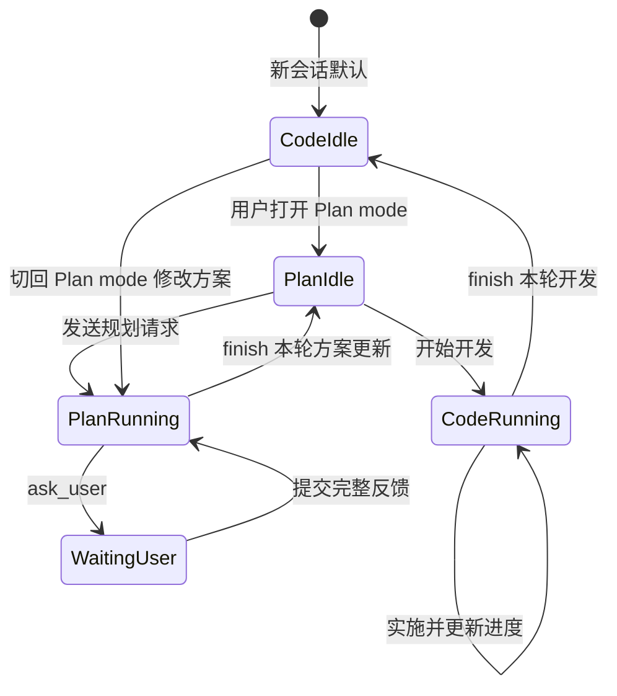

# Web IDE CodingAgent Plan Mode 设计

## 1. 背景

当前 Dora Web IDE 的 CodingAgent 已经具备多轮会话、工具调用、文件读写、Dora API 搜索、构建与运行验证、checkpoint、上下文压缩和子 Agent 等能力。现有 Agent 默认面向直接开发：理解用户请求后，可以搜索项目、修改源码、构建、运行并完成任务。

复杂开发任务在直接实施前通常还需要一个独立的规划阶段，用来：

- 阅读当前工程并确认现状，而不是仅根据用户描述猜测架构。
- 与用户确认需求范围、产品偏好和关键技术取舍。
- 把讨论结果沉淀为可持续维护的开发方案。
- 将方案拆成可执行、可验证、可跟踪的开发步骤。
- 在后续 Coding mode 实施期间持续更新进度和验证证据。

本设计为 CodingAgent 增加默认关闭的 Plan mode，并增加 `ask_user` 调查问卷工具。Plan mode 不另建一套 Agent，而是在现有 CodingAgent 执行链路中增加工作模式、工具能力投影、规划提示词、等待用户状态以及对应的 Web IDE UI。

本设计是 [web-ide-coding-agent.md](./web-ide-coding-agent.md) 的增量设计。未特别说明的会话、任务、step、checkpoint 和消息持久化机制继续复用现有实现。

## 2. 目标

### 2.1 用户目标

- 用户可以在主 Agent 会话中显式打开或关闭 Plan mode。
- Plan mode 默认关闭，新会话仍保持现有 Coding mode 行为。
- Plan mode 先调查工程，再与用户沟通并形成可确认的开发方案。
- Agent 可以通过结构化问卷快速收集单选、多选和自由填写信息。
- 问卷出现后接管普通 prompt 输入区，用户完成反馈前不能继续对话。
- 方案确认后可以切回 Coding mode，按方案实施并持续维护开发进度。

### 2.2 技术目标

- 复用 `CodingAgent.ts`、`AgentToolRegistry.ts`、`AgentSession.ts` 和现有 tool-calling/XML 双决策模式。
- 工具限制由服务端强制，不依赖前端隐藏按钮或客户端传入 disabled 列表。
- `ask_user` 不在内存中阻塞一次 `runCodingAgent()`，等待状态可以跨页面刷新和引擎重启恢复。
- 方案文档是独立、稳定、可读的事实源，不与自动压缩生成的 `MEMORY.md`、`PROJECT_MEMORY.md`、`SESSION_SUMMARY.md` 混用。
- Plan mode 的文档编辑不触发无意义的项目构建。
- 后续 Coding mode 的源码修改、构建结果和进度文档保持一致。

## 3. 非目标

首版不包含：

- 在 Plan mode 中执行构建、命令、网络下载或运行项目。
- 在 Plan mode 中启动或查询子 Agent。
- 允许 Plan mode 修改任意源码或资源文件。
- 在一个问卷 Schema 内实现条件表达式和复杂题目跳转。
- 多人同时填写同一份问卷。
- 为整份方案引入审批、冻结或单向生命周期状态。
- 将 Plan mode 实现为独立的 PlanningAgent 或复制一套执行循环。

## 4. 核心概念

现有 `AgentDecisionMode` 表示 LLM 如何输出决策：

```ts
type AgentDecisionMode = "tool_calling" | "xml";
```

新增的 `AgentWorkMode` 表示 Agent 当前工作的目的和权限：

```ts
type AgentWorkMode = "code" | "plan";
```

两者互相正交：

| Work mode | Decision mode | 含义 |
| --- | --- | --- |
| `code` | `tool_calling` | 使用原生 function calling 实施开发 |
| `code` | `xml` | 使用 XML 决策格式实施开发 |
| `plan` | `tool_calling` | 使用原生 function calling 调查并编写方案 |
| `plan` | `xml` | 使用 XML 决策格式调查并编写方案 |

`AgentWorkMode` 是会话级用户偏好，但每个 task 启动时必须取得一个不可变快照。task 运行期间不允许切换模式，避免同一个 LLM 调用前后看到不同的工具集合。

## 5. 总体工作流



关键规则：

- 方案是持续修订的活文档，不设置整份方案的审批或生命周期状态。
- Plan mode 和 Coding mode 可以在 task 空闲时反复切换，不要求方案先进入某个状态。
- `finish` 只结束当前一轮 Plan 或 Coding task，不冻结方案，也不改变方案的整体状态。
- `ask_user` 发布问卷后，当前 Agent task 结束主动运行并进入 `WAITING_USER`。
- 用户提交问卷后启动新的 Plan task，继续使用同一个活动方案和会话历史。
- 切换到 Coding mode 不删除或重建方案文档；再次切回 Plan mode 时继续修改同一份方案。

## 6. 工具权限模型

### 6.1 工具矩阵

| 工具 | Coding mode | Plan mode | 说明 |
| --- | --- | --- | --- |
| `read_file` | 允许 | 允许 | Plan mode 可读取整个 workspace 和 Dora 文档路径 |
| `edit_file` | 允许 | 受限允许 | Plan mode 只能写登记的规划文档 |
| `delete_file` | 允许 | 受限允许 | Plan mode 只能删除可删除的辅助规划文档 |
| `grep_files` | 允许 | 允许 | 用于调查当前实现 |
| `search_dora_api` | 允许 | 允许 | 用于确认 Dora API 和教程约束 |
| `glob_files` | 允许 | 允许 | 用于发现文件和工程结构 |
| `ask_user` | 不暴露 | 允许 | 发布结构化调查问卷 |
| `finish` | 允许 | 允许 | Code mode 完成开发；Plan mode提交方案供审阅 |
| `build` | 允许 | 不暴露 | Plan mode 不执行构建 |
| `fetch_url` | 按用户开关 | 不暴露 | Plan mode 首版不写入下载资源 |
| `execute_command` | 按用户开关 | 不暴露 | Plan mode 不运行 Lua、Git 或项目入口 |
| `list_sub_agents` | 主 Agent 允许 | 不暴露 | Plan mode 首版不委派 |
| `spawn_sub_agent` | 主 Agent 允许 | 不暴露 | Plan mode 首版不委派 |

Plan mode 最终暴露的工具集合必须严格为：

```text
read_file
edit_file
delete_file
grep_files
search_dora_api
glob_files
ask_user
finish
```

### 6.2 Registry 扩展

`AgentToolRegistry.ts` 中为工具增加工作模式声明：

```ts
interface ToolPrompt {
  name: string;
  roles: AgentRole[];
  workModes: AgentWorkMode[];
  // existing fields...
}
```

最终可用工具通过以下条件共同计算：

```text
角色允许
AND 工作模式允许
AND 未被当前 task 的 capability 开关禁用
AND 服务端运行环境具备该能力
```

同一结果必须用于：

- system prompt 中的工具说明。
- tool-calling 请求中的工具 Schema。
- XML repair prompt 中的工具引用。
- 决策解析后的允许性校验。
- 工具真正执行前的最终校验。
- Skills 加载和工具依赖过滤。

前端传入的 `disabledAgentTools` 只能进一步关闭工具，不能为 Plan mode 重新打开 `build`、`execute_command` 等能力。

### 6.3 Plan mode 写路径限制

仅限制工具名称不足以保证“只规划不实施”，因为不受限的 `edit_file` 仍然可以修改源码。因此 Plan mode 将写入范围固定到项目级规划目录：

```ts
const AGENT_PLAN_DIR = ".agent/plan";
const AGENT_PLAN_FILE = ".agent/plan/PLAN.md";
const AGENT_PROGRESS_FILE = ".agent/plan/PROGRESS.md";
```

规则：

- Plan mode 的 `edit_file` 和 `delete_file` 只能操作 `.agent/plan/**`。
- `PLAN.md` 和 `PROGRESS.md` 是固定主文件，首次进入 Plan mode 时自动创建。
- Agent 可以按需要在该目录增加辅助调查、比较或迁移记录文件，不需要为每个文件维护数据库白名单。
- Plan mode 对 `.agent/plan` 之外的写入在执行前被拒绝，目标文件保持不变。
- 路径解析继续拒绝绝对路径和 `..`，不能通过路径穿越离开规划目录。
- `.agent/plan/**` 的修改属于规划记录，不触发项目重新构建，也不使已有构建结果失效。

路径保护必须在统一的执行入口检查，不能只依赖 tool prompt。tool-calling、XML、批量工具和截断恢复路径都必须经过相同策略。

新增独立的 `isAgentPlanPath()`，不要复用或扩大现有 `.agent/main/**` Memory 路径判断。Memory 和规划文档虽然都位于 `.agent`，但生命周期和维护职责不同。

不为 `.agent/plan` 增加 main/sub Agent 写入角色禁令或额外文件锁。通常由 main Agent 维护；如果用户意图或子任务明确要求子 Agent 更新方案，也允许其通过现有 `edit_file`、精确文本匹配和 checkpoint 机制修改。是否更新方案由任务意图决定，不由角色硬编码决定。

## 7. 固定方案和进度文档

### 7.1 文件定位

方案和进度固定保存为：

```text
.agent/
└── plan/
    ├── PLAN.md
    └── PROGRESS.md
```

这些文件属于整个项目，而不是某个 session 或 task。后续问卷回答、方案调整、Coding mode 实施和子 Agent 的明确更新都使用同一组固定文件。无需创建 plan ID、活动方案路径或 session 方案 metadata。

### 7.2 PLAN.md 模板

```markdown
# 开发方案标题

更新时间：2026-07-20 10:00 +08:00

## 目标

## 背景与当前实现

## 范围

### 包含

### 不包含

## 已确认决策

## 待确认问题

无

## 技术方案

## 实施步骤

| ID | 工作项 | 依赖 | 验收条件 |
| --- | --- | --- | --- |
| P1 | ... | — | ... |

## 风险与回退方案

## 验证计划

## 变更记录
```

`PLAN.md` 负责目标、范围、决策、技术设计、步骤、风险和验证要求，不承担整份方案的生命周期状态。

### 7.3 PROGRESS.md 模板

```markdown
# 开发进度

更新时间：2026-07-20 10:00 +08:00

## 当前工作

## 步骤进度

| ID | 状态 | 最新结果 | 下一步 |
| --- | --- | --- | --- |
| P1 | pending | — | ... |

## 修改记录

## 验证证据

## 阻塞问题

## 进度日志
```

`PROGRESS.md` 负责步骤状态、实际修改、构建/运行/手工验证证据、阻塞问题和下一步。进度项通过稳定步骤 ID 引用 `PLAN.md`，避免在两个文件中重复完整方案内容。为兼顾可读性，ID 单元格既可写纯 ID（如 `S1`），也可写“ID + 简短工作项”（如 `S1 旋转动画`）；一致性校验取首个 token `S1` 与方案步骤关联。

### 7.4 方案修订和步骤进度

整份方案不记录 `draft`、`approved`、`in_progress`、`completed` 等状态。用户可以在开发的任何阶段切回 Plan mode 修改方案，因此整体状态既不能表达真实工作流，也会产生文档与数据库之间的同步负担。

方案只记录：

- `updated_at` 或文件修改时间。
- 技术决策、待确认问题和变更记录。
- `PLAN.md` 中稳定的步骤 ID。
- `PROGRESS.md` 中每个实施步骤的局部进度和验证证据。

步骤状态仍然有意义，因为它描述具体工作项，而不是限制整份方案的生命周期：

```text
pending
in_progress
done
blocked
skipped
```

方案发生变化时，Agent 必须同步评估 `PROGRESS.md` 中受影响的步骤。原本为 `done` 或 `in_progress` 的步骤可以重新标记为 `pending`、增加返工步骤，或在变更记录中说明为什么无需返工。文件修改时间和变更记录用于判断方案是否发生过变化，不额外维护一份 session 内的方案状态缓存。

### 7.5 Plan mode 的 finish 条件

Plan mode 调用 `finish` 前必须满足：

- `.agent/plan/PLAN.md` 和 `.agent/plan/PROGRESS.md` 均存在。
- 两个固定主文件不能通过 `delete_file` 删除；需要重构内容时使用精确编辑或完整重写。
- 当前 task 已更新两个固定文档；首次规划时必须创建并初始化两个文件。
- 目标、范围、技术方案、实施步骤和验证计划不是空章节。
- 每个实施步骤都有稳定 ID 和验收条件。
- `PROGRESS.md` 能通过步骤 ID 对应当前方案，且记录明确的下一步。
- 必须由用户决定的问题已经回答；否则使用 `ask_user`。
- 最终消息包含固定方案目录、主要决策和仍存在的非阻塞风险。

如果不满足，运行时拒绝 `finish` 并给出精确的缺失项，而不是让模型仅靠提示词自律。

## 8. ask_user 工具协议

### 8.1 工具目的

`ask_user` 用于收集无法从源码、项目文件或 Dora 文档中自行确认的信息，例如：

- 产品范围和优先级。
- 多个合理架构之间的偏好。
- 兼容性、交互和视觉取舍。
- 是否接受迁移成本或破坏性变更。
- 用户自定义的约束和补充说明。

Agent 不应询问可以通过 `read_file`、`grep_files`、`glob_files` 或 `search_dora_api` 得到的事实。

### 8.2 参数 Schema

```ts
interface AskUserParams {
  title: string;
  description?: string;
  questions: AskUserQuestion[];
}

interface AskUserQuestion {
  id: string;
  prompt: string;
  description?: string;
  type: "single_choice" | "multiple_choice" | "text";
  required?: boolean;
  options?: AskUserOption[];
  allowOther?: boolean;
  placeholder?: string;
  minSelections?: number;
  maxSelections?: number;
}

interface AskUserOption {
  id: string;
  label: string;
  description?: string;
  recommended?: boolean;
}
```

### 8.3 Schema 校验

- 每份问卷包含 1 到 8 个问题。
- 每个问题的 `id` 在问卷内唯一且稳定。
- `single_choice` 和 `multiple_choice` 包含 2 到 8 个选项。
- 同一问题内的 option ID 唯一。
- `text` 不允许包含 `options`、`minSelections` 或 `maxSelections`。
- `single_choice` 最多选择一个选项。
- `multiple_choice` 的最小/最大选择数必须合法。
- `single_choice` 最多一个选项标记为 `recommended`。
- `multiple_choice` 可以标记一组推荐选项，但数量不能超过 `maxSelections`；这组标记表达建议勾选集合。
- 标题、问题、选项说明和用户文本都有明确长度限制。
- UTF-8 文本裁剪必须按字符边界进行；服务端不能使用会把中文末尾拆成字节片段的字符串裁剪实现。
- 所有展示内容按纯文本或受限 Markdown 渲染，禁止注入任意 HTML。

首版不增加条件表达式。需要根据回答继续追问时，Agent 在下一 Plan task 发布第二份问卷。

### 8.4 回答数据

```ts
interface QuestionnaireAnswer {
  questionId: string;
  status: "answered" | "skipped";
  selectedOptionIds?: string[];
  otherText?: string;
  text?: string;
}

interface QuestionnaireSubmission {
  questionnaireId: number;
  answers: QuestionnaireAnswer[];
  submittedAt: number;
}
```

`skipped` 是显式回答状态，不能与没有提交或数据丢失混淆。

### 8.5 调用约束

- `ask_user` 是终止型动作，不能和其他 tool call 混在同一批次。
- 一个会话同时只能存在一份待回答问卷。
- `ask_user` 不设置文档更新前置条件；收到反馈后，在 `finish` 前把已确认信息和决定写入活动方案与进度文档。
- `ask_user` 成功表示问卷已持久化并展示，不表示用户已经回答。
- 发布成功后当前 task 进入 `WAITING_USER`，不得继续生成下一步工具调用。

## 9. 等待用户的运行模型

### 9.1 不阻塞 runCodingAgent

`ask_user` 不应在一次 `runCodingAgent()` 内等待 Promise 直到用户操作。长时间保留运行栈会导致：

- 页面刷新或 WebSocket 重连后状态难以恢复。
- 引擎重启后等待上下文丢失。
- stop token 和超时语义不清晰。
- Agent task 长时间占据运行状态。

正确流程：

1. Agent 生成合法的 `ask_user` 调用。
2. 服务端持久化问卷。
3. 当前 ask_user step 标记为完成，结果为 `status: waiting_user`。
4. 当前 task 和 session 进入 `WAITING_USER`。
5. 释放本次 Agent 执行栈和 active stop token。
6. 用户提交完整反馈。
7. 服务端把回答写入会话历史并创建新的 Plan task。
8. 新 task 自动继续活动方案。

### 9.2 状态扩展

```ts
type AgentTaskStatus =
  | "RUNNING"
  | "WAITING_USER"
  | "DONE"
  | "FAILED"
  | "STOPPED";
```

`CodingAgentRunResult` 建议改为可判别结果：

```ts
type CodingAgentRunResult =
  | { state: "completed"; success: true; message: string; /* ... */ }
  | { state: "waiting_user"; success: true; questionnaireId: number; /* ... */ }
  | { state: "failed"; success: false; message: string; /* ... */ };
```

等待用户不是任务成功完成，也不是失败。上层不能把它转成普通 assistant 完成消息。

### 9.3 对话历史

问卷发布后，应保存完整的 assistant tool call 和一个立即返回的工具结果：

```json
{
  "success": true,
  "status": "waiting_user",
  "questionnaireId": 42
}
```

这样历史中不存在缺失 tool result 的半截 tool call。用户提交后，新 Plan task 向模型加入可读摘要和结构化数据：

```text
用户已回答问卷「输入方案确认」：

- 目标平台：macOS、Windows
- 输入方式：键盘、手柄
- 补充要求：手柄断开时自动切换键盘

<questionnaire_answers>
{"questionnaireId":42,"answers":[...]}
</questionnaire_answers>
```

结构化 JSON 用于避免自然语言摘要丢失 option ID、自定义填写或跳过状态。

## 10. 问卷临时文件与 API

### 10.1 临时文件

问卷只承载当前一次阻塞交互，不属于需要长期查询的会话历史，因此不写入数据库。每个项目只保留一个固定临时文件：

```text
.agent/questionnaire/pending.json
```

文件包含 `id`（即 `questionnaireId`）、`sessionId`、`taskId`、`step`、`createdAt` 和已校验的 Schema。发布时先写同目录临时文件再原子移动为 `pending.json`；如果目标已存在，拒绝发布第二份问卷。

用户提交后，服务端先校验 `questionnaireId + sessionId` 和答案，再消费并删除该文件，随后启动新的 Plan task。若新 task 创建失败则恢复原文件。这样同一项目最多存在一份待答问卷，重复点击无法启动多个后续 task。

最终答案不另存为问卷记录，而是转换为结构化的用户反馈消息，进入正常会话历史和模型上下文。正常完成后 `.agent/questionnaire` 目录可以为空；异常退出留下的 `pending.json` 用于页面刷新或引擎重启后的交互恢复。

`AgentSessionStep` 对 `ask_user` 只记录工具名、等待结果和临时文件标识，不把完整 Schema 复制到 `params_json` 或 `result_json`，避免问卷结构以旁路形式长期留在数据库。

### 10.2 接口

新增：

```text
POST /agent/session/questionnaire/respond
```

请求：

```ts
interface QuestionnaireRespondRequest {
  sessionId: number;
  questionnaireId: number;
  answers: QuestionnaireAnswer[];
}
```

返回新 task ID：

```ts
type QuestionnaireRespondResponse =
  | { success: true; sessionId: number; taskId: number }
  | { success: false; message: string };
```

现有 session detail、task status 和 WebSocket patch 增加：

```ts
pendingQuestionnaire?: AgentQuestionnaire;
```

### 10.3 强制输入门禁

会话存在 `PENDING` 问卷时：

- `/agent/session/send` 拒绝普通 prompt。
- `/agent/session/resend` 拒绝重新发送历史 prompt。
- Plan/Coding mode 开关不可切换。
- “继续任务”操作不可用。
- 只接受问卷提交或明确的“关闭问卷”操作。

普通 prompt 不能作为自由文本回答绕过问卷。自由填写必须通过问卷中的 `text` 问题或 `allowOther` 选项提交。

## 11. 问卷 UI

### 11.1 Composer 接管

问卷不是消息列表中的普通卡片，也不是可关闭后继续输入的弹窗。当 `pendingQuestionnaire` 存在时，`AgentPanel` 使用问卷组件完整替换底部 `AgentComposer`：

```tsx
{pendingQuestionnaire ? (
  <AgentQuestionnaireComposer
    questionnaire={pendingQuestionnaire}
    onSubmit={submitQuestionnaire}
  />
) : (
  <AgentComposer {...composerProps} />
)}
```

问卷期间隐藏或禁用：

- 普通 prompt 文本框。
- 发送按钮。
- Plan mode 开关。
- 网络下载开关。
- 命令执行开关。
- “继续任务”按钮。

问卷出现前尚未发送的本地 prompt 草稿应保留，但不可见、不可提交；问卷完成后恢复。

### 11.2 视觉结构

问卷参考逐题卡片式交互：

```text
┌──────────────────────────────────────────┐
│ 1/3 个问题                        ━ ─ ─  │
│                                          │
│ 你希望采用哪一种输入架构？               │
│ 选择一个答案                             │
│                                          │
│ ◉ 统一 InputManager（推荐）              │
│   说明、影响和适用场景……                 │
│                                          │
│ ○ 分散事件监听                           │
│   说明、影响和适用场景……                 │
│                                          │
│ ○ 输入自己的答案                         │
│   [ 文本输入区域…… ]                     │
├──────────────────────────────────────────┤
│ [关闭问卷]              跳过     下一步  │
└──────────────────────────────────────────┘
```

布局要求：

- 顶部显示当前题号、总题数和进度指示。
- 每次只显示一个问题，减少一次呈现过多决策的负担。
- 单选使用 radio，多选使用 checkbox。
- 整个选项卡可点击，不要求用户精确点击控件。
- 选项包含标题、可选说明和可选“推荐”标记。
- 选中项使用当前 Web IDE 主题色背景和边框。
- `allowOther=true` 时显示“输入自己的答案”，选中后在卡片内展开文本框。
- 第二题开始显示“上一步”，返回时保留已有答案。
- 最后一题的主按钮改为“提交反馈”。
- “关闭问卷”使用与其它交互一致的低强调描边按钮，不使用红色危险操作样式。
- 问卷内容过长时滚动问卷内部，不挤压上方消息历史。
- 提交期间锁定所有选项和按钮，避免重复提交。

### 11.3 跳过规则

- `required=true`：不显示“跳过”，当前回答合法前“下一步”不可用。
- `required=false`：显示“跳过”，点击后记录 `status: skipped` 并进入下一题。
- 跳过是有效的显式反馈，不等同于关闭问卷。
- 不能通过普通折叠或点击卡片外部绕过问卷；只有明确点击“关闭问卷”并确认后才能恢复普通 Composer。
- 如果支持折叠，只能缩为“等待你完成 N 个问题”的状态条；普通输入区仍不可用。

“关闭问卷”需要二次确认。它丢弃未提交的问卷草稿、删除临时问卷并停止当前等待回答的 Agent task，但不关闭 Plan 模式，也不删除或回退方案文档。只有用户主动关闭 Plan 模式并切回 Coding mode，才表示结束当前规划交互。

### 11.4 前端组件

建议新增：

```text
Tools/dora-dora/src/AgentQuestionnaireComposer.tsx
Tools/dora-dora/src/AgentQuestionnaireQuestion.tsx
Tools/dora-dora/src/AgentQuestionnaireOption.tsx
```

组件职责：

- `AgentQuestionnaireComposer`：题目分页、草稿答案、校验、导航和提交。
- `AgentQuestionnaireQuestion`：按题型渲染控件和错误提示。
- `AgentQuestionnaireOption`：统一选项卡、推荐标记、自定义输入展开。

问卷草稿可以保存在 React state，并按 `questionnaireId` 缓存到 `sessionStorage`，用于页面意外刷新后的输入恢复。已发布的问卷 Schema 以服务端 `.agent/questionnaire/pending.json` 为准；最终回答进入后续用户消息，不保留独立问卷档案。

问卷提交后的用户消息采用内容与展示分离：`content` 保留发送给 Agent 的完整反馈 prompt 和结构化回答；消息记录额外保存仅含问题文本与所选选项标签/填写文本的 `displayContent`。消息卡片优先渲染 `displayContent`，不显示内部引导语、选项 ID 或 `<questionnaire_answers>` 数据，同时不持久化完整问卷 Schema。

## 12. Plan mode UI

### 12.1 开关位置

模式切换使用独立接口立即持久化：

```text
POST /agent/session/mode
{ "sessionId": 123, "workMode": "plan" }
```

在 `AgentComposer` 顶部工具按钮区域增加 Plan mode 开关：

- 新主会话默认关闭。
- 用户切换时立即通过 session mode API 写入 `AgentSession.work_mode`，不等到下一次发送 prompt。
- 页面刷新、程序重启或重新进入会话时，从 `AgentSession.work_mode` 恢复开关；退出发生在 Plan 交互中途时仍保持 Plan mode。
- 仅主 Agent 显示。
- Plan mode 下继续显示主/子 Agent 视图切换、Context token 用量和 Plan mode 开关；只隐藏不可用的网络获取与命令执行开关。
- task 运行中不可切换。
- `WAITING_USER` 时不可切换。
- 开启后显示明确的 `PLAN` 状态标识和提示文本。
- Plan mode 中隐藏网络下载和命令执行按钮，但保留用户原有 Code mode 设置，退出 Plan mode 后恢复。

### 12.2 发送行为

当前 Web IDE 在 Agent 开始工作前会停止正在运行的 Dora 项目。Plan mode 只调查文件并维护规划文档，不需要停止当前项目运行。因此：

- Coding mode 沿用现有停止项目逻辑。
- Plan mode 发送 prompt 或提交问卷时跳过 `stopProjectRunBeforeAgent()`。

### 12.3 方案操作

Plan task 完成并产生总结后，在总结卡片末尾显示与其它总结交互一致的按钮：

- “开始开发”：切换到 Coding mode，并启动新的实施 task。

该按钮只在 Plan mode 的总结卡片中出现，不在 Composer 上方增加独立操作栏。方案文件通过总结中已有的修改文件链接打开，不额外提供“打开方案”按钮。用户在 Coding mode 中需要调整方案时，直接点亮 Composer 的 Plan mode 开关；模式立即持久化，随后输入调整要求并继续维护同一份方案。

## 13. Plan mode 提示词

新增 `planAgentRolePrompt`，主要约束：

1. 先调查，后提问。能够从项目或 Dora 文档确认的信息不得询问用户。
2. 只对需求、偏好、取舍和外部约束使用 `ask_user`。
3. 不实施开发，不修改源码、资源、构建配置或测试。
4. `.agent/plan/PLAN.md` 和 `.agent/plan/PROGRESS.md` 是规划事实源；重要发现、决定和进度必须写入对应文件。
5. `ask_user` 不设置文档更新前置条件；问卷反馈需在 `finish` 前合并到方案和进度文档。
6. 问卷选项应互斥、具体、描述影响，并只在确有依据时标记推荐项；单选最多推荐一项，多选允许推荐不超过 `maxSelections` 的建议集合。
7. 方案必须包含范围、非目标、实施步骤、风险、回退和验证方法。
8. 验收条件必须区分源码实现、构建或类型检查、进程存活、自动化行为、人工交互和视觉检查；一类证据不能替代另一类证据。
9. 步骤只有在实施完成且其全部验收条件都有直接证据时才可标记为 `done`；构建成功或入口持续运行不能单独证明未触发的输入、状态转换、胜负流程、持久化、时序或视觉行为。
10. 缺少验证的步骤保持 `pending` 或 `in_progress`，在 `PROGRESS.md` 明确记录尚未验证的条件和下一项验证动作。
11. 必要问题未解决时使用 `ask_user`，不能用 `finish` 掩盖。
12. `finish` 仅表示本轮方案更新完成，不冻结方案，也不妨碍用户稍后再次修改。

`PLAN.md` 的“待确认问题”使用显式 Markdown checkbox，不从自然语言猜测状态：

```md
## 待确认问题

- [ ] 仍需用户确认的问题
- [x] 已确认的问题：结论
```

`finish` 只阻止明确的 `- [ ]` 项，并在错误中返回具体问题文本。所有问题解决后，可以全部标记为 `- [x]`，也可以把整个章节替换为 `无`。普通说明文字、`已定` 等自然语言不再被误判为未解决问题。

### 13.1 历史压缩与 Skills

- 压缩生成的 Active Checkpoint 如果建议了当前模式不可用的工具，必须丢弃该 next-tool 建议。
- 固定方案路径不需要写入压缩摘要或 session metadata；Agent 在相关 task 开始时直接读取 `.agent/plan/PLAN.md` 和 `.agent/plan/PROGRESS.md`。
- SkillsLoader 接收 `workMode` 和最终工具集合；依赖构建或命令执行的 Skill 在 Plan mode 不应声称这些能力可用。
- 自动维护的 Memory 文件不能覆盖活动方案文档。

## 14. 从方案到实施

### 14.1 开始开发

用户选择“开始开发”后：

1. 会话工作模式切换为 `code`。
2. 创建新的 Coding task。
3. CodingAgent 首先读取 `.agent/plan/PLAN.md` 和 `.agent/plan/PROGRESS.md` 的最新内容。
4. 按稳定步骤 ID 实施，不重新发明另一套方案。

如果用户之后切回 Plan mode 修改方案，当前运行中的 Coding task 应先停止或完成。再次进入 Coding mode 时创建新 task，并重新读取最新方案，不依赖上一次 task 缓存的方案内容。

### 14.2 开发进度维护

Coding mode 有活动方案时增加运行状态：

```ts
interface ActivePlanProgressState {
  planProgressPending: boolean;
}
```

规则：

- 修改非方案文件后设置 `planProgressPending=true`。
- 得到新的构建、运行或手工验证结果后设置 `planProgressPending=true`。
- 成功更新 `.agent/plan/PROGRESS.md` 中的步骤状态、证据和进度记录后清除。
- `planProgressPending=true` 时拒绝 Coding mode 的 `finish`。
- `.agent/plan/**` 文档更新本身不使已经通过的项目构建失效。

实施步骤状态：

```text
pending
in_progress
done
blocked
skipped
```

每次进度更新至少记录：

- 受影响的步骤 ID。
- 修改的文件或模块。
- 已执行的验证和结果。
- 已知问题或阻塞原因。
- 下一步工作。

## 15. 会话和数据库迁移

建议为 session 增加当前偏好，为 task 保存不可变快照：

```text
AgentSession.work_mode
AgentTask.work_mode
```

方案文件路径固定，不在 session 中保存方案 ID、路径、白名单或状态 metadata。UI 需要展示是否有更新时，直接读取固定文件的修改时间或内容摘要；Coding task 每次开始时重新读取两个文件。这样手工编辑方案文件或中途切回 Plan mode 都不会产生数据库状态与文档状态不一致的问题。

数据库变更必须使用 `ALTER TABLE` 和 `CREATE TABLE IF NOT EXISTS` 的增量迁移。当前 `AgentSession` 在 schema version 不匹配时会删除并重建会话表，不能为了 Plan mode 简单提升版本号而丢失已有会话历史。应先把新增列改为幂等 `ensure...Column()`，或先完善数据库迁移框架。

问卷不增加数据库表。若开发过程中的旧版本已经创建过 `AgentQuestionnaire` 实验表，升级时可直接删除该临时表；它不应被视为会话历史来源。

## 16. 错误、恢复和边界行为

### 16.1 页面刷新或重连

- session detail 返回 `pendingQuestionnaire`。
- UI 立即恢复问卷 Composer，不短暂显示可发送的普通输入框；问卷接管期间 Composer 顶部的主/子 Agent 视图、Context token 用量和模式开关也隐藏。
- 当前题号和未提交草稿从 `sessionStorage` 恢复。
- 已提交问卷不再显示，即使客户端重复收到旧 patch。

### 16.2 重复提交

- 提交以 `questionnaireId + sessionId + pending.json 仍存在` 为消费条件。
- 第一次提交通过校验后删除 `pending.json`；后续请求找不到同一待答问卷。
- 重复提交返回已处理结果，不创建第二个 task。

### 16.3 Agent 生成非法问卷

- Schema 校验失败时作为普通工具失败返回给 Agent。
- 不进入 `WAITING_USER`。
- 不向用户展示半成品问卷。
- Agent 可以在当前 task 的下一步修复参数。

### 16.4 用户关闭问卷

- 明确关闭时删除 `pending.json`，把等待 task 结束为 `STOPPED`，不保留问卷状态记录。
- 当前 Plan task 标记为 `STOPPED` 或专门的取消状态。
- session 持久化的 `workMode` 保持 `plan`，恢复普通 Composer 后仍处于 Plan 模式。
- “结束规划”不由关闭问卷表达；用户主动关闭 Plan 模式并切回 Coding mode 才结束规划交互。
- `.agent/plan` 中已有文档保持当前内容，不删除，也不写入额外的整体状态。
- 恢复 Composer，但不自动启动 Coding task。

### 16.5 模式切换竞争

- task 为 `RUNNING` 或 `WAITING_USER` 时，服务端拒绝模式切换。
- 模式切换和 task 创建由服务端顺序处理。
- task 始终使用创建时保存的 `work_mode`，不读取运行中变化的 UI state。

## 17. 主要代码接入点

### Agent 后端

- `Assets/Script/Lib/Agent/AgentToolRegistry.ts`
  - 增加 `AgentWorkMode`、`ask_user`、work mode 工具过滤。
- `Assets/Script/Lib/Agent/CodingAgent.ts`
  - 增加 work mode、Plan prompt、写路径保护、ask_user 终止语义、finish 校验和活动方案进度状态。
- `Assets/Script/Lib/Agent/AgentRuntimePolicy.ts`
  - 放置 `.agent/plan/**` 写路径、方案更新和 finish 前置条件等可测试策略。
- `Assets/Script/Lib/Agent/AgentSession.ts`
  - 持久化模式、问卷、`WAITING_USER` 和回答续接；不保存方案路径或状态。
- `Assets/Script/Lib/Agent/Tools.ts`
  - 扩展 task status/work mode 数据，保持 checkpoint 行为不变。
- `Assets/Script/Lib/Agent/Memory.ts`
  - 增加 Plan 角色提示词，不把固定方案文件混入 Memory 自动维护。
- `Assets/Script/Lib/Agent/AgentSkills.ts`
  - 按最终工具投影过滤依赖不可用工具的 Skill。
- `Assets/Script/Dev/WebServer.yue`
  - 增加模式切换、问卷提交和问卷终止接口。

### Web IDE 前端

- `Tools/dora-dora/src/Service.ts`
  - 增加 mode、pending questionnaire、respond/cancel API 和活动方案类型。
- `Tools/dora-dora/src/AgentPanel.tsx`
  - 管理 Plan mode、问卷门禁、方案操作以及 Plan mode 不停止项目的行为。
- `Tools/dora-dora/src/AgentComposer.tsx`
  - 增加 Plan mode 开关入口。
- `Tools/dora-dora/src/AgentQuestionnaire.tsx`
  - 新增接管式问卷 Composer，负责逐题渲染、校验、草稿、跳过、提交和终止。
- `Tools/dora-dora/src/i18n.ts`
  - 增加 Plan mode、问卷、校验、等待和方案操作文案。

## 18. 实施阶段

### 阶段 A：模式和权限基础

- 增加 `AgentWorkMode`。
- Registry 按 mode 生成工具说明和 Schema。
- 服务端执行前强制工具白名单。
- 增加 Plan mode 写路径策略。
- 覆盖 tool-calling/XML 和批处理路径测试。

### 阶段 B：方案文档与修订

- 创建固定 `.agent/plan/PLAN.md`、`.agent/plan/PROGRESS.md` 和默认模板。
- 增加 Plan role prompt。
- 增加 Plan finish 完整性校验。
- 增加 `isAgentPlanPath()`，并让规划文档更新不触发项目构建。

### 阶段 C：ask_user 和等待状态

- 注册 `ask_user` 工具。
- 增加问卷 Schema 校验和 `.agent/questionnaire/pending.json` 临时文件。
- 增加 `WAITING_USER` 状态和事件。
- 增加提交接口、一次性文件消费和新 Plan task 续接。
- 阻止普通 prompt 绕过待回答问卷。

### 阶段 D：Web IDE UI

- 增加 Plan mode 开关和状态标识。
- 实现问卷接管式 Composer。
- 实现逐题导航、选择、自定义填写、跳过和校验。
- 实现刷新恢复和重复提交保护。
- Plan mode 发送时不停止正在运行的项目。

### 阶段 E：模式往返与进度跟踪

- 在 Plan 总结卡片末尾增加“开始开发”，方案通过总结中的修改文件链接打开。
- Coding mode 通过 Composer 的 Plan mode 开关重新进入方案调整。
- Coding mode 注入活动方案。
- 增加 `planProgressPending` 和 finish 门禁。
- 持续更新步骤状态、验证证据和下一步。

## 19. 验收标准

### 19.1 权限

- 新会话默认处于 Coding mode。
- Plan mode Schema 中只出现规定的八个工具。
- 即使客户端伪造请求，Plan mode 也不能执行 build、command、fetch 或 sub-agent 工具。
- Plan mode 无法通过 edit/delete 修改 `.agent/plan/**` 之外的源码或资源路径。
- tool-calling 和 XML 模式行为一致。

### 19.2 问卷

- `ask_user` 成功后 session 进入 `WAITING_USER`。
- 普通 Composer 被问卷完全替换。
- 必答题未完成时不能进入下一题或提交。
- 非必答题可以显式跳过。
- 单选、多选、文本和自定义回答均能正确保存。
- 页面刷新和 WebSocket 重连后恢复同一问卷。
- 引擎重启后从 `.agent/questionnaire/pending.json` 恢复同一问卷。
- 普通 send/resend API 不能绕过待回答问卷。
- 重复点击提交只启动一个后续 Plan task。
- 关闭问卷会丢弃未提交草稿并恢复普通 Composer，但 session 仍保持 Plan 模式。

### 19.3 方案

- Plan mode 在 finish 前生成并更新固定的 `PLAN.md` 和 `PROGRESS.md`。
- `ask_user` 是中间信息采集动作，不设置文档更新门禁；Agent 可以先提问，收到反馈后再更新方案。每个 Plan task 在调用 `finish` 前必须实际更新两个固定文档；即使方案范围不变，也在变更记录和进度日志中留下本轮复核记录。
- 必要决策未解决时 finish 被拒绝。
- 整份方案不保存审批或生命周期状态。
- 用户可以在开发前、开发中和开发后随时切回 Plan mode 更新同一份方案。
- 用户可以按当前方案进入 Coding mode，不需要先执行批准操作。

### 19.4 进度

- 开始开发后，CodingAgent 首先读取固定方案和进度文件的最新内容。
- 方案中途修改后，新 Coding task 不沿用旧 task 缓存的方案内容。
- 源码修改和新验证结果会要求更新方案进度。
- 未同步进度时 Coding mode 不能 finish。
- 只更新 `.agent/plan/**` 不会使已通过的构建失效。

### 19.5 兼容性

- Plan mode 关闭时现有 CodingAgent 行为不变。
- 现有 session、checkpoint、回滚、上下文压缩和子 Agent 行为不回归。
- 数据库升级不删除已有 Agent 会话。

## 20. 已确认设计决策

- Plan mode 默认关闭，只在主 Agent 中开放。
- Plan mode 与 tool-calling/XML 决策格式正交。
- Plan mode 只暴露指定的文件调查、规划写入、问卷和完成工具。
- Plan mode 的 edit/delete 只允许操作固定的 `.agent/plan/**` 规划目录，不能借此实施源码修改。
- 固定主文件为 `.agent/plan/PLAN.md` 和 `.agent/plan/PROGRESS.md`，不保存 plan ID、活动路径或方案状态 metadata。
- 不按 main/sub Agent 角色硬限制 `.agent/plan` 写入；子 Agent 在任务意图明确时可以使用现有编辑和 checkpoint 机制更新。
- `ask_user` 使用 `.agent/questionnaire/pending.json` 临时持久化，并让 task 非阻塞地等待用户。
- 问卷完成后删除临时文件，回答进入正常会话上下文，不在数据库长期保存问卷结构或答案。
- 问卷逐题展示并完整接管 prompt 输入区。
- 用户完成反馈前不能发送普通 prompt、切换模式或继续 Agent。
- 自由填写通过问卷题型完成，不允许绕过问卷直接对话。
- 整份方案不设置 `draft`、`approved`、`in_progress`、`completed` 等状态。
- 用户可以随时在 Plan mode 与 Coding mode 之间往返；每个 task 仍使用启动时的模式快照。
- Coding mode 按当前方案开发，并继续维护同一文档中的步骤进度和验证证据。
