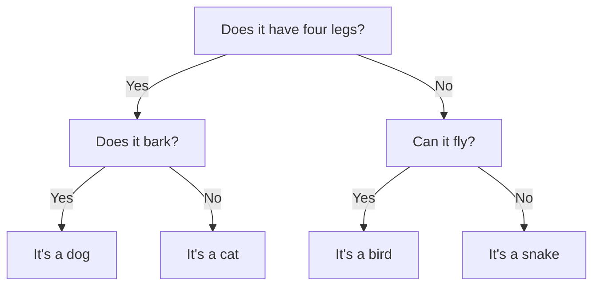
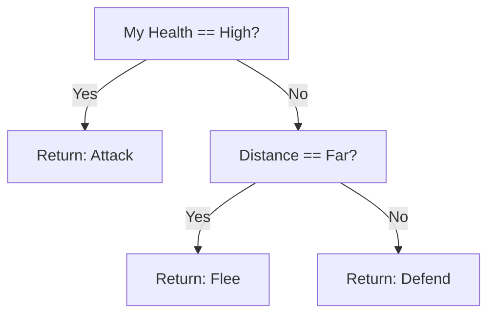

import Tabs from '@theme/Tabs';
import TabItem from '@theme/TabItem';

# Intelligent Game AI with Decision Trees

## 1. Introduction

In game development, **Artificial Intelligence (AI)** plays a crucial role. This tutorial will introduce how to use the **C4.5 decision tree** algorithm provided by the Dora SSR engine to create intelligent game AI. We will learn this process step by step through a simple example.

### 1.1 What is a Decision Tree?

A decision tree is a structure similar to a flowchart that assists in decision-making. Imagine we are playing a game of "guess the animal":



This is a simple example of a decision tree. In game AI, we can use a similar structure to make intelligent decisions.

## 2. Preparation

First, we need to prepare training data. Suppose we are developing a simple fighting game AI that needs to decide when to **attack**, **defend**, or **flee**.

### 2.1 Preparing Training Data (CSV Format)

The format of the training data is described as follows:

- **First line**: Contains the names of all features, such as "Distance," "Enemy Health," etc.
- **Second line**: Defines the data types of each feature, where:
	- `C` represents **Categorical** data, like "Near," "Far," etc., which are discrete values.
	- `N` represents **Numerical** data, like specific health values.
- **From the third line onwards**: Actual training data, with each line representing a training sample.
- **Last column**: The decision result, which is the action the AI should take. This is the target value the decision tree will learn to predict, which can be a classification or numerical value.

```csv
Distance,Enemy Health,My Health,Action
C,C,C,C
Near,High,High,Attack
Near,Low,High,Attack
Far,High,Low,Flee
Medium,Medium,Low,Defend
Far,Low,High,Attack
```

## 3. Basic Code Implementation

Let's train and generate a decision tree with this training data to implement a simple combat AI:

<Tabs groupId="language-select">
<TabItem value="lua" label="Lua">

```lua
local thread <const> = require("thread")
local ML <const> = require("ML")

-- Prepare training data
local trainingData = [[
Distance,Enemy Health,My Health,Action
C,C,C,C
Near,High,High,Attack
Near,Low,High,Attack
Far,High,Low,Flee
Medium,Medium,Low,Defend
Far,Low,High,Attack
]]

-- Build decision tree
function buildDecisionTreeAsync()
	local trainingResult = {}

	-- Set maximum depth to 3
	local accuracy, err = ML.BuildDecisionTreeAsync(trainingData, 3, function(depth, name, op, value)
		-- Add indentation based on depth
		local line = string.rep("\t", depth + 1)

		-- Handle leaf nodes (result nodes)
		if op == "return" then
			line = line .. 'return "' .. value .. '"'
		else
			-- Construct conditional statements
			local valueStr = (op == '==' and '"' .. value .. '"' or value)
			line = line .. "if " .. name .. " " .. op .. " " .. valueStr
		end
		table.insert(trainingResult, line)
	end)

	if err then
		print("Error building decision tree:", err)
		return
	end

	print("Decision tree accuracy:", accuracy)
	print("Decision tree structure:\n" .. table.concat(trainingResult, "\n"))

	return trainingResult
end

-- Test asynchronous decision tree construction with the following code
thread(buildDecisionTreeAsync)
```

</TabItem>
<TabItem value="tl" label="Teal">

```tl
local thread <const> = require("thread")
local ML <const> = require("ML")

-- Prepare training data
local trainingData = [[
Distance,Enemy Health,My Health,Action
C,C,C,C
Near,High,High,Attack
Near,Low,High,Attack
Far,High,Low,Flee
Medium,Medium,Low,Defend
Far,Low,High,Attack
]]

-- Build decision tree
local function buildDecisionTreeAsync(): {string}
	local trainingResult: {string} = {}

	-- Set maximum depth to 3
	local accuracy, err = ML.BuildDecisionTreeAsync(trainingData, 3, function(depth: integer, name: string, op: ML.Operator, value: string)
		-- Add indentation based on depth
		local line = string.rep("\t", depth + 1)

		-- Handle leaf nodes (result nodes)
		if op == "return" then
			line = line .. 'return "' .. value .. '"'
		else
			-- Construct conditional statements
			local valueStr = (op == '==' and '"' .. value .. '"' or value)
			line = line .. "if " .. name .. " " .. op .. " " .. valueStr
		end
		table.insert(trainingResult, line)
	end)

	if err then
		print("Error building decision tree:", err)
		return
	end

	print("Decision tree accuracy:", accuracy)
	print("Decision tree structure:\n" .. table.concat(trainingResult, "\n"))

	return trainingResult
end

-- Test asynchronous decision tree construction with the following code
thread(buildDecisionTreeAsync)
```

</TabItem>
<TabItem value="ts" label="TypeScript">

```ts
import { ML, thread } from "Dora";

// Prepare training data
const trainingData = `
Distance,Enemy Health,My Health,Action
C,C,C,C
Near,High,High,Attack
Near,Low,High,Attack
Far,High,Low,Flee
Medium,Medium,Low,Defend
Far,Low,High,Attack
`;

// Build decision tree
const buildDecisionTreeAsync = () => {
	const trainingResult: string[] = [];

	// Set maximum depth to 3
	const [accuracy, err] = ML.BuildDecisionTreeAsync(trainingData, 3, (depth, name, op, value) => {
		// Add indentation based on depth
		let line = "\t".repeat(depth + 1);

		// Handle leaf nodes (result nodes)
		if (op === "return") {
			line += `return "${value}"`;
		} else {
			// Construct conditional statements
			const valueStr = (op === "==" ? `"${value}"` : value);
			line += `if ${name} ${op} ${valueStr}`;
		}
		trainingResult.push(line);
	});

	if (err) {
		print("Error building decision tree:", err);
		return trainingResult;
	}

	print("Decision tree accuracy:", accuracy);
	print("Decision tree structure:\n" + trainingResult.join("\n"));

	return trainingResult;
};

// Test asynchronous decision tree construction with the following code
thread(buildDecisionTreeAsync);
```

</TabItem>
<TabItem value="yue" label="YueScript">

```yue
_ENV = Dora

-- Prepare training data
trainingData = [[
Distance,Enemy Health,My Health,Action
C,C,C,C
Near,High,High,Attack
Near,Low,High,Attack
Far,High,Low,Flee
Medium,Medium,Low,Defend
Far,Low,High,Attack
]]

-- Build decision tree
buildDecisionTreeAsync = ->
	trainingResult = []

	-- Set maximum depth to 3
	accuracy, err = ML.BuildDecisionTreeAsync trainingData, 3, (depth, name, op, value) ->
		-- Add indentation based on depth
		line = string.rep "\t", depth + 1

		-- Handle leaf nodes (result nodes)
		if op == "return"
			line ..= "return \"#{value}\""
		else
			-- Construct conditional statements
			valueStr = (op == "==" and "\"#{value}\"" or value)
			line ..= "if #{name} #{op} #{valueStr}"

		table.insert trainingResult, line

	if err
		print "Error building decision tree: #{err}"
		return

	print "Decision tree accuracy: #{accuracy}"
	print "Decision tree structure:\n" .. table.concat trainingResult, "\n"

	trainingResult

-- Test asynchronous decision tree construction with the following code
thread buildDecisionTreeAsync
```

</TabItem>
</Tabs>

### 3.1 Visualizing the Generated Decision Tree

The structure of the generated decision tree is as follows:



## 4. Using in the Game

Below is a simple follow-up example demonstrating how to apply this AI decision tree in a game character:

<Tabs groupId="language-select">
<TabItem value="lua" label="Lua">

```lua
local yue <const> = require("yue")
local Vec2 <const> = require("Vec2")

thread(function()
	-- Build decision tree
	local trainingResult = buildDecisionTreeAsync()

	-- Load decision tree as a YueScript function
	local decisionFunction = yue.loadstring(
		"(data)->\n" ..
		"\t:Distance, :Enemy Health, :My Health = data\n" ..
		table.concat(trainingResult, "\n")
	)()

	-- Define Character class
	local Character = {}
	function Character:new()
		local char = {
			position = Vec2.zero,
			health = 100,
			maxHealth = 100
		}
		setmetatable(char, {__index = Character})
		return char
	end

	-- Return state based on health percentage
	function Character:getHealthState()
		local healthPercent = self.health / self.maxHealth
		if healthPercent > 0.7 then return "High"
		elseif healthPercent > 0.3 then return "Medium"
		else return "Low" end
	end

	-- Return state based on actual distance
	function Character:calculateDistance(enemy)
		local distance = self.position:distance(enemy.position)
		if distance < 50 then return "Near"
		elseif distance < 150 then return "Medium"
		else return "Far" end
	end

	-- Decide action
	function Character:decideAction(enemy)
		return decisionFunction{
			["Distance"] = self:calculateDistance(enemy),
			["Enemy Health"] = enemy:getHealthState(),
			["My Health"] = self:getHealthState()
		}
	end

	-- Update character state and take action
	function Character:update(enemy)
		local action = self:decideAction(enemy)
		-- Perform the corresponding action
		print("Executing action: " .. action)
	end

	-- Create character instance
	local character = Character:new()
	local enemy = Character:new()

	-- Set enemy position
	enemy.position = Vec2(100, 100)
	-- Current character should perform "Attack"
	character:update(enemy)

	-- Update character health
	character.health = 10
	-- Current character should perform "Defend"
	character:update(enemy)
end)
```

</TabItem>
<TabItem value="tl" label="Teal">

```tl
local yue <const> = require("yue")
local Vec2 <const> = require("Vec2")

thread(function()
	-- Build decision tree
	local trainingResult = buildDecisionTreeAsync()

	-- Load decision tree as a YueScript function
	local result = yue.loadstring(
		"(data)->\n" ..
		"\t:Distance, :Enemy Health, :My Health = data\n" ..
		table.concat(trainingResult, "\n")
	)

	if result is nil then
		return
	end

	local record Feature
		["Distance"]: string
		["Enemy Health"]: string
		["My Health"]: string
	end

	local decisionFunction = result() as function(Feature): string

	-- Define Character class
	local record Character
		position: Vec2.Type
		health: number
		maxHealth: number
	end

	function Character:new(): Character
		local char = {
			position = Vec2.zero,
			health = 100,
			maxHealth = 100
		}
		setmetatable(char, {__index = Character})
		return char
	end

	-- Return state based on health percentage
	function Character:getHealthState(): string
		local healthPercent = self.health / self.maxHealth
		if healthPercent > 0.7 then return "High"
		elseif healthPercent > 0.3 then return "Medium"
		else return "Low" end
	end

	-- Return state based on actual distance
	function Character:calculateDistance(enemy: Character): string
		local distance = self.position:distance(enemy.position)
		if distance < 50 then return "Near"
		elseif distance < 150 then return "Medium"
		else return "Far" end
	end

	-- Decide action
	function Character:decideAction(enemy: Character): string
		return decisionFunction{
			["Distance"] = self:calculateDistance(enemy),
			["Enemy Health"] = enemy:getHealthState(),
			["My Health"] = self:getHealthState()
		}
	end

	-- Update character state and take action
	function Character:update(enemy: Character)
		local action = self:decideAction(enemy)
		-- Perform the corresponding action
		print("Executing action: " .. action)
	end

	-- Create character instance
	local character = Character:new()
	local enemy = Character:new()

	-- Set enemy position
	enemy.position = Vec2(100, 100)
	-- Current character should perform "Attack"
	character:update(enemy)

	-- Update character health
	character.health = 10
	-- Current character should perform "Defend"
	character:update(enemy)
end)
```

</TabItem>
<TabItem value="ts" label="TypeScript">

```ts
import { Vec2 } from "Dora";
const yue = require("yue")

thread(() => {
	// Build decision tree
	const trainingResult = buildDecisionTreeAsync();

	// Load decision tree as a YueScript function
	const decisionFunction = yue.loadstring(
		"(data)->\n" +
		"\t:Distance, :Enemy Health, :My Health = data\n" +
		trainingResult.join("\n")
	)() as (data: {}) => string;

	// Define Character class
	class Character {
		position: Vec2.Type
		health: number
		maxHealth: number

		constructor() {
			this.position = Vec2.zero;
			this.health = 100;
			this.maxHealth = 100;
		}

		// Return state based on health percentage
		getHealthState() {
			const healthPercent = this.health / this.maxHealth;
			if (healthPercent > 0.7) return "High";
			else if (healthPercent > 0.3) return "Medium";
			else return "Low";
		}

		// Return state based on actual distance
		calculateDistance(enemy: Character) {
			const distance = this.position.distance(enemy.position);
			if (distance < 50) return "Near";
			else if (distance < 150) return "Medium";
			else return "Far";
		}

		// Decide action
		decideAction(enemy: Character) {
			return decisionFunction({
				"Distance": this.calculateDistance(enemy),
				"Enemy Health": enemy.getHealthState(),
				"My Health": this.getHealthState()
			});
		}

		// Update character state and take action
		update(enemy: Character) {
			const action = this.decideAction(enemy);
			// Perform the corresponding action
			print(`Executing action: ${action}`);
		}
	};

	// Create character instance
	const character = new Character();
	const enemy = new Character();

	// Set enemy position
	enemy.position = Vec2(100, 100);
	// Current character should perform "Attack"
	character.update(enemy);

	// Update character health
	character.health = 10;
	// Current character should perform "Defend"
	character.update(enemy);
});
```

</TabItem>
<TabItem value="yue" label="YueScript">

```yue
import "yue"

thread ->
	-- Build decision tree
	trainingResult = buildDecisionTreeAsync!

	-- Load decision tree as a YueScript function
	decisionFunction = yue.loadstring(
		"(data)->\n" ..
		"\t:Distance, :Enemy Health, :My Health = data\n" ..
		table.concat(trainingResult, "\n")
	)!

	-- Define Character class
	class Character
		new: =>
			@position = Vec2.zero
			@health = 100
			@maxHealth = 100

		-- Return state based on health percentage
		getHealthState: =>
			healthPercent = @health / @maxHealth
			if healthPercent > 0.7 then return "High"
			elseif healthPercent > 0.3 then return "Medium"
			else return "Low"

		-- Return state based on actual distance
		calculateDistance: (enemy) =>
			distance = self.position\distance enemy.position
			if distance < 50 then return "Near"
			elseif distance < 150 then return "Medium"
			else return "Far"

		-- Decide action
		decideAction: (enemy) =>
			return decisionFunction
				["Distance"]: @calculateDistance enemy
				["Enemy Health"]: enemy\getHealthState!
				["My Health"]: @getHealthState!

		-- Update character state and take action
		update: (enemy) =>
			action = @decideAction enemy
			-- Perform the corresponding action
			print "Executing action: #{action}"

	-- Create character instance
	character = Character!
	enemy = Character!

	-- Set enemy position
	enemy.position = Vec2 100, 100
	-- Current character should perform "Attack"
	character\update enemy

	-- Update character health
	character.health = 10
	-- Current character should perform "Defend"
	character\update enemy
```

</TabItem>
</Tabs>

## 5. Practical Application Notes

### 5.1 Advantages of Decision Trees

**Decision trees**, as a machine learning algorithm, have the following advantages in game AI development:

- **Easy to understand and implement**: The structure of decision trees is intuitive and resembles human decision-making processes, making it easier for developers to comprehend and implement complex decision logic.
- **Transparent decision process**: Each decision step is clearly visible, facilitating debugging and optimization of AI behavior.
- **High flexibility**: The structure and parameters of the decision tree can be adjusted as needed to align AI behavior with design goals.
- **Efficiency**: Decision trees require only simple conditional checks at runtime, leading to low computational overhead, which is suitable for real-time gaming scenarios.

### 5.2 Considerations for Use

When using decision trees to build game AI, the following points should be noted:

- **Representativeness of training data**: Ensure that the training data covers various possible game scenarios, allowing AI to handle different states. It is recommended to use real player data as training samples.
- **Avoid overfitting**: The depth of the decision tree should not be too large. A tree that is too deep may overfit the training data, reducing its ability to generalize to new data. Start with a smaller depth and adjust gradually based on performance.
- **Continuous optimization**: Continuously collect new data during gameplay and periodically retrain the model, enabling AI to adapt to changing player strategies.

## 6. Advanced Optimization Suggestions

- **Add more features**: For example:
	- Skill cooldown times
	- Number of available items
	- Surrounding terrain information

- **Dynamically adjust AI behavior**:

	During the game, you can dynamically update the training data based on player behavior data, retraining the decision tree to make the AI more aligned with the player's style.

	<Tabs groupId="language-select">
	<TabItem value="lua" label="Lua">

	```lua
	function Character:updateAI(enemy, battleAction)
		-- Record new battle data
		local newTrainingData = string.format("%s,%s,%s,%s\n",
			self:calculateDistance(enemy),
			enemy:getHealthState(),
			self:getHealthState(),
			battleAction
		)
		trainingData = trainingData .. newTrainingData
		-- Periodically retrain the AI
		thread(function()
			buildDecisionTreeAsync()
			-- ... other handling logic
		end)
	end
	```

	</TabItem>
	<TabItem value="tl" label="Teal">

	```tl
	function Character:updateAI(enemy: Character, battleAction: string)
		-- Record new battle data
		local newTrainingData = string.format("%s,%s,%s,%s\n",
			self:calculateDistance(enemy),
			enemy:getHealthState(),
			self:getHealthState(),
			battleAction
		)
		trainingData = trainingData .. newTrainingData
		-- Periodically retrain the AI
		thread(function()
			buildDecisionTreeAsync()
			-- ... other handling logic
		end)
	end
	```

	</TabItem>
	<TabItem value="ts" label="TypeScript">

	```ts
	updateAI(enemy: Character, battleAction: string) {
		// Record new battle data
		const newTrainingData =
		`${this.calculateDistance(enemy)
		},${enemy.getHealthState()
		},${this.getHealthState()
		},${battleAction}\n`;
		trainingData = trainingData + newTrainingData;
		// Periodically retrain the AI
		thread(() => {
			buildDecisionTreeAsync();
			// ... other handling logic
		});
	}
	```

	</TabItem>
	<TabItem value="yue" label="YueScript">

	```yue
	updateAI: (enemy: Character, battleAction: string) =>
		-- Record new battle data
		newTrainingData = string.format(
			"%s,%s,%s,%s\n"
			@calculateDistance enemy
			enemy\getHealthState!
			@getHealthState!
			battleAction
		)
		trainingData ..= newTrainingData
		-- Periodically retrain the AI
		thread ->
			buildDecisionTreeAsync!
			-- ... other handling logic
	```

	</TabItem>
	</Tabs>

## 7. Frequently Asked Questions

- **Q: What should be the depth of the decision tree?**

	**A**: It is recommended to set the initial depth to 3 or 4. A tree that is too deep may lead to overfitting, while a tree that is too shallow may not capture complex decision logic.

- **Q: How can I improve the AI's performance?**

	**A**: You can improve it by:
	- Increasing the quantity and diversity of training data
	- Adjusting the depth and parameters of the decision tree
	- Adding more meaningful features (such as environmental factors, enemy types, etc.)

- **Q: How much training data is enough?**

	**A**: You can start with 50-100 data points and gradually increase the volume based on the complexity of the game and the results of testing to enhance the AI's accuracy.

## 8. Conclusion

Through this tutorial, we have learned:

- **Basic concepts of decision trees**: Understanding how decision trees assist in decision-making and their applications in game AI.
- **How to prepare training data**: Mastering the construction of effective training datasets as a foundation for model training.
- **Building decision trees using the ML module in Dora SSR**: Learning how to utilize the tools provided by the engine to quickly construct decision tree models.
- **Applying decision trees in games**: Understanding how to integrate the trained model into game logic for intelligent decision-making.
- **Methods for optimizing and improving AI systems**: Recognizing the importance of continuous optimization and how to enhance AI performance through model and data adjustments.

Remember, a great game AI should not only have complex algorithms but also enhance the player's gaming experience. By continuously adjusting and optimizing, you can create an AI that is both fun and challenging.
