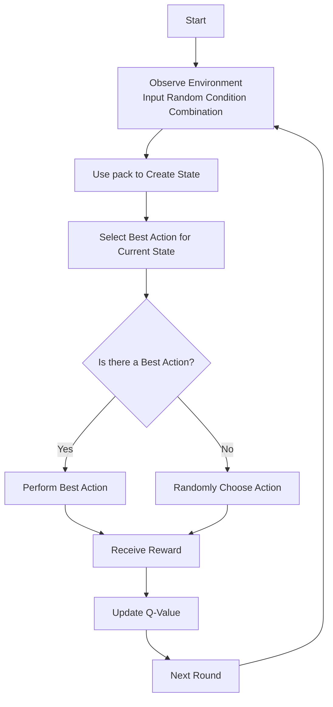

import "@site/src/languages/highlight";
import Tabs from '@theme/Tabs';
import TabItem from '@theme/TabItem';

# Developing Gameplay with Q-Learning

## 1. Introduction

Welcome to this tutorial! Here, we'll walk you through how to use the Q-Learning reinforcement learning algorithm to develop gameplay in the Dora SSR game engine. Don't worry if you're new to machine learning and game development; this tutorial is designed to be easy to understand.

## 2. What is Reinforcement Learning and Q-Learning?

**Reinforcement Learning** is a type of machine learning in which an agent takes actions in an environment to earn rewards or penalties, learning to maximize cumulative rewards.

**Q-Learning** is a model-free reinforcement learning algorithm. It estimates the maximum expected reward for an action \( a \) taken in a state \( s \) by learning a state-action value function \( Q(s, a) \).

### 2.1 Applying Q-Learning in Game Development

In a game, the game character can be seen as the agent, and the game world is the environment. Through Q-Learning, the character can gradually learn the best actions to maximize rewards, like defeating enemies or collecting items, based on different states.

## 3. Understanding the QLearner Object

The Dora SSR engine provides a `QLearner` object, which includes the methods needed to implement Q-Learning. Here are the main methods and properties:

- **pack(hints, values)**: Combines multiple conditions into a unique state value.
- **QLearner(gamma, alpha, maxQ)**: Creates a QLearner instance.
- **update(state, action, reward)**: Updates Q-values based on the reward.
- **getBestAction(state)**: Retrieves the best action for a given state.
- **matrix**: A matrix storing state, action, and corresponding Q-values.
- **load(values)**: Loads Q-values from a known state-action pair matrix.

### 3.1 QLearner:pack() Detailed Explanation

#### Function Overview

The `QLearner.pack()` method combines multiple discrete conditions into a unique state value. It accepts two parameters:

- **hints**: An integer array indicating the number of possible values for each condition.
- **values**: An integer array representing the current value for each condition.

#### Why is pack() Necessary?

In reinforcement learning, states are often made up of multiple features. To store and retrieve these states in a Q-table efficiently, we need to combine these features into a unique state identifier. The `pack()` method serves this purpose.

#### Working Principle

Imagine we have two conditions:

1. Weather conditions with three possibilities: sunny (0), cloudy (1), and rainy (2).
2. Number of enemies with two possibilities: few (0) and many (1).

Thus, `hints = {3, 2}` represents three values for the first condition and two for the second.

If it's currently cloudy and there are many enemies, then `values = {1, 1}`.

Using `pack(hints, values)`, we can convert `values` into a unique state integer. For example:

<Tabs groupId="language-select">
<TabItem value="lua" label="Lua">

```lua
local ML = require("ML")
local state = ML.QLearner:pack({3, 2}, {1, 1})
print(state) -- Outputs a unique integer representing the current state
```

</TabItem>
<TabItem value="tl" label="Teal">

```tl
local ML = require("ML")
local state = ML.QLearner:pack({3, 2}, {1, 1})
print(state) -- Outputs a unique integer representing the current state
```

</TabItem>
<TabItem value="ts" label="TypeScript">

```ts
import { ML } from "Dora";
const state = ML.QLearner.pack([3, 2], [1, 1]);
print(state); // Outputs a unique integer representing the current state
```

</TabItem>
<TabItem value="yue" label="YueScript">

```yue
_ENV = Dora
state = ML.QLearner\pack [3, 2], [1, 1]
print state -- Outputs a unique integer representing the current state
```

</TabItem>
</Tabs>

#### Mathematical Principle

The `pack()` method combines multiple conditions by encoding each as a binary number and performing bitwise operations to produce a unique integer.

## 4. Step-by-Step Implementation

### 4.1 Importing the QLearner Module

First, import the `ML` module and create a `QLearner` instance:

<Tabs groupId="language-select">
<TabItem value="lua" label="Lua">

```lua
local ML = require("ML")
local qLearner = ML.QLearner(0.5, 0.5, 100.0) -- Adjust gamma, alpha, maxQ as needed
```

</TabItem>
<TabItem value="tl" label="Teal">

```tl
local ML = require("ML")
local qLearner = ML.QLearner(0.5, 0.5, 100.0) -- Adjust gamma, alpha, maxQ as needed
```

</TabItem>
<TabItem value="ts" label="TypeScript">

```ts
import { ML } from "Dora";
const qLearner = ML.QLearner(0.5, 0.5, 100.0); // Adjust gamma, alpha, maxQ as needed
```

</TabItem>
<TabItem value="yue" label="YueScript">

```yue
_ENV = Dora
qLearner = ML.QLearner 0.5, 0.5, 100.0 -- Adjust gamma, alpha, maxQ as needed
```

</TabItem>
</Tabs>

Let's assume we want the game character to learn which weapon to use in different environments. Our conditions and actions might look like this:

- **Conditions (State Features)**:
  - Environment type (3 types): Forest (0), Desert (1), Snow (2)
  - Enemy type (2 types): Infantry (0), Tank (1)
- **Actions**:
  - Use handgun (1)
  - Use rocket launcher (2)
  - Use sniper rifle (3)

### 4.3 Constructing State Values with the pack() Method

<Tabs groupId="language-select">
<TabItem value="lua" label="Lua">

```lua
local hints = {3, 2} -- Number of values for each condition
local environment = 1 -- Desert
local enemy = 0 -- Infantry
local stateValues = {environment, enemy}
local state = ML.QLearner:pack(hints, stateValues)
```

</TabItem>
<TabItem value="tl" label="Teal">

```tl
local hints = {3, 2} -- Number of values for each condition
local environment = 1 -- Desert
local enemy = 0 -- Infantry
local stateValues = {environment, enemy}
local state = ML.QLearner:pack(hints, stateValues)
```

</TabItem>
<TabItem value="ts" label="TypeScript">

```ts
const hints = [3, 2]; // Number of values for each condition
const environment = 1; // Desert
const enemy = 0; // Infantry
const stateValues = [environment, enemy];
const state = ML.QLearner.pack(hints, stateValues);
```

</TabItem>
<TabItem value="yue" label="YueScript">

```yue
hints = [3, 2] -- Number of values for each condition
environment = 1 -- Desert
enemy = 0 -- Infantry
stateValues = [environment, enemy]
state = ML.QLearner\pack hints, stateValues
```

</TabItem>
</Tabs>

### 4.4 Choosing an Action

<Tabs groupId="language-select">
<TabItem value="lua" label="Lua">

```lua
local action = qLearner:getBestAction(state)
if action == 0 then -- 0 indicates no best action
	-- Choose a random action if no best action exists
	action = math.random(1, 3)
end
```

</TabItem>
<TabItem value="tl" label="Teal">

```tl
local action = qLearner:getBestAction(state)
if action == 0 then -- 0 indicates no best action
	-- Choose a random action if no best action exists
	action = math.random(1, 3)
end
```

</TabItem>
<TabItem value="ts" label="TypeScript">

```ts
let action = qLearner.getBestAction(state);
if (action === 0) { // 0 indicates no best action
	// Choose a random action if no best action exists
	action = Math.floor(Math.random() * 3) + 1;
}
```

</TabItem>
<TabItem value="yue" label="YueScript">

```yue
action = qLearner\getBestAction state
if action == 0 -- 0 indicates no best action
	-- Choose a random action if no best action exists
	action = math.random 1, 3
```

</TabItem>
</Tabs>

### 4.5 Performing the Action and Receiving Rewards

<Tabs groupId="language-select">
<TabItem value="lua" label="Lua">

```lua
local reward = 0
if action == 1 then
	-- Logic for using the handgun
	reward = 10 -- Hypothetical reward value
elseif action == 2 then
	-- Logic for using the rocket launcher
	reward = 20
elseif action == 3 then
	-- Logic for using the sniper rifle
	reward = 15
end
```

</TabItem>
<TabItem value="tl" label="Teal">

```tl
local reward = 0
if action == 1 then
	-- Logic for using the handgun
	reward = 10 -- Hypothetical reward value
elseif action == 2 then
	-- Logic for using the rocket launcher
	reward = 20
elseif action == 3 then
	-- Logic for using the sniper rifle
	reward = 15
end
```

</TabItem>
<TabItem value="ts" label="TypeScript">

```ts
let reward = 0;
if (action === 1) {
	// Logic for using the handgun
	reward = 10; // Hypothetical reward value
} else if (action === 2) {
	// Logic for using the rocket launcher
	reward = 20;
} else if (action === 3) {
	// Logic for using the sniper rifle
	reward = 15;
}
```

</TabItem>
<TabItem value="yue" label="YueScript">

```yue
reward = switch action
	when 1 -- Logic for using the handgun
		10 -- Hypothetical reward value
	when 2 -- Logic for using the rocket launcher
		20
	when 3 -- Logic for using the sniper rifle
		15
```

</TabItem>
</Tabs>

### 4.6 Updating Q-Values

<Tabs groupId="language-select">
<TabItem value="lua" label="Lua">

```lua
qLearner:update(state, action, reward)
```

</TabItem>
<TabItem value="tl" label="Teal">

```tl
qLearner:update(state, action, reward)
```

</TabItem>
<TabItem value="ts" label="TypeScript">

```ts
qLearner.update(state, action, reward);
```

</TabItem>
<TabItem value="yue" label="YueScript">

```yue
qLearner\update state, action, reward
```

</TabItem>
</Tabs>

### 4.7 Training Loop

Place the steps above in a loop to allow the agent to continually learn and update its strategy. A typical Q-Learning training process can be illustrated with the following flowchart:



## 5. Complete Code Example

Below is a complete Lua code example demonstrating how to use `QLearner` in the Dora SSR engine to implement simple reinforcement learning. This example allows an agent to learn to choose the best weapon based on different environments and enemy types.

<Tabs groupId="language-select">
<TabItem value="lua" label="Lua">

```lua
-- Import the ML module
local ML = require("ML")

-- Create a QLearner instance with gamma, alpha, and maxQ set
local qLearner = ML.QLearner(0.5, 0.5, 100.0)

-- Define the number of possible values for each condition (hints)
-- Environment types: Forest (0), Desert (1), Snowy (2) => 3 types
-- Enemy types: Infantry (0), Tank (1) => 2 types
local hints = {3, 2}

-- Define action set
-- Use Handgun (1), Use Rocket Launcher (2), Use Sniper Rifle (3)
local actions = {1, 2, 3}

-- Simulate multiple learning iterations
for episode = 1, 1000 do
	-- Randomly generate the current environment and enemy type
	local environment = math.random(0, 2) -- 0: Forest, 1: Desert, 2: Snowy
	local enemy = math.random(0, 1) -- 0: Infantry, 1: Tank

	-- Use pack() method to combine current conditions into a unique state value
	local stateValues = {environment, enemy}
	local state = ML.QLearner:pack(hints, stateValues)

	-- Attempt to get the best action for the given state
	local action = qLearner:getBestAction(state)

	-- If there is no best action, randomly select an action (exploration)
	if action == 0 then
		action = actions[math.random(#actions)]
	else
		-- With a certain probability, choose a random action to explore new strategies (ε-greedy strategy)
		local explorationRate = 0.1 -- 10% chance to explore
		if math.random() < explorationRate then
			action = actions[math.random(#actions)]
		end
	end

	-- Execute the action and get a reward based on the current environment and enemy type
	local reward = 0
	if action == 1 then -- Use Handgun
		if enemy == 0 then -- Against Infantry (advantage)
			reward = 20
		else -- Against Tank (disadvantage)
			reward = -10
		end
	elseif action == 2 then -- Use Rocket Launcher
		if enemy == 1 then -- Against Tank (advantage)
			reward = 30
		else -- Against Infantry (disadvantage)
			reward = 0
		end
	elseif action == 3 then -- Use Sniper Rifle
		if environment == 2 then -- In Snowy environment (advantage)
			reward = 25
		else
			reward = 10
		end
	end

	-- Update Q value
	qLearner:update(state, action, reward)
end

-- Test learning results
print("Learning complete, starting tests...")

-- Define test scenarios
local testScenarios = {
	{environment = 0, enemy = 0}, -- Forest, against Infantry
	{environment = 1, enemy = 1}, -- Desert, against Tank
	{environment = 2, enemy = 0}, -- Snowy, against Infantry
}

for i, scenario in ipairs(testScenarios) do
	local stateValues = {scenario.environment, scenario.enemy}
	local state = ML.QLearner:pack(hints, stateValues)
	local action = qLearner:getBestAction(state)

	-- Display test results
	local envNames = {"Forest", "Desert", "Snowy"}
	local enemyNames = {"Infantry", "Tank"}
	local actionNames = {"Handgun", "Rocket Launcher", "Sniper Rifle"}

	print(string.format("Scenario %d: Environment-%s, Enemy-%s => Recommended Use %s",
		i,
		envNames[scenario.environment + 1],
		enemyNames[scenario.enemy + 1],
		actionNames[action]))
end
```

</TabItem>
<TabItem value="tl" label="Teal">

```tl
-- Import the ML module
local ML = require("ML")

-- Create a QLearner instance with gamma, alpha, and maxQ set
local qLearner = ML.QLearner(0.5, 0.5, 100.0)

-- Define the number of possible values for each condition (hints)
-- Environment types: Forest (0), Desert (1), Snowy (2) => 3 types
-- Enemy types: Infantry (0), Tank (1) => 2 types
local hints = {3, 2}

-- Define action set
-- Use Handgun (1), Use Rocket Launcher (2), Use Sniper Rifle (3)
local actions = {1, 2, 3}

-- Simulate multiple learning iterations
for episode = 1, 1000 do
	-- Randomly generate the current environment and enemy type
	local environment = math.random(0, 2) -- 0: Forest, 1: Desert, 2: Snowy
	local enemy = math.random(0, 1) -- 0: Infantry, 1: Tank

	-- Use pack() method to combine current conditions into a unique state value
	local stateValues = {environment, enemy}
	local state = ML.QLearner:pack(hints, stateValues)

	-- Attempt to get the best action for the given state
	local action = qLearner:getBestAction(state)

	-- If there is no best action, randomly select an action (exploration)
	if action == 0 then
		action = actions[math.random(#actions)]
	else
		-- With a certain probability, choose a random action to explore new strategies (ε-greedy strategy)
		local explorationRate = 0.1 -- 10% chance to explore
		if math.random() < explorationRate then
			action = actions[math.random(#actions)]
		end
	end

	-- Execute the action and get a reward based on the current environment and enemy type
	local reward = 0
	if action == 1 then -- Use Handgun
		if enemy == 0 then -- Against Infantry (advantage)
			reward = 20
		else -- Against Tank (disadvantage)
			reward = -10
		end
	elseif action == 2 then -- Use Rocket Launcher
		if enemy == 1 then -- Against Tank (advantage)
			reward = 30
		else -- Against Infantry (disadvantage)
			reward = 0
		end
	elseif action == 3 then -- Use Sniper Rifle
		if environment == 2 then -- In Snowy environment (advantage)
			reward = 25
		else
			reward = 10
		end
	end

	-- Update Q value
	qLearner:update(state, action, reward)
end

-- Test learning results
print("Learning complete, starting tests...")

-- Define test scenarios
local testScenarios = {
	{environment = 0, enemy = 0}, -- Forest, against Infantry
	{environment = 1, enemy = 1}, -- Desert, against Tank
	{environment = 2, enemy = 0}, -- Snowy, against Infantry
}

for i, scenario in ipairs(testScenarios) do
	local stateValues = {scenario.environment, scenario.enemy}
	local state = ML.QLearner:pack(hints, stateValues)
	local action = qLearner:getBestAction(state)

	-- Display test results
	local envNames = {"Forest", "Desert", "Snowy"}
	local enemyNames = {"Infantry", "Tank"}
	local actionNames = {"Handgun", "Rocket Launcher", "Sniper Rifle"}

	print(string.format("Scenario %d: Environment-%s, Enemy-%s => Recommended Use %s",
		i,
		envNames[scenario.environment + 1],
		enemyNames[scenario.enemy + 1],
		actionNames[action]))
end
```

</TabItem>
<TabItem value="ts" label="TypeScript">

```ts
// Import the ML module
import { ML } from "Dora";

// Create a QLearner instance with gamma, alpha, and maxQ set
const qLearner = ML.QLearner(0.5, 0.5, 100.0);

// Define the number of possible values for each condition (hints)
// Environment types: Forest (0), Desert (1), Snowy (2) => 3 types
// Enemy types: Infantry (0), Tank (1) => 2 types
const hints = [3, 2];

// Define action set
// Use Handgun (1), Use Rocket Launcher (2), Use Sniper Rifle (3)
const actions = [1, 2, 3];

// Simulate multiple learning iterations
for (let episode = 1; episode <= 1000; episode++) {
	// Randomly generate the current environment and enemy type
	const environment = math.random(0, 2); // 0: Forest, 1: Desert, 2: Snowy
	const enemy = math.random(0, 1); // 0: Infantry, 1: Tank

	// Use pack() method to combine current conditions into a unique state value
	const stateValues = [

environment, enemy];
	const state = ML.QLearner.pack(hints, stateValues);

	// Attempt to get the best action for the given state
	let action = qLearner.getBestAction(state);

	// If there is no best action, randomly select an action (exploration)
	if (action === 0) {
		action = actions[math.random(actions.length) - 1];
	} else {
		// With a certain probability, choose a random action to explore new strategies (ε-greedy strategy)
		const explorationRate = 0.1; // 10% chance to explore
		if (math.random() < explorationRate) {
			action = actions[math.random(actions.length) - 1];
		}
	}

	// Execute the action and get a reward based on the current environment and enemy type
	let reward = 0;
	if (action === 1) { // Use Handgun
		if (enemy === 0) { // Against Infantry (advantage)
			reward = 20;
		} else { // Against Tank (disadvantage)
			reward = -10;
		}
	} else if (action === 2) { // Use Rocket Launcher
		if (enemy === 1) { // Against Tank (advantage)
			reward = 30;
		} else { // Against Infantry (disadvantage)
			reward = 0;
		}
	} else if (action === 3) { // Use Sniper Rifle
		if (environment === 2) { // In Snowy environment (advantage)
			reward = 25;
		} else {
			reward = 10;
		}
	}

	// Update Q value
	qLearner.update(state, action, reward);
}

// Test learning results
print("Learning complete, starting tests...");

// Define test scenarios
const testScenarios = [
	{ environment: 0, enemy: 0 }, // Forest, against Infantry
	{ environment: 1, enemy: 1 }, // Desert, against Tank
	{ environment: 2, enemy: 0 }, // Snowy, against Infantry
];

for (let i = 0; i < testScenarios.length; i++) {
	const scenario = testScenarios[i];
	const stateValues = [scenario.environment, scenario.enemy];
	const state = ML.QLearner.pack(hints, stateValues);
	const action = qLearner.getBestAction(state);

	// Display test results
	const envNames = ["Forest", "Desert", "Snowy"];
	const enemyNames = ["Infantry", "Tank"];
	const actionNames = ["Handgun", "Rocket Launcher", "Sniper Rifle"];

	print(string.format("Scenario %d: Environment-%s, Enemy-%s => Recommended Use %s",
		i + 1,
		envNames[scenario.environment],
		enemyNames[scenario.enemy],
		actionNames[action - 1]));
}
```

</TabItem>
<TabItem value="yue" label="YueScript">

```yue
-- Import the ML module
_ENV = Dora

-- Create a QLearner instance with gamma, alpha, and maxQ set
qLearner = ML.QLearner 0.5, 0.5, 100.0

-- Define the number of possible values for each condition (hints)
-- Environment types: Forest (0), Desert (1), Snowy (2) => 3 types
-- Enemy types: Infantry (0), Tank (1) => 2 types
hints = [3, 2]

-- Define action set
-- Use Handgun (1), Use Rocket Launcher (2), Use Sniper Rifle (3)
actions = [1, 2, 3]

-- Simulate multiple learning iterations
for episode = 1, 1000
	-- Randomly generate the current environment and enemy type
	environment = math.random 0, 2 -- 0: Forest, 1: Desert, 2: Snowy
	enemy = math.random 0, 1 -- 0: Infantry, 1: Tank

	-- Use pack() method to combine current conditions into a unique state value
	stateValues = [environment, enemy]
	state = ML.QLearner\pack hints, stateValues

	-- Attempt to get the best action for the given state
	action = qLearner\getBestAction state

	-- If there is no best action, randomly select an action (exploration)
	if action == 0
		action = actions[math.random #actions]
	else
		-- With a certain probability, choose a random action to explore new strategies (ε-greedy strategy)
		explorationRate = 0.1 -- 10% chance to explore
		if math.random! < explorationRate
			action = actions[math.random #actions]

	-- Execute the action and get a reward based on the current environment and enemy type
	reward = 0
	reward = switch action
		when 1 -- Use Handgun
			if enemy == 0 -- Against Infantry (advantage)
				20
			else -- Against Tank (disadvantage)
				-10
		when 2 -- Use Rocket Launcher
			if enemy == 1 -- Against Tank (advantage)
				30
			else -- Against Infantry (disadvantage)
				0
		when 3 -- Use Sniper Rifle
			if environment == 2 -- In Snowy environment (advantage)
				25
			else
				10

	-- Update Q value
	qLearner\update state, action, reward

-- Test learning results
print "Learning complete, starting tests..."

testScenarios =
	* environment: 0 -- Forest, against Infantry
		enemy: 0
	* environment: 1 -- Desert, against Tank
		enemy: 1
	* environment: 2 -- Snowy, against Infantry
		enemy: 0

for i, scenario in ipairs testScenarios
	stateValues = [scenario.environment, scenario.enemy]
	state = ML.QLearner\pack hints, stateValues
	action = qLearner\getBestAction state

	-- Display test results
	envNames = ["Forest", "Desert", "Snowy"]
	enemyNames = ["Infantry", "Tank"]
	actionNames = ["Handgun", "Rocket Launcher", "Sniper Rifle"]

	print string.format "Scenario %d: Environment-%s, Enemy-%s => Recommended Use %s",
		i,
		envNames[scenario.environment + 1],
		enemyNames[scenario.enemy + 1],
		actionNames[action]
```

</TabItem>
</Tabs>

### 5.1 Code Explanation

#### 1. Import Modules and Create a QLearner Instance

<Tabs groupId="language-select">
<TabItem value="lua" label="Lua">

```lua
local ML = require("ML")
local qLearner = ML.QLearner(0.5, 0.5, 100.0)
```

</TabItem>
<TabItem value="tl" label="Teal">

```tl
local ML = require("ML")
local qLearner = ML.QLearner(0.5, 0.5, 100.0)
```

</TabItem>
<TabItem value="ts" label="TypeScript">

```ts
import { ML } from "Dora";
const qLearner = ML.QLearner(0.5, 0.5, 100.0);
```

</TabItem>
<TabItem value="yue" label="YueScript">

```yue
_ENV = Dora
qLearner = ML.QLearner 0.5, 0.5, 100.0
```

</TabItem>
</Tabs>

Create a QLearner instance and set gamma, alpha, and maxQ.

- **gamma**: The discount factor, influencing the weight of future rewards.
- **alpha**: The learning rate, determining the influence of new information on Q-value updates.
- **maxQ**: The maximum limit of Q-values to prevent them from growing indefinitely.

#### 2. Define State Features and Action Set

<Tabs groupId="language-select">
<TabItem value="lua" label="Lua">

```lua
local hints = {3, 2}
local actions = {1, 2, 3}
```

</TabItem>
<TabItem value="tl" label="Teal">

```tl
local hints = [3, 2]
local actions = [1, 2, 3]
```

</TabItem>
<TabItem value="ts" label="TypeScript">

```ts
const hints = [3, 2];
const actions = [1, 2, 3];
```

</TabItem>
<TabItem value="yue" label="YueScript">

```yue
hints = [3, 2]
actions = [1, 2, 3]
```

</TabItem>
</Tabs>

Define the number of possible values for each condition (hints) and the action set. Note that the minimum action number starts from 1.

#### 3. Run Learning Iterations

<Tabs groupId="language-select">
<TabItem value="lua" label="Lua">

```lua
for episode = 1, 1000 do
	-- Learning process
end
```

</TabItem>
<TabItem value="tl" label="Teal">

```tl
for episode = 1, 1000 do
	-- Learning process
end
```

</TabItem>
<TabItem value="ts" label="TypeScript">

```ts
for (let episode = 1; episode <= 1000; episode++) {
	// Learning process
}
```

</TabItem>
<TabItem value="yue" label="YueScript">

```yue
for episode = 1, 1000
	-- Learning process
```

</TabItem>
</Tabs>

Use loops to simulate multiple episodes, allowing the agent to learn from different states. You can set the number of episodes to 1000 or adjust it based on needs—more episodes can help the agent gain more experience.

#### 4. Randomly Generate Environment and Enemy Type

<Tabs groupId="language-select">
<TabItem value="lua" label="Lua">

```lua
local environment = math.random(0, 2)
local enemy = math.random(0, 1)
```

</TabItem>
<TabItem value="tl" label="Teal">

```tl
local environment = math.random 0, 2
local enemy = math.random 0, 1
```

</TabItem>
<TabItem value="ts" label="TypeScript">

```ts
const environment = math.random(0, 2);
const enemy = math.random(0, 1);
```

</TabItem>
<TabItem value="yue" label="YueScript">

```yue
environment = math.random 0, 2
enemy = math.random 0, 1
```

</TabItem>
</Tabs>

Simulate different game scenarios where the environment and enemy types are randomly generated. This simulates diverse situations, helping the agent gain more experience.

#### 5. Construct State Value Using `pack()` Method

<Tabs groupId="language-select">
<TabItem value="lua" label="Lua">

```lua
local stateValues = {environment, enemy}
local state = ML.QLearner:pack(hints, stateValues)
```

</TabItem>
<TabItem value="tl" label="Teal">

```tl
local stateValues = [environment, enemy]
local state = ML.QLearner\pack hints, stateValues
```

</TabItem>
<TabItem value="ts" label="TypeScript">

```ts
const stateValues = [environment, enemy];
const state = ML.QLearner.pack(hints, stateValues);
```

</TabItem>
<TabItem value="yue" label="YueScript">

```yue
stateValues = [environment, enemy]
state = ML.QLearner\pack hints, stateValues
```

</TabItem>
</Tabs>

Combine multiple conditions generated in this episode into a unique state integer for storage and retrieval in the Q-table.

#### 6. Choose an Action

<Tabs groupId="language-select">
<TabItem value="lua" label="Lua">

```lua
local action = qLearner:getBestAction(state)
if action == 0 then
	action = actions[math.random(#actions)]
else
	local explorationRate = 0.1
	if math.random() < explorationRate then
		action = actions[math.random(#actions)]
	end
end
```

</TabItem>
<TabItem value="tl" label="Teal">

```tl
local action = qLearner:getBestAction(state)
if action == 0 then
	action = actions[math.random(#actions)]
else
	local explorationRate = 0.1
	if math.random() < explorationRate then
		action = actions[math.random(#actions)]
	end
end
```

</TabItem>
<TabItem value="ts" label="TypeScript">

```ts
if (action === 0) {
	action = actions[math.random(actions.length) - 1];
} else {
	const explorationRate = 0.1;
	if (math.random() < explorationRate) {
		action = actions[math.random(actions.length) - 1];
	}
}
```

</TabItem>
<TabItem value="yue" label="YueScript">

```yue
action = qLearner\getBestAction state
if action == 0
	action = actions[math.random #actions]
else
	explorationRate = 0.1
	if math.random! < explorationRate
		action = actions[math.random #actions]
```

</TabItem>
</Tabs>

Use the `getBestAction(state)` method to get the known best action for the current state and employ an `ε-greedy strategy` for exploration. This strategy balances exploiting known information and exploring new options.

#### 7. Execute Action and Get Reward

<Tabs groupId="language-select">
<TabItem value="lua" label="Lua">

```lua
local reward = 0
if action == 1 then
	-- Calculate reward based on action and current state
end
```

</TabItem>
<TabItem value="tl" label="Teal">

```tl
local reward = 0
if action == 1 then
	-- Calculate reward based on action and current state
end
```

</TabItem>
<TabItem value="ts" label="TypeScript">

```ts
let reward = 0;
if (action === 1) {
	// Calculate reward based on action and current state
}
```

</TabItem>
<TabItem value="yue" label="YueScript">

```yue
reward = 0
reward = switch action
	when 1 -- Using pistol
		-- Calculate reward based on action and current state
```

</TabItem>
</Tabs>

Set the reward based on game logic. In a real game, the reward might be calculated after a series of actions.

#### 8. Update Q Value

<Tabs groupId="language-select">
<TabItem value="lua" label="Lua">

```lua
qLearner:update(state, action, reward)
```

</TabItem>
<TabItem value="tl" label="Teal">

```tl
qLearner:update(state, action, reward);
```

</TabItem>
<TabItem value="ts" label="TypeScript">

```ts
qLearner.update(state, action, reward);
```

</TabItem>
<TabItem value="yue" label="YueScript">

```yue
qLearner\update state, action, reward
```

</TabItem>
</Tabs>

Update the Q value with the received reward to improve strategy, allowing the agent to select optimal actions in different states.

#### 9. Test the Learning Outcome

<Tabs groupId="language-select">
<TabItem value="lua" label="Lua">

```lua
for i, scenario in ipairs(testScenarios) do
	-- Test different scenarios to view agent decisions
end
```

</TabItem>
<TabItem value="tl" label="Teal">

```tl
for i, scenario in ipairs testScenarios do
	-- Test different scenarios to view agent decisions
end
```

</TabItem>
<TabItem value="ts" label="TypeScript">

```ts
for (let i = 0; i < testScenarios.length; i++) {
	// Test different scenarios to view agent decisions
}
```

</TabItem>
<TabItem value="yue" label="YueScript">

```yue
for i, scenario in ipairs testScenarios
	-- Test different scenarios to view agent decisions
```

</TabItem>
</Tabs>

Perform tests and display the agent's decisions across different scenarios. Note that the decisions may vary due to randomly generated scenarios.

### 5.2 Sample Output

```
Learning completed, starting tests...
Scenario 1: Environment-Forest, Enemy-Infantry => Suggested weapon: Pistol
Scenario 2: Environment-Desert, Enemy-Tank => Suggested weapon: Rocket Launcher
Scenario 3: Environment-Snow, Enemy-Infantry => Suggested weapon: Sniper Rifle
```

## 6. Summary

With this complete code example, we achieved the following goals:

- **Using the QLearner:pack() Method**: Combined multiple conditions into a unique state value for easy storage and retrieval in the Q-table.
- **Built a Reinforcement Learning Loop**: Allowed the agent to try actions, gain rewards, and update its strategy across different states.
- **Implemented ε-greedy Strategy**: Balanced following known best strategies while maintaining exploration.
- **Tested Learning Outcomes**: Validated whether the agent learned to select optimal actions in predefined scenarios.

We hope this example helps you understand how to use the Q-Learning algorithm in the Dora SSR engine to develop game mechanics. For any questions, feel free to join our community for discussion!
