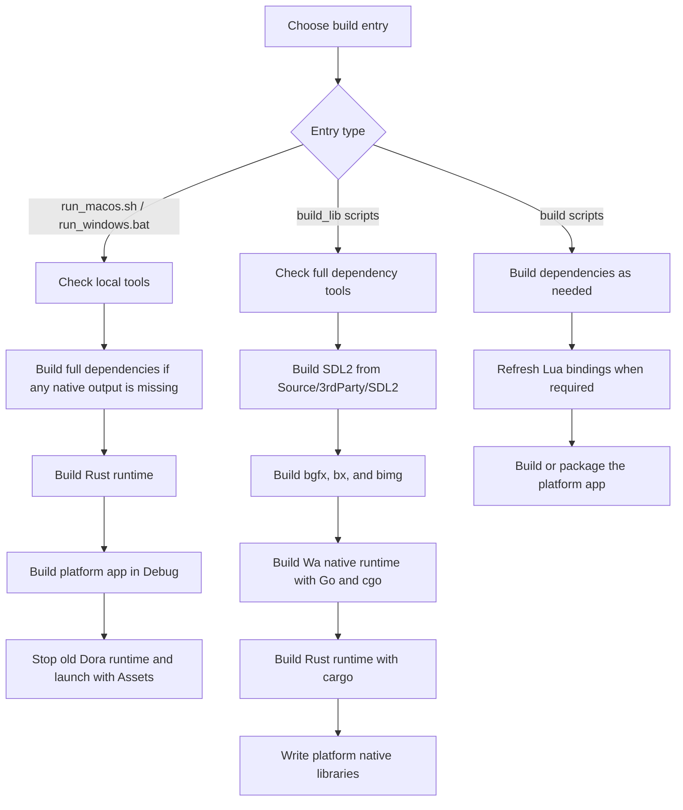

import Tabs from '@theme/Tabs';
import TabItem from '@theme/TabItem';

# How to Build Dora SSR Engine

## 1. Get the Source

<Tabs groupId="git-select">
<TabItem value="github" label="GitHub">

```sh
git clone https://github.com/ippclub/Dora-SSR.git
```

</TabItem>
<TabItem value="gitee" label="Gitee">

```sh
git clone https://gitee.com/ippclub/Dora-SSR.git
```

</TabItem>
<TabItem value="gitcode" label="GitCode">

```sh
git clone https://gitcode.com/ippclub/Dora-SSR.git
```

</TabItem>
</Tabs>


## 2. Build Game Engine Runtime

Please select the target platform you want to build for.

For the fastest local desktop loop, use the `run_*` scripts where available. They check the required native dependency outputs and build the full dependency set automatically when any dependency is missing. The platform library scripts under `Tools/build-scripts` build the native dependencies required by the engine, including SDL2, bgfx, the Rust runtime, and the Wa native runtime. You normally do not need to enter `Source/3rdParty/bgfx` and build bgfx manually.

<Tabs groupId="platform-select">
<TabItem value="windows" label="Windows">

1. Install [Go 1.24 or later](https://go.dev/dl/), [Rust](https://www.rust-lang.org/tools/install), [xmake](https://xmake.io/#/guide/installation), and [Visual Studio Community 2026](https://visualstudio.microsoft.com/vs/community/) with MSBuild tools, matching the Windows GitHub Actions build environment.

2. Install [MSYS2](https://www.msys2.org/) and a 32-bit [MinGW-w64](https://www.mingw-w64.org/) toolchain for Go cgo when building the Wa runtime DLL. The CI build uses MSYS2 MINGW32; run this from an MSYS2 MINGW32 shell:
	```sh
	pacman -S --needed mingw-w64-i686-gcc
	```

	Make sure the MINGW32 `gcc.exe` is available before other MinGW toolchains. With a default MSYS2 install this is:
	```bat
	set PATH=C:\msys64\mingw32\bin;%PATH%
	set CC=C:\msys64\mingw32\bin\gcc.exe
	```

3. Build and run the local debug runtime.
	```bat
	Tools\build-scripts\run_windows.bat
	```

4. For local debugging, open **Projects/Windows/Dora.sln** in Visual Studio and run the `Debug` configuration.

</TabItem>
<TabItem value="macos" label="macOS">

1. Install [Go 1.24 or later](https://go.dev/dl/), [Rust](https://www.rust-lang.org/tools/install), [xmake](https://xmake.io/#/guide/installation), and the latest [Xcode](https://developer.apple.com/xcode/).

2. Build and run the local debug runtime.
	```sh
	Tools/build-scripts/run_macos.sh
	```

3. For IDE debugging, open **Projects/macOS/Dora.xcodeproj** in Xcode and run the `Dora` target.

</TabItem>
<TabItem value="ios" label="iOS">

1. Install [Go 1.24 or later](https://go.dev/dl/), [Rust](https://www.rust-lang.org/tools/install), [xmake](https://xmake.io/#/guide/installation), and the latest [Xcode](https://developer.apple.com/xcode/).

2. Build the iOS native dependencies.
	```sh
	Tools/build-scripts/build_lib_ios.sh debug
	```

3. Build the simulator target.
	```sh
	xcodebuild ARCHS=arm64 ONLY_ACTIVE_ARCH=NO -project Projects/iOS/Dora.xcodeproj -configuration Debug -target Simulator -sdk iphonesimulator
	```

4. For IDE debugging, open **Projects/iOS/Dora.xcodeproj** in Xcode and run the `Simulator` target.

</TabItem>
<TabItem value="android" label="Android">

:::tip
Local Android builds require [JDK 17](https://adoptium.net/temurin/releases/?version=17) in addition to [Android Studio](https://developer.android.com/studio). The Wa Android AAR is built with Go and gomobile; the build script installs the pinned gomobile version automatically if it is missing.
:::

1. Install [Go 1.24 or later](https://go.dev/dl/), [Rust](https://www.rust-lang.org/tools/install), [xmake](https://xmake.io/#/guide/installation), and the latest Android Studio.

2. Build the Android native dependencies.
	```sh
	Tools/build-scripts/build_lib_android.sh debug
	```

3. Build the Android app locally.
	```sh
	cd Projects/Android/Dora
	./gradlew assembleDebug
	```

4. For IDE debugging, open **Projects/Android/Dora** in Android Studio and run the `app` module.

</TabItem>
<TabItem value="linux" label="Linux">

:::tip
Local Linux builds use the vendored SDL2 source and SDL's upstream CMake detection. Install the development packages for the backends you want to enable, such as X11, Wayland, ALSA, PulseAudio, PipeWire, DBus, udev, and KMSDRM.
:::

1. Install [Go 1.24 or later](https://go.dev/dl/), [Rust](https://www.rust-lang.org/tools/install), and [xmake](https://xmake.io/#/guide/installation).

<Tabs groupId="linux-distribution-select">
<TabItem value="ubuntu" label="Ubuntu/Debian">

3. Install dependent packages.
	```sh
	sudo apt-get update
	sudo apt-get install -y cmake pkg-config lua5.1 luarocks \
	  libgl1-mesa-dev libssl-dev libdbus-1-dev \
	  libasound2-dev libjack-jackd2-dev libpulse-dev libpipewire-0.3-dev libsamplerate0-dev libsndio-dev \
	  libibus-1.0-dev libudev-dev libusb-1.0-0-dev \
	  libx11-dev libxext-dev libxcursor-dev libxi-dev libxfixes-dev libxrandr-dev libxrender-dev libxss-dev \
	  libdrm-dev libgbm-dev libegl1-mesa-dev libwayland-dev libwayland-bin wayland-protocols \
	  libxkbcommon-dev libdecor-0-dev
	```

4. Manually generate Lua bindings.
	```sh
	sudo luarocks install luafilesystem
	cd Tools/tolua++
	lua tolua++.lua
	```

</TabItem>
<TabItem value="arch-linux" label="Arch Linux">

3. Install dependent packages.
	```sh
	sudo pacman -S lua51 luarocks openssl gcc make cmake pkgconf \
	  mesa libx11 libxext libxcursor libxi libxfixes libxrandr libxrender libxss \
	  wayland wayland-protocols libxkbcommon libdecor alsa-lib libpulse pipewire libusb libdrm --needed
	# Because the lua version must be 5.1,you need to use lua 5.1 instead of the newest version of lua
	# The easiest way is using 'ln' to create a soft link
	sudo ln -s /usr/bin/lua5.1 /usr/local/bin/lua
	```

4. Manually generate Lua bindings.
	```sh
	sudo luarocks --lua-version 5.1 install luafilesystem
	cd Tools/tolua++
	lua5.1 tolua++.lua
	```

</TabItem>
</Tabs>

2. Run the compile script for the current architecture. It automatically builds SDL2, bgfx, the Rust runtime, and the Wa native runtime before compiling the engine.

	```sh
	Tools/build-scripts/build_linux.sh debug
	```

3. Run the generated software.
	```sh
	cd Assets
	../Projects/Linux/build/dora-ssr

	# Or specify the resource directory with command line arguments
	./Projects/Linux/build/dora-ssr --asset Assets
	```

</TabItem>
</Tabs>

## 3. Build Web IDE

1. Compile and run the Dora SSR engine.

2. Install the latest version of [Node.js](https://nodejs.org/) and [pnpm](https://pnpm.io/installation).

3. Initialize the Dora Dora editor. Use `pnpm start` for development.

	When you need the engine runtime to serve the updated Web IDE, run `pnpm build`. It creates the production Web IDE static files and syncs them to `Assets/www`.

	Please select your platform.

<Tabs groupId="platform-select">
<TabItem value="macos" label="macOS">

	```sh
	cd Tools/dora-dora && pnpm install
	pnpm start
	```

	```sh
	cd Tools/dora-dora
	pnpm build
	```

	</TabItem>
	<TabItem value="linux" label="Linux">

	```sh
	cd Tools/dora-dora && pnpm install
	pnpm start
	```

	```sh
	cd Tools/dora-dora
	pnpm build
	```

</TabItem>
<TabItem value="windows" label="Windows">

	```sh
	cd Tools\dora-dora && pnpm install
	pnpm start
	```

	```sh
	cd Tools\dora-dora
	pnpm build
	```

</TabItem>
</Tabs>

## 4. Runtime and Dependency Build Flow



The `run_macos.sh` and `run_windows.bat` scripts are the shortest local desktop development path: they check the required tools, verify the SDL2, bgfx, and Wa native outputs, build the full dependency set if any required output is missing, rebuild the Rust runtime and app project, stop any old Dora process, and launch the debug runtime with the repository `Assets` directory.

The `build_lib_*` scripts are dependency builders. They are used when native libraries are missing, stale, or being prepared for CI and release builds. These scripts are responsible for SDL2, bgfx/bx/bimg, the Wa native runtime, and the Rust runtime.

The platform `build_*` scripts are higher-level build wrappers. They call dependency build steps where appropriate, refresh Lua bindings when the platform build requires it, and then build the platform app with the native build system such as MSBuild, Xcode, Make, or Gradle.
