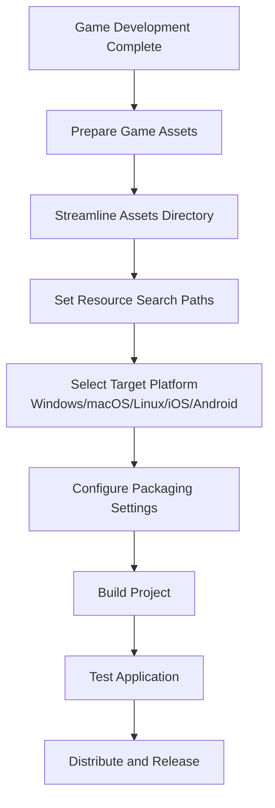

import Tabs from '@theme/Tabs';
import TabItem from '@theme/TabItem';

# How to Package Games as Standalone Applications

&emsp;&emsp;This tutorial will guide you through using the Dora SSR game engine to package game projects as standalone software packages that don't depend on Dora SSR's development assistance tools interface and Web IDE functionality.

## Packaging Process Overview



## 1. Prepare Game Assets

&emsp;&emsp;Before packaging, first ensure that all game assets are correctly placed in the `Assets` directory of your game project.

### 1.1 Standard Project Structure

```
Assets/
├── Script/
│   ├── init.lua          # Game entry script
│   ├── main.lua          # Main game logic
│   └── Lib/              # Engine library files (must be retained)
├── Image/
│   ├── player.png        # Character images
│   └── background.png    # Background images
├── Audio/
│   ├── bgm.mp3          # Background music
│   └── sfx.wav          # Sound effects
└── Font/
    └── game-font.ttf    # Game fonts
```

### 1.2 Required Asset Types

- **Art Assets**: Such as images, animations, UI materials, etc.
- **Audio Files**: Including background music and sound effects
- **Font Files**: All fonts used in the game
- **Program Scripts**: Including Lua (plain code or compiled from other languages) or WASM binary program files

> **Important Note**: These assets are essential components for game operation and must be included in the final application package.

## 2. Streamline Assets Directory

&emsp;&emsp;To reduce the size of the final application package, you need to clean up unnecessary development files.

### 2.1 Files That Must Be Retained

```
Assets/
├── Script/Lib/               # Game engine runtime libraries
│   ├── UI/                   # UI component libraries
│   └── [Other library files] # Must be retained
└── gamecontrollerdb.txt      # Game controller configuration file
```

### 2.2 Files That Can Be Deleted

```
Assets/
├── Script/Dev/              # Development programs (can be deleted)
├── Script/Tools/            # Development assistance tools (can be deleted)
├── Script/Lib/Dora/         # Engine API definition files (can be deleted)
├── Doc/                     # Documentation (can be deleted)
├── www/                     # Web IDE files (can be deleted)
└── [Other dev files]        # Can be deleted
```

> **Optimization Suggestion**: Deleting unnecessary files can significantly reduce application package size, typically reducing the volume of the published application.

## 3. Set Resource Search Paths

&emsp;&emsp;Ensure that independently packaged games maintain consistent resource loading behavior with the Web IDE environment.

### 3.1 Default Search Paths

Dora SSR Web IDE default resource search paths:

1. **Game project root directory/Script**
2. **Engine built-in resources root directory/Script/Lib**
3. **Game project root directory**

### 3.2 Configuration Example

Add the following code at the beginning of your game entry script (usually `init.lua`):

```lua title="Assets/Script/init.lua"
local Path <const> = require("Path")
local Content <const> = require("Content")

-- Get current script path
local currentScriptPath = Path:getScriptPath(...)

-- Set resource search paths
Content.searchPaths = {
	Path(currentScriptPath, "Script"),        -- Game script directory
	Path(Content.assetPath, "Script", "Lib"), -- Engine library directory
	Path(currentScriptPath),                  -- Game root directory
}

-- Main game logic
local function main()
    -- Your game code starts here
    print("Game started successfully!")
end

main()
```

## 4. Platform Packaging Guide

### 4.1 Platform Comparison Table

| Platform | Development Tools | Output Format | Signature Requirements | Distribution Channels |
|----------|------------------|---------------|----------------------|----------------------|
| Windows | Visual Studio | .exe | Optional | Steam, official website, other platforms |
| macOS | Xcode | .app | Required | App Store, official website |
| Linux | CMake | Binary | Optional | Steam, official website |
| iOS | Xcode | .ipa | Required | App Store |
| Android | Android Studio | .apk/.aab | Required | Google Play, other stores |

### 4.2 Packaging Operations for Different Platforms

<Tabs groupId="platform-select">
<TabItem value="windows" label="Windows">

#### Step 1: Configure Project
1. Open `Projects/Windows/Dora.sln`
2. Configure project properties in Visual Studio:
   - Application name
   - Version number
   - Icon file
   - Target platform (x86/x64)

#### Step 2: Build Project
```bash
# Build through Visual Studio GUI or use the command below
msbuild Projects/Windows/Dora.sln /p:Configuration=Release /p:Platform=x64
```

#### Step 3: Package Application
After building, executable files and related resources will be generated in the `Projects/Windows/Release/` directory.

</TabItem>
<TabItem value="macos" label="macOS">

#### Step 1: Configure Project
1. Open `Projects/macOS/Dora.xcodeproj`
2. Set in Xcode:
   - Bundle Identifier
   - Application name
   - Version number
   - Developer certificate

#### Step 2: Build Project
```bash
# Build through Xcode GUI or use the command below
xcodebuild -project Projects/macOS/Dora.xcodeproj -scheme Dora -configuration Release
```

</TabItem>
<TabItem value="ios" label="iOS">

#### Step 1: Configure Project
1. Open `Projects/iOS/Dora.xcodeproj`
2. Set Bundle Identifier and developer certificate
3. Configure app icons and launch screen

#### Step 2: Build and Package
```bash
# Build through Xcode GUI or use the command below
xcodebuild -project Projects/iOS/Dora.xcodeproj -scheme Dora -configuration Release -destination generic/platform=iOS
```

</TabItem>
<TabItem value="android" label="Android">

#### Step 1: Configure Project
1. Open the `Projects/Android/` directory
2. Modify the configuration in `app/build.gradle`:
   ```gradle
   android {
       defaultConfig {
           applicationId "com.yourcompany.yourgame"
           versionCode 1
           versionName "1.0"
       }
   }
   ```

#### Step 2: Build APK
```bash
# Build through Android Studio GUI or use the command below
./gradlew assembleRelease
```

</TabItem>
</Tabs>

## 5. Practical Example: Simple Game Packaging

### 5.1 Example Game Project

Let's use a simple "Click the Block" game as an example to demonstrate the complete packaging process.

#### Game Code Example

```lua title="Assets/Script/init.lua"
local Path <const> = require("Path")
local Content <const> = require("Content")
local Node <const> = require("Node")
local Sprite <const> = require("Sprite")
local Label <const> = require("Label")

-- Set resource search paths
local currentScriptPath = Path:getScriptPath(...)
Content.searchPaths = {
	Path(currentScriptPath, "Script"),
	Path(Content.assetPath, "Script", "Lib"),
	Path(currentScriptPath),
}

-- Main game scene
local function createGameScene()
	local scene = Node()

	-- Create background
	local bg = Sprite("Image/background.png")
	bg:addTo(scene)

	-- Create clickable block
	local block = Sprite("Image/block.png")
	block:addTo(scene)
	block.position = Vec2(400, 300)

	-- Create score display
	local scoreLabel = Label("Font/game-font.ttf", 32)
	scoreLabel:addTo(scene)
	scoreLabel.position = Vec2(400, 500)

	local score = 0

	-- Click event
	block:onTapBegan(function()
		score = score + 1
		scoreLabel:setString("Score: " .. score)
		block.scaleX = 0.9
		block.scaleY = 0.9
	end)

	block:onTapEnded(function()
		block.scaleX = 1.0
		block.scaleY = 1.0
	end)

	return scene
end

-- Start game
local gameScene = createGameScene()
gameScene:addTo(Director.entry)
```

### 5.2 Packaging Steps

1. **Prepare Asset Files**
   - Place `background.png` and `block.png` in `Assets/Image/`
   - Place font files in `Assets/Font/`

2. **Streamline Directory**
   - Delete the `Assets/Script/Dev/` directory
   - Delete the `Assets/Doc/` directory

3. **Choose Platform Packaging**
   - Configure and build according to the platform guide above

## 6. Testing and Release

### 6.1 Testing Checklist

- [ ] Game starts normally
- [ ] All assets load correctly
- [ ] Sound effects and music play normally
- [ ] Test on different devices
- [ ] Good performance

### 6.2 Common Problem Solutions

#### Problem 1: Asset Loading Failure
**Solution**: Check if resource search path configuration and file paths are correct

#### Problem 2: Application Package Too Large
**Solution**: Delete unnecessary development files, compress image assets

#### Problem 3: Signature Error
**Solution**: Ensure correct developer certificate and Bundle Identifier are used

### 6.3 Distribution Channels

- **Steam**: Suitable for PC games
- **App Store**: iOS and macOS applications
- **Google Play**: Android applications
- **Official Website Download**: Direct distribution
- **itch.io**: Independent game platform

## Summary

&emsp;&emsp;By following the steps in this tutorial, you can successfully package Dora SSR game projects as standalone applications. Key points include:

1. **Correctly organize project structure**, ensuring all necessary assets are in the `Assets` directory
2. **Streamline development files**, reducing the size of the final application package
3. **Configure correct resource search paths**, ensuring normal asset loading
4. **Choose appropriate platform tools**, configure and build according to platform requirements
5. **Thorough testing**, ensuring the application runs normally in various environments

&emsp;&emsp;After packaging is complete, your game can be distributed to players as a standalone application, independent of the Dora SSR development environment!

## Related Documentation

- **[Development Configuration Tutorial](/docs/tutorial/dev-configuration)** - Development environment configuration guide
