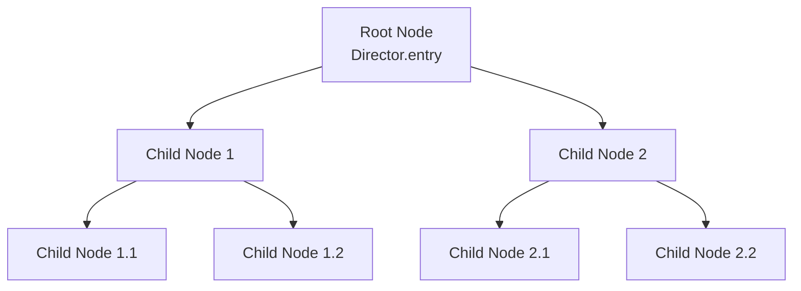

import Tabs from '@theme/Tabs';
import TabItem from '@theme/TabItem';

# How to Create a Game Scene

In the Dora SSR engine, a game scene is composed of nodes, forming a tree structure. A node is a basic element in the game scene that can contain other nodes, creating a hierarchical structure. In this tutorial, we will introduce how to create a game scene using nodes.

Here is a simple example of a game scene. The geometric transformations, color, and opacity properties of the parent node will affect the child nodes. When setting the properties of the child nodes, you are actually setting relative values on the parent node.



## 1. Creating a Node

To create a node in the Dora SSR engine, you need to instantiate a `Node` class, which will later be used to build the hierarchy of the game scene tree.

Here is an example of how to create a new `Node` instance in script code:

<Tabs groupId="language-select">
<TabItem value="lua" label="Lua">

```lua
-- Create a new node instance that will automatically mount to the root node of the game scene
local node = Node()

-- Or, you can manually mount it to the root node of the game scene
-- Director.entry:addChild(node)
```

</TabItem>
<TabItem value="tl" label="Teal">

```teal
-- Import the Node module
local Node <const> = require("Node")

-- Create a new node instance that will automatically mount to the root node of the game scene
local node = Node()

-- Or, you can manually mount it to the root node of the game scene
-- Director.entry:addChild(node)
```

</TabItem>
<TabItem value="ts" label="TypeScript">

```ts
// Import the Node module
import { Node } from "Dora";

// Create a new node instance that will automatically mount to the root node of the game scene
const node = Node();

// Or, you can manually mount it to the root node of the game scene
// Director.entry.addChild(node);
```

</TabItem>
<TabItem value="yue" label="YueScript">

```yue
-- Import the Dora module
_ENV = Dora

-- Create a new node instance that will automatically mount to the root node of the game scene
node = Node!

-- Or, you can manually mount it to the root node of the game scene
-- Director.entry\addChild node
```

</TabItem>
</Tabs>

## 2. Setting Node Properties

The `Node` class has many properties, such as `x`, `y`, `z` (the position of the node), `width`, `height` (the size of the node), `angle`, `angleX`, `angleY` (the rotation angle of the node), `scaleX`, `scaleY` (scaling factors), and `visible` (whether the node is visible).

Here is an example of how to set these properties in Lua:

<Tabs groupId="language-select">
<TabItem value="lua" label="Lua">

```lua
node.x = 100
node.y = 200
node.width = 50
node.height = 50
node.visible = true
```

</TabItem>
<TabItem value="tl" label="Teal">

```teal
node.x = 100
node.y = 200
node.width = 50
node.height = 50
node.visible = true
```

</TabItem>
<TabItem value="ts" label="TypeScript">

```ts
node.x = 100;
node.y = 200;
node.width = 50;
node.height = 50;
node.visible = true;
```

</TabItem>
<TabItem value="yue" label="YueScript">

```yue
with node
	.x = 100
	.y = 200
	.width = 50
	.height = 50
	.visible = true
```

</TabItem>
</Tabs>

## 3. Adding Child Nodes

In the `Node` class, you can add child nodes using the `addChild` method. Here's an example of how to add a child node in the code:

<Tabs groupId="language-select">
<TabItem value="lua" label="Lua">

```lua
local childNode = Node()
node:addChild(childNode)
```

</TabItem>
<TabItem value="tl" label="Teal">

```teal
local childNode = Node()
node:addChild(childNode)
```

</TabItem>
<TabItem value="ts" label="TypeScript">

```ts
const childNode = Node();
node.addChild(childNode);
```

</TabItem>
<TabItem value="yue" label="YueScript">

```yue
childNode = Node!
node\addChild childNode
```

</TabItem>
</Tabs>

In this example, the `childNode` is added to `node` as its child node.

## 4. Checking Node Properties

The `Node` class has several read-only properties such as `hasChildren` (whether the node has child nodes), `children` (the list of child nodes), `parent` (the parent node), and `boundingBox` (the bounding box of the node).

Here’s an example of how to check these properties in Lua:

<Tabs groupId="language-select">
<TabItem value="lua" label="Lua">

```lua
print(node.hasChildren) -- Prints whether there are child nodes
print(node.children) -- Prints the list of child nodes
print(node.parent) -- Prints the parent node
```

</TabItem>
<TabItem value="tl" label="Teal">

```teal
print(node.hasChildren) -- Prints whether there are child nodes
print(node.children) -- Prints the list of child nodes
print(node.parent) -- Prints the parent node
```

</TabItem>
<TabItem value="ts" label="TypeScript">

```ts
print(node.hasChildren); // Prints whether there are child nodes
print(node.children); // Prints the list of child nodes
print(node.parent); // Prints the parent node
```

</TabItem>
<TabItem value="yue" label="YueScript">

```yue
with node
	print .hasChildren -- Prints whether there are child nodes
	print .children -- Prints the list of child nodes
	print .parent -- Prints the parent node
```

</TabItem>
</Tabs>

## 5. Node Event System

The event system of the scene node class supports various event types, such as `ActionEnd`, `TapBegan`, `TapEnded`, `TapMoved`, `MouseWheelScroll`, and more. Each event type has a specific callback function that is triggered when the event occurs.

The basic steps for registering and handling events are as follows:

1. **Register Events**: You can register events on a node to listen for engine-built-in events, like screen touches, mouse, keyboard, and game controller input. The node supports multi-cast, meaning you can register multiple callbacks for the same event. Here is an example:

<Tabs groupId="language-select">
<TabItem value="lua" label="Lua">

```lua
node:slot("EventName", function(...)
	-- Add your code here
end)
```

</TabItem>
<TabItem value="tl" label="Teal">

```teal
node:slot("EventName", function(...)
	-- Add your code here
end)
```

</TabItem>
<TabItem value="ts" label="TypeScript">

```ts
node.slot("EventName", (...: any[]) => {
	// Add your code here
});
```

</TabItem>
<TabItem value="yue" label="YueScript">

```yue
node\slot "EventName", (...) ->
	-- Add your code here
```

</TabItem>
</Tabs>

2. **Handle Events**: When the registered event is triggered, you can add code inside the callback function to handle the event and retrieve event-related parameters. For example, you can handle an action end event with the following code:

<Tabs groupId="language-select">
<TabItem value="lua" label="Lua">

```lua
node:slot("ActionEnd", function(action, target)
	print("Action completed: " .. tostring(action) .. " Target node: " .. tostring(target))
end)
```

</TabItem>
<TabItem value="tl" label="Teal">

```teal
node:slot("ActionEnd", function(action: Action.Type, target: Node.Type)
	print("Action completed: " .. tostring(action) .. " Target node: " .. tostring(target))
end)
```

</TabItem>
<TabItem value="ts" label="TypeScript">

```ts
node.slot(Slot.ActionEnd, (action, target) => {
	print(`Action completed: ${action} Target node: ${target}`);
});
```

</TabItem>
<TabItem value="yue" label="YueScript">

```yue
node\slot "ActionEnd", (action, target) ->
	print "Action completed: #{action} Target node: #{target}"
```

</TabItem>
</Tabs>

3. **Remove Events**: If you no longer need to listen for an event, you can remove it with the following code:

<Tabs groupId="language-select">
<TabItem value="lua" label="Lua">

```lua
local function callback(...)
	-- Add your handling code here
end

-- Register event
node:slot("EventName", callback)

-- Remove event
node:slot("EventName"):remove(callback)

-- Remove all registered events
node:slot("EventName", nil)
```

</TabItem>
<TabItem value="tl" label="Teal

">

```teal
local function callback(...)
	-- Add your handling code here
end

-- Register event
node:slot("EventName", callback)

-- Remove event
node:slot("EventName"):remove(callback)

-- Remove all registered events
node:slot("EventName", nil)
```

</TabItem>
<TabItem value="ts" label="TypeScript">

```ts
const callback = (...: any[]) => {
	// Add your handling code here
};

// Register event
node.slot("EventName", callback);

// Remove event
node.slot("EventName").remove(callback);

// Remove all registered events
node.slot("EventName").clear();
```

</TabItem>
<TabItem value="yue" label="YueScript">

```yue
callback = (...) ->
	-- Add your handling code here

-- Register event
node\slot "EventName", callback

-- Remove event
node\slot("EventName")\remove callback

-- Remove all registered events
node\slot "EventName", nil
```

</TabItem>
</Tabs>

Commonly used node event types related to game interactions and their corresponding callback function signatures are as follows. Before using these events, make sure to enable the node to receive touch events:

```lua
node.touchEnabled = true
```

- **TapFilter**: Triggered before the tap begins, can be used to filter specific tap events. Callback signature: `function(touch: Touch)`
- **TapBegan**: Triggered when a tap is detected. Callback signature: `function(touch: Touch)`
- **TapEnded**: Triggered when the tap ends. Callback signature: `function(touch: Touch)`
- **Tapped**: Triggered after detecting and ending a tap. Callback signature: `function(touch: Touch)`
- **TapMoved**: Triggered when the touch moves. Callback signature: `function(touch: Touch)`
- **MouseWheel**: Triggered when the mouse wheel is scrolled. Callback signature: `function(delta: Vec2)`

By registering and handling these events, you can easily add rich interactive functionalities to your game nodes. More node events can be found [here](../api/Node%20Event/Node).

To simplify event handling, we also provide several built-in event registration functions like `onTapBegan`, `onTapEnded`, `onTapped`, `onTapMoved`, `onMouseWheel`. You can register and handle events by calling these functions directly on the node.

For example, here is how to register and handle a tap begin event:

<Tabs groupId="language-select">
<TabItem value="lua" label="Lua">

```lua
node:onTapBegan(function(touch)
	print("Tap began")
end)

-- Equivalent to the code:
--[[
node.touchEnabled = true
node:slot("TapBegan", function(touch)
	print("Tap began")
end)
]]
```

</TabItem>
<TabItem value="tl" label="Teal">

```teal
node:onTapBegan(function(touch: Touch)
	print("Tap began")
end)

-- Equivalent to the code:
--[[
node.touchEnabled = true
node:slot("TapBegan", function(touch: Touch)
	print("Tap began")
end)
]]
```

</TabItem>
<TabItem value="ts" label="TypeScript">

```ts
node.onTapBegan(touch => {
	print("Tap began");
});

// Equivalent to the code:
// node.touchEnabled = true;
// node.slot(Slot.TapBegan, touch => {
// 	print("Tap began");
// });
```

</TabItem>
<TabItem value="yue" label="YueScript">

```yue
node\onTapBegan (touch) -> print "Tap began"

-- Equivalent to the code:
-- node.touchEnabled = true
-- node\slot "TapBegan", (touch) -> print "Tap began"
```

</TabItem>
</Tabs>

## 6. Node Actions

The following shows how to use the node action system to create various animation effects.

1. **Move Action**:

<Tabs groupId="language-select">
<TabItem value="lua" label="Lua">

```lua
local moveAction = Move(duration, startPosition, stopPosition)
node:perform(moveAction)
```

</TabItem>
<TabItem value="tl" label="Teal">

```teal
local moveAction = Move(duration, startPosition, stopPosition)
node:perform(moveAction)
```

</TabItem>
<TabItem value="ts" label="TypeScript">

```ts
const moveAction = Move(duration, startPosition, stopPosition);
node.perform(moveAction);
```

</TabItem>
<TabItem value="yue" label="YueScript">

```yue
moveAction = Move duration, startPosition, stopPosition
node\perform moveAction
```

</TabItem>
</Tabs>

In the above code, `duration` represents the duration of the movement, `startPosition` is the starting position, and `stopPosition` is the target position.

2. **Scale Action**:

<Tabs groupId="language-select">
<TabItem value="lua" label="Lua">

```lua
local scaleAction = Scale(duration, startScale, stopScale)
node:perform(scaleAction)
```

</TabItem>
<TabItem value="tl" label="Teal">

```teal
local scaleAction = Scale(duration, startScale, stopScale)
node:perform(scaleAction)
```

</TabItem>
<TabItem value="ts" label="TypeScript">

```ts
const scaleAction = Scale(duration, startScale, stopScale);
node.perform(scaleAction);
```

</TabItem>
<TabItem value="yue" label="YueScript">

```yue
scaleAction = Scale duration, startScale, stopScale
node\perform scaleAction
```

</TabItem>
</Tabs>

In the above code, `duration` represents the duration of the scaling, `startScale` is the initial scale value, and `stopScale` is the target scale value.

3. **Rotation Action (Angle)**:

<Tabs groupId="language-select">
<TabItem value="lua" label="Lua">

```lua
local rotateAction = Angle(duration, startAngle, stopAngle)
node:perform(rotateAction)
```

</TabItem>
<TabItem value="tl" label="Teal">

```teal
local rotateAction = Angle(duration, startAngle, stopAngle)
node:perform(rotateAction)
```

</TabItem>
<TabItem value="ts" label="TypeScript">

```ts
const rotateAction = Angle(duration, startAngle, stopAngle);
node.perform(rotateAction);
```

</TabItem>
<TabItem value="yue" label="YueScript">

```yue
rotateAction = Angle duration, startAngle, stopAngle
node\perform rotateAction
```

</TabItem>
</Tabs>

In the above code, `duration` represents the rotation duration, `startAngle` is the initial angle, and `stopAngle` is the target angle.

You can also combine multiple actions to create more complex animations.

4. **Sequential Actions (Sequence)**:

<Tabs groupId="language-select">
<TabItem value="lua" label="Lua">

```lua
node:perform(Sequence(
	Move(duration, startPosition, stopPosition),
	Angle(duration, startAngle, stopAngle)
))
```

</TabItem>
<TabItem value="tl" label="Teal">

```teal
node:perform(Sequence(
	Move(duration, startPosition, stopPosition),
	Angle(duration, startAngle, stopAngle)
))
```

</TabItem>
<TabItem value="ts" label="TypeScript">

```ts
node.perform(Sequence(
	Move(duration, startPosition, stopPosition),
	Angle(duration, startAngle, stopAngle)
));
```

</TabItem>
<TabItem value="yue" label="YueScript">

```yue
node\perform Sequence(
	Move duration, startPosition, stopPosition
	Angle duration, startAngle, stopAngle
)
```

</TabItem>
</Tabs>

In the above code, `Move` and `Angle` will execute sequentially, one after the other.

5. **Simultaneous Actions (Spawn)**:

<Tabs groupId="language-select">
<TabItem value="lua" label="Lua">

```lua
node:perform(Spawn(
	Move(duration, startPosition, stopPosition),
	Scale(duration, startScale, stopScale)
))
```

</TabItem>
<TabItem value="tl" label="Teal">

```teal
node:perform(Spawn(
	Move(duration, startPosition, stopPosition),
	Scale(duration, startScale, stopScale)
))
```

</TabItem>
<TabItem value="ts" label="TypeScript">

```ts
node.perform(Spawn(
	Move(duration, startPosition, stopPosition),
	Scale(duration, startScale, stopScale)
));
```

</TabItem>
<TabItem value="yue" label="YueScript">

```yue
node\perform Spawn(
	Move duration, startPosition, stopPosition
	Scale duration, startScale, stopScale
)
```

</TabItem>
</Tabs>

In the above code, `Move` and `Scale` will execute simultaneously.

In addition to the action types shown above, our action system also supports other actions such as `ScaleX`, `ScaleY`, `AngleX`, `AngleY`, `Roll`, `SkewX`, `SkewY`, `Delay`, `Event`, `Show`, `Hide`, and `AnchorX`, `AnchorY`.

By combining and adjusting these actions, you can create a wide variety of animation effects to enhance your game experience.

6. **Easing Functions (Ease)**:

Easing functions add smooth transitions to actions, making animations look more natural. In our action system, you can specify different easing functions using enumerated parameters. Here are some common easing functions and their corresponding enum parameters:

- **Ease.Linear**: The default easing function, actions are executed at a constant speed.
- **Ease.InOutQuad**: Actions accelerate and decelerate smoothly at the beginning and end.
- **Ease.InQuad**: Actions accelerate gradually.
- **

Ease.OutQuad**: Actions decelerate gradually.
- **Ease.OutElastic**: Actions bounce like a spring.
- **Ease.OutBounce**: Actions bounce like a ball.

When creating an action instance, you can pass the easing function as the last parameter to the corresponding creation function. For example:

<Tabs groupId="language-select">
<TabItem value="lua" label="Lua">

```lua
local moveAction = Move(
	duration,
	startPosition,
	stopPosition,
	Ease.InOutQuad
)
node:perform(moveAction)
```

</TabItem>
<TabItem value="tl" label="Teal">

```teal
local moveAction = Move(
	duration,
	startPosition,
	stopPosition,
	Ease.InOutQuad
)
node:perform(moveAction)
```

</TabItem>
<TabItem value="ts" label="TypeScript">

```ts
const moveAction = Move(
	duration,
	startPosition,
	stopPosition,
	Ease.InOutQuad
);
node.perform(moveAction);
```

</TabItem>
<TabItem value="yue" label="YueScript">

```yue
moveAction = Move(
	duration
	startPosition
	stopPosition
	Ease.InOutQuad
)
node\perform moveAction
```

</TabItem>
</Tabs>

In the example above, `Ease.InOutQuad` specifies an ease-in-out effect.

You can choose the easing function that best suits your needs to add more dynamics and details to your actions. Be sure to try different easing functions to achieve the desired animation effect. All available easing functions can be found [here](../api/Class/Ease).
