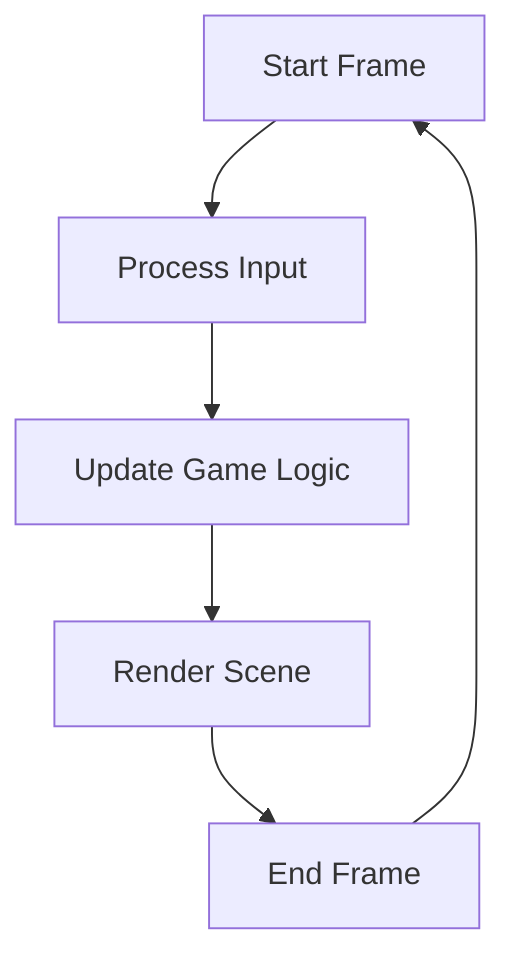

import Tabs from '@theme/Tabs';
import TabItem from '@theme/TabItem';

# How to Use Update Scheduling

Dora SSR provides a flexible Update scheduling mechanism that allows developers to easily control game logic updates. This tutorial will guide you through how to use Update scheduling, including coroutine tasks for asynchronous processing and update functions that are called every frame.

## 1. Understanding Game Update Scheduling

Game update scheduling is a mechanism in game engines used to manage and execute game logic updates. It allows developers to execute code on each frame or under specific conditions, creating a dynamic gaming experience. The essence of a game engine is an uninterrupted loop program, with each cycle referred to as a frame, during which game logic updates occur.

A typical game logic update process is outlined below. Under an engine executing at 60 frames per second, this process runs 60 times per second:



## 2. Differences Between Coroutine Tasks and Update Functions

- **Coroutine Tasks**:
	- **Asynchronous processing**: Can pause and resume between multiple frames.
	- **Use cases**: Suitable for handling operations that need to wait, such as loading resources or timers.
	- **Implementation**: Achieved via `thread`, `threadLoop`, `once`, and `loop` functions.
- **Update Functions**:
	- **Synchronous processing**: Called every frame.
	- **Use cases**: Ideal for handling logic that needs to be updated every frame, such as movement or collision detection.
	- **Implementation**: Achieved via `node:schedule()` and `node:onUpdate()` functions.

## 3. Using Coroutine Tasks for Asynchronous Processing

Coroutine tasks allow you to pause during execution, wait for conditions to be met or for a certain time, and then continue execution. This lets you perform time-consuming operations without blocking the main thread, which is very useful for handling asynchronous events.

### 3.1 Global Coroutine Tasks vs. Node-Associated Coroutine Tasks

In Dora SSR, coroutine tasks can be executed in two ways:

1. **Global Coroutine Tasks**: Coroutine tasks created using `thread(function() ... end)` are managed by the engine's global scheduling module. These tasks will keep running unless manually removed and are cleaned up when the engine exits.
2. **Node-Associated Coroutine Tasks**: Coroutine tasks created using `node:schedule(once(function() ... end))` are associated with the node’s lifecycle. When the node is cleared, the scheduled functions will also stop and be cleaned up.

#### Example: Executing a Global Coroutine Task

<Tabs groupId="language-select">
<TabItem value="lua" label="Lua">

```lua
local thread <const> = require("thread")
local sleep <const> = require("sleep")
local Content <const> = require("Content")

thread(function()
	print("Start loading resources asynchronously")
	local resourceData = Content:loadAsync("path/to/resource")
	sleep(2) -- Simulate additional time-consuming operation
	print("Resource loading completed")
	-- Continue logic after resource loading is finished
end)
```

</TabItem>
<TabItem value="tl" label="Teal">

```tl
local thread <const> = require("thread")
local sleep <const> = require("sleep")
local Content <const> = require("Content")

thread(function()
	print("Start loading resources asynchronously")
	local resourceData = Content:loadAsync("path/to/resource")
	sleep(2) -- Simulate additional time-consuming operation
	print("Resource loading completed")
	-- Continue logic after resource loading is finished
end)
```

</TabItem>
<TabItem value="ts" label="TypeScript">

```ts
import { thread, sleep, Content } from "Dora";

thread(() => {
	print("Start loading resources asynchronously");
	const resourceData = Content.loadAsync("path/to/resource");
	sleep(2); // Simulate additional time-consuming operation
	print("Resource loading completed");
	// Continue logic after resource loading is finished
});
```

</TabItem>
<TabItem value="yue" label="YueScript">

```yue
_ENV = Dora

thread ->
	print "Start loading resources asynchronously"
	resourceData = Content\loadAsync "path/to/resource"
	sleep 2 -- Simulate additional time-consuming operation
	print "Resource loading completed"
	-- Continue logic after resource loading is finished
```

</TabItem>
</Tabs>

In the example above, `thread(function() ... end)` creates a coroutine task, `loadAsync` asynchronously loads resources, and `sleep(2)` simulates a time-consuming operation. The coroutine ensures long-running tasks don't block the main thread, and the task's lifecycle is managed globally by the engine.

:::tip Tip
In Dora SSR, functions with the `async` suffix are asynchronous functions, such as `Content.loadAsync` and `Cache.loadAsync`, which need to be executed asynchronously in coroutine tasks.
:::

#### Example: Node-Associated Coroutine Task

<Tabs groupId="language-select">
<TabItem value="lua" label="Lua">

```lua
local Node <const> = require("Node")
local sleep <const> = require("sleep")

local node = Node()
node:once(function()
	print("Start node-associated asynchronous operation")
	sleep(2) -- Simulate time-consuming operation
	print("Node-associated asynchronous operation completed")
end)
```

</TabItem>
<TabItem value="tl" label="Teal">

```tl
local Node <const> = require("Node")
local sleep <const> = require("sleep")

local node = Node()
node:once(function()
	print("Start node-associated asynchronous operation")
	sleep(2) -- Simulate time-consuming operation
	print("Node-associated asynchronous operation completed")
end)
```

</TabItem>
<TabItem value="ts" label="TypeScript">

```ts
import { Node, sleep } from "Dora";

const node = Node();
node.once(() => {
	print("Start node-associated asynchronous operation");
	sleep(2); // Simulate time-consuming operation
	print("Node-associated asynchronous operation completed");
});
```

</TabItem>
<TabItem value="yue" label="YueScript">

```yue
_ENV = Dora

node = Node!
node\once ->
	print "Start node-associated asynchronous operation"
	sleep 2 -- Simulate time-consuming operation
	print "Node-associated asynchronous operation completed"
```

</TabItem>
</Tabs>

Here, `node:once(function() ... end)` creates a coroutine task associated with the `node`. When the `node` is cleared, the task is automatically stopped and cleaned up.

### 3.2 Differences in Using the Two Types of Coroutine Tasks

- **Lifecycle Management**:
	- **Global Coroutine Tasks**: Their lifecycle is independent of any node, managed by the engine's global scheduler, and must be manually removed or cleared when the engine exits.
	- **Node-Associated Coroutine Tasks**: Their lifecycle is tied to the associated node, automatically stopping and cleaning up when the node is destroyed.

- **Use Cases**:
	- **Global Coroutine Tasks**: Suitable for tasks that need to run throughout the game's lifecycle, such as global event listeners.
	- **Node-Associated Coroutine Tasks**: Suitable for tasks associated with specific scenes or objects, such as character animation control.

### 3.3 Using Coroutine Control Functions

In Dora SSR, coroutine tasks execute asynchronously, and you can use specific control flow functions to manage task execution order and pausing within coroutines. These functions include `wait`, `cycle`, and `sleep`. Their main purpose is to pause or loop the coroutine until certain conditions are met.

1. `wait` Function

The `wait` function pauses the coroutine task until a condition is met. The condition is a function that returns `true`.

#### Example: Continuing Execution When a Condition is Met

<Tabs groupId="language-select">
<TabItem value="lua" label="Lua">

```lua
local thread <const> = require("thread")
local wait <const> = require("wait")

thread(function()
	print("Waiting for condition to be met...")
	wait(function()
		-- Continue execution when the player's score is greater than 100
		return player.score > 100
	end)
	print("Condition met, continuing execution")
end)
```

</TabItem>
<TabItem value="tl" label="Teal">

```tl
local thread <const> = require("thread")
local wait <const> = require("wait")

thread(function()
	print("Waiting for condition to be met...")
	wait(function(): boolean
		-- Continue execution when the player's score is greater than 100
		return player.score > 100
	end)
	print("Condition met, continuing execution")
end)
```

</TabItem>
<TabItem value="ts" label="TypeScript">

```ts
import { thread, wait } from "Dora";

thread(() => {
	print("Waiting for condition to be met...");
	wait(() => {
		// Continue execution when the player's score is greater than 100
		return player.score > 100;
	});
	print("Condition met, continuing execution");
});
```

</TabItem>
<TabItem value="yue" label="YueScript">

```yue
_ENV = Dora

thread ->
	print "Waiting for condition to be met..."
	wait ->
		-- Continue execution when the player's score is greater than 100
		player.score > 100
	print "Condition met, continuing execution"
```

</TabItem>
</Tabs>

2. `cycle` Function

The `cycle` function repeatedly calls a function every frame over a specified time period, suitable for scenarios where you need to perform repeated logic over a certain time span.

#### Example: Updating an Object's Position Every Frame Over 3 Seconds

<Tabs groupId="language-select">
<TabItem value="lua" label="Lua">

```lua
local cycle <const> = require("cycle“)
local Node <const> = require("Node")

local node = Node()
node:once(function()
	local startX = node.x
	print("Start moving")
	cycle(3, function(time)
		-- Update the object's position every frame over 3 seconds
		node.x = startX + 500 * time -- time's value will go from 0 to 1
	end)
	print("Movement ended")
end))
```

</TabItem>
<TabItem value="tl" label="Teal">

```tl
local cycle <const> = require("cycle“)
local Node <const> = require("Node")

local node = Node()
node:once(function()
	local startX = node.x
	print("Start moving")
	cycle(3, function(time: number)
		-- Update the object's position every frame over 3 seconds
		node.x = startX + 500 * time -- time's value will go from 0 to 1
	end)
	print("Movement ended")
end)
```

</TabItem>
<TabItem value="ts" label="TypeScript">

```ts
import { cycle, Node } from "Dora";

const node = Node();
node.once(() => {
	const startX = node.x;
	print("Start moving");
	cycle(3, time => {
		// Update the object's position every frame over 3 seconds
		node.x += startX + 500 * time; // time's value will go from 0 to 1
	});
	print("Movement ended");
});
```

</TabItem>
<TabItem value="yue" label="YueScript">

```yue
_ENV = Dora

node = Node!
node\once ->
	startX = node.x
	print "Start moving"
	cycle 3, (time) ->
		-- Update the object's position every frame over 3 seconds
		node.x += startX + 500 * time -- time's value will go from 0 to 1
	print "Movement ended"
```

</TabItem>
</Tabs>

3. `sleep` Function Usage

The `sleep` function is used to pause execution in a coroutine task for a specified amount of time. It can serve as a simple timer, allowing the coroutine to resume after a certain delay.

#### Example: Executing a Task After a 2-Second Delay

<Tabs groupId="language-select">
<TabItem value="lua" label="Lua">

```lua
local sleep <const> = require("sleep")
local thread <const> = require("thread")

thread(function()
	print("Task started...")
	sleep(2) -- Pause coroutine for 2 seconds
	print("Task resumed after 2 seconds")
end)
```

</TabItem>
<TabItem value="tl" label="Teal">

```tl
local sleep <const> = require("sleep")
local thread <const> = require("thread")

thread(function()
	print("Task started...")
	sleep(2) -- Pause coroutine for 2 seconds
	print("Task resumed after 2 seconds")
end)
```

</TabItem>
<TabItem value="ts" label="TypeScript">

```ts
import { sleep, thread } from "Dora";

thread(() => {
	print("Task started...");
	sleep(2); // Pause coroutine for 2 seconds
	print("Task resumed after 2 seconds");
});
```

</TabItem>
<TabItem value="yue" label="YueScript">

```yue
_ENV = Dora

thread ->
	print "Task started..."
	sleep 2 -- Pause coroutine for 2 seconds
	print "Task resumed after 2 seconds"
```

</TabItem>
</Tabs>

In this example, `sleep(2)` pauses the coroutine for 2 seconds, after which the remaining logic is executed. You can use `sleep` to easily create timer functionality.

## 4. Using Per-Frame Update Functions

In some cases, you need to execute certain logic every frame, such as detecting user input or updating an object's position.

#### Example: Updating an Object's Position Every Frame

<Tabs groupId="language-select">
<TabItem value="lua" label="Lua">

```lua
local Node <const> = require("Node")

local node = Node()
node:schedule(function(deltaTime)
	-- When the right arrow key is pressed
	if Keyboard:isKeyPressed("Right") then
		-- Update the object's position
		node.x = node.x + 10 * deltaTime
		-- Returning true stops the update
	end
end)
```

</TabItem>
<TabItem value="tl" label="Teal">

```tl
local Node <const> = require("Node")

local node = Node()
node:schedule(function(deltaTime: number): boolean
	-- When the right arrow key is pressed
	if Keyboard:isKeyPressed("Right") then
		-- Update the object's position
		node.x = node.x + 10 * deltaTime
		-- Returning true stops the update
	end
end)
```

</TabItem>
<TabItem value="ts" label="TypeScript">

```ts
import { Node, KeyName } from "Dora";

const node = Node();
node.schedule(deltaTime => {
	// When the right arrow key is pressed
	if (Keyboard.isKeyPressed(KeyName.Right)) {
		// Update the object's position
		node.x += 10 * deltaTime;
		// Returning true stops the update
	}
	return false;
});
```

</TabItem>
<TabItem value="yue" label="YueScript">

```yue
_ENV = Dora

node = Node!
node\schedule (deltaTime) ->
	-- When the right arrow key is pressed
	if Keyboard\isKeyPressed "Right"
		-- Update the object's position
		node.x += 10 * deltaTime
		-- Returning true stops the update
```

</TabItem>
</Tabs>

`node:schedule(function(deltaTime) ... end)` schedules a function to be called every frame, where `deltaTime` is the time interval between the previous and current frame.

### 4.1 Differences Between `node:schedule()` and `node:onUpdate()`

**Similarities**:

- The scheduled function is called every frame, and returning `true` will stop the execution.
- You can also schedule a coroutine task, and use `return true` or `coroutine.yield(true)` to stop execution.

**Differences**:

- **`node:schedule()`**: Used for scheduling the main update function or coroutine tasks. Repeated calls will overwrite the previously scheduled function.
- **`node:onUpdate()`**: Used for scheduling multiple functions or coroutine tasks to run every frame. You can call it multiple times, allowing several functions to be scheduled simultaneously.

#### Example:

<Tabs groupId="language-select">
<TabItem value="lua" label="Lua">

```lua
-- Using node:schedule() to schedule the main update function
node:schedule(function(deltaTime)
	-- Main update logic
	if condition then
		return true -- Return internal state to stop scheduling
		-- Or use node:unschedule() to actively cancel scheduling
	end
end)

-- Using node:onUpdate() to schedule multiple update functions
node:onUpdate(function(deltaTime)
	-- Update logic A
end)

node:onUpdate(function(deltaTime)
	-- Update logic B
end)
```

</TabItem>
<TabItem value="tl" label="Teal">

```tl
-- Using node:schedule() to schedule the main update function
node:schedule(function(deltaTime: number): boolean
	-- Main update logic
	if condition then
		return true -- Return internal state to stop scheduling
		-- Or use node:unschedule() to actively cancel scheduling
	end
end)

-- Using node:onUpdate() to schedule multiple update functions
node:onUpdate(function(deltaTime: number): boolean
	-- Update logic A
end)

node:onUpdate(function(deltaTime: number): boolean
	-- Update logic B
end)
```

</TabItem>
<TabItem value="ts" label="TypeScript">

```ts
// Using node.schedule() to schedule the main update function
node.schedule(deltaTime => {
	// Main update logic
	if (condition) {
		return true; // Return internal state to stop scheduling
		// Or use node.unschedule() to actively cancel scheduling
	}
	return false;
});

// Using node.onUpdate() to schedule multiple update functions
node.onUpdate(deltaTime => {
	// Update logic A
	return false;
});

node.onUpdate(deltaTime => {
	// Update logic B
	return false;
});
```

</TabItem>
<TabItem value="yue" label="YueScript">

```yue
-- Using node\schedule() to schedule the main update function
node\schedule (deltaTime) ->
	-- Main update logic
	if condition
		return true -- Return internal state to stop scheduling
		-- Or use node\unschedule() to actively cancel scheduling

-- Using node\onUpdate() to schedule multiple update functions
node\onUpdate (deltaTime) ->
	-- Update logic A

node\onUpdate (deltaTime) ->
	-- Update logic B
```

</TabItem>
</Tabs>

## 5. Abbreviation of Functions

In Dora SSR, there are several shorthand versions of functions provided to simplify code writing:

- **`thread(function() end)`** is a shorthand for **`Routine(once(function() end))`**.
- **`threadLoop(function() end)`** is a shorthand for **`Routine(loop(function() end))`**.
- **

`node:once(function() end)`** is a shorthand for **`node:schedule(once(function() end))`**.
- **`node:loop(function() end)`** is a shorthand for **`node:schedule(loop(function() end))`**.

## 6. Summary

Through this tutorial, you should have learned how to use the Update scheduling mechanism in the Dora SSR game engine. You can utilize coroutine tasks for asynchronous processing to ensure smooth operation of the main thread, and use per-frame update functions to handle logic that needs continuous updates. Understanding the differences between `node:schedule()` and `node:onUpdate()` and the shorthand versions of functions can help you write more efficient code.

We hope this tutorial helps you master Dora SSR’s Update scheduling and develop outstanding games!
