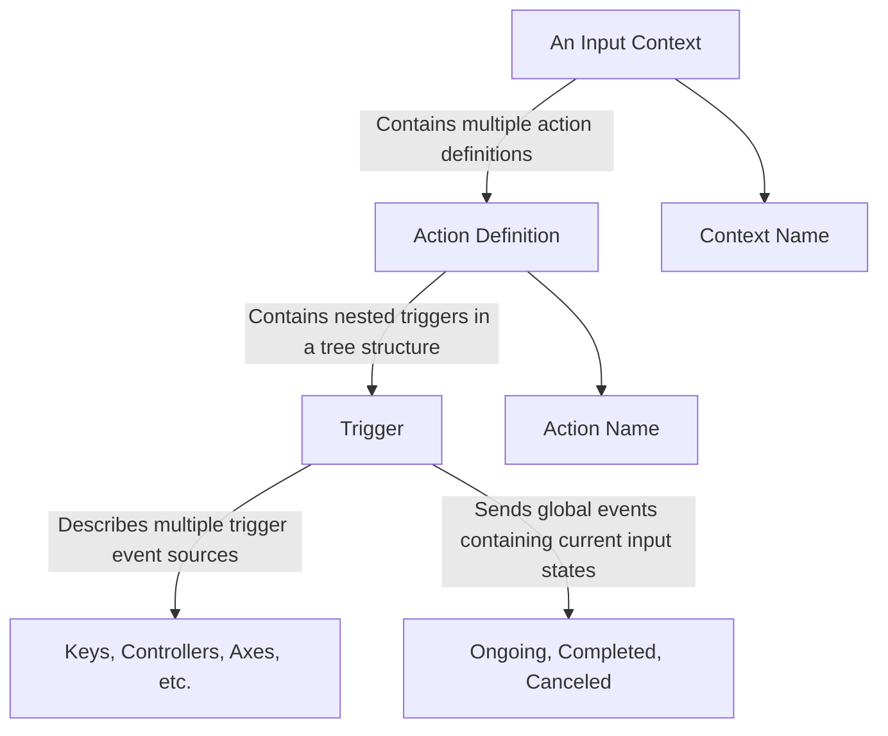
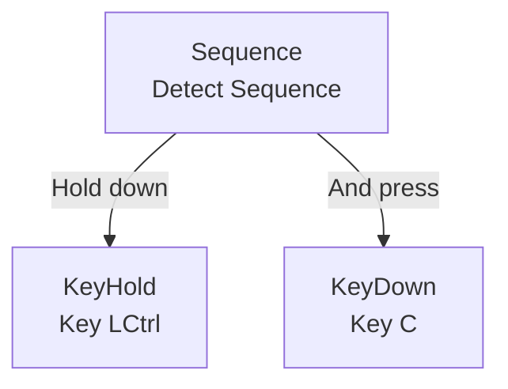
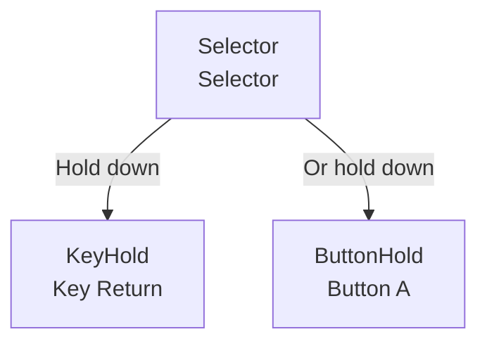

import "@site/src/languages/highlight";
import Tabs from '@theme/Tabs';
import TabItem from '@theme/TabItem';

# Using the Enhanced Input System

In game development, handling user input is a crucial part, especially when dealing with complex input sequences or Quick Time Events (QTEs). Dora SSR provides an enhanced input system that allows developers to manage various input events more efficiently and flexibly. This tutorial will guide you on how to set up and use this input system, explaining the new concepts involved in detail.

## 1. New Concepts Involved

Dora SSR's enhanced input system allows you to create complex input logic, such as multi-stage QTEs and combo keys. By using input contexts, actions, and triggers, you can precisely control how the game responds to player inputs in different states.

### 1.1 Action

An action is the basic unit in the input system that defines a set of conditions under which a behavior is triggered. For example, pressing the confirm key for confirmation, or pressing the movement key to move a character.

### 1.2 Input Context

An input context is a collection of actions that allows you to activate or deactivate a set of input actions based on the game scene. For instance, in a game menu scene, you may only need to handle navigation and selection inputs. In an in-game scene, you might need to handle a different set of inputs, such as movement and attack.

### 1.3 Trigger

A trigger defines the conditions under which an action is activated. It can be a simple key press or a complex input sequence. Dora SSR provides various types of triggers, including:

- **KeyDown**: Triggered when all specified keys are pressed.
- **KeyUp**: Triggered when all specified keys are pressed and any one of them is released.
- **KeyPressed**: Triggered when all specified keys are currently pressed.
- **KeyHold**: Triggered when a specific key is pressed and held for a specified duration.
- **KeyTimed**: Triggered when a specific key is pressed within a specified time window.
- **KeyDoubleDown**: Triggered when a specific key is double-clicked.
- **AnyKeyPressed**: Triggered when any key is continuously pressed.
- **ButtonDown**: Triggered when all specified game controller buttons are pressed.
- **ButtonUp**: Triggered when all specified game controller buttons are pressed and any one of them is released.
- **ButtonPressed**: Triggered when all specified game controller buttons are currently pressed.
- **ButtonHold**: Triggered when a specific game controller button is pressed and held for a specified duration.
- **ButtonTimed**: Triggered when a specific game controller button is pressed within a specified time window.
- **ButtonDoubleDown**: Triggered when a specific game controller button is double-clicked.
- **AnyButtonPressed**: Triggered when any game controller button is continuously pressed.
- **JoyStick**: Triggered when a specific game controller axis is moved.
- **JoyStickThreshold**: Triggered when the joystick moves beyond a specified threshold.
- **JoyStickDirectional**: Triggered when the joystick moves in a specific direction within a tolerance angle.
- **JoyStickRange**: Triggered when the joystick is within a specified range.
- **Sequence**: Requires triggers to be detected in a specific order.
- **Selector**: Triggers the action as long as any one trigger is activated.
- **Block**: Prevents other triggers from being activated.

### 1.4 Trigger State

When a trigger is activated, it will trigger a corresponding global event in the engine, which contains the current state of the trigger. There are three trigger states:

- **Ongoing**: The trigger condition is in progress.
- **Completed**: The trigger condition has been completed.
- **Canceled**: The trigger condition has been canceled.

### 1.5 Relationship between Contexts, Actions, Triggers, and Trigger States

An input context contains multiple actions, each action contains a tree-structured organization of triggers, which provide various trigger event sources and the current input state.



### 1.6 Nesting of Triggers

Here is an example of a tree-nested trigger definition used to describe a trigger for pressing the `Ctrl` key and the `C` key simultaneously:



The corresponding trigger code definition:

<Tabs groupId="language-select">
<TabItem value="lua" label="Lua">

```lua
Trigger.Sequence({
	Trigger.KeyPressed("LCtrl"),
	Trigger.KeyDown("C")
})
```

</TabItem>
<TabItem value="tl" label="Teal">

```lua
Trigger.Sequence({
	Trigger.KeyPressed("LCtrl"),
	Trigger.KeyDown("C")
})
```

</TabItem>
<TabItem value="ts" label="TypeScript">

```ts
Trigger.Sequence([
	Trigger.KeyPressed(KeyName.LCtrl),
	Trigger.KeyDown(KeyName.C)
])
```

</TabItem>
<TabItem value="yue" label="YueScript">

```yue
Trigger.Sequence [
	Trigger.KeyPressed "LCtrl"
	Trigger.KeyDown "C"
]
```

</TabItem>
</Tabs>

Here is a trigger definition for pressing and holding the keyboard `Enter` key or the game controller `A` button for 1 second to trigger a confirmation action:



The corresponding trigger code definition:

<Tabs groupId="language-select">
<TabItem value="lua" label="Lua">

```lua
Trigger.Selector({
	Trigger.KeyHold("Return", 1),
	Trigger.ButtonHold("a", 1)
})
```

</TabItem>
<TabItem value="tl" label="Teal">

```lua
Trigger.Selector({
	Trigger.KeyHold("Return", 1),
	Trigger.ButtonHold("a", 1)
})
```

</TabItem>
<TabItem value="ts" label="TypeScript">

```ts
Trigger.Selector([
	Trigger.KeyHold(KeyName.Return, 1),
	Trigger.ButtonHold(ButtonName.A, 1)
])
```

</TabItem>
<TabItem value="yue" label="YueScript">

```yue
Trigger.Selector [
	Trigger.KeyHold "Return", 1
	Trigger.ButtonHold "a", 1
]
```

</TabItem>
</Tabs>

## 2. Creating the Input System

### 2.1 Simple Input System Example 1

Here is a simple code example for creating an input system:

<Tabs groupId="language-select">
<TabItem value="lua" label="Lua">

```lua
-- Import modules
local InputManager <const> = require("InputManager")
local Trigger <const> = InputManager.Trigger
local Node <const> = require("Node")

-- Create input manager with one context and one action
local input = InputManager.CreateManager({{
	name = "testContext",
	actions = {{
		name = "Ctrl+C",
		trigger = Trigger.Sequence({
			Trigger.KeyPressed("LCtrl"),
			Trigger.KeyDown("C")
		})
	}}
}})

-- Create a node to receive and process input events
local node = Node()

-- Connect global event signals; note the "Input." prefix matches the action's name
node:gslot("Input.Ctrl+C", function(state, progress, value)
	if state == "Completed" then
		print("Ctrl+C triggered successfully")
		-- Remove the current active context, pressing Ctrl+C won't trigger again
		input:popContext()
	end
end)

-- Activate the testContext to enable its input triggers
input:pushContext("testContext")
```

</TabItem>
<TabItem value="tl" label="Teal">

```tl
-- Import modules
local InputManager <const> = require("InputManager")
local Trigger <const> = InputManager.Trigger
local Node <const> = require("Node")
local type Vec2 = require("Vec2")

-- Create input manager with one context and one action
local input = InputManager.CreateManager({{
	name = "testContext",
	actions = {{
		name = "Ctrl+C",
		trigger = Trigger.Sequence({
			Trigger.KeyPressed("LCtrl"),
			Trigger.KeyDown("C")
		})
	}}
}})

-- Create a node to receive and process input events
local node = Node()

-- Connect global event signals; note the "Input." prefix matches the action's name
node:gslot("Input.Ctrl

+C", function(state: InputManager.TriggerState, progress: number, value: number | boolean | Vec2.Type)
	if state == "Completed" then
		print("Ctrl+C triggered successfully")
		-- Remove the current active context, pressing Ctrl+C won't trigger again
		input:popContext()
	end
end)

-- Activate the testContext to enable its input triggers
input:pushContext("testContext")
```

</TabItem>
<TabItem value="ts" label="TypeScript">

```ts
import { Node, KeyName, Vec2 } from "Dora";
import { CreateManager, Trigger, TriggerState } from "InputManager";

// Create input manager with one context and one action
const inputManager = CreateManager([{
	name: "testContext",
	actions: [{
		name: "Ctrl+C",
		trigger: Trigger.Sequence([
			Trigger.KeyPressed(KeyName.LCtrl),
			Trigger.KeyDown(KeyName.C)
		])
	}]
}]);

// Create a node to receive and process input events
const node = Node();

// Connect global event signals; note the "Input." prefix matches the action's name
node.gslot("Input.Ctrl+C", (state: TriggerState, progress: number, value: number | boolean | Vec2.Type) => {
	if (state === TriggerState.Completed) {
		print("Ctrl+C triggered successfully");
		// Remove the current active context, pressing Ctrl+C won't trigger again
		inputManager.popContext();
	}
});

// Activate the testContext to enable its input triggers
inputManager.pushContext("testContext");
```

</TabItem>
<TabItem value="yue" label="YueScript">

```yue
_ENV = Dora
import "InputManager" as :CreateManager, :Trigger

-- Create input manager with one context and one action
inputManager = CreateManager [
	{
		name: "testContext"
		actions: [
			{
				name: "Ctrl+C",
				trigger: Trigger.Sequence [
					Trigger.KeyPressed "LCtrl"
					Trigger.KeyDown "C"
				]
			},
		]
	},
]

-- Create a node to receive and process input events
with Node!
	-- Connect global event signals; note the "Input." prefix matches the action's name
	\gslot "Input.Ctrl+C", (state, progress, value) ->
		if state == "Completed"
			print "Ctrl+C triggered successfully"
			-- Remove the current active context, pressing Ctrl+C won't trigger again
			inputManager\popContext!

-- Activate the testContext to enable its input triggers
inputManager\pushContext "testContext"
```

</TabItem>
</Tabs>

In this example, we created an input manager, defined an input context, and one action. The action `Ctrl+C` trigger defined the conditions for pressing the `Ctrl` key and the `C` key. We pushed this context into the input manager for activation. Then we created a scene node to receive and process input events. Finally, we connected the corresponding global event signals, printing a message when the action `Ctrl+C` is completed and removing the current active context.

:::tip Tip
When registering global event signals for handling input events, use the `Input.` prefix followed by the action's name, such as `Input.Confirm`. Note that in the global event callback function, we can retrieve the trigger's state (`state`), progress (`progress`), and value (`value`). In this example, we only handled the completion state of the action. When using triggers related to time (Hold or Timed), we can obtain the current progress of the trigger through the progress parameter (ranging from 0 to 1). When using triggers that provide varying input values (like joystick axis input), we can retrieve the current input value through the value parameter (`value`).
:::

### 2.2 Simple Input System Example 2

Here is another simple input system example, including a long-press confirmation UI interaction context and a game scene context for character movement:

<Tabs groupId="language-select">
<TabItem value="lua" label="Lua">

```lua
local InputManager <const> = require("InputManager")
local Trigger <const> = InputManager.Trigger
local Node <const> = require("Node")

-- Create input manager with two contexts and their actions
local inputManager = InputManager.CreateManager({
	{
		name = "UI",
		actions = {{
			name = "Confirm",
			trigger = Trigger.Selector({
				Trigger.KeyHold("Return", 1),
				Trigger.ButtonHold("a", 1)
			})
		}}
	},
	{
		name = "Game",
		actions = {{
			name = "MoveLeft",
			trigger = Trigger.Selector({
				Trigger.KeyPressed("Left"),
				Trigger.ButtonPressed("dpleft")
			})
		}, {
			name = "MoveRight",
			trigger = Trigger.Selector({
				Trigger.KeyPressed("Right"),
				Trigger.ButtonPressed("dpright")
			})
		}}
	}
})

-- Create a node to receive and process input events
local node = Node()

-- Connect global event signals to handle the confirm action in the UI context
node:gslot("Input.Confirm", function(state, progress)
	if state == "Ongoing" then
		print(string.format("Confirming, progress: %d", progress * 100))
	elseif state == "Completed" then
		print("Confirmation complete")
	end
end)

-- Connect global event signals to handle movement actions in the Game context
node:gslot("Input.MoveLeft", function(state)
	if state == "Completed" then
		print("Moving left")
	end
end)

node:gslot("Input.MoveRight", function(state)
	if state == "Completed" then
		print("Moving right")
	end
end)
```

</TabItem>
<TabItem value="tl" label="Teal">

```tl
local InputManager <const> = require("InputManager")
local Trigger <const> = InputManager.Trigger
local Node <const> = require("Node")

-- Create input manager with two contexts and their actions
local inputManager = InputManager.CreateManager({
	{
		name = "UI",
		actions = {{
			name = "Confirm",
			trigger = Trigger.Selector({
				Trigger.KeyHold("Return", 1),
				Trigger.ButtonHold("a", 1)
			})
		}}
	},
	{
		name = "Game",
		actions = {{
			name = "MoveLeft",
			trigger = Trigger.Selector({
				Trigger.KeyPressed("Left"),
				Trigger.ButtonPressed("dpleft")
			})
		}, {
			name = "MoveRight",
			trigger = Trigger.Selector({
				Trigger.KeyPressed("Right"),
				Trigger.ButtonPressed("dpright")
			})
		}}
	}
})

-- Create a node to receive and process input events
local node = Node()

-- Connect global event signals to handle the confirm action in the UI context
node:gslot("Input.Confirm", function(state: InputManager.TriggerState, progress: number)
	if state == "Ongoing" then
		print(string.format("Confirming, progress: %d", progress * 100))
	elseif state == "Completed" then
		print("Confirmation complete")
	end
end)

-- Connect global event signals to handle movement actions in the Game context
node:gslot("Input.MoveLeft", function(state: InputManager.TriggerState)
	if state == "Completed" then
		print("Moving left")
	end
end)

node:gslot("Input.MoveRight", function(state: InputManager.TriggerState)
	if state == "Completed" then
		print("Moving right")
	end
end)
```

</TabItem>
<TabItem value="ts" label="TypeScript">

```ts
import { Node, KeyName, ButtonName } from "Dora";
import { CreateManager, Trigger, TriggerState } from "InputManager";

// Create input manager with two contexts and their actions
const inputManager = CreateManager([
	{
		name: "UI",
		actions: [{
			name: "Confirm",
			trigger: Trigger.Selector([
				Trigger.KeyHold(KeyName.Return, 1),
				Trigger.ButtonHold(ButtonName.A, 1)
			])
		}]
	},
	{
		name: "Game",
		actions: [{
			name: "MoveLeft",
			trigger: Trigger.Selector([
				Trigger.KeyPressed(KeyName.Left),
				Trigger.ButtonPressed(ButtonName.Left)
			])
		}, {
			name: "MoveRight",
			trigger: Trigger.Selector([
				Trigger.KeyPressed(KeyName.Right),
				Trigger.ButtonPressed(ButtonName.Right)
			])
		}]
	}
]);

// Create a node to receive and process input events
const node = Node();

// Connect global event signals to handle the confirm action in the UI context
node.gslot("Input.Confirm", (state: TriggerState, progress: number) => {
	if (state === TriggerState.Ongoing) {
		print(`Confirming, progress: ${progress * 100}`);
	} else if (state === TriggerState.Completed) {
		print("Confirmation complete");
	}
});

// Connect global event signals to handle movement actions in the Game context
node.gslot("Input.MoveLeft", (state: TriggerState) => {
	if (state === TriggerState.Completed) {
		print("Moving left");
	}
});

node.gslot("Input.MoveRight", (state: TriggerState) => {
	if (state === TriggerState.Completed) {
		print("Moving right");
	}
});
```

</TabItem>
<TabItem value="yue" label="YueScript">

```yue
_ENV = Dora
import "InputManager" as :CreateManager, :Trigger

-- Create input manager with two contexts and their actions
inputManager = CreateManager [
	{
		name: "UI"
		actions: [
			{
				name: "Confirm"
				trigger: Trigger.Selector [
					Trigger.KeyHold "Return", 1
					Trigger.ButtonHold "a", 1
				]
			}
		]
	},
	{
		name: "Game"
		actions: [
			{
				name: "MoveLeft"
				trigger: Trigger.Selector [
					Trigger.KeyPressed "Left"
					Trigger.ButtonPressed "dpleft"
				]
			},
			{
				name: "MoveRight"
				trigger: Trigger.Selector [
					Trigger.KeyPressed "Right"
					Trigger.ButtonPressed "dpright"
				]
			}
		]
	}
]

-- Create a node to receive and process input events
with Node!
	-- Connect global event signals to handle the confirm action in the UI context
	\gslot "Input.Confirm", (state, progress) ->
		if state == "Ongoing"
			print "Confirming, progress: " + progress * 100
		elseif state == "Completed"
			print "Confirmation complete"

	-- Connect global event signals to handle movement actions in the Game context
	\gslot "Input.MoveLeft", (state) ->
		if state == "Completed"
			print "Moving left"

	\gslot "Input.MoveRight", (state) ->
		if state == "Completed"
			print "Moving right"
```

</TabItem>
</Tabs>

In this example, we created an input manager that includes two contexts: `UI` and `Game`. The `UI` context contains a long-press confirmation action `Confirm`, while the `Game` context contains two movement actions `MoveLeft` and `MoveRight`. We created a node to receive and process input events. We then connected the global event signals to handle the confirm action in the UI context and the movement actions in the Game context.

When handling the confirm action in the UI context, we can also retrieve the current trigger state and the long-press progress. When handling the movement actions in the Game context, we only need to handle the action completion state.

In actual games, we can dynamically activate or deactivate different input contexts based on the current game state to achieve different input logic. When needing to activate or deactivate a context, simply call the `pushContext` or `popContext` methods.

<Tabs groupId="language-select">
<TabItem value="lua" label="Lua">

```lua
-- Assuming we are currently in a game operation scene
-- Activate the Game context to start handling character movement
inputManager:pushContext("Game")

-- Assuming we need to open a UI interface for a confirmation operation
-- Activate the UI context, automatically deactivating the Game context
inputManager:pushContext("UI")

-- Assuming the UI interface is now closed
-- Deactivate the UI context, then the remaining Game context on the stack will be reactivated
inputManager:popContext()

-- Assuming you need to activate both Game and UI contexts simultaneously to accept two types of input
inputManager:pushContext({"UI", "Game"})

-- Popping the context from the top of the stack
-- Will deactivate the just activated group of two contexts
inputManager:popContext()
```

</TabItem>
<TabItem value="tl" label="Teal">

```tl
-- Assuming we are currently in a game operation scene
-- Activate the Game context to start handling character movement
inputManager:pushContext("Game")

-- Assuming we need to open a UI interface for a confirmation operation
-- Activate the UI context, automatically deactivating the Game context
inputManager:pushContext("UI")

-- Assuming the UI interface is now closed
-- Deactivate the UI context, then the remaining Game context on the stack will be reactivated
inputManager:popContext()

-- Assuming you need to activate both Game and UI contexts simultaneously to accept two types of input
inputManager:pushContext({"UI", "Game"})

-- Popping the context from the top of the stack
-- Will deactivate the just activated group of two contexts
inputManager:popContext()
```

</TabItem>
<TabItem value="ts" label="TypeScript">

```ts
// Assuming we are currently in a game operation scene
// Activate the Game context to start handling character movement
inputManager.pushContext("Game");

// Assuming we need to open a UI interface for a confirmation operation
// Activate the UI context, automatically deactivating the Game context
inputManager.pushContext("UI");

// Assuming the UI interface is now closed
// Deactivate the UI context, then the remaining Game context on the stack will be reactivated
inputManager.popContext();

// Assuming you need to activate both Game and UI contexts simultaneously to accept two types of input
inputManager.pushContext(["UI", "Game"]);

// Popping the context from the top of the stack
// Will deactivate the just activated group of two contexts
inputManager.popContext();
```

</TabItem>
<TabItem value="yue" label="YueScript">

```yue
-- Assuming we are currently in a game operation scene
-- Activate the Game context to start handling character movement
inputManager\pushContext "Game"

-- Assuming we need to open a UI interface for a confirmation operation
-- Activate the UI context, automatically deactivating the Game context
inputManager\pushContext "UI"

-- Assuming the UI interface is now closed
-- Deactivate the UI context, then the remaining Game context on the stack will be reactivated
inputManager\popContext!

-- Assuming you need to activate both Game and UI contexts simultaneously to accept two types of input
inputManager\pushContext ["UI", "Game"]

-- Popping the context from the top of the stack
-- Will deactivate the just activated group of two contexts
inputManager\popContext!
```

</TabItem>
</Tabs>

In this example, we demonstrated how to dynamically activate or deactivate different input contexts to switch between different input logics.

:::tip Tip
Only the context at the top of the input manager stack will be effective, while contexts not at the top will be automatically deactivated. This mechanism helps you keep track of historical input contexts for reactivation when needed.
:::

## 3. Implementing Complex Input Logic

In the previous examples, we created a simple input system with one context and one action. Now, we will delve into how to use triggers to implement more complex input logic, such as multi-stage Quick Time Events (QTE).

### 3.1 Defining QTE Context

To implement multi-stage QTEs, we can create a function to generate the input context for each stage. Each stage has specific keys or buttons and corresponding time windows.

<Tabs groupId="language-select">
<TabItem value="lua" label="Lua">

```lua
local InputManager <const> = require("InputManager")
local Trigger <const> = InputManager.Trigger

-- Function to define a QTE challenge input context supporting both keyboard and game controller buttons
local function QTEContext(contextName, keyName, buttonName, timeWindow)
	return {
		name = contextName,
		actions = {{
			name = "QTE",
			trigger = Trigger.Sequence({
				Trigger.Selector({
					-- Trigger for filtering specific keyboard keys
					-- Trigger failure on pressing the wrong key
					Trigger.Selector({
						Trigger.KeyPressed(keyName),
						Trigger.Block(Trigger.AnyKeyPressed())
					}),
					-- Trigger for filtering specific game controller buttons
					-- Trigger failure on pressing the wrong button
					Trigger.Selector({
						Trigger.ButtonPressed(buttonName),
						Trigger.Block(Trigger.AnyButtonPressed())
					})
				}),
				-- Trigger to detect pressing the specified key or button within the designated time window
				Trigger.Selector({
					Trigger.KeyTimed(keyName, timeWindow),
					Trigger.ButtonTimed(buttonName, timeWindow)
				})
			})
		}}
	end
end
```

</TabItem>
<TabItem value="tl" label="Teal">

```tl
local InputManager <const> = require("InputManager")
local type Keyboard = require("Keyboard")
local type Controller = require("Controller")
local Trigger <const> = InputManager.Trigger

-- Function to define a QTE challenge input context supporting both keyboard and game controller buttons
local function QTEContext(contextName: string, keyName: Keyboard.KeyName, buttonName: Controller.ButtonName, timeWindow: number): InputManager.InputContext
	return {
		name = contextName,
		actions = {{
			name = "QTE",
			trigger = Trigger.Sequence({
				Trigger.Selector({
					-- Trigger for filtering specific keyboard keys
					-- Trigger failure on pressing the wrong key
					Trigger.Selector({
						Trigger.KeyPressed(keyName),
						Trigger.Block(Trigger.AnyKeyPressed())
					}),
					-- Trigger for filtering specific game controller buttons
					-- Trigger failure on pressing the wrong button
					Trigger.Selector({
						Trigger.ButtonPressed(buttonName),
						Trigger.Block(Trigger.AnyButtonPressed())
					})
				}),
				-- Trigger to detect pressing the specified key or button within the designated time window
				Trigger.Selector({
					Trigger.KeyTimed(keyName, timeWindow),
					Trigger.ButtonTimed(buttonName, timeWindow)
				})
			})
		}}
	end
end
```

</TabItem>
<TabItem value="ts" label="TypeScript">

```ts
import { KeyName, ButtonName } from "Dora";
import { CreateManager, Trigger, InputContext } from "InputManager";

// Function to define a QTE challenge input context supporting both keyboard and game controller buttons
function QTEContext(contextName: string, keyName: KeyName, buttonName: ButtonName, timeWindow: number): InputContext {
	return {
		name: contextName,
		actions: [{
			name: "QTE",
			trigger: Trigger.Sequence([
				Trigger.Selector([
					// Trigger for filtering specific keyboard keys
					// Trigger failure on pressing the wrong key
					Trigger.Selector([
						Trigger.KeyPressed(keyName),
						Trigger.Block(Trigger.AnyKeyPressed())
					]),
					// Trigger for filtering specific game controller buttons
					// Trigger failure on pressing the wrong button
					Trigger.Selector([
						Trigger.ButtonPressed(buttonName),
						Trigger.Block(Trigger.AnyButtonPressed())
					])
				]),
				// Trigger to detect pressing the specified key or button within the designated time window
				Trigger.Selector([
					Trigger.KeyTimed(keyName, timeWindow),
					Trigger.ButtonTimed(buttonName, timeWindow)
				])
			])
		}]
	};
}
```

</TabItem>
<TabItem value="yue" label="YueScript">

```yue
_ENV = Dora
import "InputManager" as :Trigger

-- Function to define a QTE challenge input context supporting both keyboard and game controller buttons
QTEContext = (contextName, keyName, buttonName, timeWindow) -> return
	name: contextName
	actions: [
		{
			name: "QTE"
			trigger: Trigger.Sequence [
				Trigger.Selector [
					-- Trigger for filtering specific keyboard keys
					-- Trigger failure on pressing the wrong key
					Trigger.Selector [
						Trigger.KeyPressed keyName
						Trigger.Block Trigger.AnyKeyPressed!
					]
					-- Trigger for filtering specific game controller buttons
					-- Trigger failure on pressing the wrong button
					Trigger.Selector [
						Trigger.ButtonPressed buttonName
						Trigger.Block Trigger.AnyButtonPressed!
					]
				]
				-- Trigger to detect pressing the specified key or button within the designated time window
				Trigger.Selector [
					Trigger.KeyTimed keyName, timeWindow
					Trigger.ButtonTimed buttonName, timeWindow
				]
			]
		},
	]
```

</TabItem>
</Tabs>

In this function:

- **contextName**: The name of the context used to identify the current QTE stage.
- **keyName**: The name of the specified keyboard key.
- **buttonName**: The name of the specified game controller button.
- **timeWindow**: The time window within which the input must be completed, measured in seconds.

The trigger uses **Trigger.Sequence** to combine triggers, requiring only the specified key or button to be pressed, otherwise triggering a failure. As long as the correct key or button is pressed within the designated time window, it will trigger successfully.

### 3.2 Creating Input Manager and Adding QTE Context

Now, we will create an input manager and add the default context along with multiple QTE stage contexts.

<Tabs groupId="language-select">
<TabItem value="lua" label="Lua">

```lua
-- Create input manager and add contexts
local inputManager = InputManager.CreateManager({
	{
		name = "Default",
		actions = {{
			name = "StartQTE",
			-- Press the space bar or start button to initiate the QTE challenge
			trigger = Trigger.Selector({
				Trigger.KeyDown("Space"),
				Trigger.ButtonDown("start")
			})
		}}
	},
	-- Add QTE stage contexts
	QTEContext("Phase1", "J", "a", 3), -- Phase 1: Press key J or button A within 3 seconds
	QTEContext("Phase2", "K", "b", 2), -- Phase 2: Press key K or button B within 2 seconds
	QTEContext("Phase3", "L", "x", 1) -- Phase 3: Press key L or button X within 1 second
})

-- Activate the default context
inputManager:pushContext("Default")
```

</TabItem>
<TabItem value="tl" label="Teal">

```tl
-- Create input manager and add contexts
local inputManager = InputManager.CreateManager({
	{
		name = "Default",
		actions = {{
			name = "StartQTE",
			-- Press the space bar or start button to initiate the QTE challenge
			trigger = Trigger.Selector({
				Trigger.KeyDown("Space"),
				Trigger.ButtonDown("start")
			})
		}}
	},
	-- Add QTE stage contexts
	QTEContext("Phase1", "J", "a", 3), -- Phase 1: Press key J or button A within 3 seconds
	QTEContext("Phase2", "K", "b", 2), -- Phase 2: Press key K or button B within 2 seconds
	QTEContext("Phase3", "L", "x", 1) -- Phase 3: Press key L or button X within 1 second
})

-- Activate the default context
inputManager:pushContext("Default")
```

</TabItem>
<TabItem value="ts" label="TypeScript">

```ts
// Create input manager and add contexts
const inputManager = CreateManager([
	{
		name: "Default",
		actions: [{
			name: "StartQTE",
			// Press the space bar or start button to initiate the QTE challenge
			trigger: Trigger.Selector([
				Trigger.KeyDown(KeyName.Space),
				Trigger.ButtonDown(ButtonName.Start)
			])
		}]
	},
	// Add QTE stage contexts
	QTEContext("Phase1", KeyName.J, ButtonName.A, 3), // Phase 1: Press key J or button A within 3 seconds
	QTEContext("Phase2", KeyName.K, ButtonName.B, 2), // Phase 2: Press key K or button B within 2 seconds
	QTEContext("Phase3", KeyName.L, ButtonName.X, 1) // Phase 3: Press key L or button X within 1 second
]);

// Activate the default context
inputManager.pushContext("Default");
```

</TabItem>
<TabItem value="yue" label="YueScript">

```yue
-- Create input manager and add contexts
inputManager = InputManager.CreateManager [
	{
		name: "Default"
		actions: [
			{
				name: "StartQTE"
				-- Press the space bar or start button to initiate the QTE challenge
				trigger: Trigger.Selector [
					Trigger.KeyDown "Space"
					Trigger.ButtonDown "start"
				]
			},
		]
	}
	-- Add QTE stage contexts
	QTEContext "Phase1", "J", "a", 3 -- Phase 1: Press key J or button A within 3 seconds
	QTEContext "Phase2", "K", "b", 2 -- Phase 2: Press key K or button B within 2 seconds
	QTEContext "Phase3", "L", "x", 1 -- Phase 3: Press key L or button X within 1 second
]

-- Activate the default context
inputManager\pushContext "Default"
```

</TabItem>
</Tabs>

Here, we:

- Created a default context containing the action **StartQTE** to initiate the QTE.
- Used the **QTEContext** function to add three QTE stage contexts: **Phase1**, **Phase2**, and **Phase3**.

### 3.3 Handling Input Events

Next, we need to handle input events, particularly the QTE logic. We will create a node and connect the corresponding global event signals.

<Tabs groupId="language-select">
<TabItem value="lua" label="Lua">

```lua
local Node <const> = require("Node")

-- Create node
local node = Node()

-- Define the current QTE phase
local phase = "None"
local contextCount = 1

-- Logic to handle moving to the next QTE phase
local function nextPhase()
	-- 1 -> 2
	if phase == "Phase1" then
		phase = "Phase2"
		print("Press key K or button B")
	-- 2 -> 3
	elseif phase == "Phase2" then
		phase = "Phase3"
		print("Press key L or button X")
	-- 3 -> End
	elseif phase == "Phase3" then
		phase = "None"
		inputManager:popContext(contextCount)
		print("Challenge successful!")
		return
	end

	-- Activate the next phase context
	inputManager:pushContext(phase)
	contextCount = contextCount + 1
end

-- Handle input event to start the QTE challenge
node:gslot("Input.StartQTE", function(state)
	if state == "Completed" then
		phase = "Phase1"
		print("Press key J or button A")
		inputManager:pushContext(phase)
		contextCount = contextCount + 1
	end
end)

-- Handle input events for the QTE
node:gslot("Input.QTE", function(state, progress)
	if state == "Ongoing" then
		-- Handle the countdown progress of the QTE; progress is a value increasing from 0 to 1
		-- print(string.format("Progress: %.2f", progress))
	elseif state == "Canceled" then
		if phase ~= "None" then
			phase = "None"
			inputManager:popContext(contextCount)
			print("Challenge failed!")
		end
	elseif state == "Completed" then
		nextPhase()
	end
end)

print("Press space bar or start button to initiate QTE challenge")
```

</TabItem>
<TabItem value="tl" label="Teal">

```tl
local Node <const> = require("Node")

-- Create node
local node = Node()

-- Define the current QTE phase
local phase = "None"
local contextCount = 1

-- Logic to handle moving to the next QTE phase
local function nextPhase()
	-- 1 -> 2
	if phase == "Phase1" then
		phase = "Phase2"
		print("Press key K or button B")
	-- 2 -> 3
	elseif phase == "Phase2" then
		phase = "Phase3"
		print("Press key L or button X")
	-- 3 -> End
	elseif phase == "Phase3" then
		phase = "None"
		inputManager:popContext(contextCount)
		print("Challenge successful!")
		return
	end

	-- Activate the next phase context
	inputManager:pushContext(phase)
	contextCount = contextCount + 1
end

-- Handle input event to start the QTE challenge
node:gslot("Input.StartQTE", function(state: InputManager.TriggerState)
	if state == "Completed" then
		phase = "Phase1"
		print("Press key J or button A")
		inputManager:pushContext(phase)
		contextCount = contextCount + 1
	end
end)

-- Handle input events for the QTE
node:gslot("Input.QTE", function(state: InputManager.TriggerState, progress: number)
	if state == "Ongoing" then
		-- Handle the countdown progress of the QTE; progress is a value increasing from 0 to 1
		-- print(string.format("Progress: %.2f", progress))
	elseif state == "Canceled" then
		if phase ~= "None" then
			phase = "None"
			inputManager:popContext(contextCount)
			print("Challenge failed!")
		end
	elseif state == "Completed" then
		nextPhase()
	end
end)

print("Press space bar or start button to initiate QTE challenge")
```

</TabItem>
<TabItem value="ts" label="TypeScript">

```ts
import { Node } from "Dora";
import { TriggerState } from "InputManager";

// Create node
const node = Node();

// Define the current QTE phase
let phase = "None";
let contextCount = 1;

// Logic to handle moving to the next QTE phase
function nextPhase() {
	switch (phase) {
		// 1 -> 2
		case "Phase1":
			phase = "Phase2";
			print("Press key K or button B");
			break;
		// 2 -> 3
		case "Phase2":
			phase = "Phase3";
			print("Press key L or button X");
			break;
		// 3 -> End
		case "Phase3":
			phase = "None";
			inputManager.popContext(contextCount);
			print("Challenge successful!");
			return;
	}

	// Activate the next phase context
	inputManager.pushContext(phase);
	contextCount++;
}

// Handle input event to start the QTE challenge
node.gslot("Input.StartQTE", (state: TriggerState) => {
	if (state === TriggerState.Completed) {
		phase = "Phase1";
		print("Press key J or button A");
		inputManager.pushContext(phase);
		contextCount++;
	}
});

// Handle input events for the QTE
node.gslot("Input.QTE", (state: TriggerState, progress: number) => {
	if (state === "Ongoing") {
		// Handle the countdown progress of the QTE; progress is a value increasing from 0 to 1
		// print(`Progress: ${progress.toFixed(2)}`);
	} else if (state === "Canceled") {
		if (phase !== "None") {
			phase = "None";
			inputManager.popContext(contextCount);
			print("Challenge failed!");
		}
	} else if (state === "Completed") {
		nextPhase();
	}
});

print("Press space bar or start button to initiate QTE challenge");
```

</TabItem>
<TabItem value="yue" label="YueScript">

```yue
-- Create node
node = Node!

-- Define the current QTE phase
phase = "None"
contextCount = 1

-- Logic to handle moving to the next QTE phase
nextPhase = ->
	-- 1 -> 2
	switch phase when "Phase1"
		phase = "Phase2"
		print "Press key K or button B"
	-- 2 -> 3
	when "Phase2"
		phase = "Phase3"
		print "Press key L or button X"
	-- 3 -> End
	when "Phase3"
		phase = "None"
		inputManager\popContext contextCount
		print "Challenge successful!"
		return

	-- Activate the next phase context
	inputManager\pushContext phase
	contextCount += 1

-- Handle input event to start the QTE challenge
node\gslot "Input.StartQTE", (state) ->
	if state == "Completed"
		phase = "Phase1"
		print "Press key J or button A"
		inputManager\pushContext phase
		contextCount += 1

-- Handle input events for the QTE
node\gslot "Input.QTE", (state, progress) ->
	switch state when "Ongoing"
		-- Handle the countdown progress of the QTE; progress is a value increasing from 0 to 1
		-- print "Progress: " + progress.toFixed(2)
	when "Canceled"
		if phase ~= "None"
			phase = "None"
			inputManager\popContext contextCount
			print "Challenge failed!"
	when "Completed"
		nextPhase!

print "Press space bar or start button to initiate QTE challenge"
```

</TabItem>
</Tabs>

In this code:

- Handle the global event **Input.StartQTE**: When the action to start the QTE is completed, it enters the **Phase1** stage and activates the corresponding context.
- Handle the global event **Input.QTE**: Based on the current phase, it processes the QTE logic. When the trigger completes, it moves to the next phase; when the trigger is canceled, it indicates failure.

## 4. Summary

Through this tutorial, you have learned how to use Dora SSR's enhanced input system to create complex input logic, including multi-stage Quick Time Events (QTEs). We explored the concepts of input contexts, actions, and triggers, as well as how to use them to precisely control the game's responses in different states.

Next, you can try applying this knowledge in your own projects to create richer and more interactive gaming experiences.
