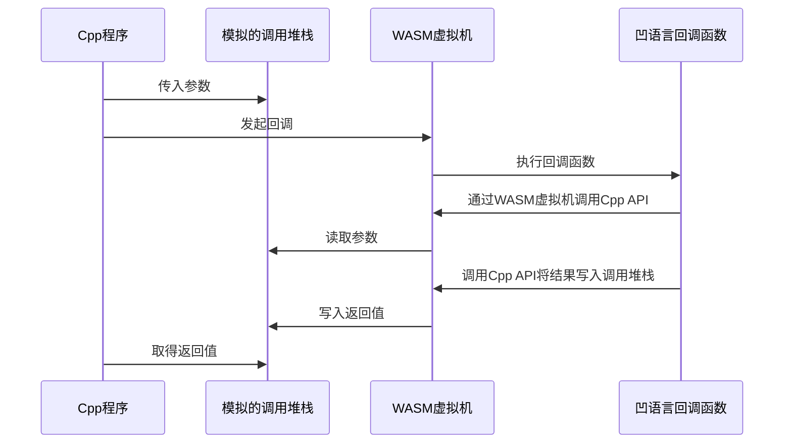
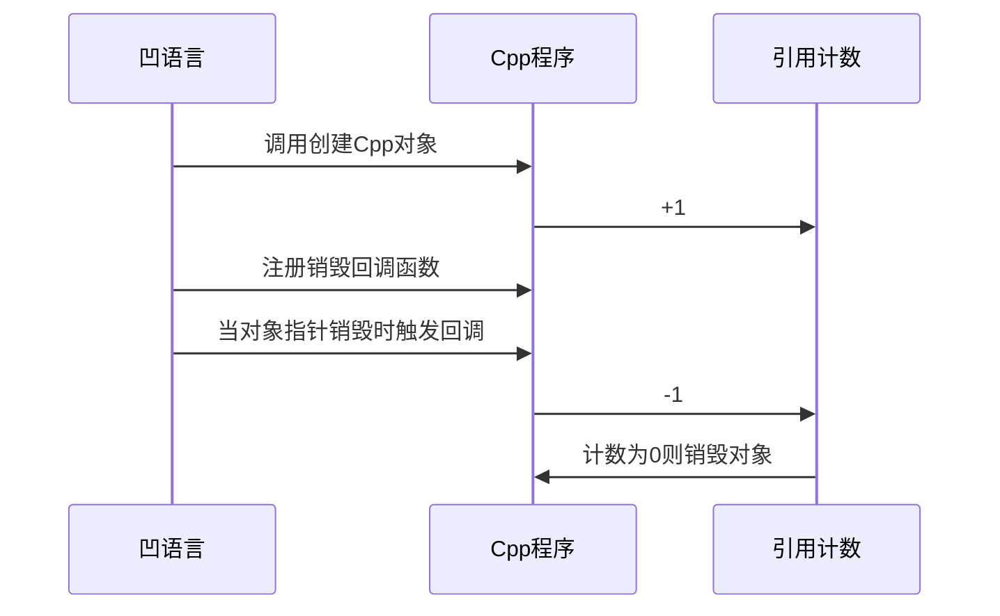

## 一、故事的开端

关注凹语言团队并“潜伏”在他们社区群中也一年有余，突然被他们发表的一篇为开源精神正本溯源的文章感染了。其实也一直在关注了解他们开源项目发展生存的进展，我作为 Dora SSR 项目的核心贡献者，知道其实我们都一样，同为底层打工人阶级出身的开源作者，不是站在高处往下看的人，而是混迹在沙丁鱼罐中挣扎的鲶鱼。

所以在这里先高调的宣布吧，我们优先实现了使用**凹语言结合 Dora SSR 游戏引擎开发跨平台游戏**的功能！

<!-- truncate -->

## 二、学习编程语言就像给自己织茧

Dora SSR 游戏引擎的目标则是打造一个包容、多样化的引擎生态。很多关注者都会非常疑惑为什么这个引擎要支持那么多的编程语言，而且目前已经官方提供了用作热更新脚本的 Lua、Teal、YueScript、TypeScript、TSX 和 Rust 语言的支持，还是不满足。作为一个写了很多年代码和各式各样项目的“**老东西**”，我最能体会的一件事，就是没有一种编程语言是完美的，如果发现一种语言秒天秒地什么都能做，那只能说明是自己缺乏跨不同领域开发做动手实践的经验和认知，或者是编程语言接触的还不够多缺乏编程审美力，只能被人生先入为主的一两种编程语言劫持认知（暴论结束）。

## 三、正式谈谈凹语言的使用体验

给 Dora SSR 游戏引擎接入凹语言（即提供 FFI 支持）很简单，分为三步：

- 1、复用引擎为 Rust 语言导出的 C API 接口。

- 2、在凹语言中导入 C API 接口。

- 3、为凹语言手工编写和自动生成 C API 的包装接口代码，提供符合凹语言风格的开发体验。

然后就可以使用凹语言开发游戏啦！

但是说的这么轻巧简单是骗人的，实际上的真实接入流程是这样：

Dora SSR 是一个主要使用 C++ 语言开发的游戏引擎。通过内嵌的 WASM3 虚拟机来解释执行凹语言编译为的 WASM 二级制代码，并提供对引擎的调用功能。Dora C++ 这边的接口筛选出发挥引擎必要的功能的子集目前有 1000 多个，手写这些接口的包装代码需要花费大量的时间，而且这些接口的代码需要随着引擎的更新而更新，所以需要一个自动化的工具来生成这些接口的代码。

所以我们的自动化工具需要完成的事，举个最简单的例子：

- a. 我有一个 C++ 接口：

```cpp
class App {
public:
    int32_t getTargetFPS();
};

#define SharedApplication \
    Singleton<Application>::shared()
```

- b. 变成一个 C 语言的导出接口：

```c
extern "C" {
    int32_t application_get_target_fps() {
        return SharedApplication.getTargetFPS();
    }
}
```

- c. 再变成一个凹语言的导入接口：

```go
#wa:import dora application_get_target_fps
func application_get_target_fps() => i32
```

- d. 最终变成一个成熟的凹语言调用的接口：

```go
type _App :struct {}
func _App.GetTargetFPS() => i32 {
    return application_get_target_fps()
}
global App = _App{}
```

- e. 在凹语言程序中进行调用：

```go
import "dora"

func init {
    println(dora.App.GetTargetFPS())
}
```

其中 b, c, d 这三步主要就是需要批量由工具自动完成的步骤。

但是举的这个例子是最简单的情形，大家都知道 C++ 语言中的机制花样多得很。我们跨语言要传递的东西除了基础数据类型，还有对象、对象的继承关系、对象在继承链上的类型转换、字符串对象、存有各种类型数据和对象的数组、C++ 和凹语言互相调用的回调函数、枚举类型数据、对于函数还有静态函数、成员变量函数、类的静态成员函数等等。搞完了对象的传递，一个更加棘手的问题就是对象的生命周期要怎么管理，C++ 管 C++，凹语言管凹语言，然后跨语言之间还要互相引用对象互相管理。

各种各样的细节这里讲不过来就请大家去看源码吧（不负责任）。

篇幅不够平台不给推流也就白写了，这里就再介绍个比较有趣的绑定处理机制。就是关于跨语言调用回调函数的。大家都知道 C/C++ 的世界（以及很多语言的世界）里，函数调用传参数的核心是通过一个编译器生成的调用堆栈来在函数体中传入参数以及取出返回值。跨语言的时候通常两边语言机制的调用堆栈并不能直接互相访问，那么是不是可以通过自己编写一个两边语言都能访问的调用堆栈，用来模拟跨语言之间传递参数，以及获取返回值的函数回调调用呢？这个思路当然可以。

比如我们写游戏循环通常会需要注册一个每个游戏帧里都被调用的 Update 更新函数。可能会有一个这样的 C++ 接口：

```cpp
void GameScheduleUpdate(const std::function<bool(double)>& updateFunc);
```

我们就先实现一个函数调用堆栈：

```cpp
class CallStack {
public:
    void push(double v);
    void push(bool v);
    double popDouble();
    bool popBool();
};
```

提供 C 包装函数：

```cpp
extern "C" {
    int64_t new_call_stack() { /* 创建 CallStack 对象 */ }
    void call_stack_push_bool(int64_t stack, int32_t v) { /* bool 入栈 */ }
    int64_t call_stack_pop_f64(int64_t stack) { /* double 出栈 */ }

    void game_schedule_update(int32_t funcId, int64_t stack) {
        std::shared_ptr<void> deref(nullptr, [funcId](auto) {
            SharedWasmRuntime.deref(funcId);
        });
        auto args = reinterpret_cast<CallStack*>(stack);
        GameScheduleUpdate([funcId, args, deref](double deltaTime) {
            args->push(deltaTime); // 给凹语言传参
            SharedWasmRuntime.invoke(funcId); // 执行回调
            return args->popBool(); // 从凹语言取返回值
        });
    }
}
```

在凹语言这边提供注册 Update 回调函数的接口：

```go
#wa:import dora new_call_stack
func new_call_stack() => i64
#wa:import dora call_stack_push_bool
func call_stack_push_bool(stack: i64, v: i32)
#wa:import dora call_stack_pop_f64
func call_stack_pop_f64(stack: i64) => f64

#wa:import dora game_schedule_update
func game_schedule_update(funcId: i32, stack: i64)

func _Game.ScheduleUpdate(update_func: func(delta_time: f64) => bool) {
    stack := new_call_stack()
    func_id := PushFunction(func() {
        delta_time := call_stack_pop_f64(stack) // 从 C++ 取得传参
        result := 0
        if update_func(delta_time) { // 执行实际的回调
            result = 1
        }
        call_stack_push_bool(stack, result) // 给 C++ 传返回值
    })
    game_schedule_update(func_id, stack)
}
```

在凹程序中就可以这样使用清爽的程序接口啦：

```go
import "dora"

func init() {
    dora.Game.ScheduleUpdate(func(delta_time: f64) => bool {
        println(delta_time)
        return false
    })
}
```

在实际运行中，其实还要比看起来的方案更复杂一点，因为凹语言是一门运行在 WASM 虚拟机上的语言，两个语言的互动实际还要经过 WASM 虚拟机这个“中间商”来完成。实际执行回调的流程大概会像是这样：



其实这个图中还简化了一些东西，比如 C++ 程序与 WASM 虚拟机之间的调用，也是走了一套额外的通过 WASM 虚拟机模拟调用堆栈的流程。所以可以看到当前的方案对于跨语言函数回调的实现，还是有一定的性能损耗，未来也许会研究有没有办法直接访问复用 WASM 虚拟机的调用堆栈，来优化性能。

然后再简单聊聊对象生命周期的管理的问题。如果不能从语言层面找到能自动并正确托管 C++ 对象生命周期的机制，那我们在新的编程语言环境中就只有手动管理对象的释放，比如需要满世界不能多不能少的准确安排调用一次`obj.Destroy()`的方法来释放对象，这种硬核刀耕火种的内存管理方式会让急着写游戏玩法脚本的我们累到奔溃。

好在凹语言有个优势就是和引擎 C++ 这边的机制都同样是走了引用计数的方式。甚至有语义非常相似的，通过引用计数管理指针指向对象的机制，所以我们就只要这样做：



## 四、实践中遇到的困难

原理先聊到这里，下面聊一下实践中遇到的难题。

### 困难一：凹语言作者告诉我别用这个语言

要先说回为什么对凹语言这么感兴趣，而且实际上 Dora SSR 引擎中已经实现了 Rust 语言的 WASM 绑定，Rust 语言对于 C++ 老手的体验来讲什么都好，几乎快要“秒天秒地”。但是要用来快速开发和迭代游戏逻辑层的玩法的话，我其实是有些犯怵的。就像你就想好好写个作业，结果旁边坐了一个老师直勾勾地盯着你写的每一个字，不停的骂你，有时因为不够懂老师的规矩，结果导致做作业过程中增加了和老师争执以及妥协重写一遍作业的时间。

凹语言完全走向了 Rust 语言的反面。类 Go 语言的设计，强调语言规则的极简。

不整那么多有的没的语法智力挑战和强制要优雅美丽的编码方式。用完全没法花哨的极简语法集就快速糊你的业务逻辑。这个风格我也很喜欢，以至于在初期和凹语言核心作者交流时，被警告这个项目可能还不成熟，请不要报太大期望下，我说，吃螃蟹还是得吃，Rust 螃蟹（此处有 Rust logo）吃得，凹有什么吃不得呢。大不了遇到语言的 bug 我就参与贡献解决一下。然后困难二就来了，我真遇到了语言的 bug 就参与贡献了一下。

### 困难二：软件工程之天道难违

其实说到这个事，我老实交代一下，Dora SSR 开源游戏引擎项目也有一摸一样的问题。研发开源软件的事，既然叫做软件研发，那自然得面对软件工程的现实问题。以前大家都喜欢吐槽开源项目就是种新颖的无酬劳众包测试（团伙型劳动力白嫖），要研发一个成熟稳定功能强大的软件，采取稳健的需求设计开发测试的实施路径，投入充足的人力时间都是必不可少的。作为个人业余时间的开源开发者，再是以一当十的天才，也很难以个人投入去匹配所需的资源成本去做出期望的完美软件。所以要用开源白嫖，错了，要用开源共建的方式，搞持久战和人民战争，才有可能性在去资本加持的模式下去实现一些奇观，创造出所有人平等可得的技术资产。

然后我在做凹语言绑定过程中确实遇上了一些具体是语言编译器的 bug，刚上手几天就就给作者来了个 issue 5 连发。其中一个 issue 因为不修复我的代码就无法运行，只好去通读研究凹语言编译器的源码找到了修复方案。

所以提了这个 issue：https://github.com/wa-lang/wa/issues/67

以及这个对应的修复 pr：https://github.com/wa-lang/wa/pull/68

其实我感觉开源项目往往会有个奇怪的规律，如果你有看到被提 issue 越多的项目，很可能你在亲自上手使用的时候遇到的问题就越少。用户试用发现并提交问题也是构建软件项目客观需要的劳动力投入。你帮助一个开源项目发现的问题越多，能带来的结果就是这个开源项目长期的问题会越少。这个互动模式是很健康的，也是开源软件项目的魅力所在，你不只是一个无关紧要旁观者，哪怕只是参与观测和试用也会是建设它的重要力量，最重要的是，建设结果也是和你共享的。

### 困难三：路在何方

你有没有发现这篇文章还没有提到大家都喜欢的大模型？不蹭一下吗？

因为在当下开发一门新语言大概率会和大模型辅助绝缘了（不是）。当然凹语言暂时还算好一点，毕竟是 Go like 的语言，差异化目前还不够大，为 Go 语言生成的代码，凹也能勉强改改用。很多人在想有 AI 大模型，编程开发已经没有价值了，那只是资方老板期待的平行宇宙。作为通过实践创造真实世界的开发者，这个世界是什么样，还不是得经由自己的感受去认知，并由自己的双手去直接创造的。作为 WASM 上原生语言的探索，我体会到凹的价值是很大的，比如我是没法上手去研究 Rust 语言那么复杂的工程是怎么实现编译到 WASM 并做交互的，但是研究凹的过程确实帮助到我快速上手了解到非常多的 WASM 知识细节。因为有了这样的实践体验，所以我能切身接受到作者们发起一门新的语言带来的实际价值。

所以，在这里呼吁大家也一起来参与开启编程语言的创作浪潮吧。无论是创作 native，WASM，还是 Lua  虚拟机上的转译语言。用“一人一言”去构建一个由每一个个人主导而非自动生成的新世界。只要你敢发明新的编程语言，我都敢通过 Dora SSR 开源项目给你的作品也接入一个创作游戏的运行时，扩展你的作品边界。详情请进群咨询：512620381（Dora 引擎 Q 群非诈骗）

## 五、相关代码仓库链接

- Dora SSR 的凹语言开发包：https://github.com/IppClub/dora-wa
- 凹语言：https://github.com/wa-lang/wa
- Dora SSR 开源游戏引擎：https://github.com/IppClub/Dora-SSR
