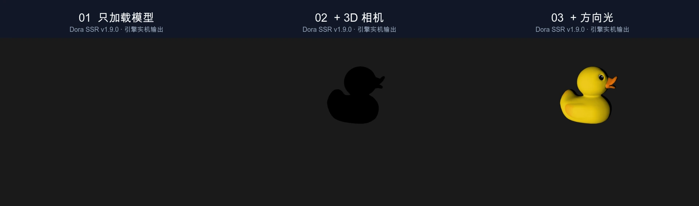

# Dora SSR 为什么现在才开始做 3D？从创作成本到第一只小鸭


<!-- truncate -->

## 一直不做 3D，不是因为只缺少几组 API

要解释 Dora SSR 为什么过去一直没有做 3D 功能，答案不能只从技术实现里找。

这并不是因为我们没有想过，也不只是因为实现模型、相机或灯光的接口很困难。真正让我犹豫的，是 3D 从来不只是一个功能性问题。

一旦开始制作 3D 游戏，创作投入通常会迅速扩大。除了渲染功能，还要面对模型、材质、贴图、骨骼动画、场景搭建、灯光和物理。尤其是美术资源：要验证引擎能否真正支持一件 3D 作品，不能只让几个测试三角形出现在屏幕上，还需要把实际模型和场景放进去，持续检查它们怎样加载、显示、运动和交互。

Dora SSR 本身也是一件以个人创作为主、依靠社区共同维护的作品。我们没有一个可以长期投入大量程序、美术和内容制作资源的团队。对于个人创作者来说，做出一组 3D API 也许还有可能；围绕它做出足够的资源、示例、教程、测试和真实作品，才是更难长期承担的部分。

我不太愿意只为了在功能列表里写上“支持 3D”，就留下一套缺少作品验证、也没有足够精力继续维护的半成品。这件事因此被搁置了很久。

## 直到 AI Coding 降低了试错成本

后来发生变化的，并不是 3D 内容创作突然变便宜了。至少在目前，AI 仍然不能替我们稳定完成一套可直接用于作品的模型、材质、动画和场景资源。

变化在于，AI Coding 开始能够进入真实工程，参与跨模块修改、构建、排错、测试和文档工作。它让一个设想更快变成可以运行的原型，也让发现问题后的下一轮验证不再同样昂贵。

维护者仍然要决定架构边界、技术路线和验收标准。但动手尝试的成本降低以后，我们终于可以开始这项过去很难由个人长期承担的工程。

## 3D 功能是怎样一步步做出来的

真正开始以后，我们面对的第一个问题并不是“先支持多少种模型”，而是怎样让新的 3D 能力进入 Dora SSR，又不把原来轻量的 2D 创作方式搅乱。

### 先划清 2D 与 3D 的边界

Dora SSR 没有把 3D 节点硬塞进原来的 2D 节点体系，而是建立了一棵独立的 3D 场景树。原来的 2D 节点继续使用像素位置、层级和渲染顺序；新的 `Node3D` 则负责三维空间里的位置、旋转和缩放。

两者通过 `View3D` 连接。可以把它理解为嵌在原有场景中的一扇 3D 窗口：窗口外仍然是熟悉的 2D 世界，窗口里才运行新的 3D 场景。这样做多花了一些设计工作，却保住了 Dora SSR 已有项目的使用方式，也让 2D 界面与 3D 内容可以继续组合。

### 再跑通从模型到画面的最小闭环

边界确定后，下一步不是一次完成所有功能，而是先回答三个最小问题：场景里放什么、从哪里看、怎样把它照亮。

于是我们先让 `Model3D` 能读取 glTF 模型，让 `Camera3D` 能观察三维空间，再让灯光和材质把模型表面正确呈现出来。在这条最短路径跑通后，才继续补上 PBR 材质、环境光、阴影、动画、缓存和异步资源加载。

这个顺序很重要。每增加一层能力，都能回到前一个可运行的结果，判断问题究竟出在模型、相机、光照，还是资源加载，而不必面对一个同时包含所有变量的大场景。

### 从“能显示”推进到“能做游戏”

模型出现在画面里还只是开始。要成为游戏对象，它还需要运动、碰撞、响应玩家，也需要和原来的 2D 界面配合。

因此后续开发继续加入了 3D 动画、物理世界、刚体和角色控制器；`Surface3D` 则让原来的 2D 内容能够出现在 3D 空间中。与此同时，各种语言绑定也要同步补齐，否则底层已经实现的能力仍然到不了用户手里。

### 最后用真实场景把功能收住

一项功能能够编译，不等于它已经可以使用。开发过程中，我们用不同模型、材质、阴影、动画和物理场景反复运行，把截图、渲染统计和自动回归结果留下来。节点被反复创建和销毁、模型异步加载、角色与物体发生碰撞，这些容易藏住问题的环节也必须单独检查。

走到这里，Dora SSR 的第一轮 3D 能力才从一组接口变成了一条经过实际运行验证的路径。接下来要解决的，便不再是“引擎里有没有 3D”，而是“一个第一次接触它的人，应该从哪里开始”。

## 为什么最后从一只小鸭开始

新的工具让我们有能力开始，却没有改变 Dora SSR 原来的另一个坚持：游戏开发工具不应该先要求你准备一间工作室，才允许你开始创造。

3D 涉及的概念很多。模型格式、相机、光照、材质、阴影、动画和物理，每一个词都能展开成一整章。如果第一篇教程就搭好一个复杂场景，初学者看到的只是漂亮结果，仍然不知道自己应该从哪一行开始。

所以我们选择做一个看起来有些笨的实验：先只加载一只小鸭，哪怕第一眼几乎看不见它。

然后一次只解决一个问题。先确认模型已经进入场景，再学习怎样观察它，最后让光线把它的表面照亮。这样得到的不只是一张完成图，而是三个以后仍然可以复用的判断：场景里有什么、从哪里看、怎样把表面看清楚。

## 接下来理解三个基本问题

第一次接触 3D 开发时，画面没有按预期出现，并不一定是代码写错了。

一个模型要成为清晰可读的 3D 画面，通常需要三个基本组成：

- **模型**：场景中要显示什么。
- **相机**：从哪里、以什么方式观察模型。
- **光照**：模型表面如何呈现明暗和体积。

接下来，我们使用 Dora SSR 和一个小鸭模型，依次加入这三个组成部分。完成后，你不仅能看到最终画面，也能理解每一段代码解决了什么问题。



## 开始前需要准备什么

本文使用 TypeScript。开始前需要：

1. 创建一个 Dora SSR TypeScript 项目。
2. 在 Web IDE 中打开项目。
3. 将 glTF 2.0 模型放在 `Assets/Model/Duck.glb`。

`.glb` 是 glTF 的单文件格式，可以把模型的几何、纹理和动画数据放在同一个文件中，适合初学时使用。

如果使用自己的模型，只需要修改代码中的文件路径。完成下面三步前，建议先让模型保持在导出时的原点附近，也就是 `(0, 0, 0)`。

## 第一步：加载模型

先创建模型节点，并把它加入 Dora SSR 的 3D 入口视图：

```ts
import {Director, Model3D} from "Dora";

const model = Model3D("Assets/Model/Duck.glb");
if (!model) {
	throw new Error("无法加载 Duck.glb，请检查文件路径和格式");
}
Director.entry.addChild(model);
```

这里发生了两件事：

1. `Model3D()` 读取 glTF 文件，并返回一个可以放入 3D 场景的模型节点。
2. `Director.entry.addChild(model)` 把模型明确加入默认的 3D 入口视图。

`if (!model)` 用来处理加载失败。如果路径错误、文件损坏或格式不受支持，程序会立即给出容易理解的错误，而不是继续运行到后面才出现难以定位的问题。

运行这段代码后，你可能看不到小鸭，或者只能看到一个非常小的物体。这是正常现象。

此时 Dora SSR 仍然使用默认的 2D 相机。2D 场景通常用屏幕像素组织位置，而 3D 模型一般按照接近现实尺度的世界单位制作。模型已经进入场景，只是当前的观察方式不适合它。

这一阶段需要确认的是：

> 模型是否成功加载，而不是画面是否已经好看。

## 第二步：切换到 3D 相机

接下来在现有代码中加入 `Camera3D`：

```ts
import {Camera3D, Director, Model3D, Vec3} from "Dora";

const model = Model3D("Assets/Model/Duck.glb");
if (!model) {
	throw new Error("无法加载 Duck.glb，请检查文件路径和格式");
}
Director.entry.addChild(model);

const camera = Camera3D();
camera.lookAt(Vec3(3, 2, 5), Vec3(0, 0, 0));
Director.pushCamera(camera);
```

重点是下面三行：

- `Camera3D()` 创建一台使用透视关系观察世界的 3D 相机。
- `lookAt(eye, target)` 设置相机位置和观察目标。
- `Director.pushCamera(camera)` 将这台相机设为当前相机。

在本例中：

- `Vec3(3, 2, 5)` 是相机的位置，可以理解为位于原点右侧 3 个单位、上方 2 个单位、前方 5 个单位。
- `Vec3(0, 0, 0)` 是相机观察的目标，也就是小鸭所在的原点。

切换相机后，小鸭会进入合适的构图，但画面可能仍然很暗，只能看到轮廓。

这说明相机已经完成了自己的工作：它解决了“怎样观察模型”，但没有解决“怎样看清模型表面”。

## 第三步：加入方向光

最后加入 `DirectionalLight3D`：

```ts
import {
	Camera3D,
	DirectionalLight3D,
	Director,
	Model3D,
	Vec3,
} from "Dora";

const model = Model3D("Assets/Model/Duck.glb");
if (!model) {
	throw new Error("无法加载 Duck.glb，请检查文件路径和格式");
}
Director.entry.addChild(model);

const camera = Camera3D();
camera.lookAt(Vec3(3, 2, 5), Vec3(0, 0, 0));
Director.pushCamera(camera);

const light = DirectionalLight3D();
light.intensity = 3;
Director.entry.addChild(light);
```

方向光可以理解为太阳一类距离很远的光源。它的光线方向一致，因此不需要设置具体位置；通过旋转灯光节点可以改变照射方向。

`intensity = 3` 设置光照强度。加入方向光后，小鸭表面的黄色、眼睛、嘴巴和明暗变化都会变得清楚，模型也开始呈现体积感。

## 三个组成部分分别解决什么问题

| 组成部分 | 主要作用 | 缺少时的典型现象 |
|---|---|---|
| `Model3D` | 加载并创建场景中的 3D 对象 | 场景中没有要显示的内容 |
| `Camera3D` | 决定观察位置、方向和透视关系 | 模型很小、位置异常或不可见 |
| `DirectionalLight3D` | 让模型表面产生可读的明暗变化 | 模型很暗、扁平或只有轮廓 |

需要注意：实际效果还会受到模型尺寸、原点、材质和环境光等因素影响。因此，这张表适合用于定位第一类问题，但不是所有 3D 画面问题的唯一答案。

## 常见问题

### 只加载模型后，画面里什么也没有

先检查模型路径是否正确。如果没有加载错误，可以继续加入 `Camera3D`。默认 2D 相机不适合观察以世界单位制作的 3D 模型。

### 加入 3D 相机后仍然是空白画面

依次检查：

1. 是否执行了 `Director.pushCamera(camera)`。
2. 相机是否看向模型所在的位置。
3. 模型是否仍在原点附近。
4. 模型自身的尺寸是否过大或过小。

### 能看到模型轮廓，但表面很暗

确认已经创建 `DirectionalLight3D`，并设置了足够的光照强度。不同材质也可能需要进一步配置环境光、颜色和光照方向。

### 换成自己的模型后构图不合适

不同模型的尺寸和原点可能不同。先调整 `lookAt()` 的相机位置与目标点，再考虑修改模型的 `position` 和 `scale`。

## 从第一个场景继续学习

Dora SSR v1.9.0 的第一轮 3D 教程沿着这个基础继续展开：

> 模型 → 相机 → 光照与材质 → 动画 → 物理与角色 → 2D UI → 测量与调试

模型、相机和光照是这条路线的起点。理解三者各自承担的职责后，后续遇到画面问题时，就能先判断问题属于资源加载、观察方式还是表面照明，而不是一次调整所有参数。

本文中的三阶段图片由脚本启动 Dora SSR 引擎实际生成。相同场景依次加入模型、相机和方向光，最终检查结果为 `PASS`；这只能证明该示例在当前本地环境中成功运行，不代表所有模型和设备都具有完全相同的视觉结果。

现在可以打开完整教程，亲自运行第一步，并观察自己的模型在三个阶段中发生的变化：

**开始《创建第一个 3D 场景》：**

https://dora-ssr.net/zh-Hans/docs/tutorial/Three%20D%20Game%20Development/first-3d-scene/

---

<p align="center"></p>
