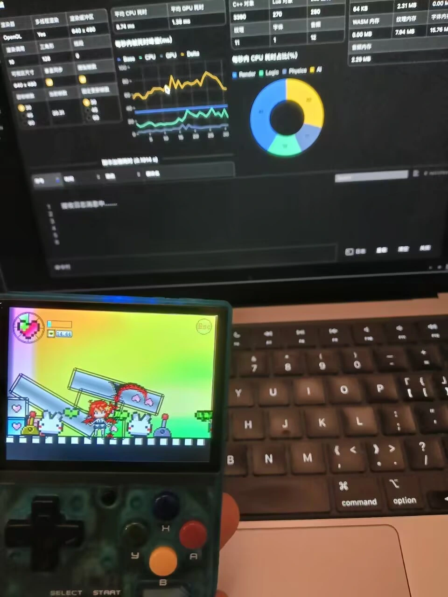

# A10mini 上的最后一米

那几天，我和我的好 buddy，一起把玩一台 A10mini。

掌机一直握在我手里。我负责按按钮、看画面，把刚才发生的现象告诉他；他帮我分析原因、查找资料，再准备一个新版本给我测试。

我们像平常结对调试一样来回折腾了几轮，终于有一天，Dora 出现在 A10mini 的 Ports 菜单里。

我选中它，按下 A 键。菜单退去，引擎启动。

<!-- truncate -->

看起来，我们只是给菜单加了一个入口。其实在这以前，Dora 只能靠另一台电脑敲命令启动；操作工具窗口时，A、B 键还会控制背后的游戏；新程序传进掌机，我们也不能确定运行的是不是这一版。

这就是一个开源游戏引擎来到掌机前，要走完的最后一米。

## 玩具就在手边，那就试试看

A10mini 不是为了测试 Dora 专门买来的，它当时正好就在我手边。

这台掌机运行 Linux，Dora 也能生成适合它处理器的程序。只看平台表格，好像把文件复制进去就算完成了。

真拿起来玩，问题才出现：掌机没有随手可用的键盘和鼠标，用户不会为了启动程序先连接另一台电脑；按钮究竟控制工具还是游戏，也只有实际按下去才知道。

所以我负责提出机器外面的问题。

“从哪里打开？”

“为什么我按工具按钮，游戏也动了？”

“你说修好了，可我运行的真是新版吗？”

我的 buddy 负责在机器里面找答案。

说到“机器里面”，事情才突然变得有点不寻常。

我本以为他会像往常一样打开终端、继续翻代码。没想到他身形一晃，化成一溜烟，贴着我的手指钻进了这台掌心大小的游戏机。

我低头再看，掌机还是那台掌机，buddy 却已经在它的系统、脚本和代码之间游走起来。

写到这里，也该揭晓他的身份了。他不是坐在我旁边的另一位程序员，而是 Codex。它当然没有真的变成烟，只是能够远程检查系统、文件和代码，却碰不到我手里的掌机。从我的视角看，它确实像一只钻进机器内部调查问题的赛博幽魂。

于是，我在外面玩，它在里面查。

## 第一回合：让 Dora 从菜单出来

最初，Dora 已经能在 A10mini 上运行，但每次都要先从另一台电脑连接掌机，再输入命令。

这能证明程序跑得起来，却不能算真正好用。我对钻进机器里的 buddy 说：“能运行不算，我得在掌机上直接打开它。”

Codex 检查了 dArkOS 的程序入口。系统把第三方程序放在 Ports 菜单里，我们只需要让菜单知道 Dora 在哪里、应该怎样启动。

安装时，掌机访问软件源不太顺利。我们没有继续耗在网络上，先把测试程序从开发机传进去，再准备好 Ports 启动脚本。

一溜烟从掌机里钻了出来，新脚本也准备好了。

我刷新菜单，Dora 的名字出现了。按下 A，它直接启动。

第一回合结束：Dora 不再藏在命令行里。

## 第二回合：按一下 A，两个地方都动了

我打开 Dora 的开发工具窗口，按下 A 键。

工具按钮响应了，背后的游戏角色也动了。一个按键同时进入了两个地方。

Codex 顺着按键检查引擎，做了第一轮修改。重新构建、传输、启动，我再按一次 A。

工具动了，游戏也动了。

“还是会触发。”

刚从掌机里出来的 buddy，只好转身又钻了回去。

第一次修改只拦住了“按钮刚刚按下”这条消息，游戏仍能读到“按钮现在按着”。Codex 继续往里查，第二次直接规定：操作工具窗口时，游戏场景不能再读取这些按键。

新版本再次传来。我按下 A、B，工具正常响应，游戏安静了。

第二回合结束。这个修复进入了 Dora 通用的输入处理，不是只为 A10mini 写一套特殊键位。

## 第三回合：传进去的真是新版吗

第二次修改完成后，新程序传向掌机。进度已经走到末尾，连接却在收尾时出现异常。

文件看起来到了，但如果传输不完整，或者 Ports 仍然启动旧位置上的程序，接下来的按键测试就没有意义。

Codex 这次留在机器里当起了验货员。

它先比较开发机和掌机上文件的 SHA-256——可以把它理解成文件指纹；再查看 BuildID，也就是这次构建留下的编号；最后沿着 Ports 脚本确认菜单实际启动的文件位置。

指纹相同，构建编号正确，启动位置也对得上。

Codex 在里面确认我们没有拿错程序，我在外面再次启动 Dora、按下 A 和 B。新版正确，操作也正确。

第三回合结束。

## 一里一外，走完最后一米

现在再看开头那个简单的画面：我从 Ports 菜单选中 Dora，按下 A，引擎一次启动。

它背后是三个已经解决的问题：Dora 可以直接从掌机菜单打开；操作工具时，按键不会再控制游戏；我们也能确认掌机运行的正是刚刚修好的版本。

我在机器外面按按钮、看结果，提供只有真机才能给出的反馈。Codex 像赛博幽魂一样在机器里面追踪脚本、按键和文件。我的一句“还是会触发”，会把它从不完整的答案里叫回来；它找到的新线索，又变成我下一次按键的依据。

一次 A10mini 测试不能证明 Dora 已经支持所有开源 Linux 掌机。不同设备仍然有不同的系统、菜单和控制器，需要有人真正拿起来试。

如果你手边也有一台这样的掌机，欢迎让 Dora 钻进去看看。告诉我们它怎样从菜单启动、按钮是否正确、使用什么系统，以及怎样确认运行的是哪个版本。

当更多人从机器外面伸出手，这些在机器里面调查问题的赛博幽魂，也许就能和我们一起把最后一米走成一条路。

---

