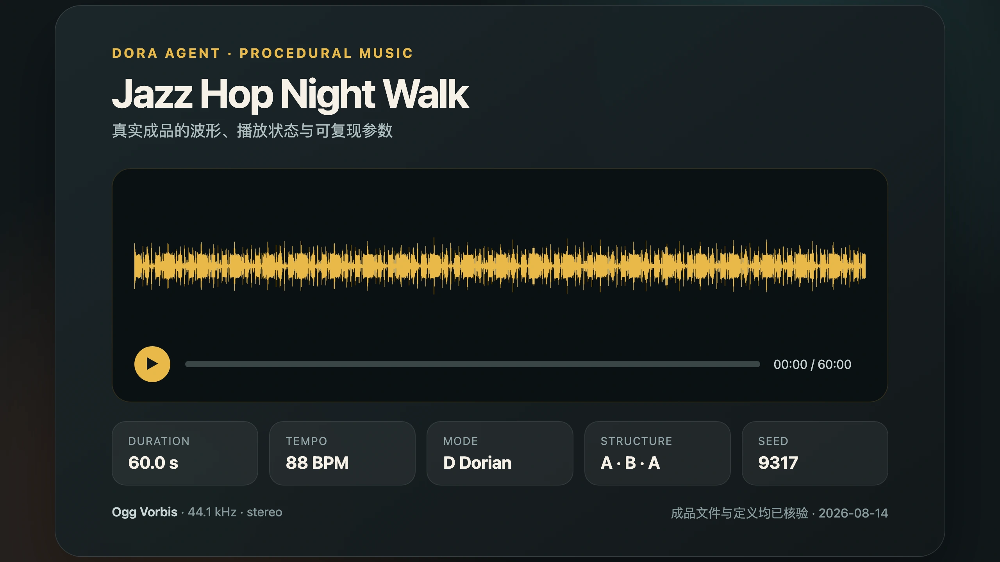
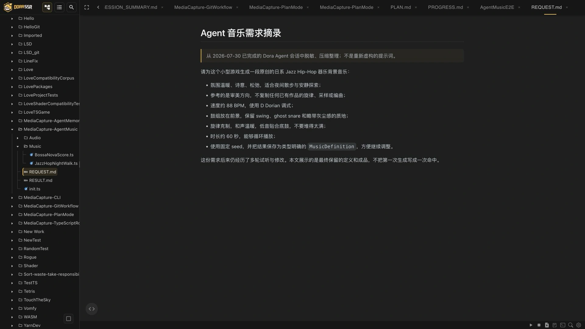

# 让 Agent 为游戏谱曲

> 从社区伙伴的一次纯 Lua PR，到 Dora Agent 生成第一段真正合我口味的 Jazz Hiphop。

<!-- truncate -->

过去做游戏时，我经常在寻找音效这件事上感到很烦。

如果是一部对音乐要求很高的作品，答案其实很清楚：应该去寻找自己喜欢、也真正理解作品的专业音乐创作者合作。音乐不是给游戏填空，它本来就是作品表达的一部分。

麻烦的反而是那些小型游戏、实验原型和突然冒出来的创意。

我希望它有一段切合场景的背景音乐，却又觉得这个项目还没有必要专门邀请一位专业作者；随便找一段能循环的音乐塞进去，又很容易让画面、操作和声音各说各话。于是，明明只想验证一个小游戏，最后却在素材网站和音频文件夹里来回翻找。

这是一种很微妙的尴尬：不是完全没有音乐，而是缺少一段“刚好适合这个游戏”的音乐。

所以，当 Dora Agent 开始拥有音乐生成能力时，我真正关心的并不是“AI 又会生成一种东西了”，而是另一件更具体的事：

> 它能不能听懂我对游戏氛围的描述，把音乐做成项目里可以构建、试听、修改和继续使用的资产？

这篇文章会讲清楚这项能力从哪里来、为什么从常驻工具改成了按需 skill、它怎样从纯 Lua 原型进入引擎底层，以及普通创作者现在可以怎样使用它。


## 这件事并不是我先提出来的

Dora Agent 的音乐生成，起点来自社区伙伴 [`@123123213weqw`](https://github.com/123123213weqw) 提交的 [PR #117](https://github.com/IppClub/Dora-SSR/pull/117)。

这次贡献使用纯 Lua 程序，为 Agent 接入了音效和程序化背景音乐生成。它不需要在线调用一个文生音频服务，而是根据参数实际计算波形、组织旋律和节奏，再把结果写成游戏项目里的 WAV 文件。

第一版已经相当完整：它可以生成短音效，也可以生成背景音乐、变奏和不同声部。更重要的是，它第一次证明了一件事——Dora Agent 不只能替游戏写代码，也能直接参与游戏资产的制作。

但 PR 合并以后，我们在社区群里聊了很久。争论最久的并不是“音乐好不好听”，而是一个看起来更像产品设计的问题：

> 音乐生成应该成为 Agent 的常驻 tool，还是一套需要时才加载的 skill？

## 为什么后来没有把音乐生成留在常驻工具里

这里先解释两个词。

**Tool** 是 Agent 每一轮工作都能看到和调用的工具，例如读取文件、修改代码和执行构建。它们像一直摆在工作台上的螺丝刀和扳手。

**Skill** 则更像放在柜子里的专项说明书和工具包。Agent 平时只知道这里有一项能力；真正遇到音乐任务时，才会读取完整说明，编写相应脚本并调用引擎完成工作。

音乐生成显然很有趣，但它并不是每次修改游戏代码都会用到的高频动作。如果把完整的音乐参数和三个生成工具一直放进每次 Agent loop，不仅会占用上下文，也会让本来应该清楚的工具列表越来越臃肿。

我们最后做了一个不那么显眼、但很重要的选择：移除常驻的 `generate_sfx`、`generate_music` 和变奏工具，把音乐生成改成按需使用的 `music-generation` skill。

换句话说，我们没有要求 Agent 每次开工都把整套录音棚摆在桌上。只有当项目真的需要音乐时，它才去把录音棚搬出来。

这个选择也让音乐制作从“一次工具调用”变成了一条更透明的工程流程：Agent 先写下音乐定义，项目先完成类型检查，确认参数和结构成立以后，再让引擎执行合成。

## 能生成，距离能用还差一层

产品形态确定以后，另一个问题很快暴露出来：纯 Lua 原型证明了方向，却不适合独自承担越来越复杂的音乐合成。

数字音频需要连续计算大量采样点。以 44.1 kHz 音频为例，一秒钟就包含 44,100 个采样位置；一段几十秒的背景音乐还要处理多个声部、包络、混音和文件编码。把这些工作都留在 Lua 层，生成速度和后续扩展都会受到限制。

与此同时，最初的程序合成音色也不够丰富。它很适合快速做出电子音效和复古声音，但当我们开始尝试钢琴、爵士鼓、吉他等表现时，仅靠第一版音色就有些捉襟见肘。

所以，我继续把这项能力往引擎底层推进：

- Agent 仍然使用 TypeScript 编写有类型约束的音乐定义。
- 项目构建负责提前发现拼错的风格、乐器和参数。
- 合成、混音与音频编码进入 Rust 原生层异步执行。
- 简单音色可以使用内置合成器，需要更真实的乐器时也可以选择 SoundFont。
- 短音效输出为 WAV，较长的背景音乐可以直接输出为 Ogg。

于是，完整路径变成了：

> 描述音乐需求 → Agent 编写音乐定义 → 构建检查 → 引擎原生合成 → 生成 WAV/Ogg → 在游戏中试听和修改

这里的每一步都能看到，也都能检查。Agent 不是在某个不可见的远端服务里“变”出一段声音，而是在项目中留下定义、参数和输出文件。

## 先补一堂很小的音乐课：程序怎样表示一首曲子

在继续讲 `Night Walk` 之前，需要先回答一个更基础的问题：音乐为什么可以被程序生成？

一首音乐听起来很感性，但把它交给计算机时，可以先拆成几类相对清楚的信息：

- **音高**：要演奏哪个音，例如 C4、F#4；程序内部也可以用 0—127 的 MIDI 音符编号表示。
- **节拍**：音符从第几拍开始、持续多少拍。它描述的是音乐位置，而不是音频文件里的第几秒。
- **速度**：BPM，也就是每分钟有多少拍。120 BPM 时，一拍是半秒。
- **小节与拍号**：把连续节拍组织成周期。例如常见的 4/4 拍，可以先理解为每四拍形成一个小节。
- **力度**：同一个音是轻轻出现还是重重落下。Dora 用 `velocity` 表示。
- **轨道与音色**：旋律、低音、和声和鼓可以分别放在不同轨道，再指定钢琴、贝斯或程序合成音色。
- **调式与和声**：调式限定一组常用音，和弦进行决定音乐怎样产生稳定、离开和回归的感觉。

如果这些词暂时还有点陌生，没有关系。关键只在于：计算机不直接理解“温暖”或“有夜晚散步的感觉”，但它可以准确理解“第 2 拍演奏哪个音、持续多久、用多大力度”。Agent 的工作，就是在人的感受和这些可执行信息之间做翻译。

Dora 的音乐定义提供了两条不同的路径：`score` 和 `composition`。它们都会生成声音，但解决的不是同一种问题。


## Score：把每一个音明确写进程序乐谱

`score` 可以理解为一份程序化乐谱。作者或 Agent 明确写出每条轨道的乐器，以及每个音的音高、开始位置、持续拍数和力度。

下面是一段最小的提示音乐谱：

```ts
import type { MusicDefinition } from "Agent/Gen/Music";

export const definition: MusicDefinition = {
	output: "Audio/confirm.wav",
	synth: {},
	score: {
		bpm: 120,
		beatsPerBar: 4,
		bars: 1,
		tracks: [
			{
				instrument: "bell",
				role: "melody",
				notes: [
					{ pitch: "C5", start: 0, duration: 0.5, velocity: 0.8 },
					{ pitch: "E5", start: 0.5, duration: 0.5, velocity: 0.8 },
					{ pitch: "G5", start: 1, duration: 1, velocity: 0.9 },
				],
			},
		],
	},
};
```

这里的 `start` 和 `duration` 都以拍为单位。第一个 C5 从第 0 拍开始，持续半拍；E5 紧接着出现；最后的 G5 持续一整拍。引擎根据 120 BPM 把这些拍子换算成秒，再交给指定音色演奏。

`score` 还可以写多条轨道、鼓点、力度变化、左右声道位置、延音踏板和速度变化。它适合以下任务：

- UI 确认音、胜利提示和短旋律。
- 用户已经指定音符或节奏的音乐。
- 需要准确复现旋律，而不是每次重新编配的片段。
- 对节奏落点有明确要求的音效和乐句。

需要注意的是，`score` 本身不会替你“想出下一段旋律”。每个音都已经写在乐谱里。Agent 可以帮助创作和修改这份乐谱，但引擎的职责是检查它、换算时间并把它准确演奏出来。

## 音符写好以后，由谁来演奏：内置合成器与 GeneralUser GS

无论使用 `score` 还是后面的 `composition`，最终都会得到一组“什么时间演奏什么音”的事件。但音符只决定演奏内容，并不决定听起来像钢琴、吉他还是电子游戏里的方波。

决定音色的是合成器。Dora 当前提供两种选择。

第一种是**内置程序合成器**。前面代码里的 `instrument: "bell"`，以及 `pluck`、`sub`、`piano`、`lofi` 鼓组等名称，都对应引擎内部的波形、包络、FM 或程序噪声模型。它们不需要额外音频资源，生成稳定、体积小，也很适合电子音效和具有程序感的配乐；但“piano”表示一种程序模拟的钢琴音色，并不等于录制真实钢琴得到的采样。

第二种是 **SoundFont**。可以把 SoundFont 理解成一套可由 MIDI 音符演奏的数字乐器库：它保存真实或加工过的乐器采样，并规定某个 bank、program 和音高应该调用哪段声音、怎样循环和衰减。程序仍然负责谱曲和安排演奏，SoundFont 负责提供更接近具体乐器的声音材料。

Dora SSR 内置了一份 [`GeneralUser GS`](https://www.schristiancollins.com/generaluser.php) SoundFont。目前随引擎打包的是 S. Christian Collins 制作的 GeneralUser GS 2.0.3 BETA，使用压缩采样的 `.sf3` 格式，文件约 8 MB。Dora 从文件中整理出了 287 个 preset，包括 Grand Piano、Electric Piano、吉他、贝斯、弦乐、管乐、合成器以及多套打击乐器。

这里的 bank 和 program 可以理解为乐器库里的“楼层号”和“房间号”。例如 bank 0、program 0 是 Grand Piano；打击乐使用专门的 percussion bank。Agent 不需要靠猜测寻找这些编号，可以读取 Dora 随包提供的完整 preset 目录。

要让刚才的程序乐谱改用 GeneralUser GS 钢琴，只需要明确指定 SoundFont 文件和 preset：

```ts
export const definition: MusicDefinition = {
	output: "Audio/piano_phrase.ogg",
	synth: { file: "Audio/GeneralUserGS.sf3" },
	score: {
		bpm: 120,
		tracks: [
			{
				preset: { bank: 0, program: 0 }, // Grand Piano
				notes: [
					{ pitch: "C4", start: 0, duration: 0.5 },
					{ pitch: "E4", start: 0.5, duration: 0.5 },
					{ pitch: "G4", start: 1, duration: 1 },
				],
			},
		],
	},
};
```

引擎不会自动使用 GeneralUser GS。只有定义显式写出 `synth.file`，并为轨道选择 `preset` 时，才会加载 SoundFont；全部使用内置乐器时则保持 `synth: {}`。在底层，Dora 解码 SF3 中压缩的采样，再通过 Rust 的 SoundFont 合成支持按音符进行演奏。

两者不是谁取代谁：

- 内置合成器更轻、更可控，适合程序音色、短音效和不依赖采样资源的生成。
- GeneralUser GS 提供更丰富、辨识度更高的传统乐器音色，适合钢琴、吉他、贝斯和管弦乐等需求。
- 同一首音乐还可以让部分轨道使用内置合成，另一部分轨道使用 SoundFont。

GeneralUser GS 的许可允许将它用于个人或商业音乐创作，也允许在软件项目中使用和修改。不过，原作者同时披露：音色库早期汇集的一部分免费样本无法百分之百追溯来源。Dora 在许可文件中保留了这项说明。因此，用它制作学习示例和一般音乐时可以依据其许可使用；面向重要商业发行时，仍应根据项目风险重新审查采样来源，不能把“随引擎提供”简单理解为没有任何权利判断。

本文的代表曲 `jazz_hop_night_walk.ogg` **没有使用 GeneralUser GS**。它的 `synth` 为空，旋律、低音、钢琴色彩和鼓组都来自 Dora 的内置程序合成器。GeneralUser GS 是另一条可选的音色路径，而不是这首曲子的声音来源。

## Composition：让规则和算法长出一首曲子

`composition` 解决的是另一类问题：我们知道自己想要怎样的气氛和结构，却不想手工列出几百个音符。

这时，作者提供的不是完整乐谱，而是一组作曲条件：

| 条件 | 它告诉算法什么 |
|---|---|
| `style` | 使用哪套风格规则，例如 calm、hiphop 或 jazz_hop |
| `tempo` | 音乐前进的速度 |
| `key`、`mode` | 以哪个音为中心，可以优先使用哪些音 |
| `progression` | 每个小节沿着怎样的和弦级数移动 |
| `structure` | A、B、A 等段落怎样排列 |
| `melodyComplexity` | 旋律出现得多密、跳动得多复杂 |
| `rhythmComplexity` | 节奏切分、鼓点和音符间隔有多活跃 |
| `intensity` | 配器和鼓组的整体推动力 |
| `seed` | 固定这次选择，让同一版本中的结果可以重现 |

收到这些条件后，Dora 当前的程序化作曲大致经过以下步骤：

1. **建立时间网格**：程序化背景音乐以常见的 4/4 拍为基础，把每个小节划分成 16 个小步，可以安排十六分音符级别的节奏。
2. **确定可用音高**：算法根据根音和调式建立音阶。例如 D Dorian 会得到一组带小调色彩、但第六级较明亮的音。
3. **铺设和声路线**：罗马数字和弦级数被转换成实际音高；和声轨道、低音轨道和旋律轨道都围绕当前和弦活动，避免完全无约束地乱跳。
4. **生成段落与旋律**：A、B 等段落使用由 seed、段落名和小节位置共同决定的伪随机序列。随机数负责选择候选音和变化，但候选范围仍受音阶、和弦、密度和复杂度约束。
5. **生成节奏与鼓组**：不同 style 拥有不同的鼓点骨架、力度分布和混音倾向。Jazz Hiphop 会使用自己的 kick、snare 和 hi-hat 模式，并把部分弱拍向后推，形成 swing；ghost note 则用较低力度补充细小律动。
6. **合成与混音**：音符被转换成频率和时间事件，再由内置合成器或 SoundFont 音色发声。最后加入声像、包络、混响、延迟等处理，完成响度归一化并编码成 WAV/Ogg。

这里的“随机”不是让音符毫无规则地乱跑。它更像在一组音乐约束中进行选择：和弦决定这一小节的地面，调式划出可以活动的范围，复杂度决定走直线还是多绕几步，seed 则记住这一次到底走了哪条路。

因此，在固定的引擎版本、定义和 seed 下，我们可以再次得到同一套编曲选择。引擎算法升级后，生成结果仍可能变化，所以正式项目还应把最终音频文件一同纳入版本管理，而不是只保存 seed。

这也解释了两条路径最简单的区别：

> `score` 是“这些音，请准确演奏”；`composition` 是“在这些规则里，替我完成一版编曲”。

`Night Walk` 需要的是大约一分钟、有完整鼓组、低音、和声和旋律变化的背景音乐。逐个写出全部音符并不是不能做，但我们的目标正是验证 Agent 能否把审美描述转成一套作曲规则，所以它采用了 `composition`。

## 让 Agent 写一段我喜欢的 Jazz Hiphop

能力做出来以后，我当然要拿自己的偏好试一遍。

我一直很喜欢 Nujabes 所代表的那类温暖、诗意、松弛的 Jazz Hiphop 氛围。但我没有只给 Agent 留下一句“照这个风格写”。在实际需求中，我把这种感受拆成了可以讨论的音乐特征：

- 速度控制在 86—90 BPM，保持适合夜晚散步的松弛感。
- 使用带有柔和小调色彩的 Dorian 调式和爵士和声。
- 把 dusty kick、清楚的 snare 和带力度变化的 hi-hat 放在混音前景。
- 加入 swing、切分和 ghost note，让鼓组有松动但不混乱的律动。
- 旋律尽量克制，给鼓和氛围留下空间。
- 减少混响和 delay，避免所有声音糊在一起。
- 参考只转换成一般音乐特征，不复制任何已有作品的旋律、采样或编曲。

听起来已经很具体了，但第一次生成仍然没有直接命中。

有一版鼓组很好听，和声却不协和；改过以后，旋律又显得太杂乱。我们继续减少音符，结果情绪仍然有点紧张。再换音色，旋律又变得刺耳。

我给出的反馈也越来越具体：

> 鼓很好听，但 harmony 不好听。
>
> 音太多了，可能没有和鼓组站在一起。
> 旋律有点刺耳，再留白一些。

Agent 根据这些反馈重新安排和声与旋律，降低旋律密度，把鼓组留在前面，并固定了最终的随机 seed。最后留下的版本叫作 `jazz_hop_night_walk.ogg`：88 BPM、D Dorian、约 60 秒，可以循环播放。



它并没有使用现成歌曲的采样，也没有试图复刻一首具体作品。当前版本使用 Dora 原生的程序化乐器和鼓组，在固定的音乐结构中生成旋律、和声与节奏。

我有时会把这个过程叫作“抽卡”。但这里的抽卡并不是不停点击生成，直到碰巧掉下一首神曲。真正有效的是，我们可以听一遍，指出哪里不对，修改可以理解的音乐参数，再生成下一版。

当最终版本的鼓点、律动和整体氛围一起出现时，我第一次产生了一种很直接的感觉：

> 这个 Agent 好像真的 get 到我了。

## 接下来，让 Dora Agent 为游戏生成一段音乐

如果你不懂乐理，也不需要从 88 BPM、Dorian 或七和弦开始。更好的起点，是先把游戏现场说清楚。

例如，可以在 Dora Web IDE 中告诉 Agent：

> 为一个夜晚在城市中散步的小游戏制作约 45 秒、可以循环的背景音乐。整体温暖、放松，但要有清楚的鼓点推动角色前进。旋律不要太密，不要使用现成作品的采样。请生成 Ogg，并在完成后试听和报告真实时长。

收到需求后，Agent 会读取音乐生成 skill，并在项目的 `Music` 目录中写下一份 TypeScript 定义。短提示音可以选择前面介绍的 `score`；这类氛围背景音乐则更适合使用 `composition`。它的核心结构大致像这样：



```ts
import type { MusicDefinition } from "Agent/Gen/Music";

export const definition: MusicDefinition = {
	output: "Audio/night_walk.ogg",
	synth: {},
	composition: {
		style: "jazz_hop",
		seed: 9317,
		duration: 45,
		tempo: 88,
		key: "D",
		mode: "dorian",
	},
	arrangement: {
		intensity: 0.8,
		melodyComplexity: 0.15,
		rhythmComplexity: 0.85,
	},
	instruments: {
		lead: "pluck",
		bass: "sub",
		harmony: "piano",
	},
};
```


现在再看这段定义，其中的参数就不再只是一组陌生单词。对第一次使用来说，只需要先抓住四件事：

1. `output` 决定音频保存到哪里；较长的 BGM 使用 `.ogg`。
2. `composition` 描述风格、时长、速度和调式。
3. `arrangement` 控制音乐有多密、节奏有多活跃。
4. `instruments` 选择旋律、低音与和声使用的音色。

接下来，Agent 会构建这份文件。构建通过说明字段名称、类型和基本结构成立，但还不能说明音乐一定好听——耳朵显然还没有被 TypeScript 接管。

构建完成后，引擎在后台执行合成，生成 Ogg 文件并返回实际时长、采样率、峰值和是否出现削波等信息。然后，你就可以在 Audio Preview 或游戏中播放它，继续用自然语言反馈：

- 鼓点再靠前一些。
- 旋律太密，给画面留一点空间。
- 和声太紧张，希望更温暖。
- 开头很好，但循环回去时转折太明显。

这些反馈比简单地说“再好听一点”更有用。你不需要成为专业作曲家，但需要逐渐学会描述自己听到了什么、游戏又需要什么。

## 它没有替代音乐人，只是让尝试更容易发生

Dora Agent 的音乐生成已经可以帮助小型游戏制作音效、背景循环和可继续调整的音乐资产，但它没有让专业音乐创作变得不重要。

恰恰相反，如果一部作品对音乐有明确的艺术要求，我仍然更愿意寻找自己欣赏的专业创作者合作。人的经历、表达、现场沟通和对整部作品的长期理解，不是一份参数表可以替代的。

这项能力首先解决的是另一类问题：当我们制作小游戏、Game Jam、玩法原型，或者只是想验证某种氛围时，不必先花很长时间寻找一段勉强合适的素材。我们可以先让 Agent 做出一个能进入项目的版本，听一遍，再决定这条路值不值得继续。

AI 没有替我们完成审美判断。它只是让“我脑子里有一种感觉，能不能先听听看”这件事，变得更容易开始。

如果你也在制作一个小型游戏，可以试着不要只告诉 Agent“写一首好听的 BGM”，而是描述一个真实场景：角色在哪里、正在做什么、希望玩家感到什么、节奏应该推动还是陪伴。

然后听听看，最难让它理解的，究竟是哪一种感觉。

---

<p align="center"></p>
