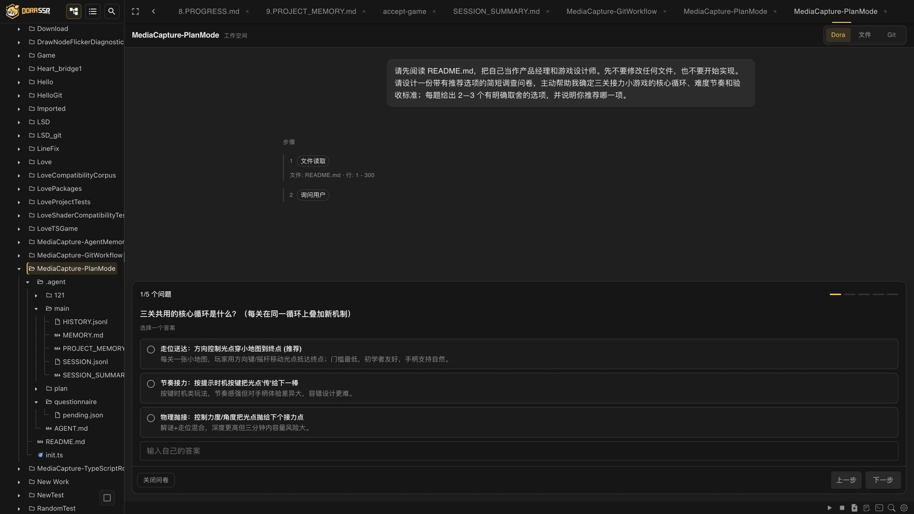
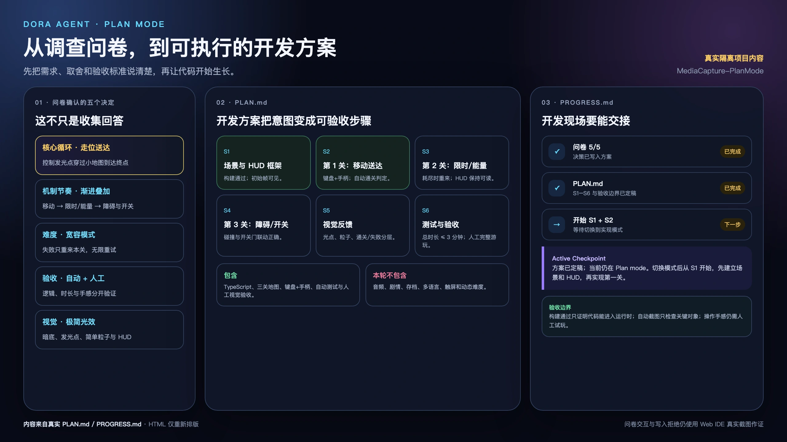
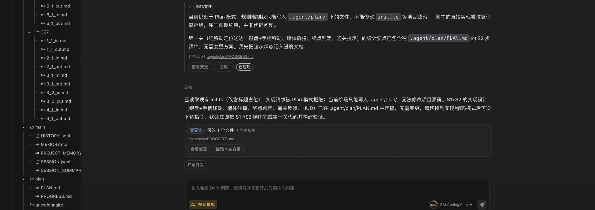

# 先和 Agent 把需求聊清楚

> Agent 可以帮我踩油门，但需求、架构和技术选型的方向盘还得握在人手里。

## 我还在聊需求，它已经想去改文件了

在让 Agent 执行一项长程任务以前，我有一个自己的习惯：先不让它写代码，而是把它拉来当一会儿产品经理。

我会先说出一个可能还很模糊的想法，再和它一起拆需求、补边界、比较几种实现方案。哪些是必须做的，哪些只是听起来很诱人；哪个方案短期省事，哪个方案以后比较好维护；最后又该用什么现象证明这件事真的做完了。

<!-- truncate -->

这时候的 Agent 往往显得特别积极。

人类产品经理可能还在说“我们再想想”，它已经把袖子卷好，恨不得下一秒就开始改文件。毕竟，会写代码正是它最拿手的事。让一位过分勤快的程序员坐在产品会上只听不动，多少有点委屈它。

但我渐渐发现，在一项复杂任务里，最危险的并不总是代码写错了，而是代码写得很对，事情却做错了。

如果需求里还留着没有确认的产品选择，Agent 就只能根据上下文替我们补上。它可能选择一个完全说得通的答案，再用很整齐的代码把这个答案实现出来。等我们真正运行起来，才发现它解决的并不是我原来想解决的问题。

代码质量不理想，还可以继续构建、测试和修改。方向如果错了，写得越快，反而离目标越远。

所以我并不要求 Agent 第一次就交出最漂亮的代码。我更在意的是：在开始实现以前，整个方案仍然处在我能够理解、能够判断，也愿意承担后果的范围内。

## 会写代码，不等于会定义一款好软件

我们很容易把 AI 编程理解成一道输入输出题：人写下一段需求，大模型生成一批代码，程序运行，任务结束。

但一款软件是否符合人的预期，至少还要经过三层判断。

第一层是**需求理解**。

我们究竟想改变谁的什么体验？一句“增加一个 Plan mode”，可能是在要求 Agent 多思考一会儿，也可能是在要求它不要碰项目文件，还可能是在要求它先把几种方案拿回来让人决定。这些含义听起来接近，做出来却是三种不同的产品。

第二层是**架构设计**。

架构可以先简单理解为：一项能力应该放在系统的哪个位置，又该怎样与已有功能长期合作。一个限制如果只藏在界面按钮里，后端仍然允许执行，它就只是看起来安全；一份进度记录如果只存在当前对话里，换个会话便消失，它也很难成为可靠的工作状态。

第三层是**技术选型**。

同一个功能通常不只一种做法。我们要比较实现成本、运行性能、跨平台兼容、第三方依赖、项目现有语言和后续维护压力。大模型容易给出一个在一般项目里很常见、资料也很多的方案，但“常见”不等于适合 Dora，更不等于适合一个由个人长期维护的开源游戏引擎。

Agent 可以帮助调查代码、补充选项、解释优缺点和发现风险。这些能力很有价值。但它给出的第一个可行方案，并不会因为来自大模型就自动变成最优解。

人需要提供对需求、价值和长期后果的判断；Agent 提供调查、比较和实施能力。双方一起把方案收敛到一个人能理解、愿意确认的范围里，软件才更有机会符合人的预期。

## 越早开工，不一定越省 token

这件事在 AI 编程里还有一项非常直观的成本：token。

假如 Agent 选了一条不合适的路线，它会继续读取文件、生成代码、解释修改、执行构建，再根据错误进行修补。等我们发现方向不对，它还得重新理解需求、撤回旧设计、改写实现并再次验证。

一次本来能在讨论阶段排除的选择，走到实现深处以后，就会长出一串很勤奋的返工。

不过，我不想把 Plan mode 简单宣传成“更省 token”。调查项目、澄清需求和比较方案本身同样需要 token。它真正做的是把一部分消耗从“过早实现一个尚未确认的方向”，前移到“先理解问题并确认决定”。

而且，返工里最昂贵的也未必是 token。人的等待、审查、重新解释、架构清理，以及对项目理解的逐渐丢失，常常才是更难补回来的成本。

Agent 很擅长踩油门。Plan mode 要解决的，是在加速以前先看看方向盘握在谁手里。

## 于是，我们给 Dora Agent 加了 Plan mode

这里说的 Plan mode，不是让大模型躲在幕后独自多想一会儿，也不是要求它先生成一份漂亮的待办清单。

它是一套把调查、讨论、决策和执行分开的工作流程。

Dora Agent 的新会话仍然默认处在可以执行开发工作的 code mode。对于简单而明确的修改，没有必要每次都先开一场正式会议；但遇到长程任务、模糊需求或包含重要技术取舍的工作时，可以主动切换到 Plan mode。

进入以后，Agent 要依次完成四件事：

1. **先调查项目**：阅读相关代码和文档，弄清现状，不急着修改项目。
2. **再澄清选择**：只有仓库里找不到答案的产品偏好、范围和外部条件，才交给人确认。
3. **持续整理方案**：记录需求怎样变化、比较过哪些方案、为什么做出当前取舍，以及准备怎样实施和验收。
4. **等待明确授权**：计划完成并不等于获得执行权，只有人确认开始开发以后，Agent 才能切回执行状态。

这四步看起来并不神秘。真正重要的是，它们不只是一段写给模型看的礼貌提醒，还被做进了 Dora Agent 的界面、状态和服务端工具边界里。

## 一份好问卷，本身就是 Agent 提交的第一版设计

“让 Agent 先提问”听起来不错，但也很容易变成另一种偷懒：用户刚说完一句需求，Agent 就回赠十几个开放题，仿佛在说“好的，现在请你自己完成需求分析”。

这不是我想要的产品经理。

Plan mode 要求 Agent 先阅读项目。能从代码、文档和当前配置中找到的事实，不应该再让用户手工回答。真正需要提问的，是无法从项目中推出的选择，例如：这次更重视向后兼容，还是允许简化旧接口？这个功能只服务主会话，还是也要开放给子 Agent？失败以后应该自动回退，还是停下来等待确认？

问题还应该尽量带着可比较的选项回来。一个合格的选项不只是 A、B、C 三个按钮，还要说明各自会改变什么、有什么代价，以及 Agent 根据当前调查更推荐哪一个。人仍然做决定，但不必从一张白纸开始思考。

这正是“调查问卷”式交互最有价值的地方：**设计问卷本身，就是 Agent 积极参与产品设计的过程。**

例如，直接问一句：

> 你希望怎样限制 Plan mode？

这道开放题几乎把整个设计问题原样退还给了用户。真正有帮助的 Agent，应该先调查现有实现，再带着类似这样的选项回来：

- **只用提示词约束**：改动较小，但边界依赖模型自觉。
- **只在界面隐藏执行入口**：用户能看见模式区别，但服务端能力仍然存在。
- **按模式投影服务端工具，并限制计划文件路径（推荐）**：实现成本更高，但限制由系统真正执行。

为了写出这三个选项，Agent 已经不能停留在“等待用户告诉我答案”的状态。它必须先识别真正的设计矛盾，形成几条可行路线，比较安全性、实现成本和维护代价，再公开自己的推荐。问卷因此不只是收集意见的表单，更像 Agent 交出的一份小型方案评审：它先贡献判断，然后邀请人选择、质疑和修正。

这种形式也提高了采集用户反馈的效率。面对“你想怎么实现”这样的开放题，人往往要重新组织背景、重复已经聊过的内容，还可能遗漏自己不知道需要说明的约束。面对已经写明影响和代价的选项，用户可以先完成三件更轻松的事：

1. 选择最接近自己预期的方向。
2. 组合多个同时需要的条件。
3. 用“其他”或文本回答补充选项没有覆盖的经历和要求。

一次结构化回答，往往可以同时确认偏好、范围和取舍，减少多轮“是不是这个意思”的往返。回答结果也更容易准确写入方案文档，成为后续实现和验收可以追溯的决策，而不是散落在长对话里的半句话。

更重要的是，推荐项会把分歧提前暴露出来。如果 Agent 推荐的路线让人觉得不对，双方会在代码出现以前开始讨论它的假设；如果所有选项都不合适，用户也可以直接补充另一条路线。这比等 Agent 实现完毕以后，再从成百上千行修改中寻找双方理解的分叉点便宜得多。

当然，问卷不应该把连续的产品思考粗暴压成几道选择题。Dora 的问卷支持单选、多选、文本题、推荐项和“其他”补充。它们不是为了限制用户只能接受 Agent 预设的答案，而是让 Agent 先拿出一份可以批评、组合和改进的设计草案。

当问卷发出以后，任务会进入 `WAITING_USER` 状态。普通输入框会让位给问卷；发送消息、继续任务、重发以及切换模式也会在服务端被拦住。待回答问卷保存在项目的 `.agent/questionnaire/pending.json` 中，因此刷新或恢复会话时，这段尚未完成的决策不会只靠浏览器内存勉强记住。

换句话说，Agent 不能把问题问完，趁人还没回答又从旁边溜回去继续开工。

## 聊过的事，不能聊完就散会

讨论过程如果只存在聊天记录里，也会带来另一个问题：当对话变长、上下文被压缩，或者我们过几天重新回来时，最容易丢失的往往不是最后那张待办清单，而是当初为什么这样决定。

所以 Dora Agent 会维护两份职责不同的活文档。

第一份是 `.agent/plan/PLAN.md`，也就是**方案文档**。它回答的是：

- 我们真正决定做什么？
- 哪些内容明确不做？
- 比较过哪些方案，各自有什么代价？
- 为什么选择现在这条路线？
- 准备分几步完成，又怎样验收？

第二份是 `.agent/plan/PROGRESS.md`，也就是**开发进度表**。它回答的是：

- 现在进行到哪一步？
- 哪些模块已经修改？
- 构建、测试和运行验证得到了什么证据？
- 当前还有什么问题？
- 下一个动作是什么？

这两份文档不是同一份 Agent 大笔记的两个副本。

方案文档记录“为什么这样做”，进度表记录“实际上做到哪里”。前者在讨论中持续修订，后者在真正开发后继续跟踪源码变化和验证里程碑。即使会话中断，人和 Agent 也可以从同一组可见记录继续，而不是再次依靠彼此模糊的记忆对暗号。

> 图中内容来自隔离项目真实生成的 `PLAN.md` 与 `PROGRESS.md`；HTML 只负责重新排版。问卷交互和 Plan mode 写入拒绝仍使用真实 Web IDE 截图作为行为证据。

## “请别动手”不能只靠 Agent 自觉

如果 Plan mode 只是在提示词里写着“现在请不要修改项目”，但 Agent 仍然拥有执行命令、构建项目和任意编辑文件的工具，那么“先别动手”就只是一句建议。

模型大多数时候可能会照做，但一条重要的工程边界，不应该以“大概会听话”为设计目标。

Dora Agent 会根据当前 `workMode`，在服务端生成这一轮真正允许提供给模型的工具集合。处于 Plan mode 时，构建、网络获取、命令执行以及创建子 Agent 等执行能力不会被提供。

Plan mode 并不是完全不能写文件，因为它还需要持续维护 `PLAN.md` 和 `PROGRESS.md`。因此，计划阶段的编辑和删除能力被进一步限制在 `.agent/plan` 目录内；即使模型尝试把目标指向项目源码或资源文件，运行时也会检查并拒绝。

这一区别很重要：

> 提示词告诉 Agent 应该遵守什么；服务端权限决定它实际上能够做什么。

目前我们已经从源码确认了项目写入限制。对于工作区外文件的读取边界，还需要继续进行真实运行测试，因此这里不把 Plan mode 描述成一个无所不能的安全沙箱。它首先解决的是计划阶段不应修改项目，以及执行必须等待人明确授权的问题。

## 从产品经理切换回执行者

当需求、取舍、步骤和验收方式都确认以后，界面会提供“开始开发”的明确动作。

只有到这一步，工作模式才会切回 code mode，Agent 重新读取现有计划，从下一个尚未完成的步骤开始编辑、构建和运行验证。开发过程中，它还要在源码发生变化或完成验证里程碑以后更新 `PROGRESS.md`，让计划不至于在开工那一刻就变成过期文件。

所以，Plan mode 不是让 Agent 少干活，也不是用一大套流程拖慢每个小修改。

它只是把一项长程任务中原本混在一起的几件事拆开：先理解，再选择；先记录，再授权；获得授权以后，才开始执行和验证。

## 方向盘仍然在人手里

我仍然会使用 Agent 快速写代码，也仍然接受第一版实现可能不够漂亮。AI coding 最有吸引力的地方，本来就是它把很多过去昂贵的尝试变得更容易发生。

但尝试成本下降，不等于需求理解、架构设计和技术选择已经不再重要。恰恰相反，当代码产生得更快，我们更需要知道自己正在让它实现什么，以及为什么选择这条路。

Plan mode 没有让 Agent 的发动机熄火。它只是希望在开工以前，把方向盘重新交还给人。

如果你也准备让 Agent 执行一项长程任务，不妨先别急着说“开始实现”。先让它读一遍项目，带着几个真正值得选择的问题回来，再共同留下一份你能看懂、愿意确认的方案。

代码可以继续改。方向最好先说清楚。

---

