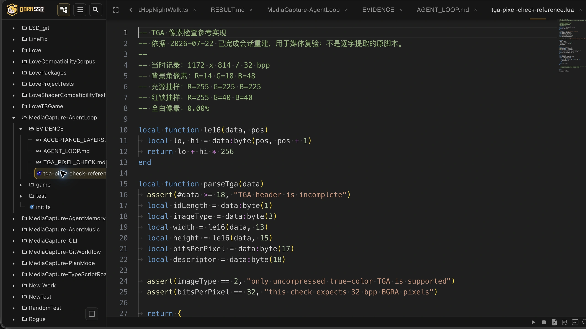
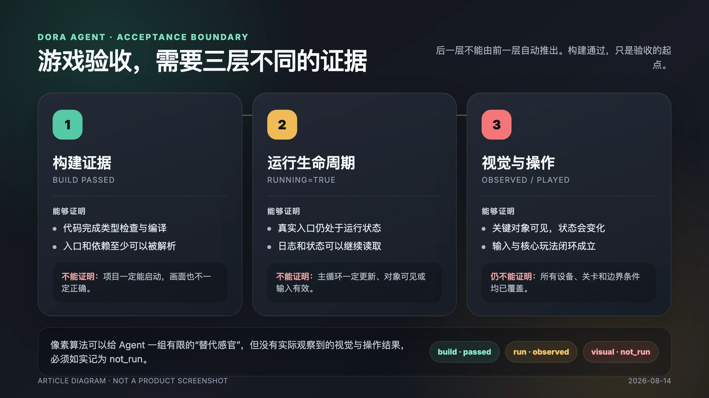
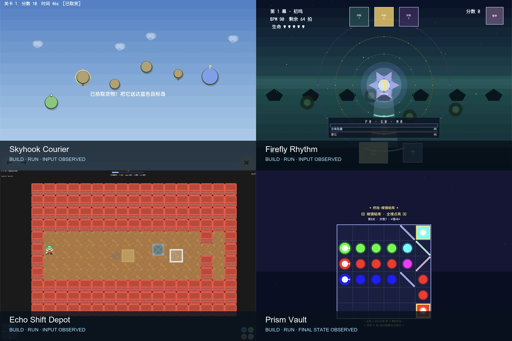
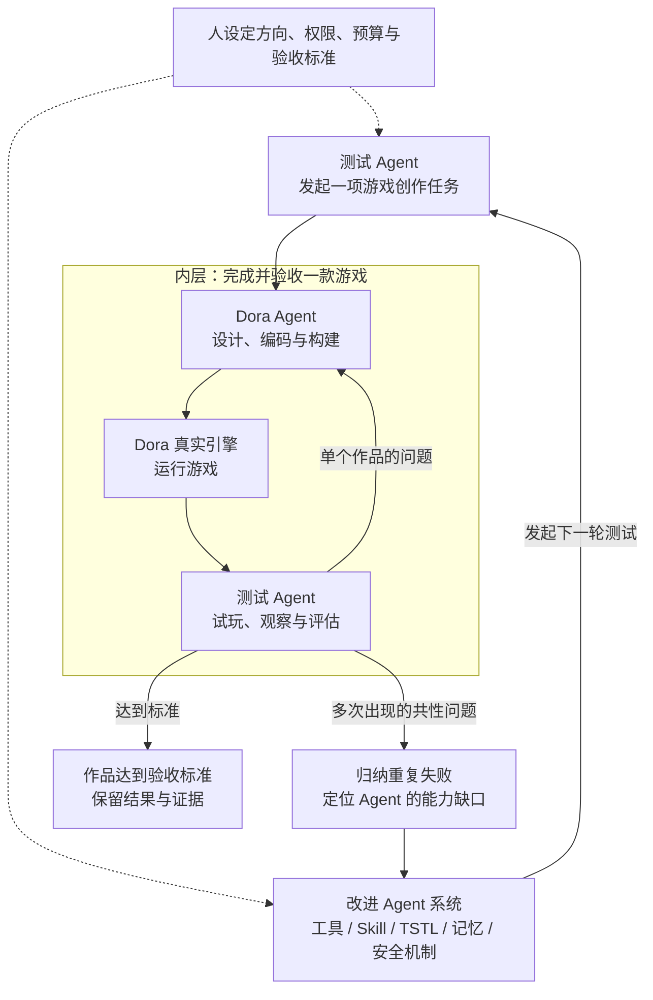

# 我让一个 Agent 扮演用户，去验收另一个 Agent 做游戏

> Codex 负责提需求和试玩，Dora Agent 负责创作；几十款实验后来变成了引擎本身的训练场。

<!-- truncate -->

## 这一次，我请 Codex 去当用户

最近我做了一件看起来有点绕的事。

我让 Codex 扮演一名使用 Dora SSR 的游戏创作者，通过 Web IDE 给 Dora Agent 提需求。Dora Agent 负责设计、写代码、构建和修正；Codex 则像用户一样继续追问、启动游戏、观察画面、使用键鼠操作，再把发现的问题发回下一轮会话。

一个 Agent 做游戏，另一个 Agent 坐在旁边验收。

听上去像两台机器开会，甚至有一点“你们 AI 自己商量好再叫我”的味道。但它并不是一个完全脱离人的自动训练系统。做什么实验、怎样才算可玩、哪些问题值得继续追，仍然来自我的目标和判断。Codex 承担的是一位耐心用户、产品负责人和测试者的角色，把这些要求持续落实到每一轮交互里。

这项工作最后在 `AgentArcade` 里留下了八十多个项目目录。其中有同一游戏的 `v2`、`v3`，也有不同完成度的实验。归一化以后，依然覆盖了几十个不同游戏概念，以及大量创作、试玩和返工记录。

这些记录让我越来越确信：当模型的 coding 能力跨过临界点以后，最难的问题已经不只是让它写出代码。

更难的是，怎样让它知道自己做出来的东西到底对不对。

## 它看不见画面，却给自己做了一双像素眼睛

在这些实验里，有一个瞬间让我觉得很神奇。

当时 Dora Agent 正在修复一款叫《棱镜秘库》的光路解谜游戏。它使用的是 GLM-5.2，并不具备视觉多模态能力。换句话说，它可以写渲染代码，却不能像人一样看一眼截图，说出画面是黑的、白的，还是少了一个红色的锁。

按照通常的产品边界，故事似乎应该停在一句很礼貌的说明：

> 我无法查看画面，请用户进行视觉确认。

但它没有停下来。

它先调用 Dora 的截图接口，把游戏画面保存成 TGA 文件。随后又发现截图落在引擎工作目录里，项目内容系统读不到；于是它把文件复制到项目可读取的区域，再用 Lua 读取二进制数据。

TGA 是一种结构相对直接的图像格式。文件开头记录图片类型、宽度、高度、每个像素占多少位，以及像素从哪个方向排列；后面跟着一串蓝、绿、红和透明度数据。人看到的是一张图，程序看到的是一个文件头和几百万个数字。

GLM-5.2 就从这些数字开始，给自己搭了一种有限的视觉。

它解析出截图是 1172×814、32 位未压缩真彩色图像，然后统计全白、暗色、蓝紫和红色区域的比例。为了确认画面里不只是“有颜色”，它还把游戏的 6×6 棋盘坐标换算成截图坐标，去抽样光源、锁、背景和棋盘中心的具体像素。

最后得到的结果包括：背景角是 R=14、G=18、B=48 的深蓝紫色；红色锁是 R=255、G=40、B=40；光源中心带有白色高光；全白像素占比为 0%。

它甚至继续分阶段截图，检查放下一块镜子以后，光线是否抵达锁，锁是否点亮，游戏又是否进入下一关。

这段过程也不是一次顺滑的表演。它先后遇到了截图路径不可读、异步复制还没完成就读到空文件，以及像素循环变量写错等小问题，再根据真实结果一项项修正。它最终完成的，不是“假装看见”，而是为一个自己无法直接感知的问题，临时制造了一套可以被数据反驳的检查方法。

我很喜欢这样理解这个瞬间：

> 它看不见画面，却把一张截图变成了一份自己能够批改的像素考卷。

当然，这双“像素眼睛”仍然有明确边界。它能判断是不是黑屏、关键颜色是否缺失、某个元素是否出现在预计区域，却很难回答构图是否舒服、文字是否好读、动画是否自然、操作有没有手感。

所以它没有让人的视觉验收变得多余。它真正改变的是：在把作品交给人以前，一个没有视觉能力的 Agent 也可以主动排除更多确定性的画面错误。

## 它说游戏正在运行，我却只看见了背景

有一款打砖块游戏很能说明问题。

Dora Agent 已经写完代码，逻辑测试通过，真实入口也显示 `running=true`。从工程状态看，一路绿灯，似乎已经可以收工。

但把游戏真正打开以后，画面中看不到砖块、挡板和球，只剩下 HUD。

原因并不神秘：负责绘制深色背景的节点被放在了游戏图形上面，于是它兢兢业业地把所有东西都盖住了。程序确实在运行，球也可能正在背景后面努力工作，只是玩家什么都看不见。

这次失败把三个经常被混在一起的结果拆开了：

1. **代码能够构建**：说明程序符合语言和类型规则。
2. **入口能够运行**：说明引擎成功加载了它，没有立刻报错退出。
3. **游戏能够玩**：画面看得见，输入有效，目标、失败和重新开始组成了实际体验。

前两项可以由工具快速检查，第三项却不会因为状态栏亮起一个绿色标记就自动成立。

这也解释了为什么，我后来不满足于让 Dora Agent 自己报告“任务完成”，而要安排另一个角色真正打开作品，像用户一样看一眼、按一下、玩一会儿。

不过，这个故事的起点还要再往前倒一点。

## 第一次请 Agent 来，是让它进积木工厂

我第一次认真把 Agent 放进 Dora，不是让它做游戏，而是请它进 Blockly 的“积木工厂”。我先手写一个 Dora 专用积木作为模板，Cursor Agent 再按同一规则扩展，大约三天补出了 5000 多行 API 定义。

重点不在代码量，而在分工：人理解问题、建立范式，Agent 把可检查的规则快速铺开。它最初帮我们制造的，是做游戏的工具。

后来有人追问：既然 AI 能造积木，能不能让它自己搭？我们让模型生成带类型约束的 TypeScript，再经编译检查转换为 Blockly，于是形成一条小闭环：

> 理解需求 → 生成程序 → 编译检查 → 根据错误修正 → 保存为积木

这证明了清晰表达加编译反馈可以让 Agent 自我修正。不过，编译器只能判断程序是否合法，不能告诉它砖块有没有被背景盖住。要继续往前，Agent 必须从积木工厂走进真实项目。

## 从一棵积木树，走进完整游戏项目

Dora Coding Agent 后来能够成立，是三个条件逐渐汇合的结果。

Blockly Coder 让我们验证了结构化表达和编译反馈。Dora Web IDE 已经把项目文件、代码编辑、构建、日志和真实引擎放在同一个工作现场。再往后，大模型的 coding 能力跨过临界点，长程地阅读项目、调用工具和根据错误继续修正，才开始真正值得做成产品。

问题也随之发生变化。

以前我们问：“AI 能不能写出这段代码？”

现在更重要的问题是：“它能不能在这个项目里把事情做完，并拿出可信的结果？”

要做到这件事，一个 Agent 至少需要三种互相连接的能力。

第一是**理解现场**。它要知道项目里有哪些文件，使用什么 Dora API，资源放在哪里，现有代码采用怎样的结构。没有这些信息，再聪明的模型也像第一天上班却没人告诉它仓库在哪的新同事。

第二是**使用工具**。它要能读写文件、构建、运行、检查错误，并在方向不对时恢复。工具把“我认为应该这样做”变成“我已经在项目里这样做了”。

第三是**接受真实结果的反驳**。构建器可以驳回错误代码，引擎可以暴露运行异常，而画面、输入和玩法还会继续追问：程序虽然跑了，作品真的成立了吗？

缺少任何一段，Agent 都很容易把自己的陈述误当成交付。

## 几十款游戏，不是一面作品墙

最初，我也希望随着 Dora Agent 不断改进，做下一款游戏需要的轮次会自然减少。

真实数据没有这么讨人喜欢。

在一批 24 款游戏的历史记录中，Codex 共向 Dora Agent 发起 112 次任务，产生 1855 次 LLM 轮次。后八款的单次任务略有缩短，但每款游戏需要的返工任务反而更多，端到端成本并没有呈现清楚的下降趋势。

一部分原因是验收标准变严格了。早期容易把“构建通过”当作一个漂亮的终点；后来，我们会继续启动真实入口、观察画面、尝试键盘、触摸和手柄输入，再根据问题发起下一轮。

质量要求提高，当然会增加返工。但记录也揭示出真正的瓶颈：Agent 常常能很快做出第一版，却不能在第一轮里完成从实现到试玩的完整闭环。

打砖块的图层遮挡只是其中一个例子。

还有一款贪吃蛇，入口显示正在运行，纯逻辑测试也通过，蛇却一直停在原地。原因是同一个节点调用了两次 `schedule()`。在 Dora 中，第二次调度会替换第一次；负责重绘的回调把负责游戏推进的回调挤掉了。它不是崩溃，而是一本正经地静止。

输入问题也反复出现过：键盘短按被帧轮询漏掉；代码声称支持手柄，实际却从错误位置读取控制器；触摸按钮在小窗口里缩到四十多个像素；全屏以后 HUD 小得像写给蚂蚁看的说明书。

这些问题很难只靠阅读源码统一发现。它们要求验收者真的看见画面、按下按键，并把“哪里不对劲”重新翻译成下一轮明确反馈。

所以这几十款游戏对我而言，不只是一面等待展示的作品墙，更像一组不断把 Agent 打回来的实验。

## 游戏在改，Agent 也在改

当同一种失败重复出现，继续给每个游戏补一句更长的提示词并不是最有价值的做法。我们会追问：这是不是 Dora Agent 本身缺了一项能力，或者缺了一条来自引擎的反馈？

例如：

- Agent 写完代码却不断搜索 API、不肯先构建，我们就让空项目减少无意义探测，并形成“小批编辑—构建—按错误修正”的节奏。
- 上下文压缩后，它忘记已经做到了哪一步，又从头读取文件，我们就在摘要中保留当前错误、已改文件和精确的下一动作。
- `running=true` 容易制造假象，我们把构建、运行和人工/视觉验收拆成不同结果，并补充真实入口的加载、状态查询和停止清理。
- 坐标、图层、`schedule`、HUD 和输入反复出错，我们把这些 Dora 特有知识写进 Agent 真正会读取的 Skill，而不是希望模型每次临场猜对。

还有一类问题看起来更像程序员的代码习惯，我却把它们当成了运行规则。

Dora Agent 写的是 TypeScript，交给引擎运行的却是转换后的 Lua。两种语言很像一对能聊得来的同事，但在一些小地方会突然互相误会：`any` 会让类型检查提前放弃追问；裸 `null` 不适合直接表示 Lua 里的“没有”；Lua 数组也留不住由 `undefined` 或 `null` 形成的空位。更隐蔽的是，JavaScript 里的数字 `0` 可以被当成假，Lua 里却只有 `false` 和 `nil` 才是假。

于是，我没有只把这些经验塞进 Agent 的提示词里，而是直接修改了 Dora 内置的 TSTL 编译器。显式使用 `any`，编译器会报错并停止转译；写下裸 `null`，它会明确告诉 Agent：Lua 没有对应的 `null`，请使用 `undefined`。对于 `if`、循环以及 `&&`、`||` 里的条件，它也会检查代码是否误用了 JavaScript 的真假值习惯，要求把“有没有”和“是不是”写成显式比较。

Skill 仍然会提前告诉 Agent 正确写法，具体项目的记忆也会记录怎样修正，但编译器是最后那道不会忘记的门。它们不是代码风格洁癖，而是两种语言之间的交通规则；更重要的是，这些规则一旦进入编译器，就不只服务于某一次 Agent 会话，而会保护以后所有使用 Dora TypeScript 的创作。

有一次，Dora Agent 执行的测试还让引擎内存一路增长到约 30 GB，我只能强制退出。于是工具能力的另一面也变得很具体：Agent 不只需要更多权限，还需要超时、取消、对象数量监控和可靠清理。否则，一位过分勤奋的新同事也可能在几秒钟内把仓库塞满。

这套过程不是传统意义上的模型训练。我们没有用这些游戏去更新大模型权重。被持续训练的，是围绕模型工作的整个系统：工具怎样反馈，Skill 提供什么知识，长任务如何保存进度，什么情况允许继续，什么证据才配得上“完成”。

## 当 Loop 本身也成为工程对象

Agent 原本就依靠 loop 工作：读懂任务，采取行动，接收结果，再决定下一步。但做完几十款游戏以后，我开始把视线从“这一轮能不能写对”移到了 loop 本身。

在内层循环里，Dora Agent 围绕一款游戏反复编辑、构建、运行和修正。在它外面，还有一层更长的循环：Codex 连续扮演用户创造试验样本、试玩验收、归纳共同失败，再去修改 Dora Agent 的工具、Skill、编译器和安全机制，最后交给下一批游戏复测。

我更愿意把这件事称作 **Loop 工程**。它不是让模型关在房间里无限思考，而是把目标、反馈、状态保存、评估标准、调用预算和安全边界都做成可设计、可观察、可改进的工程系统。

图中的回路有两个出口。某款游戏自己的问题，会回到 Dora Agent 继续修正；如果同一种问题跨作品反复出现，测试 Agent 就把它提升为系统问题，推动 Agent 的工具、知识、编译器或安全机制发生变化，再发起下一轮测试。

这样一来，交给 Agent 的就不再只有某项软件功能。连“怎样把这类功能越做越好”的一部分工作，也可以交给 Agent 长时间运行：制造样本、发现问题、修改系统，再用新样本检验自己。

第一次意识到这一点时，我确实觉得，我们已经半步踏进未来了。

当然，这里的“自我演进”不是模型偷偷改写自己的权重，更不是让它脱离人的目标无限运行。人仍然决定往哪里走、开放哪些权限、愿意花多少成本，以及什么证据才能通过验收。变化在于，人不再需要亲手推动循环里的每一个动作；Agent 已经可以参与改进承载自己的那套软件系统。

## 改进有效吗？有迹象，但还没有魔法

为了避免只拿越来越复杂的不同游戏互相比较，我们还做过一组小规模对照：固定同一个普通用户需求、模型、验收标准和十分钟上限，不把技术实现与测试步骤偷偷写进提示词。

在 DeepSeek 的三轮小样本中，改进版相对 baseline 把 LLM 请求从 218 次降到 137 次。按我实际试玩的结果，能玩的样本从 1 个增加到 2 个。

这个结果令人鼓舞，但三对三远远不够写成稳定成功率。它只能说明，在那组条件下，我们同时看到了 loop 减少和可玩产出增加；改进版依然有失败，作品质量也并不一致。

截至 2026 年 8 月，以我在 Dora Agent 中的使用体验，DeepSeek V4 Pro 已经可以作为跑通主流程的可用基线；GLM-5.2 及更强模型，在长程理解、工具调用和连续推进上表现得更强、更省心。

这也不是一份永久的模型排行榜。型号会变化，同一个模型面对不同项目也会有很大差异。真正比较稳定的判断是：模型越强，Agent 能够主导的工作范围确实会扩大；而它能否把能力落到游戏里，仍然取决于工具、反馈、时间和调用预算。

## Agent 可以主导，但“完成”不能由它自己宣布

我并不认为 Dora Agent 永远只能做一个等待逐行指令的助手。

如果给它更强的模型、足够的时间和合理的调用预算，它已经有能力主导玩法细化、工程实现、构建和多轮修正。人可以深度参与每个产品选择，也可以只提供创作目标、资源边界和验收标准，把大部分中间过程交给 Agent。

这不是“辅助或取代”的二选一，而是一条会随条件移动的刻度。

不过，Agent 主导得越多，真实反馈越重要。模型可以大量完成代码，甚至参与设计，但游戏是否可见、可控、可理解、可重新开始，仍要由运行中的作品回答。

回头看，Dora Agent 的路线很像一次逐渐扩大的实习。

一开始，它按照模板帮我们造积木；后来，它学会用结构化文本自己搭积木；再后来，我们把完整项目、构建工具和真实引擎交给它，让它开始为结果负责。

而这一次，我们又安排另一个 Agent 坐到了用户的位置上。它不只是鼓掌，也会打开游戏，按下按键，然后认真地说：

“等一下，球呢？”

这句有点扫兴的反馈，可能正是一个会写代码的 Agent 走向一个会完成作品的 Agent，中间最重要的一步。

而当它还能把这次失败变成下一轮的工具、规则和编译器改进时，改变的就不只是一款游戏，而是制造下一款游戏的循环本身。

---

资料来源：

- [Dora SSR x Blockly—这种感觉我从未拥有](https://ippclub.org/Dora-SSR-x-Blockly%E2%80%94%E8%BF%99%E7%A7%8D%E6%84%9F%E8%A7%89%E6%88%91%E4%BB%8E%E6%9C%AA%E6%8B%A5%E6%9C%89/)
- [Dora SSR x AI x Blockly 低科技和高科技的碰撞](https://ippclub.org/Dora-SSR-x-AI-x-Blockly-%E4%BD%8E%E7%A7%91%E6%8A%80%E5%92%8C%E9%AB%98%E7%A7%91%E6%8A%80%E7%9A%84%E7%A2%B0%E6%92%9E/)
- [DeepSeek API 更新日志](https://api-docs.deepseek.com/zh-cn/updates)
- [DeepSeek V4 Pro 发布说明](https://api-docs.deepseek.com/zh-cn/news/news260424)
- [GLM-5.2 官方文档](https://docs.bigmodel.cn/cn/guide/models/text/glm-5.2)

---

