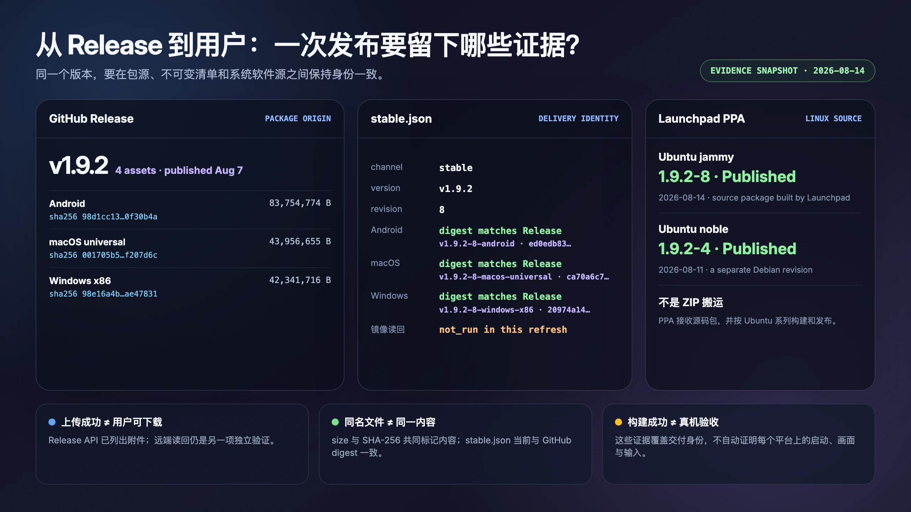

# 开源软件为什么到不了用户手里

我以前对开源有一种很朴素的想象：代码已经放到 GitHub，许可证也允许大家免费使用，这件软件大概就算交到用户手里了。

后来维护 Dora SSR 的时间越来越长，我才发现这个想象有一点离谱。像是把菜谱贴在门口，然后宣布晚饭已经送达。

<!-- truncate -->

对开发者来说，源代码确实在那里。愿意配置编译环境、处理依赖、阅读构建说明的人，可以自己把它做成能运行的软件。但多数用户要找的不是菜谱。他们想知道：我的 Windows 电脑能不能直接下载？Mac 上应该选哪个包？Android 安装时为什么提示签名？一台复古游戏掌机上有没有现成入口？下一个版本又该去哪里更新？

只要这些问题没有答案，软件在用户眼里就还没有真正出现。

## 源码公开、可以安装和进入商店，是三件事

“开源发布”很容易被说成一个动作，实际上至少有三层距离。

第一层是源码公开。它解决的是查看、修改、再分发和共同开发的权利。

第二层是可下载安装。项目需要为不同操作系统和处理器准备包，说明怎样安装，并让用户能够稳定下载。一个在开发者电脑上编译成功的目录，还不是普通用户能够使用的产品。

第三层是进入用户熟悉的主流应用商店。到了这一层，软件不只要能运行，还要进入平台的开发者体系，准备相应材料，完成身份和账号核验，满足安装包签名、内容审核以及后续更新等要求。

这三件事会互相连接，却不能画成等号。源码免费，不会自动生成 Windows、macOS 和 Android 安装包；已经有安装包，也不代表它自然会出现在每一个应用商店里。

## 我确实考虑过应用商店，然后主动放弃了

Dora SSR 是一个公益开源项目。我当然考虑过把它放进国内用户熟悉的应用商店。那会让下载入口更容易理解，也可能让第一次接触开源游戏引擎的人少绕很多路。

但在评估这条路线以后，我没有继续提交。这里没有一个“我们满怀期待地提交，然后惨遭拒绝”的戏剧故事。更准确的说法是：我把需要长期完成的工作列出来，然后承认以个人项目的资源，很难稳定承担它。

我评估时还发现，Dora 并不是一款完全离线的单机工具。它没有自建资源服务器，但会从第三方 Git 仓库获取开源资源，也包含 Web IDE、Agent 等联网或设备通信能力。因此，如果进入国内应用商店，就不能简单按照纯离线应用理解，仍需结合实际功能确认 App 备案要求。这里讨论的是 App 备案，并不意味着 Dora 因为能够联网，就需要申请 ICP 经营许可证。

备案之外，开发者实名、权属材料、安装包签名和第三方许可证又是几条彼此独立的交付线。它们各有目的，也不能被概括成一种统一的“上架资质”。

iPhone 还有一道更难靠补材料解决的门槛。Dora 不是功能在提交时就完全固定的成品应用，它本来就是让用户在设备上修改、加载并运行游戏代码，立即测试创作结果。App Store 希望提交上去的软件已经知道自己要做什么，Dora 偏偏是一件帮助用户不断写出“它接下来要做什么”的工具。

苹果原则上限制 App 下载和执行会改变自身功能的代码。规则虽然为代码教学、开发和测试工具保留了有限例外，要求源码可被用户完整查看和编辑，但 Dora 作为能够加载和测试完整游戏的通用引擎能否适用，仍有很大的审核不确定性。我们没有实际提交后被拒的经历，因此不能说它绝无可能；但也不能把 App Store 当作一条稳定的公开分发路径。

截至 2026 年 8 月，苹果的替代应用分发只覆盖欧盟、日本和巴西，尚未覆盖中国大陆，而且替代分发的 App 仍需经过 Apple Notarization。未来中国大陆如果开放类似机制，确实会为 Dora 增加一种安装机会，却不保证动态加载代码的问题自动消失；还要看届时的公证和平台规则。

每一项要求都有自己的目的。真正让我退后的不是其中某一项，而是备案确认、主体材料、软件签名、平台审核和后续更新共同组成了一项长期工作。它不会随着首次上架结束：每次发版以后，仍要继续确认渠道中的内容是否正确。

商业软件可以把这些工作交给法务、发行、测试和平台运营。个人主导的公益项目如果也走同一条路，成本不会因为软件免费就自动消失。它只会从用户支付的价格，转移成维护者投入的时间、精力和持续责任。

所以我放弃的是一条暂时承担不起的渠道，不是把软件送到用户手里的目标。

## 没有统一商店，就搭一张分发网络

Dora 后来选择了一条更符合开源项目资源条件的路线。

GitHub Release 是平台包的源头。一个明确的版本在这里对应源码历史、发布说明和构建产物。对能够顺畅访问 GitHub 的开发者，它也是最容易核对原始发布信息的地方。

但源头不一定对每位用户都同样可达，于是 Gitee、GitCode 等国内镜像补充下载入口。镜像的意义不只是“再复制一份”。它需要跟随版本更新，还要确认用户从远端真正下载到的文件，与源头是不是同一份内容。

对于 Android、Windows x86 和 macOS universal 三个平台，Dora 还建立了 `Dora-Releases` 分发库。它不把“最新版”只写成一个会移动的模糊指针，而是为每个平台建立不可变的 revision tag，并用签名的 `stable.json` 记录版本、平台提交和文件摘要之间的关系。

Linux 走的是另一条路径。PPA 接收的是源码包，由 Launchpad 针对 Ubuntu 发行版构建并发布到 apt 软件源。这样做保留了 Debian 包的版本和依赖规则，也让 Linux 用户能够沿着系统熟悉的软件包管理方式安装与更新，而不是把另一个平台的压缩包硬搬过去。

再往外，复古游戏掌机和其他设备往往没有统一答案。它们的系统、处理器、目录约定和启动方式不同，最后那一米通常要靠熟悉设备的社区伙伴补上安装说明、启动脚本或专用软件包。

这些渠道并不等同，也不是全部由我一个人维护。GitHub 负责源头，镜像改善可达性，平台分发库固定交付内容，PPA 进入 Linux 包管理体系，社区设备入口解决具体机器怎样安装和启动。它们共同组成了一张并不完美、但可以逐步扩展的分发网络。



## 为什么同一个 v1.9.2，还需要 revision 8？

截至 2026 年 8 月 14 日，Dora 的当前案例是 `v1.9.2 revision 8`。

`v1.9.2` 表达产品版本。它告诉用户，这些包属于同一条功能和兼容性基线。`revision 8` 表达交付修订：在产品版本不变时，构建脚本、平台包装、生成资源或分发内容可能经过修正，需要一个新的编号精确指出“用户拿到的是哪一次交付”。

这也是为什么 Git tag、平台 revision 和用户看到的版本号不能混成一件事。Git tag 把源码发布固定到一段历史；平台 revision 固定某个平台实际交付的内容；版本号则负责告诉人这是什么产品版本。

Linux 包里还会出现类似 `1.9.2-8` 的 Debian revision。它可以记录某次打包修复，而不假装上游引擎突然多了一个新的功能版本。不同 Ubuntu 系列也可能处在不同的打包 revision；编号看起来多了一层，目的反而是减少含糊：将来出了问题，我们能追到具体是哪一个源、哪一次构建和哪一份包。

## 发布流程要替人记住那些容易忘的事

跨平台发版最危险的状态，不是完全失败，而是“看起来已经差不多成功”。

CI 页面变绿，只能说明工作流完成了构建，不等于软件已经在目标设备上运行正确。上传接口返回成功，只能说明服务接收了请求，不等于公开页面已经更新，更不等于用户能下载。两个附件都叫 `dora-ssr-v1.9.2-android.zip`，也不能证明它们的内容相同；旧文件完全可以穿着新文件名继续留在远端。

因此 Dora 的发布过程逐步变成了一条明确的交接链：

```text
版本元数据
→ annotated tag
→ 平台 CI
→ 下载并核对大小与 SHA-256
→ 上传国内镜像
→ 从远端重新读回并复核
→ 建立不可变的平台 revision tag
→ 最后发布签名清单
```

annotated tag 不只是一个方便看的名称，它还保存标签对象、作者、时间和说明，让版本落到明确提交。SHA-256 可以理解为文件内容的数字指纹：文件名可以一样，指纹却很难在内容变化后继续相同。远端读回则是站到用户一侧再走一次下载路径，避免只相信上传端说“已经成功”。

把签名清单放到最后，也是在表达一种交付顺序：先确认每个平台的内容已经存在、能够匿名取得并与摘要一致，再宣布这个 revision 可以被客户端看到。至于客户端怎样验证签名、怎样避免不安全更新，是另一个值得单独展开的话题，这里先不把它塞进一篇文章。

自动化并不是为了显得发布流程很高级。它首先是在替人记忆。个人维护者可能在深夜更新版本，也可能几个月后才再次发包；让脚本坚持检查版本、标签、大小、哈希和远端内容，比要求一个人永远记得所有步骤更可靠。

## 免费不等于零成本

开源让软件可以被看见、研究、修改和共同建设；免费让用户不需要先支付许可费用。但从一份源代码到一个普通用户能够放心下载的安装包，中间仍然有人在构建、测试、签名、上传、镜像、写说明、维护软件源，并回答某台设备为什么启动不了。

这些成本不会消失，只会决定由谁承担，以及能不能通过工具和社区分担。

Dora 没有因为暂时不进入主流应用商店，就假装分发问题不存在。我们只是把有限资源放在一张可以验证、可以接力、允许社区逐步补全的网络上，使个人主导的公益项目仍能持续维护。

如果你熟悉某个还没有被 Dora 覆盖的系统、可靠镜像或游戏设备，欢迎贡献对应的软件包、下载入口、安装说明或启动脚本。比“这里也应该支持一下”更有价值的，是一起说明它怎样构建、怎样验证、由谁维护，以及下一次版本到来时怎样继续把软件送到用户手里。

---

本文涉及的平台规则以 2026 年 8 月核验结果为背景，不构成法律建议；发布前仍需按官方规则和 Dora 当前渠道状态重新核对。

参考资料：

- [工信部：移动互联网应用程序备案工作解读](https://www.miit.gov.cn/jgsj/xgj/hlwgl/art/2023/art_564bf0759d7e41d5b4aa8ce4996b9e84.html)
- [工信部：互联网信息服务管理办法](https://sdca.miit.gov.cn/zwgk/fgbz/art/2026/art_fea940f81f1d423e87101adf147ab979.html)
- [Android：为应用签名](https://developer.android.com/studio/publish/app-signing)
- [华为 AppGallery Connect：应用分发流程](https://developer.huawei.com/consumer/cn/appgallery/devstart/)
- [小米：应用资质审核 FAQ](https://dev.mi.com/xiaomihyperos/documentation/detail?pId=2251)
- [小米：移动应用程序备案信息补充指引](https://dev.mi.com/xiaomihyperos/documentation/detail?pId=1775)
- [Apple：App Review Guidelines](https://developer.apple.com/app-store/review/guidelines/)
- [Apple：Alternative app distribution](https://support.apple.com/en-mide/118110)
- [Dora SSR v1.9.2 GitHub Release](https://github.com/IppClub/Dora-SSR/releases/tag/v1.9.2)
- [Dora-Releases](https://gitcode.com/ippclub/Dora-Releases)
- [Dora SSR Launchpad PPA](https://launchpad.net/~ippclub/+archive/ubuntu/dora-ssr)

---

<p align="center"></p>
