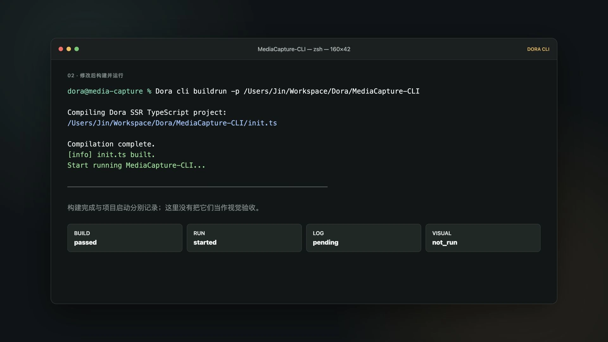
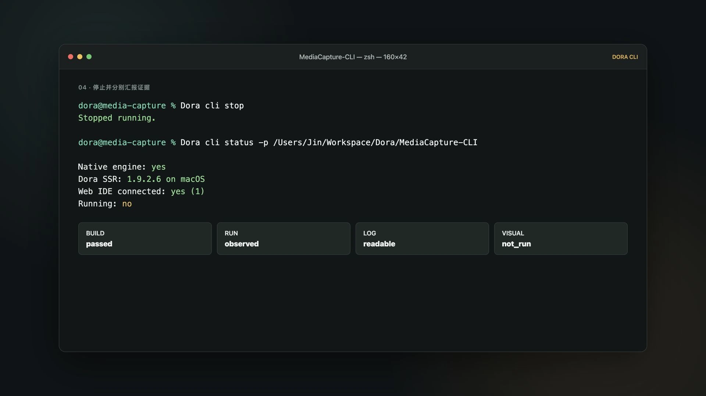

# Agent 为什么需要 CLI

> Agent 会写代码以后，下一个问题是：它能不能自己把游戏跑起来，并看懂发生了什么？

## 我想离开电脑一会儿，Agent 却停在了浏览器门口

我一直想让 OpenCode、Codex 这样的外部 Agent 自动开发 Dora 游戏。

理想中的画面有点贪心：我把想法交代清楚，Agent 自己查资料、修改代码、构建和运行。即使我暂时离开，它也能根据结果继续调整。等我回来时，面对的不是一句“代码已经写好，请你手动测试”，而是一个已经走过几轮验证、把成功和失败都记录下来的项目。

<!-- truncate -->

但最初的现实更像另一回事。

Agent 能读项目，也能把代码写进文件。然后它走到游戏引擎门口，发现后面的按钮都在浏览器里：构建要打开 Web IDE，运行要点击界面，日志和当前状态还需要人看过以后再转述。

像是请来一位会做家具的伙伴。木料切好了，桌腿也装上了，最后它却隔着玻璃门问你：“能帮我进去拧一下最后一颗螺丝吗？”偶尔一次当然没问题。可长程任务里每走几步都要等人回来，所谓自动开发就只剩下了自动写代码。

## 会写代码，和接过开发任务，还隔着一段路

游戏开发不是把源码填满就结束了。

一段修改至少还要经过构建、运行和反馈。构建告诉我们语法与类型是否成立；运行告诉我们引擎能不能真正加载它；状态和日志则让开发者知道当前跑的是哪个项目、程序有没有报错、下一步应该继续还是回头修正。

这些步骤对人来说可以靠记忆和界面完成，对 Agent 来说却必须成为可以调用、可以读取的明确接口。

如果每项能力散落在不同页面、脚本和内部服务里，Agent 就要反复猜测：该用哪个入口？浏览器是否已经连接？这次修改应该怎样验证？换成另一种 Agent，整套接入还可能重做一次。

我真正想补上的，就是这段路。

## Agent 的工具不只有 tool call 和 MCP

谈到给 Agent 增加能力，人们很容易先想到 tool call 或 MCP。它们确实很重要，但不是所有能力都必须做成同一种形状。

| 入口 | 更适合解决什么问题 |
|---|---|
| tool call | 把经常调用的动作包装成模型可以按结构使用的工具 |
| MCP | 让 Agent 客户端按统一协议连接外部工具或数据服务 |
| Skill | 告诉 Agent 某类任务有哪些规则、步骤，以及什么时候使用现有能力 |
| CLI | 给人、脚本和不同 Agent 一套都能执行、复制并检查的文本接口 |

它们并不互相排斥。Skill 可以教 Agent 什么时候调用 CLI；MCP 工具也可以在内部复用同一套底层能力。

CLI 的特别之处在于它足够朴素。只要一个 Agent 可以执行命令，就有机会使用它，不必先为某个宿主开发专属适配。那些不常用的能力，也不一定要始终出现在每一轮 Agent loop 的工具列表里；需要时再从 Skill 或文档中找到命令即可。

而且，人类可以原样运行同一条命令。Agent 说自己完成了构建，我们不必只相信一段总结，也能复制它的步骤重新检查。

## Dora 以前也有 CLI，但现在这套入口来自新的需求

这里需要先说明一件事：Dora 并不是到 2026 年才第一次拥有 CLI。

2026 年 4 月，项目已经加入过一套独立的 Python CLI，用来统一安装、构建和运行等操作。真正由外部 Agent 自动开发需求直接推动的，是两个月后开始形成的当前引擎原生 CLI。

2026 年 6 月 20 日，旧 Python 工具被移除，CLI 进入 Dora 可执行文件自身。命令行参数中出现 `cli` 时，引擎不会启动普通的游戏运行流程，而是进入一个轻量模式，只加载 CLI Lua 脚本和命令需要的最小辅助能力。

随后几天里，项目状态、环境诊断、多语言构建和 Yarn 检查被陆续接入；7 月又加入了 Dora API 与教程的搜索、读取能力。

这不是简单地把 Python 改写成 Lua。入口从一个外围工具变成了引擎自己能够解释和维护的公共接口，目标也更明确：让人和外部 Agent 都能沿着同一条路进入 Dora 的开发现场。

## 一次自动开发，可以怎样走完

假设现在请 Codex 或 OpenCode 修改一个 Dora 游戏，它可以先用 `doc search` 找到相关教程或 API，再用 `doc read` 读取需要的段落，不必凭印象猜引擎接口。


代码修改完成后，`buildrun` 会把构建和运行接起来。接着，Agent 可以用 `status` 确认当前运行目标，用 `log` 读取引擎反馈，任务结束后再用 `stop` 停止项目。



整个过程可以收成一条很短的路径：

```text
查文档 → 修改项目 → 构建并运行 → 读取状态和日志 → 停止 → 汇报结果
```

为了核对这条路径，我用当前 Dora SSR `1.9.1.11` 建立了一个临时 TypeScript 项目。CLI 成功搜索并读取教程，安装 API 定义，构建并运行项目；日志里读到了程序写出的版本标记，停止以后，状态也重新回到 `Running: no`。

这些结果意味着外部 Agent 可以获得一套完整的工程反馈，不需要每一步都等人回到浏览器前面。




## 能自动执行，也要知道自己有没有越界

稳定的公共接口不只是功能多，还要让调用者知道每条命令会做什么。

Dora CLI 中，`status` 和 `doctor` 看起来都在检查状态，性格却不一样。

`status` 像门口的信号灯，只报告引擎是否存在、Web IDE 是否连接、当前有没有项目运行。它短、只读，也更适合脚本和 Agent 快速判断。

`doctor` 才像一张详细检查单。它会展开 CLI 路径、项目结构、服务状态和工具链信息，帮助定位问题。只有明确写成 `doctor --fix`，才表示允许它启动本地引擎、恢复连接或打开 Web IDE。

这种区分对 Agent 尤其重要。检查不应该暗中变成修复，读取状态也不应该顺手改变运行环境。能力越基础，副作用越需要说清楚。


轻量 CLI 模式也是同一种克制。早期实现曾经为了读取 `--asset` 指定的资源路径而初始化完整的引擎内容系统，退出时还产生了一串本不该出现的销毁日志。后来，它被收窄成只向 Lua 环境提供最小的路径信息。

为了看一眼门牌号，没有必要把整栋楼的灯都打开。

## `Running: yes` 还不等于游戏真的做好了

自动化最容易让人兴奋，也最容易让结论跑得太快。

CLI 可以证明代码通过了构建、引擎启动了项目、日志中出现了预期结果。它不能只凭 `Running: yes` 就证明画面正确、按钮好用或者游戏真的有趣。

视觉和玩法还需要另一层验收：让具有视觉能力的 Agent 检查截图，用确定性脚本分析运行结果，或者请人实际试玩。工程闭环让 Agent 不再停在浏览器门口，但它没有取消游戏开发中对结果的判断。

这也是我希望 Agent 最后分别汇报的几件事：构建是否通过，项目是否运行，日志验证了什么，视觉检查是否执行。没有做过的验收就写 `not_run`，不要悄悄拿另一项成功代替。

## 命令行没有回到旧时代，它只是多了一位新读者

图形界面仍然适合人直接创作。tool call、MCP 和 Skill 也各有适合的位置。Dora CLI 不需要取代它们。

它解决的是一个更基础的问题：当不同的人、脚本和 Agent 都需要操作同一台引擎时，能不能拥有一套共同理解的入口？

命令是明确的，输出可以读取，失败能够复现，副作用也有边界。对人来说，这是一套可以记住和排查的路标；对 Agent 来说，它是一种不绑定特定产品、需要时就能拿来工作的公共协议。

如果你正在使用一个能执行命令的 Agent，可以尝试把下面这段任务交给它：

> 在一个最小 Dora 项目中，先用 CLI 查阅需要的教程或 API，再修改代码并调用 `buildrun`。读取 `status` 和 `log` 后停止项目，分别报告构建、运行、日志和视觉验收结果；没有执行的验收明确写成 `not_run`。

当它能够自己走完这条路，我们得到的才不只是一个会写代码的 Agent，而是一位开始能够接过开发任务的协作者。

---

参考资料：

- [Dora CLI 中文教程](https://github.com/IppClub/Dora-SSR/blob/main/Docs/i18n/zh-Hans/docusaurus-plugin-content-docs/current/tutorial/115.command-line-interface.mdx)
- [加入旧版统一 Python CLI](https://github.com/IppClub/Dora-SSR/commit/01a2b88909c2cb343b00365fd4418eadec7af075)
- [将 Dora CLI 迁入引擎 Lua 模式](https://github.com/IppClub/Dora-SSR/commit/bd62ba2a1775d0475296b753e193d4e1a0152464)
- [加入 status 与 doctor](https://github.com/IppClub/Dora-SSR/commit/267ceab41d0de4842d3ee815f5afd94c710f3a63)
- [统一 Dora CLI 项目工作流](https://github.com/IppClub/Dora-SSR/commit/f7db59ebccd742b1b2d5ba99612ff873c83e8b33)
- [加入 CLI 文档检索](https://github.com/IppClub/Dora-SSR/commit/07b237b8ea0479a548e622e699849ed829a9a132)

---

<p align="center"></p>
