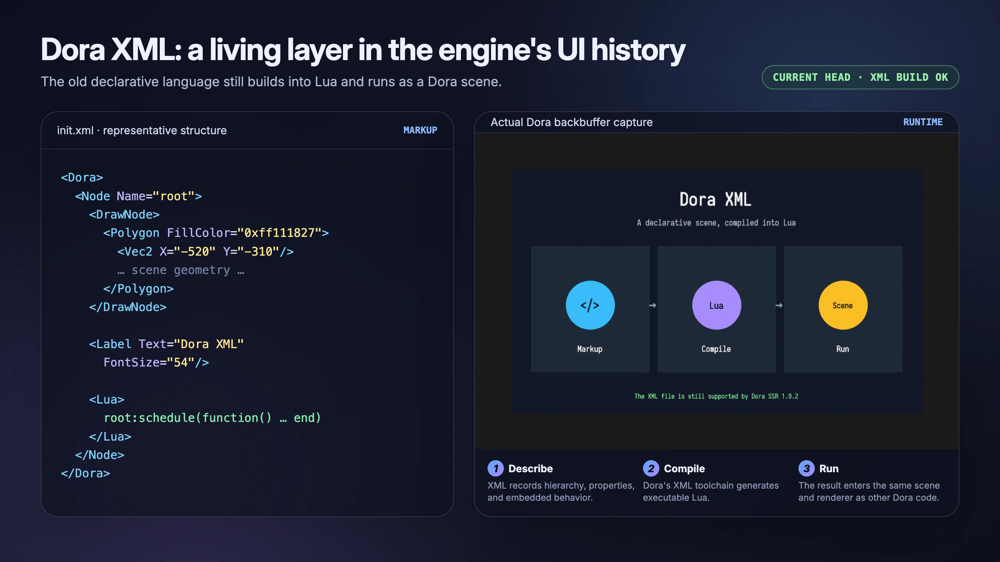
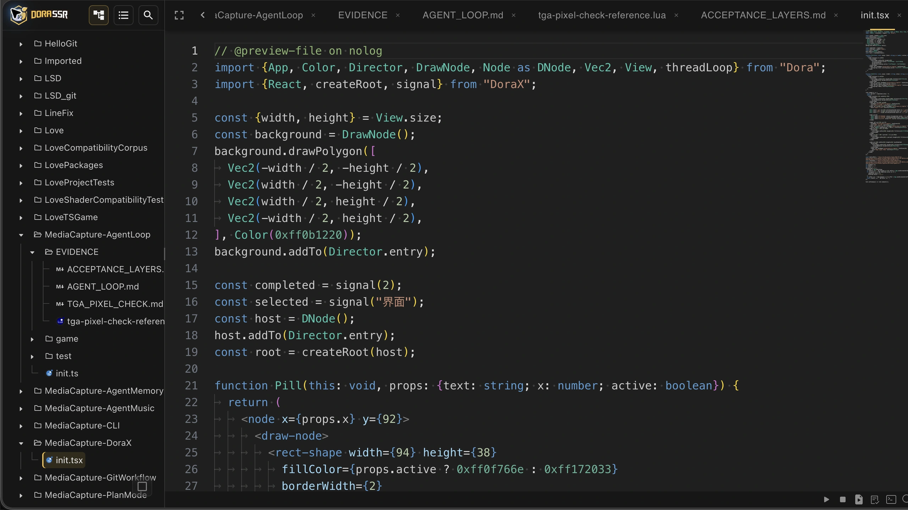
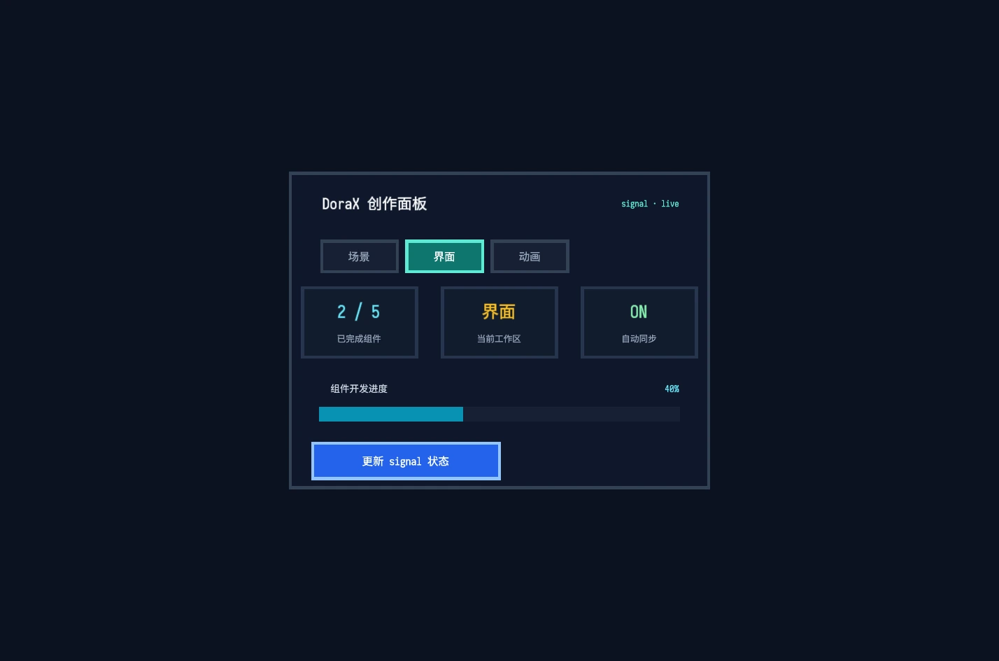

# DoraX：用 TSX 写游戏 UI


> 从 Dora XML 到 DoraX：声明式结构、组件复用和数据驱动怎样进入游戏场景。

<!-- truncate -->

## 那些还没有“数据驱动”的日子

在很久以前——久到今天的前端开发者也许会把它称作“上古时代”——做 UI 常常就是用一门通用程序语言，依次创建控件、设置属性、加入父节点，再绑定事件。

这种方式当然能工作，而且非常直接。只是界面最后长什么样，往往不会完整地出现在代码的任何一个地方。它像一份施工记录：先搬来一块板，再拧上两个螺丝，最后接一根电线。读代码的人要在脑子里把所有步骤重新组装，才能看见那张界面。

后来，UI 定义被抽象成 XML 风格的专用 DSL。层级、属性和布局终于可以直接写成结构。数据与画面怎样保持同步，也逐渐有了 MVC、MVVM 和数据绑定等方法。再往后，JSX 与 React 所代表的数据驱动组件模式流行起来：开发者描述当前数据下界面应该是什么样，再由运行时负责把变化落实到显示对象上。

这不是一条前一种技术退休、后一种技术全面接班的整齐年表。它们直到今天仍然并存。但几十年的软工文化一直在回答两个相同的问题：结构怎样写得更清楚？数据变化以后，能不能少靠人手工追着每一个对象修改？

## Dora 也有过自己的 XML 时代

Dora 引擎自己也走过一段相似的路。

最初，我们可以直接用 Lua 创建节点、设置位置和颜色、挂载子节点，再写事件与动画。2017 年，Dora 已经加入基础 XML loader；后来又推出 Dora XML 和专门的 DoraXml 编辑器。

Dora XML 的目标很明确：把图形展示和逻辑处理适当分开。UI 组件、布局尺寸、颜色外观、交互动画和消息事件，都可以写进 XML 标签。它支持自定义标签和模板，也会编译成 Lua 交给引擎执行。

这让“界面是什么结构”比一长串创建命令更容易看见。Dora XML 并没有从引擎里消失，今天的 Web IDE 仍能新建和构建 `.xml` 文件。



不过，XML 不是这段历史的终点。

## 把声明结构重新放回 TypeScript

2024 年，Dora 开始加入 TSX。

这件事乍看很像绕了一圈：我们先把界面结构从通用程序语言里抽出来，写进 XML；后来又通过 TSX，把类似 XML 的标签放回 TypeScript。

但回来的不只是标签。TypeScript 同时带回了类型检查、代码补全、条件与循环、函数抽象和组件。结构不必再与程序能力二选一。

例如，一个游戏对象可以这样被描述：外层是物理刚体，里面有碰撞形状、负责绘制外观的节点和文字，还可以附带一段进入动画。它们在运行时承担不同职责，在 TSX 里却能作为一个完整结构一起出现。

```tsx
import { BodyMoveType } from "Dora";
import { React, toNode } from "DoraX";

const ScoreBox = (props: {score: number; x: number; y: number}) => (
	<body type={BodyMoveType.Dynamic} x={props.x} y={props.y}>
		<rect-fixture width={100} height={100}/>
		<draw-node>
			<rect-shape width={100} height={100} fillColor={0x8800ffff}/>
		</draw-node>
		<label fontName="sarasa-mono-sc-regular" fontSize={32}>
			{props.score}
		</label>
		<scale time={0.3} start={0} stop={1}/>
	</body>
);

const scene = toNode(
	<physics-world>
		<ScoreBox score={100} x={0} y={0}/>
	</physics-world>
);
```

这不是网页 DOM。`body` 是 Dora 的物理刚体，`rect-fixture` 是碰撞形状，`scale` 是引擎动作。DoraX 借用了 TSX 的表达形式，又把游戏引擎自己的对象和行为放了进去。



函数组件则让整组结构可以复用。HUD、菜单可以做成组件，敌人、物理箱子和带动画的场景对象同样可以。组件化在这里不只是少写几行代码，而是给一组对象和行为划出可以重复组合的边界。



## 写成结构，不等于自动跟着数据变化

这里有一个容易混淆的地方。

DoraX 最早的 `toNode()` 负责把 TSX 元素一次性转换成 Dora 节点。它很适合构建一次以后交给引擎动作、物理系统、事件或普通代码继续管理的场景。

但一次性创建并不等于数据驱动。分数增加以后，文字不会因为当初写成 TSX 就自动改变；菜单列表少了一项，已经创建的节点也不会凭空知道该删除谁。

到了 2026 年，DoraX 又加入 `createRoot()` 和 `signal()`，这一步才把动态数据驱动补进来。

```tsx
import { Director } from "Dora";
import { React, createRoot, signal } from "DoraX";

const items = signal([
	{id: 1, text: "开始游戏"},
	{id: 2, text: "设置"},
]);

const root = createRoot(Director.ui);
root.render(() => (
	<menu>
		{items.value.map((item, index) => (
			<label key={item.id}
				y={40 - index * 50}
				fontName="sarasa-mono-sc-regular" fontSize={30}>
				{item.text}
			</label>
		))}
	</menu>
));

// 比如删掉“设置”，列表会在下一次调度中更新。
items.value = items.value.filter((item) => item.id !== 2);
```

动态根会记住上一次渲染的元素树。当 `items.value` 改变，它重新执行渲染函数，比较新旧结构，再更新属性、加入新节点或移除旧节点。开发者描述“现在应该有哪些菜单项”，不用亲自维护每一个节点的增删步骤。

这里的 `key` 也不是为了满足框架的格式偏好。列表插入、删除或重新排序以后，运行时要靠它识别“这还是原来的那个对象”，才能决定哪些节点应该复用，哪些应该卸载。

当动态界面不再需要时，还应调用 `root.unmount()`。它会移除已渲染节点、取消数据订阅，并执行组件需要的清理。数据驱动减少了手工同步，却没有取消生命周期；只是把生命周期变成框架和开发者共同遵守的规则。


## 两种入口，不必争一个胜负

有了动态渲染，并不代表所有场景都必须持续 diff。

如果对象树只需创建一次，`toNode()` 更直接。它把结构交给 Dora，后续由动作、物理、调度和普通游戏逻辑继续工作。只有当 HUD、菜单或对象列表确实需要跟随数据增删和更新时，才值得使用 `createRoot()` 与 `signal()`。

Dora XML 也仍然存在。当前教程只是建议：在没有性能瓶颈时优先考虑 TSX，以换取 TypeScript 的编辑辅助和更细致的静态检查。不同入口服务不同项目条件，这比宣布某种写法“淘汰”另一种写法更接近真实的软件工程。

## 从 UI 文化走进游戏世界

回头看，DoraX 并不是突然把一个前端流行语塞进游戏引擎。

UI 开发花了很多年，把对象结构、数据依赖和更新规则逐渐写得更明确。Dora 自己也从命令式 Lua 走到 Dora XML，再从一次性 TSX 构建走到动态数据驱动。

而游戏世界同样由对象、层级、状态和生命周期组成。按钮和菜单需要组件，物理箱子、动画角色和场景节点也需要；UI 列表会增删，游戏对象同样会出生、变化和离开。

当 TSX 开始定义动画和物理对象，它就不再只是在写 UI。它开始成为一种描述游戏世界怎样组成、又怎样随数据变化的语言。

---

参考资料：

- [React：Describing the UI](https://react.dev/learn/describing-the-ui)
- [React：Reacting to Input with State](https://react.dev/learn/reacting-to-input-with-state)
- [Microsoft：XAML overview](https://learn.microsoft.com/en-us/windows/apps/develop/platform/xaml/xaml-overview)
- [Microsoft：Data binding and MVVM](https://learn.microsoft.com/en-us/windows/uwp/data-binding/data-binding-and-mvvm)
- [Apple：Displaying and managing views with a view controller](https://developer.apple.com/documentation/uikit/displaying-and-managing-views-with-a-view-controller)

---

<p align="center"></p>
