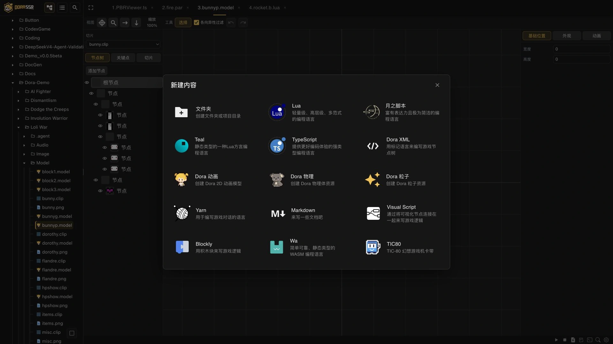
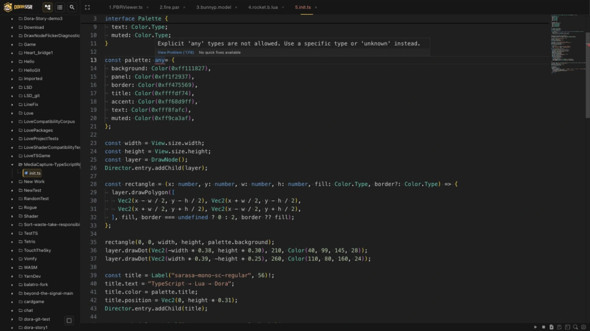

# TypeScript 成了 Dora 的路标

> 当代码的读者不再只有人，编译器也开始参与人和 Agent 之间的协作。

<!-- truncate -->

## 以前写程序，有一种做积木拼搭的快乐

我过去做过嵌入式和 C++ 应用开发。那时候，写下代码往往只是开始：后面还有环境、编译、部署、连接设备和调试，把大批中间操作的任务排成一队，等着把一个小改动送到屏幕上。

如果现在回头看，这大概可以算经典的“古法编程”。程序员先搭好环境和工具链，再把代码一块块拼起来，最后装到设备上，看看这座积木能不能站稳。

这段经历让我一直很在意一件事：编程语言不只决定代码长什么样，它还决定一个创作者需要走多远，才能看到自己的想法真正跑起来。

对个人游戏创作者来说，这个距离尤其重要。我们本来就没有很多人和很多时间。一个想法如果每次都要经过一场小型基础设施建设，它很可能还没来得及证明自己，创作者已经累了。

## Lua 让路变短了，但路短不等于路永远好走

Lua 很轻，可以嵌入引擎，又适合快速修改游戏逻辑。在 Dora 里，它自然成了整个脚本运行环境的地基。

反复等待编译再看结果，和修改脚本很快就能重新运行，是两种完全不同的创作节奏。后一种节奏更容易让人进入“要不再试一下”的状态。

不过，当项目逐渐长大，新问题也会出现。Lua 语法简单、自由，在小脚本里是优点；代码变长以后，我又希望它能更简洁、更好读，让结构更接近我思考游戏逻辑的方式。

我曾经很喜欢 MoonScript。它把很多 Lua 代码写得更紧凑，同时还尽量保留可读性。后来，为了改善原编译器的性能和实现方式，我用 C++ 重写了 MoonScript 编译器，又继续添加自己需要的语言能力。它最后成了 YueScript。

这也逐渐变成了我对编程语言的一种习惯：如果现成的表达方式不够顺手，我不仅想换一个选项，还会忍不住看看编译器里面能不能改。

## 语言看起来很多，其实它们没走同一条路

随着 Dora 发展，项目里逐渐出现了 Lua、YueScript、Teal、TypeScript、TSX、Rust、Wa 和 C# 等不同入口。

把它们排成一行 Logo，看起来像是引擎开了一场语言博览会。但这个画面容易让人误会：它们并不是八个只换了语法的同等按钮。

它们大致经过三条不同的技术路径：

| 路径 | 怎样运行 | 目前的代表入口 |
|---|---|---|
| Lua 脚本路径 | 直接运行 Lua，或者先把其他语言转译成 Lua | Lua、YueScript、Teal、TypeScript / TSX |
| WebAssembly 路径 | 把程序编译成 WASM 字节码，在引擎内置的 WASM 运行时中执行 | Wa、Rust |
| 原生动态库路径 | 将引擎能力导出为稳定的 C 接口，再由其他语言封装调用 | 当前的 C# Windows 工程 |

这里的“转译”，可以理解为把一门高级语言翻译成另一门语言再运行。YueScript、Teal 和 TypeScript 的写法不同，但在 Dora 中都可以转成 Lua，再与引擎的 Lua 环境协作。

WASM 则像一种通用的中间交付格式。Rust 和 Wa 可以使用静态类型和各自的工具链，最后把可执行的 WASM 交给 Dora。C# 又是另一条路：它当前主要在 Windows 上通过动态库和 P/Invoke 调用引擎，不是 Web IDE 里与 Lua 完全同类的脚本入口。

这些路径没有必要争一个绝对胜负。Lua 很适合轻量脚本，YueScript 关心表达力，Teal 给 Lua 加上静态类型，Rust 和 Wa 探索 WASM 与高性能模块，C# 连接另一套开发生态。

语言在这里不是收集品。它们是面向不同任务的工具，也是我用来探索类型、编译、运行时和工具体验的实验。

## 开一扇门很浪漫，一直修门就是工程苦力活了

多语言的代价不在项目主页的那一行名字里。

引擎每增加一个 API，不同入口都可能要同步声明、绑定和封装。“语言绑定”就是让另一门语言能识别并调用引擎原有的类、函数和对象。它的一部分可以通过 IDL 和生成器自动完成，但项目模板、编译工具、教程、示例和平台集成仍然要分别维护。

而且，这些门并不是同样宽。

Lua、YueScript、Teal 和 TypeScript 可以在 Web IDE 中直接新建并由通用构建流程处理；Wa 需要自己的项目结构和引擎内置编译器，目前仍属于工程试验阶段；Rust 使用本地工具链编译 WASM；C# 则是 Windows 上的独立工程。

所以，Dora 支持多语言不代表它们有完全一样的成熟度。门越多，越需要把路标写得老实。

前些天，社区里有人抛出一个很有画面的说法：过去人们为不同脑回路创造不同的编程语言，有点像纤夫为劳动创造不同的号子。语法、缩进和表达习惯，不只是技术选择，也是人类在漫长手工编程中形成的劳动文化。

这个说法当然有些夸张，但它点中了一个变化：过去选择语言，首先考虑的是人写得顺不顺手；Agent 加入以后，我们还要考虑另一件事——什么样的语言和工具链，更容易让机器理解、检查并修正自己的代码？

## 然后，代码来了一位新读者

TypeScript 在 2023 年底进入 Dora，最开始也只是这些语言入口之一。它通过 TypeScriptToLua（TSTL）转译为 Lua，同时带来类型检查、补全和 API 声明。后来加入的 TSX 和 DoraX，又让 TypeScript 可以直接描述 UI 与游戏场景结构。

这些都很有用，但它们还不是 TypeScript 在 Dora 中改变位置的全部原因。

真正的转折发生在 AI Coding 开始可以参与更长程的开发以后。

最近的 Dora Agent 优化中，我让 Codex 扮演真实用户，持续向 Dora Agent 提要求，让它创作游戏，再运行、测试和验收结果。这个过程做了几十款游戏的大量试验，也留下了不少迭代版本。

单看一次生成，Agent 写错一段代码也许只是偶然。当同一类错误在不同游戏里反复出现，它就不再只是某次会话的问题，而是工具链没有给出足够清楚的边界。

这时，代码的读者已经不只是人类程序员了。

## 与其反复告诉 Agent，不如让编译器记住

批量试验中，Agent 会反复写出一些对 JavaScript 很自然、转成 Lua 却容易出问题的代码：用 `any` 绕过类型检查，使用 Lua 没有独立对应值的 `null`，或者按照 JavaScript 的规则判断真假。比如数字 `0` 在 JavaScript 中是假值，在 Lua 中却是真值；数组中间的 `nil` 还会破坏连续数组。

最初，我们把这些注意事项写进提示词和 Skill。可只要经验仍是一段文字，Agent 就可能在下一次任务里重新犯错。

2026 年 6 月，我们把它们写进了 Dora 内置的 TSTL 编译链：显式 `any` 和裸 `null` 会报错，JavaScript 与 Lua 的真值差异会触发诊断，可能产生 `nil` 元素的数组也会被拦截。

这件事让我对语言工具多了一个很具体的理解：**编译器可以教 Agent。**

过去的失败不再只留在某次会话里，而会变成以后每次构建都生效的规则。人不必反复提醒，Agent 也能从编译反馈中知道自己越过了哪条边界。

## 门仍然可以有很多，但路标需要更清楚

Dora 当前的公开教程仍然会说：没有绝对的最佳语言，只有更适合你的语言。

这个判断没有因为 Agent 出现就失效。Lua 仍然轻巧，YueScript 仍然有自己的表达力，Teal、Wa、Rust 和 C# 也各自连接着不同的类型、运行时与工程需求。

但对 Dora Agent 来说，TypeScript 已经成为当前最清晰的主路径。内置的开发规范会优先编辑 TS/TSX 源码，小原型优先从 `init.ts` 开始，并尽量用类型和可编译的确定性测试完成验收。

这不是要关掉其他语言的门，而是承认一个新的工程现实：当代码开始由人和 Agent 共同维护，语言除了要让人写得自然，还要让机器能够被类型、编译器和测试持续纠正。

以前，我为了让自己写得更顺手，忍不住走进编译器。现在，我又开始把人与 Agent 协作的经验写回编译器。

语言的门可以继续留着。只是第一次来到 Dora 的人，以及第一次进入项目的 Agent，都应该能看见一块更清楚的路标。

---

参考资料：

- [Dora SSR：选择你的游戏编程语言](https://dora-ssr.net/zh-Hans/docs/tutorial/language-select)
- [给 MoonScript 重写编译器的故事](https://dora-ssr.net/zh-Hans/blog/2024/4/17/a-moon-script-tale/)
- [来用 Rust 开发跨平台游戏吧](https://dora-ssr.net/zh-Hans/blog/2024/4/15/rusty-game-dev/)
- [TypeScript 首次支持提交](https://github.com/IppClub/Dora-SSR/commit/f28bf34b804881d570d779586be4bed5ce96d496)
- [Dora TSTL 加入更严格诊断](https://github.com/IppClub/Dora-SSR/commit/695bf3376ccf92999b1af17d5f12efa62eb632a4)
- [Dora TSTL 加入更严格的数组诊断](https://github.com/IppClub/Dora-SSR/commit/770ef70688bd5a672cb8886c2aafd22fcc2f7e)

---

