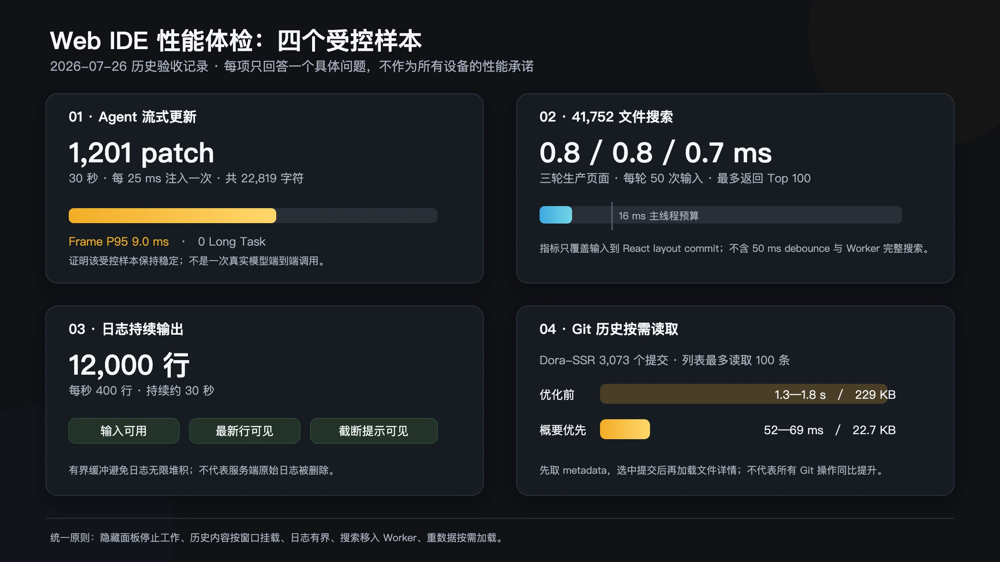

# Web IDE 性能体检

2026 年 7 月，我们对 Dora Web IDE 做了一轮系统性能优化。

这次工作并不是修复某一个已经十分明显的卡顿。真正的起因是 Web IDE 承担的职责越来越多：代码编辑、资源管理、Git、运行日志、可视化工具和 Coding Agent 都在同一个浏览器页面中工作。每项功能单独看都能正常运行，叠加以后却可能产生大量不容易被用户直接看到的消耗。

<!-- truncate -->

例如，一个已经隐藏的面板可能仍在监听数据；Agent 每输出几个字，整段历史消息可能又渲染一次；文件搜索最终只显示几十项，后台却先扫描了四万项；Git 历史只展示提交标题，服务端却提前计算了每次提交修改的全部文件。

因此，这轮优化先不问“哪个按钮最慢”，而是回答三个更基础的问题：

1. 哪些工作发生得过于频繁？
2. 哪些内容虽然暂时看不见，却仍在继续计算？
3. 哪些数据在用户真正需要以前，就被提前加载和处理了？

为了让答案可以复查，我们建立了固定样本和性能预算。本文选取其中最有代表性的几条路径，解释一个浏览器开发环境怎样面对长程 Agent、大型工作区和持续输出。

| 测试负荷 | 主要压力 | 核心处理方法 |
|---|---|---|
| 30 秒内 1,201 次 Agent 更新 | 高频状态更新和历史消息渲染 | 批量合并、稳定历史行、限制可见窗口 |
| 41,752 个文件的搜索索引 | 主线程计算和过期结果竞争 | Worker、Top 100、增量索引、请求编号 |
| 每秒 400 行、共 12,000 行日志 | 高频刷新和内存持续增长 | 分块缓冲、批量刷新、容量上限 |
| 3,073 次 Git 提交 | 提前计算和传输无关详情 | 概要优先、详情按需加载 |

## Agent 输出真正昂贵的是什么

Coding Agent 工作时，会持续产生文字、工具步骤、文件变化和任务状态。Web IDE 接收到的并不是偶尔出现的一整段回答，而是一连串细小更新。

在 Dora 的会话协议中，这类增量更新称为 patch。这里的 patch 不是 Git 补丁，可以把它理解为“现有会话又发生了一点变化”。多一个字、一个工具步骤进入运行状态、一次构建结束，都可能带来新的 patch。

如果每收到一次 patch，页面就重新查找、排序并渲染整段会话，那么 Agent 输出越快，界面的无效工作就越多。问题不一定立刻表现为页面完全卡死，更常见的是输入开始迟钝、自动滚动抖动，或者长会话使用一段时间后越来越沉重。

这条链路采用了四项处理。

### 1. 把密集更新合成批次

普通文字和步骤更新先进入短暂队列，默认每 50 毫秒合并提交一次。这样，短时间内连续到达的多个变化只触发一次界面更新。

批处理不能让所有消息都等待。停止、错误、问卷和任务结束等控制事件仍会立即提交，因为这些状态会直接影响用户下一步操作。

### 2. 保持没有变化的消息稳定

会话状态使用按 ID 组织的数据结构。更新最后一条回答时，前面的消息和工具步骤继续保留原有引用，界面可以判断它们没有变化，不再重复渲染。

### 3. 限制页面实际挂载的历史

完整会话仍然保留，但页面不会一次挂载全部历史。旧轮次分段展开，当前任务默认只显示最近一部分工具步骤。用户向前查看时再继续加载。

这不是删除上下文，而是区分“数据仍然存在”和“此刻必须生成页面元素”。

### 4. 隐藏面板停止高频工作

Agent 面板离开当前视图后，不再继续执行自动滚动、内容刷新和不必要的观察器工作。重新打开时，它从保存的会话快照恢复，而不是先闪过空状态再重新加载。

在 2026 年 7 月 26 日的受控测试中，生产 Web IDE 在 30 秒内经实际事件入口接收了 1,201 次 patch，共 22,819 个字符。测试记录的动画帧 P95 为 9.0 毫秒，没有出现一次长时间占住浏览器的任务；稳定的历史消息和步骤也没有发生额外渲染。

P95 表示绝大多数被测帧都没有慢过这个数值。它比只展示一次最好成绩更能反映持续输出时的状态，但仍然只代表这组固定样本，不是任意长会话的性能保证。

## 四万文件为什么会影响一次键盘输入

文件搜索常见的误区是：页面最终只显示几十条结果，所以数据量应该不大。

真正的计算发生在显示以前。每输入一个字符，搜索程序都要在候选文件中寻找相近路径并排序。固定测试工作区包含 41,752 个文件，旧方案的一次短查询需要约 16—56 毫秒。如果这段计算和键盘输入、界面刷新运行在浏览器的同一条主线程上，用户就会直接感觉到打字不跟手。

优化后的搜索链路包含四个部分。

- **Worker**：把文件匹配放到浏览器后台线程，不占用处理输入和界面的主线程。
- **Top 100**：后台只返回最相关的 100 项，避免把完整匹配结果再次交给页面渲染。
- **请求编号**：每次查询都有递增编号。用户快速继续输入时，旧查询即使更晚返回，也不能覆盖新结果。
- **增量索引**：新建、删除、重命名或移动文件时，只更新受影响的路径，不重新扫描完整列表。

改造后，三轮独立生产页面测试中，键盘输入更新界面的 P95 分别为 0.8、0.8 和 0.7 毫秒。这个指标不包含后台完成整次搜索的时间，因此不能写成“搜索四万个文件只要 0.7 毫秒”。它证明的是，大量文件的匹配计算已经不再堵住用户输入。

## 持续日志为什么必须有边界

运行游戏、构建项目和执行 Agent 都会产生日志。如果每到一行就立即刷新一次页面，高频输出会把大量时间花在重复拼接文本和更新界面上。如果所有日志又永久保留在浏览器内存里，运行时间越长，占用就越难控制。

Dora Web IDE 将日志拆成多个数据块保存，并以约 80 毫秒的节奏批量刷新界面。内存视图设置两条上限：10,000 行或 4 MiB，任一达到后就从最旧内容开始移出。

有上限不意味着用户应该在不知情的情况下失去信息。界面会固定显示“较早日志已截断”，服务端保存完整日志的路径仍然保留。浏览器里的是快速工作视图，磁盘上的是完整记录，两者承担不同职责。

压力测试以每秒 400 行持续约 30 秒，共输出 12,000 行。测试期间输入仍然可用，最新日志可见，截断提示正常出现，控制台没有新增错误。

## 不要计算用户还没有打开的内容

另一类性能浪费不是计算太慢，而是计算得太早。

Web IDE 的 Git 历史列表只需要提交者、时间和标题。旧路径却会为列表中的每次提交提前计算修改文件，即使用户没有打开详情。在包含 3,073 次提交的 Dora-SSR 仓库中，读取 100 条历史需要约 1.3—1.8 秒，响应约 229 KB。

改造后，列表只请求概要信息，响应下降到约 22.7 KB，耗时为 52—69 毫秒。用户选择某次提交后，Web IDE 再单独读取它的文件变化。

同样的原则也用于页面资源。Agent、Git、上传面板、Monaco 编辑器和 TypeScript Worker 不必在 Web IDE 刚打开时全部加载。用户真正进入对应功能时，再下载和初始化相关模块。

按需处理并不等于用完即丢。已经打开的编辑器仍要保留内容、光标和撤销记录；未保存的可视化编辑状态也不能为了控制内存被擅自关闭。性能优化必须先确定哪些状态不能牺牲，再决定哪些工作可以延后。

## 从一次优化变成长期性能门槛

这轮工作的关键成果不只是几处实现修改，而是把性能测试留在了项目中。

固定脚本可以重复检查浏览器首屏、面板切换、Agent 流式输出、日志压力、文件搜索、Git 数据和构建体积。测试预算也明确记录在方案里：输入不能被长计算堵住，隐藏面板不能持续工作，日志内存必须有界，大型模块不应在使用前加载。

这样，性能不再只能依赖“最近感觉顺不顺”。以后 Web IDE 增加新功能，可以重新运行相同样本，观察旧问题是否回来。测试条件没有保持一致时，也不能随意计算一个吸引人的整体提升百分比。

Codex 在这次任务中的特殊之处，是它既使用 Web IDE，也负责建立压力样本、修改承载自己的界面并重新验证。但这不是完全自主的自我进化：优化任务、行为边界和验收标准仍然由人提出和确认。

UI 美术优化不属于这轮性能任务。新手引导、主题样式、文件导航和视觉层级使用另一套设计目标与验证方式，将在另一篇文章中单独讨论。

如果你遇到 Dora Web IDE 卡顿，欢迎提交一个可复现案例：使用的平台和版本、项目或会话规模、具体操作步骤，以及能够重复观察的时间或界面现象。相比一句“感觉有点慢”，这些信息更容易进入下一轮测量和修复。

---

---

