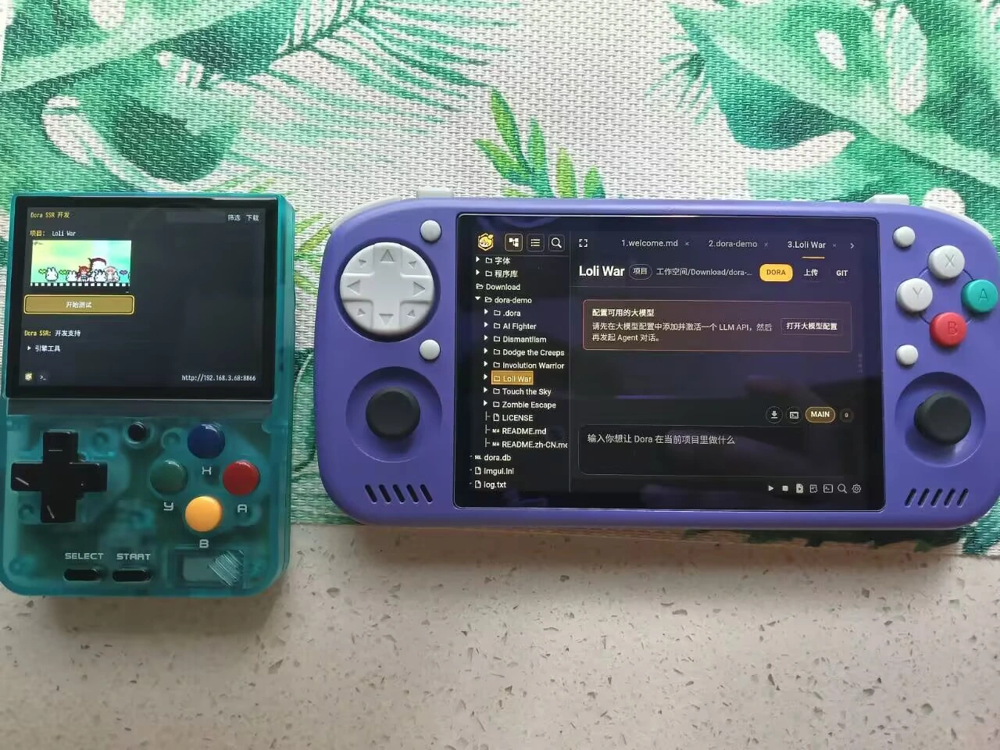
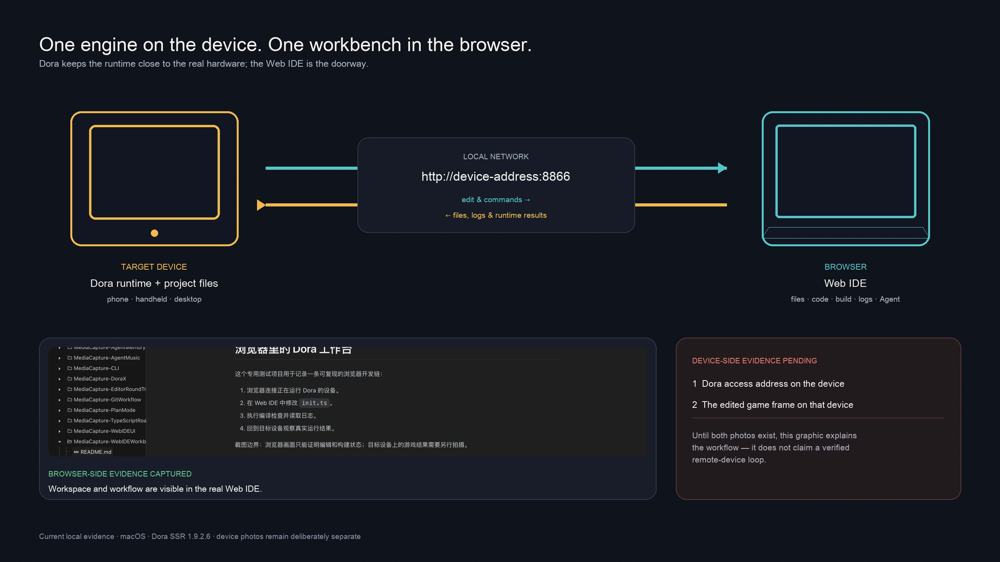

# Dora 为什么把 IDE 放进浏览器

> 从一台国产开源 Android 复古掌机，到一个人和 Agent 都能工作的创作现场。

## 我还没开始写程序，已经在配环境了

我过去做过嵌入式开发，也做过 Android 应用开发。

做过这两类开发的人，大概都熟悉一套很有仪式感的流程：你只是想验证一个小想法，SDK、工具链、依赖、驱动和设备连接已经排好队，等着接受检阅。

程序还没出生，开发环境先办起了入学手续。

<!-- truncate -->

一切顺利时，它们只是安静的背景；只要某个版本、路径或驱动没对上，问题就会立刻接管整个晚上。你本来想做游戏，最后做出的是一个终于不报错的开发环境。

更麻烦的是，这些折腾通常不会让你的作品多一种玩法，也不会让画面多一个角色。它只是在收取“开始之前的门票”。

后来我做 Dora SSR，这种经历一直留在心里，并且慢慢长成了一点执念：游戏开发已经够复杂了，能不能别让“开始开发”本身也变成一个项目？

一个由个人主导的开源游戏引擎，不可能为每个平台都长期维护一套完整的桌面开发工具。可如果每换一台设备，创作者都得重新买一张门票，那么“跨平台”就还只完成了一半。

## 我想让一台掌机变成开发现场

我手头刚好有一台国产、开源的 Android 复古游戏掌机。

它的本职工作当然是玩游戏。但一台又能跑 Android、又长着实体按键的开源掌机摆在一个游戏引擎作者面前，要求我只把它当成玩具，多少有点为难人。

于是我开始盯着它想一个不太安分的问题：能不能不等游戏在电脑上写完、打包、传输以后，才让掌机第一次看到它？能不能直接让这台掌机变成开发和测试游戏的现场？

这个念头听着有点像“把工作带到游戏机上”，但先别急着为掌机感到辛苦。它背后其实有一个很具体的工程问题：我们究竟是在哪台设备上验证游戏？

我们在电脑上打开的模拟器或预览窗口，可以尽量接近目标设备，但它终究不是那台设备。真实的屏幕尺寸、输入方式、性能、文件系统和系统行为，往往要到真机才愿意说真话。

所以 Dora 里所谓的“目标设备”，就是游戏最后真正要运行的手机、掌机或电脑。如果引擎能留在那里，开发环境又能从外面连进去，真机就不再只是项目的发布终点，而是可以反复修改、运行和观察的工作台。

## 没有给每台设备做一个 IDE

问题变成了：用什么连进这个工作台？

我最后选择了一个几乎每台设备里都已经有的东西：浏览器。

说得直白一点，我没有办法给每台设备都配一间豪华工作室，那就先给它们装上同一扇门。

这个选择背后不只有“跨平台”一个词。对 Dora 这样的个人开源项目来说，它同时解决了几个互相关联的问题：

- 不用为 Android、Linux、Windows 和 macOS 分别维护一套完整的编辑器。
- 引擎和项目可以继续运行在掌机或手机上，开发者用电脑、平板，甚至另一台手机的浏览器连入。
- 代码编辑、项目文件、构建、日志和一些小型资源工具，可以逐步放进同一个 Web 界面。

于是 Dora 的工作流变成了这样：在 Android 掌机上启动引擎，它会提供一个 Web IDE 访问地址；再用同一局域网里的其他设备打开这个地址。你看到的是浏览器界面，但文件、构建和运行结果都连着掌机上真正的 Dora 运行时。

浏览器在这里不是游戏引擎的代替品，而是一个连接入口。你从门外伸手干活，真正的引擎仍然蹲在掌机里跑得正欢。

## 但这个选择一直有代价

不过，浏览器也没有白送我这张通行证。门刚装好，它转头就把账单递了过来。

游戏开发不只是写代码。场景、动画、粒子、物理形状和各类美术资源，都需要反复观察和调整。浏览器很难完整复现一套与引擎渲染深度绑定的大型图形化编辑体验。

因此 Dora Web IDE 没有把目标定成“在浏览器里复制一个完整的桌面游戏编辑器”。它更偏向代码、项目文件和结构化配置，再针对动画、粒子、物理、Yarn 剧情和 TIC-80 等具体任务，增加一些可视化辅助工具。

所以不是“Web 不能做图形编辑”，而是我们不试图在有限的项目资源中，把一整座大型游戏制作工厂搬进浏览器。我更希望它像一间小工坊：工具不必什么都有，但你正在修改的材料、构建的结果和运行中的作品，应该尽量在手边。

在很长一段时间里，这都只是一次很明确的取舍：小工坊成立了，但它终究不是一座什么都能生产的超级工厂。

## 工坊先开门，Agent 后来才来上班

Dora 的 Web IDE 最早于 2023 年 2 月进入仓库。它早期的演进非常朴素：文件树、代码编辑、语法高亮、类型检查、定义跳转、上传、保存、运行和错误显示。

它当时要解决的，是人如何更快地进入 Dora 的开发现场。我们并没有在 2023 年就预见今天的 coding agent，更没有为了等它出现而提前铺路。把两者写成从小一起长大的青梅竹马，听起来很浪漫，可惜提交记录不同意。

转折是后来才发生的。工坊已经开了两年，Agent 才开始拎着工具箱来上班。

2025 年 4 月，Dora 开始了 Blockly Coder 的 LLM Agent 实验。2026 年 2 月，mini Coding Agent 进入项目。之后，它才逐步长出 Web IDE 交互、项目文件更新、检查点回滚、Skill、记忆、构建检查和运行时验证等能力。

也是到这时，我才突然意识到：Dora Web IDE 原来那些面向代码和配置的能力，不再只是个人项目为了控制成本做出的选择。它们开始变成 Dora 不同于传统游戏引擎的一种优势。

这感觉就像，我原本因为家里地方小，只打了一排小巧结实的工具柜。结果有一天来了一位能读标签、能找工具、用完还能自己检查成品的新伙伴。

原来小并不只意味着将就，它也意味着，每件工具都离手更近。

## Agent 为什么会改写答案

故事讲到这里，我们把工坊、工具柜和新同事先放到一边，认真说清这个转折为什么会发生。

如果你刚开始接触 AI 编程，可以先把对话式 AI 和 Agent 做一个简单区分。

对话式 AI 可以告诉你一段代码大概应该怎么写。但一个真正进入开发工作流的 Agent，还需要能读取项目文件，理解现有结构，修改代码和配置，发起构建，看懂错误，再运行作品验证结果。

也就是：

> 项目文件 → 人或 Agent 修改 → 检查与构建 → 真实设备运行 → 读取结果 → 继续迭代

这恰好是 Dora Web IDE 已经建立起来的现场。

代码和结构化配置都有明确的文本与规则，人可以阅读，Agent 也可以分析和修改。构建、日志和运行结果又给了 Agent 检查自己工作的机会。它不只是在聊天窗口里猜“应该能跑”，而是可以把结果送进真正的 Dora 运行时。

这里发生的不是 Web IDE 突然获得了更强的图形编辑能力，而是原本偏向代码和配置的产品取舍，突然被 Agent 放大了价值。

## 两种设备，同一个创作闭环

现在 Dora 已经明确支持的形态，是让引擎运行在掌机、手机或桌面目标设备上，再从另一台设备的浏览器连入 Web IDE。浏览器承担工作界面，目标设备承担真实运行环境。

我还希望把这套架构继续推向另一种形态：在计算和交互资源更充足的手机等设备上，同时启动 Dora 引擎与 Web IDE，让代码修改、构建、运行和测试在同一台设备上完成。

这还是一个要继续完成和验证的目标，不该提前写成已经在所有手机上成熟的体验。但它与跨设备连接并不矛盾：引擎和工作现场仍然在目标设备，只是浏览器可以根据设备能力，来自别处，也可以留在本机。

## 一间人和 Agent 都能工作的小工坊

Agent 的出现并没有让图形编辑不再重要，也没有消除游戏创作里的美术、设计和反复调整成本。Dora 也不会因为有了 Agent，就声称自己可以取代大型游戏制作工具。

它带来的改变要更具体一些：一个人可以更早在真实设备上验证一个小想法；Agent 可以进入同一个项目现场，协助处理代码、配置和构建问题；人和 Agent 都不必把“写完了”当成终点，而是继续把结果送进引擎验证。

我最初只是不想再为一台掌机重新搭建一整套开发环境。当时我要解决的问题很朴素：别让我又为配环境失去一个晚上。

现在回头看，那个把开发环境放进浏览器的决定，最终留下的不只是一个轻量编辑器。

它留下了一间靠近真实设备的小工坊。一开始只有人在里面工作；后来，Agent 也拎着工具箱来上班了。

---

如果你想试试这种工作流，可以先在 Android 设备上启动 Dora SSR，再用同一局域网里的电脑、平板或其他设备打开它显示的 Web IDE 地址。不妨先从一个最小的项目开始：改一处代码，构建它，然后让真正的设备告诉你结果。

---

