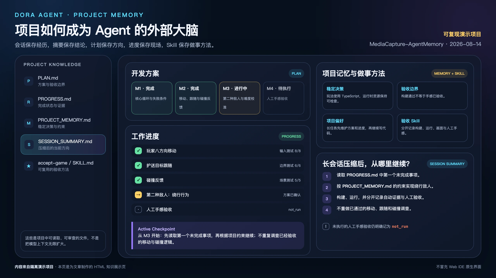
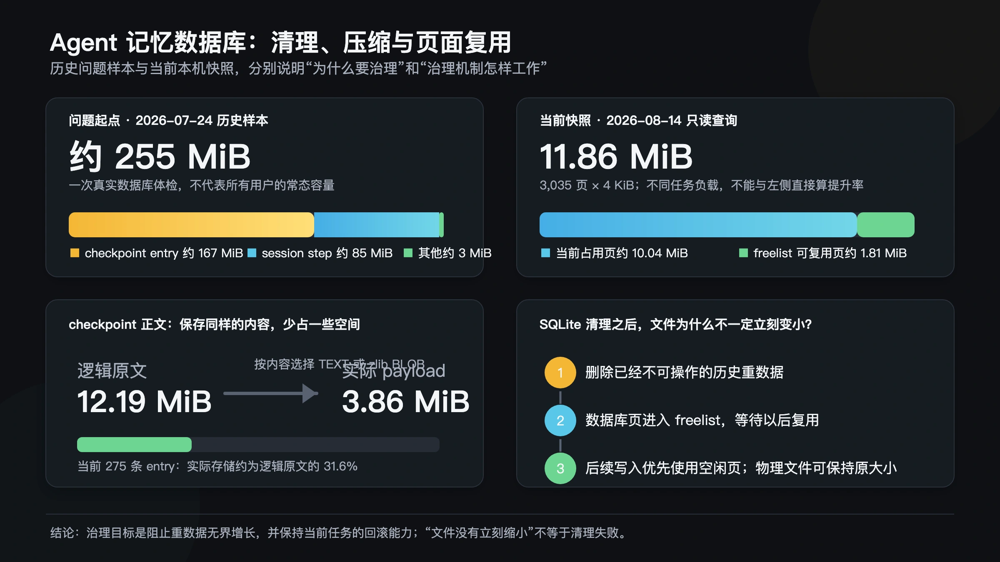

# 项目是 Agent 的外部大脑

有一天，我去检查 Dora 的应用数据目录，看到里面有一个大约 255 MiB 的数据库文件。

两百多 MiB 对今天的硬盘不算庞然大物，可这只是一个仍在增长的开发工具数据库。我忍不住翻开这位过分勤奋的同事留下的工作现场：它到底记住了什么？

Agent 修改文件时，为了让用户能够查看前后差异，也为了出错后可以回滚，会把修改前后的内容保存下来。它调用过什么工具、传入了什么参数、得到了什么结果，也会留下步骤记录。任务一个接一个地完成，旧记录却没有总能跟着任务一起退场。

2026 年 7 月 24 日，我们对这份数据库做了一次只读体检。约 255 MiB 中，保存文件修改前后内容的 checkpoint entry 占了约 167 MiB，Agent 的历史 step 占了约 85 MiB。checkpoint 中未压缩的文件正文加起来约有 163.2 MiB。

它还没有造成程序跑不动。真正让我警觉的是：如果 Agent 每完成一次工作，都把现场原封不动地装进仓库，那么它工作得越久，仓库就只会越来越大。

我们想让 Agent 拥有记忆，却不能把“有记忆”简单理解成“什么都不删”。

<!-- truncate -->

## Agent 的记忆不只在模型里

说到大模型的记忆，许多人最先想到的是上下文，也就是模型在当前一次思考中能够直接看到的信息。

它很像一张工作台。需求、刚读过的代码、工具返回的结果和最近的讨论都摊在上面。工作越做越久，桌面上的东西就越多；超过模型能够处理的范围以后，早先的信息便不能继续完整地放在那里。

但 Dora Agent 的工作并不只依赖这张工作台。项目目录里还有几种性质不同的“外部记忆”。

`SESSION.jsonl` 保存一段可以用于恢复的会话尾部。它更像工作台旁的临时记录：浏览器刷新或引擎意外退出以后，Agent 不至于完全不知道刚才发生了什么。它并不是要永久保存从项目诞生以来的全部对话。

当会话变得很长时，Agent 会把值得留下的内容重新整理。用户偏好和稳定决定进入 `MEMORY.md`，项目结构、构建方法和已知问题进入 `PROJECT_MEMORY.md`，当前目标、已经完成的验证和下一步进入 `SESSION_SUMMARY.md`，更早的整理记录则写入可以搜索的 `HISTORY.jsonl`。

进入 Plan mode 以后，项目里还会出现两份很重要的工作进展记忆：`.agent/plan/PLAN.md` 和 `.agent/plan/PROGRESS.md`。

`PLAN.md` 保存经过讨论后确定的开发方案：目标是什么、哪些事情不在范围内、准备怎样实现，以及用什么标准验收。`PROGRESS.md` 则记录方案已经走到哪里：哪些步骤完成了，证据是什么，哪些仍在等待，以及下一步应该做什么。

会话摘要帮助 Agent 在长任务压缩后恢复思路；方案与进度文档则属于项目本身。即使换了会话或执行者，后来者仍可直接读取同一份工作约定，不必从聊天摘要猜测原方案。

项目里还会留下等待回答的问卷、工具步骤和文件修改 checkpoint。它们更接近工作正在发生的现场痕迹：问卷保存尚未完成的交互，步骤记录操作过程，checkpoint 则帮助我们查看差异或撤销一次不正确的修改。

最后还有 Skill。工程上，它是 Agent 按需读取的一份项目文档；从记忆的角度看，它更像一种沉淀后的做事方法。某次任务告诉我们“这次做了什么”，Skill 则告诉以后的 Agent“遇到这类事情应该怎样做”。

这些载体合在一起构成 Agent 的外部记忆，却不应该拥有相同的寿命。

> 这是基于隔离演示项目真实 Markdown 内容制作的 HTML 知识展示页，用来说明各类外部记忆的关系，不冒充 Web IDE 原生界面。

## 第一种压缩：不是省磁盘，而是提炼下一步

长会话中的上下文压缩，和压缩一个 ZIP 文件不是一回事。

它的目标不是减少硬盘字节，而是把一段冗长经历整理成以后仍然有用的信息。哪些决定已经确认？哪些文件改过？哪些测试真正通过了？现在还卡在哪里？恢复工作时，下一步应该调用什么工具？

这里最重要的不是写出一段读起来漂亮的摘要，而是保存一个准确的工作接力点。

例如，一个任务里有五项互不相同的验收，其中三项已经通过。压缩后的记录不能只写一句“测试进行中”，否则 Agent 恢复以后很可能把前三项重新调查、重新构建一遍。它应该留下一个简洁的清单，标明每一项是通过、失败还是只完成了一部分，并把最新的命令结果作为证据。

如果工作尚未完成，`SESSION_SUMMARY.md` 还需要留下 Active Checkpoint：当前目标是什么，最后一个可靠结果是什么，第一个未完成事项在哪里，以及下一步该做什么。这样，旧对话可以退出模型的工作台，任务却不会跟着失忆。

这种压缩会主动丢掉大量内容。寒暄、重复讨论、已经被新证据推翻的猜测，都没有必要继续占据下一轮思考。留下的不是一次会话的完整录像，而是一份能够继续工作的交接记录。

## 第二种压缩：checkpoint 真的会占磁盘

数据库里的 checkpoint 面对的是另一种问题。

Agent 每次修改文本文件时，都要保留修改前后的内容。这让一条 checkpoint 可以独立显示 diff，也可以在需要时回滚。但是，如果 Agent 连续修改同一个大文件，相邻 checkpoint 中的大部分文字其实可能完全相同。安全感是真实的，存储放大也是真实的。

Dora 后来把 Agent 的 session、task、step、checkpoint 和任务引用搬进了独立的 `agent.db`，不再让高频工作数据和普通引擎配置挤在一起。

文件正文写入 checkpoint 时，也会先判断是否值得压缩。很短的文字，或者压缩后并没有收益的内容，仍然按普通文本保存；适合压缩的大段内容则使用 zlib 压缩后，以数据库的 BLOB 字段保存。BLOB 可以先简单理解为“数据库里的一段二进制字节”。

这条路径有一个不能让步的要求：解压后的内容必须与原文逐字节一致。因为这些数据不只是为了节省空间，它们还要在未来承担 diff 和回滚。损坏的压缩流不能被当成空文件，过大的异常输出也需要被拒绝。

历史样本中，约 163.2 MiB 的 checkpoint 正文预计可以压到约 60.8 MiB，减少约 62.8%。但这只是当时那组内容的测算，不是“所有代码都能缩小六成”的产品承诺。文本重复程度不同，压缩收益也会不同。

## 真正困难的是：什么时候可以忘掉

只做压缩仍然不够。压得再小，如果每个历史任务都永久保留，数据最后还是会无限增长。

最粗暴的办法，是任务结束就删除 checkpoint。但这会伤到仍然有效的工作。

一个主 Agent 可以把任务交给子 Agent。子 Agent 完成交接后，它自己的 session 可能已经关闭，但主 Agent 仍然需要通过交接卡片查看修改差异，甚至回滚子 Agent 的整轮改动。此时，子 session 不在了，不代表它留下的 checkpoint 已经没有价值。

所以 Dora 不按“记录够不够旧”判断，而是先问：“它还可不可以被当前工作操作？”

每个 session 当前正在执行的 task 是起点。从这些 task 出发，再沿着子 Agent 交接等引用关系继续寻找，得到一组仍然活着的任务。运行中的任务、等待用户回答的任务，以及仍被当前主任务依赖的子任务，都不能进入重数据清理。

当一个旧 task 已经被新任务替代，前端也不再允许查看和回滚它时，相关 step、checkpoint 和文件前后副本才可以回收。轻量的用户消息和总结仍可留下，让历史会话不至于变成完全无法理解的空壳。

清理本身也必须安全。一项 task 的 entry、checkpoint、step 和引用关系放在同一个事务中处理：要么全部成功，要么失败后保持原样，不能出现 checkpoint 已删、步骤却还指向它的半成品状态。运行期发现没有归属的孤儿任务时，每次也只处理有限数量，避免一次清理占住整个交互过程。

在 2026 年 7 月 24 日记录的连续 100 task 测试中，历史重数据没有跟着 task 数量线性累积，最后只保留当前任务的 1 个 checkpoint 和 1 个 entry。这个结果说明的不是数据库永远只有一条记录，而是保留量开始跟“仍可操作的工作”相关，而不是跟“曾经发生过多少工作”相关。

## 文件没有立刻变小，也不一定是失败

SQLite 删除记录以后，数据库文件通常不会马上把空间还给操作系统。空出来的页面会进入 freelist，等待后续写入重新使用。

这也是为什么直接运行 `VACUUM` 并不是最初问题的答案。审计时，那 255 MiB 主要由仍然存在的有效记录组成，而不是一堆已经删除却没有收缩的空页。先把数据的生命周期管对，比急着让文件尺寸看起来漂亮更重要。

生命周期清理后，即使文件暂时保持历史峰值，只要新任务复用空闲页，它就不会随历史无限增长。`VACUUM` 可以留到合适的空闲维护时机。

## Skill 是记忆，也是一次经验的升级

清掉工作痕迹，不等于把经验也一起扔掉。一条信息最初可能只是 session、工具步骤或 checkpoint 中的现场记录；任务变长以后，重要结果被提炼进会话摘要；稳定的项目事实和决定进入长期记忆；反复验证过的工作方法，最后才有资格成为 Skill。

这不是把同一段文字从一个文件搬到另一个文件。每向上沉淀一层，细节可以更少，复用价值却应该更高。现场记录回答“刚才发生了什么”，进度记忆回答“工作走到哪里”，长期记忆回答“以后仍应知道什么”，Skill 则回答“下次遇到同类问题应该怎样做”。

沉淀过程中还有一条重要原则：最新的实际证据比旧摘要更可靠。如果源码已经修改、命令产生了新结果，或者验收推翻了早先判断，就应该先以这些证据更新进度和记忆，不能让一份过时摘要覆盖刚刚发生的事实。

例如，“怎样安全发布一个 Dora 版本”不适合依赖某次会话的几百条原始步骤。更有价值的做法，是把已经验证的发布顺序、检查点、失败边界和验收方法整理成 Skill。下一位 Agent 不必重新经历同样的摸索，却仍能在需要时读取这套方法。

这正是我所说的“项目成为 Agent 的外部大脑”。项目不只是代码和资源的集合，也保存了做出这些代码时形成的事实、决定、进度和方法。它们以人可以阅读的文件存在，而不是封闭在模型内部。人可以纠正它们，Agent 也可以在下一次任务中重新找到它们。

一次会话的原始记录保存经历，压缩记忆保存结论，`PLAN.md` 保存共同确认的方案，`PROGRESS.md` 保存工作进展与验收证据，checkpoint 保存尚有操作价值的修改现场，Skill 保存以后还会用到的做事方法。

可靠的 Agent 既要会记住，也要会忘掉。记住让工作能够接力，忘掉让过去不至于淹没现在；真正值得长期留下的东西，则应该从一次对话中走出来，成为项目自身的一部分。

如果你想观察这套外部大脑怎样工作，可以让 Dora Agent 执行一次真正需要多轮修改、构建和验收的长任务。留意它在上下文变长后怎样整理记忆，恢复时是否能从第一个未完成事项继续，以及任务结束后，哪些内容留在会话里，哪些成为项目记忆或 Skill。一个 Agent 能否长期参与创作，答案也许就藏在这些留下与离开的痕迹中。

---

